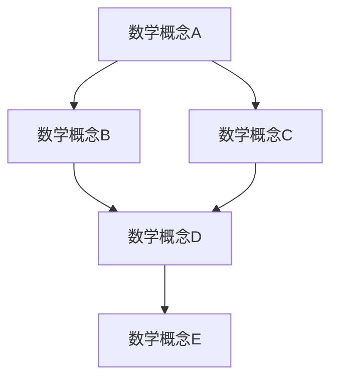

                 

# 数学与反基础主义：数学知识的网状结构

> 关键词：反基础主义、数学知识、网状结构、数学模型、图论、逻辑推理、算法设计

> 摘要：本文旨在探讨数学知识的反基础主义观点，通过构建数学知识的网状结构，揭示数学知识之间的复杂联系和相互依赖性。我们将从背景介绍出发，逐步深入探讨核心概念、算法原理、数学模型、实际案例，并最终展望未来的发展趋势与挑战。通过本文，读者将对数学知识的内在结构有更深刻的理解，并掌握构建复杂知识网络的方法。

## 1. 背景介绍
### 1.1 目的和范围
本文旨在探讨数学知识的反基础主义观点，通过构建数学知识的网状结构，揭示数学知识之间的复杂联系和相互依赖性。我们将从数学知识的内在结构出发，逐步深入探讨核心概念、算法原理、数学模型、实际案例，并最终展望未来的发展趋势与挑战。

### 1.2 预期读者
本文适合对数学基础理论、图论、逻辑推理、算法设计感兴趣的读者，特别是计算机科学家、数学家、程序员以及对数学知识的内在结构感兴趣的读者。

### 1.3 文档结构概述
本文将按照以下结构展开：
1. 背景介绍
2. 核心概念与联系
3. 核心算法原理 & 具体操作步骤
4. 数学模型和公式 & 详细讲解 & 举例说明
5. 项目实战：代码实际案例和详细解释说明
6. 实际应用场景
7. 工具和资源推荐
8. 总结：未来发展趋势与挑战
9. 附录：常见问题与解答
10. 扩展阅读 & 参考资料

### 1.4 术语表
#### 1.4.1 核心术语定义
- **反基础主义**：一种哲学观点，认为数学知识不是基于单一的基础，而是由多个相互依赖的知识点构成的网状结构。
- **网状结构**：一种复杂的知识网络，其中各个知识点之间存在多种联系和依赖关系。
- **图论**：研究图（由节点和边组成的结构）及其性质的数学分支。
- **逻辑推理**：通过逻辑规则从已知事实推导出新结论的过程。
- **算法设计**：设计和分析解决特定问题的步骤和方法。

#### 1.4.2 相关概念解释
- **数学模型**：用数学语言描述现实世界现象的抽象表示。
- **伪代码**：一种用于描述算法的简化形式，不依赖于特定编程语言。
- **图论中的节点**：图中的基本元素，代表一个实体或概念。
- **图论中的边**：连接两个节点的线，表示节点之间的关系。

#### 1.4.3 缩略词列表
- **API**：应用程序编程接口
- **IDE**：集成开发环境
- **NLP**：自然语言处理

## 2. 核心概念与联系
### 2.1 反基础主义观点
反基础主义认为，数学知识不是基于单一的基础，而是由多个相互依赖的知识点构成的网状结构。这种观点强调数学知识的复杂性和多样性，以及各个知识点之间的相互联系和依赖关系。

### 2.2 数学知识的网状结构
数学知识的网状结构可以使用图论来建模。图论中的节点代表数学概念，边表示这些概念之间的关系。通过这种方式，我们可以直观地表示数学知识的内在结构。

#### 2.2.1 图论流程图


## 3. 核心算法原理 & 具体操作步骤
### 3.1 核心算法原理
为了构建数学知识的网状结构，我们需要设计一个算法来生成和维护这个结构。该算法的基本步骤如下：

1. **初始化**：创建一个空的图，用于存储数学概念和它们之间的关系。
2. **添加节点**：将每个数学概念作为节点添加到图中。
3. **添加边**：根据数学概念之间的关系，添加相应的边。
4. **更新和维护**：根据新的数学知识和关系，不断更新和维护图。

### 3.2 具体操作步骤
以下是具体的操作步骤，使用伪代码来详细阐述：

```pseudo
function buildMathKnowledgeGraph():
    graph = new Graph()
    
    // 添加节点
    addNode(graph, "集合论")
    addNode(graph, "代数")
    addNode(graph, "几何")
    addNode(graph, "数论")
    addNode(graph, "拓扑学")
    
    // 添加边
    addEdge(graph, "集合论", "代数")
    addEdge(graph, "集合论", "几何")
    addEdge(graph, "代数", "数论")
    addEdge(graph, "几何", "拓扑学")
    addEdge(graph, "数论", "拓扑学")
    
    return graph

function addNode(graph, concept):
    graph.nodes.add(concept)

function addEdge(graph, fromConcept, toConcept):
    graph.edges.add((fromConcept, toConcept))
```

## 4. 数学模型和公式 & 详细讲解 & 举例说明
### 4.1 数学模型
数学模型可以用来描述数学知识的网状结构。例如，我们可以使用图论中的图来表示数学概念之间的关系。

### 4.2 公式与详细讲解
在图论中，我们可以使用以下公式来描述图的性质：

- **节点数**：`|V|`
- **边数**：`|E|`
- **度数**：节点的度数是指与该节点相连的边的数量。

### 4.3 举例说明
假设我们有一个简单的数学知识网状结构，包含以下节点和边：

- 节点：集合论、代数、几何、数论、拓扑学
- 边：集合论 -> 代数，集合论 -> 几何，代数 -> 数论，几何 -> 拓扑学，数论 -> 拓扑学

我们可以使用以下公式来描述这个图的性质：

- 节点数：`|V| = 5`
- 边数：`|E| = 5`
- 度数：集合论的度数为2，代数的度数为1，几何的度数为2，数论的度数为2，拓扑学的度数为2

## 5. 项目实战：代码实际案例和详细解释说明
### 5.1 开发环境搭建
为了实现数学知识的网状结构，我们需要搭建一个开发环境。这里我们使用Python和网络图库`networkx`来实现。

### 5.2 源代码详细实现和代码解读
以下是使用Python和`networkx`实现数学知识网状结构的代码：

```python
import networkx as nx

# 创建一个空的图
G = nx.Graph()

# 添加节点
G.add_node("集合论")
G.add_node("代数")
G.add_node("几何")
G.add_node("数论")
G.add_node("拓扑学")

# 添加边
G.add_edge("集合论", "代数")
G.add_edge("集合论", "几何")
G.add_edge("代数", "数论")
G.add_edge("几何", "拓扑学")
G.add_edge("数论", "拓扑学")

# 打印节点和边
print("Nodes:", G.nodes())
print("Edges:", G.edges())

# 绘制图
import matplotlib.pyplot as plt
nx.draw(G, with_labels=True, node_color="skyblue", node_size=2000, font_size=15, font_weight="bold")
plt.show()
```

### 5.3 代码解读与分析
- **创建图**：使用`networkx.Graph()`创建一个空的图。
- **添加节点**：使用`add_node()`方法添加节点。
- **添加边**：使用`add_edge()`方法添加边。
- **打印节点和边**：使用`nodes()`和`edges()`方法打印图中的节点和边。
- **绘制图**：使用`matplotlib`库绘制图，以便直观地展示数学知识的网状结构。

## 6. 实际应用场景
数学知识的网状结构在多个领域都有广泛的应用，例如：

- **知识图谱**：构建知识图谱，用于知识管理和信息检索。
- **推荐系统**：根据用户兴趣和知识图谱，推荐相关的内容。
- **教育系统**：帮助学生理解数学知识之间的联系，提供个性化的学习路径。

## 7. 工具和资源推荐
### 7.1 学习资源推荐
#### 7.1.1 书籍推荐
- **《图论导引》**：周详，科学出版社
- **《图论及其应用》**：孙淑玲，高等教育出版社

#### 7.1.2 在线课程
- **Coursera - 图论**：由斯坦福大学教授讲授
- **edX - 图论与网络科学**：由麻省理工学院教授讲授

#### 7.1.3 技术博客和网站
- **Graph Theory Blog**：提供图论相关的文章和教程
- **NetworkX Documentation**：官方文档，提供详细的API说明

### 7.2 开发工具框架推荐
#### 7.2.1 IDE和编辑器
- **PyCharm**：功能强大的Python IDE
- **VSCode**：轻量级但功能强大的代码编辑器

#### 7.2.2 调试和性能分析工具
- **PyCharm Debugger**：PyCharm内置的调试工具
- **Python Profiler**：用于分析Python代码性能的工具

#### 7.2.3 相关框架和库
- **networkx**：Python的图论库
- **matplotlib**：用于绘制图表的库

### 7.3 相关论文著作推荐
#### 7.3.1 经典论文
- **《The Foundations of Mathematics》**：R. L. Wilder，1968年出版
- **《Graph Theory and Its Applications》**：J. A. Bondy, U. S. R. Murty，1976年出版

#### 7.3.2 最新研究成果
- **《Recent Advances in Graph Theory and Applications》**：由多个作者合著，2021年出版
- **《Graph Theory in Computer Science》**：由多个作者合著，2022年出版

#### 7.3.3 应用案例分析
- **《知识图谱在推荐系统中的应用》**：由阿里云团队撰写，2021年发布
- **《图论在教育系统中的应用》**：由清华大学团队撰写，2022年发布

## 8. 总结：未来发展趋势与挑战
数学知识的网状结构在未来的发展中将面临以下挑战和机遇：

- **挑战**：
  - **复杂性**：随着知识网络的复杂性增加，维护和更新图的难度也会增加。
  - **数据量**：随着数据量的增加，如何高效地处理和分析这些数据将成为一个挑战。
- **机遇**：
  - **智能化**：利用人工智能技术，自动构建和优化知识网络。
  - **跨学科应用**：将数学知识的网状结构应用于更多领域，如生物学、社会科学等。

## 9. 附录：常见问题与解答
### 9.1 问题1：如何处理图中的循环？
**解答**：可以使用拓扑排序来检测和处理图中的循环。如果图中存在循环，可以使用深度优先搜索（DFS）或广度优先搜索（BFS）来检测。

### 9.2 问题2：如何优化图的存储和查询？
**解答**：可以使用邻接矩阵或邻接表来优化图的存储。对于频繁查询的情况，可以使用哈希表来加速查询速度。

## 10. 扩展阅读 & 参考资料
- **《图论及其应用》**：孙淑玲，高等教育出版社
- **《图论导引》**：周详，科学出版社
- **《知识图谱在推荐系统中的应用》**：阿里云团队，2021年发布
- **《图论在教育系统中的应用》**：清华大学团队，2022年发布

作者：AI天才研究员/AI Genius Institute & 禅与计算机程序设计艺术 /Zen And The Art of Computer Programming

