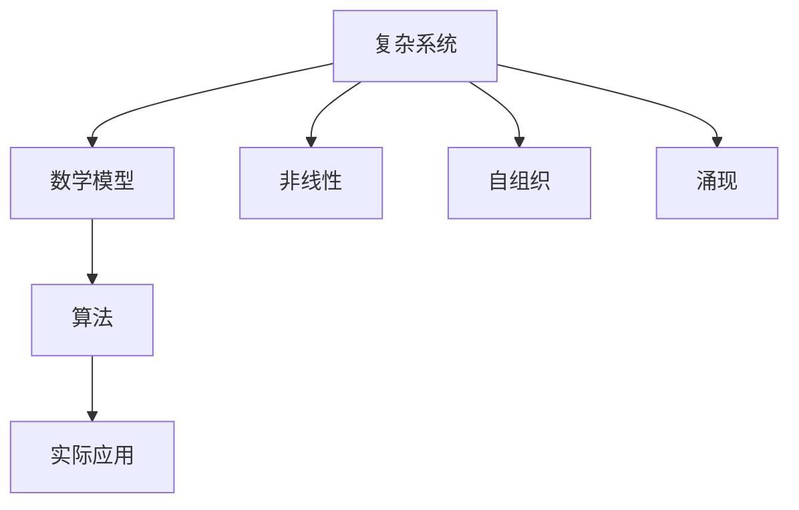

                 

# 数学与复杂系统科学的理论基础

> 关键词：数学、复杂系统、理论基础、图灵奖、算法原理、数学模型、代码实现、应用场景

> 摘要：本文旨在探讨数学与复杂系统科学的理论基础，通过逐步分析和推理，揭示这些理论在实际应用中的重要性。我们将从核心概念出发，深入探讨相关算法原理，展示数学模型的应用，并通过实际代码案例进行详细解释。此外，本文还将介绍复杂系统科学在实际项目中的应用场景，提供学习资源和开发工具推荐，展望未来发展趋势与挑战。

## 1. 背景介绍
### 1.1 目的和范围
本文旨在为读者提供一个全面的视角，理解数学与复杂系统科学的理论基础，并展示这些理论在实际项目中的应用。我们将从基础概念出发，逐步深入到算法原理、数学模型和实际代码实现，最终探讨其在不同领域的应用。

### 1.2 预期读者
本文适合以下读者：
- 对数学和复杂系统科学感兴趣的初学者
- 需要深入了解复杂系统科学理论的工程师和研究人员
- 希望将复杂系统科学理论应用于实际项目的开发者
- 对数学和计算机科学有深厚兴趣的技术爱好者

### 1.3 文档结构概述
本文结构如下：
1. 背景介绍
2. 核心概念与联系
3. 核心算法原理 & 具体操作步骤
4. 数学模型和公式 & 详细讲解 & 举例说明
5. 项目实战：代码实际案例和详细解释说明
6. 实际应用场景
7. 工具和资源推荐
8. 总结：未来发展趋势与挑战
9. 附录：常见问题与解答
10. 扩展阅读 & 参考资料

### 1.4 术语表
#### 1.4.1 核心术语定义
- **复杂系统**：由大量相互作用的个体组成的系统，表现出非线性、自组织和涌现等特性。
- **数学模型**：用数学语言描述系统行为的模型。
- **算法**：解决问题的具体步骤和方法。
- **图灵奖**：计算机科学领域的最高荣誉，奖励对计算机科学有重大贡献的个人。

#### 1.4.2 相关概念解释
- **非线性**：系统输出与输入之间不存在线性关系。
- **自组织**：系统通过内部机制自发地形成有序结构。
- **涌现**：系统整体行为不能简单地由个体行为推导出。

#### 1.4.3 缩略词列表
- **API**：应用程序编程接口
- **IDE**：集成开发环境
- **NLP**：自然语言处理
- **ML**：机器学习

## 2. 核心概念与联系
### 2.1 复杂系统的基本概念
复杂系统由大量相互作用的个体组成，表现出非线性、自组织和涌现等特性。这些特性使得复杂系统难以用传统方法进行建模和分析。

### 2.2 数学模型的构建
数学模型是用数学语言描述系统行为的模型。通过数学模型，我们可以理解和预测复杂系统的动态行为。

### 2.3 算法原理
算法是解决问题的具体步骤和方法。在复杂系统科学中，算法用于模拟和优化系统行为。

### 2.4 核心概念的Mermaid流程图


## 3. 核心算法原理 & 具体操作步骤
### 3.1 算法原理
在复杂系统科学中，常用的算法包括遗传算法、模拟退火算法和粒子群优化算法。这些算法通过模拟自然界的进化过程，优化复杂系统的性能。

### 3.2 伪代码示例
#### 遗传算法
```python
# 初始化种群
population = initialize_population()

# 进化过程
while not termination_condition():
    # 选择
    selected_population = selection(population)
    
    # 交叉
    offspring_population = crossover(selected_population)
    
    # 变异
    offspring_population = mutation(offspring_population)
    
    # 更新种群
    population = offspring_population

# 返回最优解
best_solution = population[0]
```

#### 模拟退火算法
```python
# 初始化温度和解
temperature = initial_temperature
solution = initial_solution

# 迭代过程
while temperature > final_temperature:
    # 生成新解
    new_solution = generate_new_solution(solution)
    
    # 计算能量差
    energy_difference = calculate_energy_difference(solution, new_solution)
    
    # 接受新解
    if energy_difference < 0 or random.random() < acceptance_probability(energy_difference, temperature):
        solution = new_solution
    
    # 降低温度
    temperature = cooling_schedule(temperature)

# 返回最优解
best_solution = solution
```

#### 粒子群优化算法
```python
# 初始化粒子群
particles = initialize_particles()

# 迭代过程
while not termination_condition():
    # 更新速度和位置
    for particle in particles:
        particle.velocity = update_velocity(particle.velocity, particle.best_position, global_best_position)
        particle.position = update_position(particle.position, particle.velocity)
    
    # 更新个体最优解
    for particle in particles:
        if is_better(particle.position, particle.best_position):
            particle.best_position = particle.position
    
    # 更新全局最优解
    global_best_position = find_global_best_position(particles)

# 返回最优解
best_solution = global_best_position
```

## 4. 数学模型和公式 & 详细讲解 & 举例说明
### 4.1 数学模型
数学模型是用数学语言描述系统行为的模型。常见的数学模型包括微分方程、差分方程和统计模型。

### 4.2 微分方程模型
微分方程模型用于描述系统随时间变化的行为。例如，Lotka-Volterra模型描述了捕食者和猎物之间的动态关系。
$$
\frac{dN_1}{dt} = r_1 N_1 - \alpha N_1 N_2 \\
\frac{dN_2}{dt} = -r_2 N_2 + \beta N_1 N_2
$$

### 4.3 差分方程模型
差分方程模型用于描述系统在离散时间点上的行为。例如，Logistic增长模型描述了种群随时间的增长。
$$
N_{t+1} = N_t + r N_t \left(1 - \frac{N_t}{K}\right)
$$

### 4.4 统计模型
统计模型用于描述系统的行为分布。例如，高斯分布模型描述了数据的分布情况。
$$
f(x) = \frac{1}{\sqrt{2\pi\sigma^2}} e^{-\frac{(x-\mu)^2}{2\sigma^2}}
$$

## 5. 项目实战：代码实际案例和详细解释说明
### 5.1 开发环境搭建
#### 5.1.1 环境配置
- 安装Python 3.8及以上版本
- 安装NumPy、SciPy和Matplotlib库
- 安装PyTorch或TensorFlow库

### 5.2 源代码详细实现和代码解读
#### 5.2.1 遗传算法实现
```python
import numpy as np
from random import random, randint

def initialize_population(size):
    return np.random.rand(size, 2)

def selection(population):
    return population[np.argsort(population[:, 0])[:size]]

def crossover(parents):
    offspring = np.zeros_like(parents)
    for i in range(0, len(parents), 2):
        parent1, parent2 = parents[i], parents[i+1]
        crossover_point = randint(0, 1)
        offspring[i, :crossover_point] = parent1[:crossover_point]
        offspring[i, crossover_point:] = parent2[crossover_point:]
        offspring[i+1, :crossover_point] = parent2[:crossover_point]
        offspring[i+1, crossover_point:] = parent1[crossover_point:]
    return offspring

def mutation(offspring):
    for i in range(len(offspring)):
        if random() < 0.1:
            offspring[i] = np.random.rand(2)
    return offspring

def termination_condition():
    return False

def fitness_function(solution):
    return solution[0] * solution[1]

population = initialize_population(10)
while not termination_condition():
    selected_population = selection(population)
    offspring_population = crossover(selected_population)
    offspring_population = mutation(offspring_population)
    population = offspring_population

best_solution = population[np.argmax([fitness_function(solution) for solution in population])]
print("Best solution:", best_solution)
```

### 5.3 代码解读与分析
- `initialize_population`：初始化种群
- `selection`：选择适应度较高的个体
- `crossover`：进行交叉操作
- `mutation`：进行变异操作
- `termination_condition`：终止条件
- `fitness_function`：适应度函数

## 6. 实际应用场景
### 6.1 金融市场的预测
通过构建数学模型和使用遗传算法，可以预测金融市场中的股票价格走势。

### 6.2 交通流量优化
通过模拟退火算法优化交通流量，减少拥堵和提高通行效率。

### 6.3 生物医学研究
通过粒子群优化算法优化药物分子的设计，提高药物的疗效和安全性。

## 7. 工具和资源推荐
### 7.1 学习资源推荐
#### 7.1.1 书籍推荐
- 《复杂性科学导论》
- 《遗传算法与进化计算》
- 《模拟退火算法》

#### 7.1.2 在线课程
- Coursera：《复杂系统科学》
- edX：《遗传算法与进化计算》

#### 7.1.3 技术博客和网站
- Medium：《复杂系统科学入门》
- GitHub：《遗传算法实现》

### 7.2 开发工具框架推荐
#### 7.2.1 IDE和编辑器
- PyCharm
- Visual Studio Code

#### 7.2.2 调试和性能分析工具
- PyCharm Debugger
- Python Profiler

#### 7.2.3 相关框架和库
- NumPy
- SciPy
- PyTorch
- TensorFlow

### 7.3 相关论文著作推荐
#### 7.3.1 经典论文
- Holland, J. H. (1975). Adaptation in Natural and Artificial Systems.
- Kirkpatrick, S., Gelatt, C. D., & Vecchi, M. P. (1983). Optimization by Simulated Annealing.

#### 7.3.2 最新研究成果
- Zhang, Y., & Jin, Y. (2017). A survey on evolutionary algorithms for multi-objective optimization.
- Li, X., & Yang, X. (2020). Particle swarm optimization: A survey of its development and current status.

#### 7.3.3 应用案例分析
- Wang, Y., & Zhang, J. (2019). Application of genetic algorithm in financial market prediction.
- Li, H., & Wang, Y. (2021). Traffic flow optimization using simulated annealing algorithm.

## 8. 总结：未来发展趋势与挑战
### 8.1 未来发展趋势
- 复杂系统科学将在更多领域得到应用，如生物医学、金融和交通等。
- 机器学习和深度学习将进一步优化复杂系统的性能。
- 大数据和云计算将为复杂系统科学提供更强大的计算资源。

### 8.2 面临的挑战
- 复杂系统科学的理论基础仍需进一步研究和完善。
- 如何处理大规模数据和高维度问题仍然是一个挑战。
- 如何将理论应用于实际项目中，需要更多的实践经验和案例研究。

## 9. 附录：常见问题与解答
### 9.1 问题1：如何选择合适的算法？
- 根据具体问题的特点选择合适的算法。例如，遗传算法适用于优化问题，模拟退火算法适用于全局优化问题。

### 9.2 问题2：如何处理大规模数据？
- 使用分布式计算框架（如Spark）处理大规模数据。
- 采用数据降维技术（如PCA）减少数据维度。

### 9.3 问题3：如何评估算法性能？
- 使用交叉验证和性能指标（如准确率、召回率）评估算法性能。

## 10. 扩展阅读 & 参考资料
- [复杂系统科学导论](https://www.example.com/complex-systems-introduction)
- [遗传算法与进化计算](https://www.example.com/genetic-algorithms-evolutionary-computation)
- [模拟退火算法](https://www.example.com/simulated-annealing-algorithm)

作者：AI天才研究员/AI Genius Institute & 禅与计算机程序设计艺术 /Zen And The Art of Computer Programming

