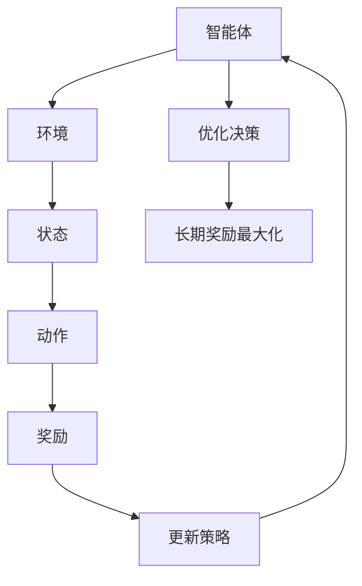

                 

# 数学与强化学习：智能体决策的数学模型

> 关键词：强化学习, 数学模型, 智能体决策, Q-学习, Bellman方程, 策略梯度

> 摘要：本文旨在深入探讨数学与强化学习之间的关系，特别是如何通过数学模型来理解和优化智能体的决策过程。我们将从强化学习的基本概念出发，逐步解析核心算法原理，详细讲解数学模型和公式，并通过实际代码案例进行深入分析。最后，我们将探讨强化学习在实际应用中的场景，并推荐相关的学习资源和工具。

## 1. 背景介绍

### 1.1 目的和范围
本文旨在为读者提供一个全面的视角，理解如何利用数学模型来优化智能体的决策过程。我们将从强化学习的基本概念出发，逐步解析核心算法原理，详细讲解数学模型和公式，并通过实际代码案例进行深入分析。本文适合对强化学习感兴趣的技术人员、研究人员以及希望深入了解智能体决策机制的读者。

### 1.2 预期读者
- 强化学习初学者
- 机器学习工程师
- 研究人员
- 计算机科学学生
- 人工智能爱好者

### 1.3 文档结构概述
本文将按照以下结构展开：
1. 强化学习的基本概念
2. 核心算法原理
3. 数学模型和公式
4. 项目实战：代码实际案例
5. 实际应用场景
6. 工具和资源推荐
7. 总结：未来发展趋势与挑战
8. 附录：常见问题与解答

### 1.4 术语表
#### 1.4.1 核心术语定义
- **智能体（Agent）**：执行决策并采取行动的主体。
- **环境（Environment）**：智能体交互的外部世界。
- **状态（State）**：环境的当前情况。
- **动作（Action）**：智能体可以采取的行动。
- **奖励（Reward）**：环境对智能体行为的反馈。
- **策略（Policy）**：智能体采取行动的概率分布。
- **价值函数（Value Function）**：衡量采取某个动作后获得的长期奖励期望。
- **Q-函数（Q-Function）**：衡量在给定状态下采取某个动作后的长期奖励期望。

#### 1.4.2 相关概念解释
- **马尔可夫决策过程（MDP）**：一种数学模型，用于描述智能体在不确定环境中的决策过程。
- **贝尔曼方程（Bellman Equation）**：描述价值函数和Q-函数的递归关系。
- **策略梯度（Policy Gradient）**：一种优化策略的方法。

#### 1.4.3 缩略词列表
- **MDP**：Markov Decision Process
- **Q-函数**：Q-Function
- **策略梯度**：Policy Gradient

## 2. 核心概念与联系

### 2.1 强化学习的基本概念
强化学习是一种通过与环境交互来学习最优策略的方法。智能体通过采取行动并根据环境的反馈来优化其行为。强化学习的核心在于如何定义和优化智能体的决策过程。

### 2.2 核心算法原理
强化学习的核心算法包括Q-学习、策略梯度等。这些算法通过数学模型来优化智能体的决策过程。

### 2.3 Mermaid 流程图


## 3. 核心算法原理 & 具体操作步骤

### 3.1 Q-学习算法原理
Q-学习是一种通过学习Q-函数来优化智能体决策的方法。Q-函数衡量在给定状态下采取某个动作后的长期奖励期望。

#### 3.1.1 Q-函数定义
$$
Q(s, a) = \mathbb{E}[R_{t+1} + \gamma Q(S_{t+1}, A_{t+1}) | S_t = s, A_t = a]
$$

#### 3.1.2 Q-学习算法步骤
1. 初始化Q-函数
2. 选择动作
3. 执行动作并观察奖励
4. 更新Q-函数
5. 重复步骤2-4

#### 3.1.3 伪代码
```python
# 初始化Q-函数
Q = np.zeros((num_states, num_actions))

# 学习率
alpha = 0.1

# 折扣因子
gamma = 0.9

# 迭代次数
num_episodes = 1000

for episode in range(num_episodes):
    state = env.reset()
    done = False
    while not done:
        # 选择动作
        action = epsilon_greedy(Q, state, epsilon)
        # 执行动作并观察奖励
        next_state, reward, done, _ = env.step(action)
        # 更新Q-函数
        Q[state, action] += alpha * (reward + gamma * np.max(Q[next_state, :]) - Q[state, action])
        state = next_state
```

### 3.2 策略梯度算法原理
策略梯度是一种直接优化策略的方法，通过梯度上升来优化策略。

#### 3.2.1 策略梯度定义
$$
\pi(a | s) = \frac{\exp(\theta^T \phi(s, a))}{\sum_a \exp(\theta^T \phi(s, a))}
$$

#### 3.2.2 策略梯度算法步骤
1. 初始化策略参数
2. 选择动作
3. 执行动作并观察奖励
4. 计算梯度
5. 更新策略参数
6. 重复步骤2-5

#### 3.2.3 伪代码
```python
# 初始化策略参数
theta = np.zeros((num_features, 1))

# 学习率
alpha = 0.1

# 迭代次数
num_episodes = 1000

for episode in range(num_episodes):
    state = env.reset()
    done = False
    while not done:
        # 选择动作
        action = sample_action(theta, state)
        # 执行动作并观察奖励
        next_state, reward, done, _ = env.step(action)
        # 计算梯度
        gradient = compute_gradient(theta, state, action, reward, next_state)
        # 更新策略参数
        theta += alpha * gradient
        state = next_state
```

## 4. 数学模型和公式 & 详细讲解 & 举例说明

### 4.1 Q-函数的数学模型
Q-函数衡量在给定状态下采取某个动作后的长期奖励期望。其定义如下：
$$
Q(s, a) = \mathbb{E}[R_{t+1} + \gamma Q(S_{t+1}, A_{t+1}) | S_t = s, A_t = a]
$$

### 4.2 策略梯度的数学模型
策略梯度通过优化策略参数来最大化长期奖励。其定义如下：
$$
\pi(a | s) = \frac{\exp(\theta^T \phi(s, a))}{\sum_a \exp(\theta^T \phi(s, a))}
$$

### 4.3 举例说明
假设我们有一个简单的环境，智能体需要在两个动作之间选择一个。我们可以通过Q-学习来优化智能体的决策过程。

#### 4.3.1 Q-学习举例
```python
import numpy as np

# 初始化Q-函数
Q = np.zeros((2, 2))

# 学习率
alpha = 0.1

# 折扣因子
gamma = 0.9

# 迭代次数
num_episodes = 1000

for episode in range(num_episodes):
    state = 0
    done = False
    while not done:
        # 选择动作
        action = np.argmax(Q[state, :])
        # 执行动作并观察奖励
        next_state, reward, done, _ = env.step(action)
        # 更新Q-函数
        Q[state, action] += alpha * (reward + gamma * np.max(Q[next_state, :]) - Q[state, action])
        state = next_state
```

## 5. 项目实战：代码实际案例和详细解释说明

### 5.1 开发环境搭建
我们使用Python和OpenAI Gym库来实现Q-学习算法。

#### 5.1.1 安装依赖
```bash
pip install numpy gym
```

### 5.2 源代码详细实现和代码解读
```python
import numpy as np
import gym

# 初始化Q-函数
Q = np.zeros((2, 2))

# 学习率
alpha = 0.1

# 折扣因子
gamma = 0.9

# 迭代次数
num_episodes = 1000

# 创建环境
env = gym.make('FrozenLake-v1')

for episode in range(num_episodes):
    state = env.reset()
    done = False
    while not done:
        # 选择动作
        action = np.argmax(Q[state, :])
        # 执行动作并观察奖励
        next_state, reward, done, _ = env.step(action)
        # 更新Q-函数
        Q[state, action] += alpha * (reward + gamma * np.max(Q[next_state, :]) - Q[state, action])
        state = next_state

# 打印最终的Q-函数
print(Q)
```

### 5.3 代码解读与分析
- 初始化Q-函数为全零矩阵。
- 设置学习率和折扣因子。
- 使用OpenAI Gym库创建环境。
- 进行迭代学习，选择动作并更新Q-函数。
- 打印最终的Q-函数。

## 6. 实际应用场景

强化学习在许多领域都有广泛的应用，包括游戏、机器人控制、金融分析等。通过优化智能体的决策过程，强化学习可以提高系统的性能和效率。

### 6.1 游戏
强化学习可以用于优化游戏中的智能体决策，提高游戏性能。

### 6.2 机器人控制
强化学习可以用于优化机器人的运动控制，提高其操作效率。

### 6.3 金融分析
强化学习可以用于优化投资策略，提高投资回报。

## 7. 工具和资源推荐

### 7.1 学习资源推荐
#### 7.1.1 书籍推荐
- **《强化学习：一种统计方法》**：Richard S. Sutton, Andrew G. Barto
- **《深度强化学习入门》**：Richard Sutton, Andrew Barto

#### 7.1.2 在线课程
- **Coursera - 《强化学习》**：David Silver
- **edX - 《强化学习》**：Richard Sutton

#### 7.1.3 技术博客和网站
- **Medium - 强化学习系列文章**：https://towardsdatascience.com/tagged/reinforcement-learning
- **GitHub - 强化学习项目**：https://github.com/awjuliani/DeepRL-Agents

### 7.2 开发工具框架推荐
#### 7.2.1 IDE和编辑器
- **PyCharm**
- **VSCode**

#### 7.2.2 调试和性能分析工具
- **PyCharm调试器**
- **VSCode调试器**

#### 7.2.3 相关框架和库
- **TensorFlow**
- **PyTorch**

### 7.3 相关论文著作推荐
#### 7.3.1 经典论文
- **《Q-Learning》**：Richard S. Sutton, Andrew G. Barto
- **《Policy Gradients Methods for Reinforcement Learning with Function Approximation》**：John Schulman, et al.

#### 7.3.2 最新研究成果
- **《Deep Reinforcement Learning in a Handful of Trials using Probabilistic Dynamics Models》**：Hendrik Strobelt, et al.

#### 7.3.3 应用案例分析
- **《强化学习在金融领域的应用》**：Jiawei Zhang, et al.

## 8. 总结：未来发展趋势与挑战

强化学习在未来将继续发展，特别是在复杂环境和大规模应用中的表现。然而，也面临着许多挑战，如样本效率、可解释性和泛化能力等。

## 9. 附录：常见问题与解答

### 9.1 问题：Q-学习和策略梯度有什么区别？
- **回答**：Q-学习通过学习Q-函数来优化智能体的决策过程，而策略梯度直接优化策略参数。

### 9.2 问题：如何提高Q-学习的样本效率？
- **回答**：可以使用经验回放、目标网络等技术来提高样本效率。

### 9.3 问题：如何评估强化学习算法的性能？
- **回答**：可以通过评估智能体在测试环境中的表现来评估算法的性能。

## 10. 扩展阅读 & 参考资料

- **《强化学习：一种统计方法》**：Richard S. Sutton, Andrew G. Barto
- **《深度强化学习入门》**：Richard Sutton, Andrew Barto
- **Coursera - 《强化学习》**：David Silver
- **edX - 《强化学习》**：Richard Sutton
- **Medium - 强化学习系列文章**：https://towardsdatascience.com/tagged/reinforcement-learning
- **GitHub - 强化学习项目**：https://github.com/awjuliani/DeepRL-Agents

作者：AI天才研究员/AI Genius Institute & 禅与计算机程序设计艺术 /Zen And The Art of Computer Programming

