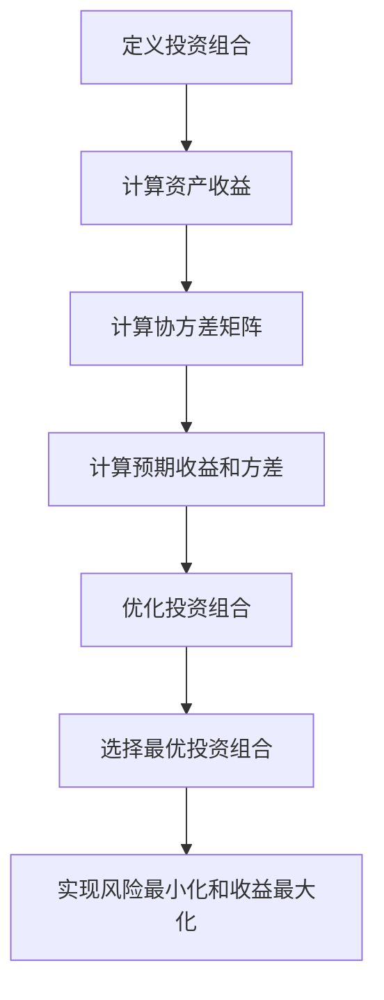

                 

# 数学与投资组合理论：资产配置的数学优化

> 关键词：投资组合理论, 资产配置, 数学优化, 马科维茨模型, 协方差矩阵, 均值-方差优化

> 摘要：本文旨在深入探讨投资组合理论中的数学优化方法，特别是马科维茨模型。我们将从理论基础出发，逐步解析其核心算法原理，并通过实际代码案例进行详细说明。通过本文，读者将能够理解如何利用数学工具优化资产配置，从而实现投资组合的风险最小化和收益最大化。

## 1. 背景介绍
### 1.1 目的和范围
本文旨在为读者提供一个全面的视角，理解投资组合理论中的数学优化方法。我们将重点介绍马科维茨模型，这是一种广泛应用于金融领域的资产配置策略。通过本文，读者将能够掌握如何利用数学工具优化资产配置，从而实现投资组合的风险最小化和收益最大化。

### 1.2 预期读者
本文适合以下读者群体：
- 投资者和金融分析师，希望优化其投资组合。
- 金融工程和量化交易领域的从业者。
- 对数学优化和投资组合理论感兴趣的计算机科学家和工程师。
- 对金融数学和统计学感兴趣的研究生和博士生。

### 1.3 文档结构概述
本文结构如下：
1. 背景介绍
2. 核心概念与联系
3. 核心算法原理 & 具体操作步骤
4. 数学模型和公式 & 详细讲解 & 举例说明
5. 项目实战：代码实际案例和详细解释说明
6. 实际应用场景
7. 工具和资源推荐
8. 总结：未来发展趋势与挑战
9. 附录：常见问题与解答
10. 扩展阅读 & 参考资料

### 1.4 术语表
#### 1.4.1 核心术语定义
- **投资组合**：由多种资产构成的投资组合。
- **资产**：投资组合中的单个证券或金融工具。
- **预期收益**：资产的平均收益。
- **方差**：资产收益的波动性。
- **协方差**：资产收益之间的相关性。
- **均值-方差优化**：通过优化投资组合的预期收益和方差来实现最优配置。
- **马科维茨模型**：一种基于均值-方差优化的投资组合理论。

#### 1.4.2 相关概念解释
- **风险**：投资组合的波动性。
- **收益**：投资组合的预期收益。
- **协方差矩阵**：描述资产收益之间相关性的矩阵。

#### 1.4.3 缩略词列表
- **MVO**：均值-方差优化（Mean-Variance Optimization）
- **MV**：均值-方差（Mean-Variance）
- **Cov**：协方差（Covariance）

## 2. 核心概念与联系
### 2.1 投资组合理论基础
投资组合理论的核心在于如何通过优化资产配置来实现风险最小化和收益最大化。马科维茨模型是这一理论的基石，它通过均值-方差优化方法来实现这一目标。

### 2.2 均值-方差优化原理
均值-方差优化的目标是找到一个投资组合，使得其预期收益最大化，同时方差（风险）最小化。这一目标可以通过以下流程图来表示：



### 2.3 核心概念联系
- **资产收益**：是投资组合的基础，决定了投资组合的预期收益。
- **协方差矩阵**：描述了资产收益之间的相关性，是优化过程中的关键输入。
- **预期收益和方差**：是优化目标，通过调整资产权重来实现。
- **最优投资组合**：是通过优化过程找到的，使得预期收益最大化，方差最小化。

## 3. 核心算法原理 & 具体操作步骤
### 3.1 均值-方差优化算法原理
均值-方差优化的核心在于通过调整资产权重来最小化投资组合的方差，同时最大化预期收益。这一过程可以通过以下伪代码来表示：

```pseudo
function optimize_portfolio(assets, expected_returns, covariance_matrix):
    n = length(assets)
    weights = [0.0] * n
    constraints = {
        "sum(weights) == 1",
        "weights >= 0"
    }
    objective = minimize(weights' * covariance_matrix * weights)
    objective += maximize(weights' * expected_returns)
    solution = solve(objective, constraints)
    return solution.weights
```

### 3.2 具体操作步骤
1. **定义投资组合**：确定投资组合中的资产。
2. **计算资产收益**：获取每种资产的历史收益数据。
3. **计算协方差矩阵**：基于历史收益数据计算资产之间的协方差。
4. **计算预期收益和方差**：基于历史数据计算每种资产的预期收益和投资组合的方差。
5. **优化投资组合**：通过优化算法找到最优的资产权重。
6. **选择最优投资组合**：根据优化结果选择最优的投资组合。

## 4. 数学模型和公式 & 详细讲解 & 举例说明
### 4.1 数学模型
均值-方差优化的目标函数可以表示为：

$$
\min_{\mathbf{w}} \mathbf{w}^T \Sigma \mathbf{w} \quad \text{subject to} \quad \mathbf{w}^T \mathbf{r} = \mu, \quad \mathbf{w}^T \mathbf{1} = 1, \quad \mathbf{w} \geq 0
$$

其中：
- $\mathbf{w}$ 是资产权重向量。
- $\Sigma$ 是协方差矩阵。
- $\mathbf{r}$ 是资产收益向量。
- $\mu$ 是目标预期收益。
- $\mathbf{1}$ 是单位向量。

### 4.2 详细讲解
- **目标函数**：最小化投资组合的方差。
- **约束条件**：确保投资组合的预期收益达到目标值，资产权重之和为1，且所有权重非负。

### 4.3 举例说明
假设我们有三个资产A、B、C，其历史收益数据如下：

| 资产 | 收益 |
|------|------|
| A    | 0.05 |
| B    | 0.07 |
| C    | 0.04 |

协方差矩阵为：

$$
\Sigma = \begin{bmatrix}
0.0004 & 0.0002 & 0.0001 \\
0.0002 & 0.0006 & 0.0003 \\
0.0001 & 0.0003 & 0.0005
\end{bmatrix}
$$

预期收益向量为：

$$
\mathbf{r} = \begin{bmatrix}
0.05 \\
0.07 \\
0.04
\end{bmatrix}
$$

目标预期收益为：

$$
\mu = 0.06
$$

通过优化算法，我们可以找到最优的资产权重向量。

## 5. 项目实战：代码实际案例和详细解释说明
### 5.1 开发环境搭建
我们将使用Python进行代码实现，确保安装了必要的库：

```bash
pip install numpy pandas cvxopt
```

### 5.2 源代码详细实现和代码解读
```python
import numpy as np
import pandas as pd
from cvxopt import matrix, solvers

# 定义资产收益数据
returns = np.array([0.05, 0.07, 0.04])

# 定义协方差矩阵
cov_matrix = np.array([
    [0.0004, 0.0002, 0.0001],
    [0.0002, 0.0006, 0.0003],
    [0.0001, 0.0003, 0.0005]
])

# 定义目标预期收益
target_return = 0.06

# 转换为cvxopt格式
P = matrix(cov_matrix)
q = matrix(np.zeros(len(returns)))
G = matrix(-np.eye(len(returns)))
h = matrix(np.zeros(len(returns)))
A = matrix(returns, (1, len(returns)))
b = matrix(target_return)

# 解决优化问题
solvers.options['show_progress'] = False
sol = solvers.qp(P, q, G, h, A, b)

# 获取最优权重
optimal_weights = np.array(sol['x'])
print("Optimal Weights:", optimal_weights)
```

### 5.3 代码解读与分析
- **导入库**：导入必要的Python库。
- **定义资产收益数据**：定义资产的历史收益数据。
- **定义协方差矩阵**：定义资产之间的协方差矩阵。
- **定义目标预期收益**：定义目标预期收益。
- **转换为cvxopt格式**：将数据转换为cvxopt格式，以便进行优化。
- **解决优化问题**：使用cvxopt库解决优化问题。
- **获取最优权重**：从优化结果中获取最优的资产权重。

## 6. 实际应用场景
均值-方差优化在实际投资中有着广泛的应用，例如：
- **资产配置**：通过优化资产权重来实现风险最小化和收益最大化。
- **风险管理**：通过优化投资组合来降低整体风险。
- **量化交易**：通过优化算法实现自动化交易策略。

## 7. 工具和资源推荐
### 7.1 学习资源推荐
#### 7.1.1 书籍推荐
- **《投资组合理论》**：深入讲解投资组合理论及其应用。
- **《金融数学》**：详细介绍了金融数学中的各种模型和方法。

#### 7.1.2 在线课程
- **Coursera - 金融工程**：涵盖金融工程中的各种模型和方法。
- **edX - 金融数学**：深入讲解金融数学中的各种理论和应用。

#### 7.1.3 技术博客和网站
- **QuantStart**：提供丰富的量化交易和金融工程相关文章。
- **Medium - 金融工程**：分享最新的金融工程和投资组合理论文章。

### 7.2 开发工具框架推荐
#### 7.2.1 IDE和编辑器
- **PyCharm**：强大的Python开发环境。
- **Jupyter Notebook**：适合进行数据分析和代码实现。

#### 7.2.2 调试和性能分析工具
- **PyCharm Debugger**：强大的Python调试工具。
- **LineProfiler**：用于性能分析的工具。

#### 7.2.3 相关框架和库
- **cvxopt**：用于求解二次规划问题的库。
- **pandas**：用于数据处理和分析的库。

### 7.3 相关论文著作推荐
#### 7.3.1 经典论文
- **《投资组合理论》**：马科维茨的经典论文，奠定了投资组合理论的基础。
- **《资产定价理论》**：深入探讨资产定价理论及其应用。

#### 7.3.2 最新研究成果
- **《现代投资组合理论》**：最新研究成果，涵盖了最新的投资组合理论和方法。
- **《量化投资》**：最新研究成果，涵盖了最新的量化投资策略和方法。

#### 7.3.3 应用案例分析
- **《投资组合理论在实际应用中的案例分析》**：详细分析了投资组合理论在实际应用中的案例。

## 8. 总结：未来发展趋势与挑战
均值-方差优化在投资组合理论中有着重要的地位，未来的发展趋势包括：
- **机器学习和人工智能**：利用机器学习和人工智能技术进一步优化投资组合。
- **大数据和云计算**：利用大数据和云计算技术处理大规模数据，提高优化效率。
- **风险管理**：进一步提高风险管理能力，降低投资风险。

## 9. 附录：常见问题与解答
### 9.1 问题：如何处理非正定协方差矩阵？
**解答**：可以使用对角占优方法或添加一个小的正数到对角线上，以确保协方差矩阵的正定性。

### 9.2 问题：如何选择目标预期收益？
**解答**：可以根据历史数据和市场预期来选择目标预期收益。

### 9.3 问题：如何处理交易成本？
**解答**：可以在优化目标中加入交易成本项，以降低交易成本的影响。

## 10. 扩展阅读 & 参考资料
- **《投资组合理论》**：马科维茨的经典论文。
- **《金融数学》**：深入讲解金融数学中的各种模型和方法。
- **《量化投资》**：最新研究成果，涵盖了最新的量化投资策略和方法。

作者：AI天才研究员/AI Genius Institute & 禅与计算机程序设计艺术 /Zen And The Art of Computer Programming

