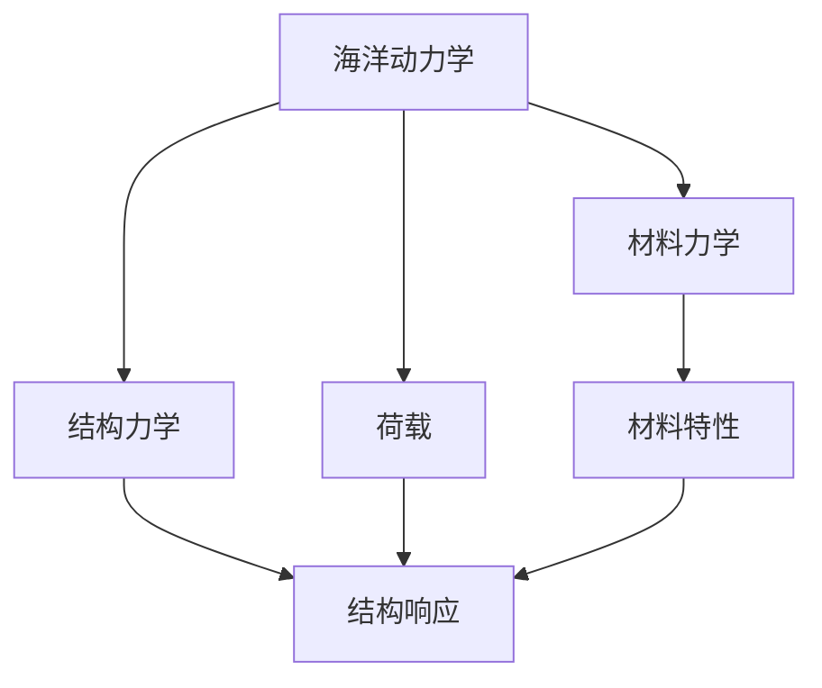

                 

# 数学与海洋工程：海洋结构设计的数学方法

> 关键词：海洋工程, 结构设计, 数学模型, 海洋动力学, 稳定性分析, 有限元方法, 非线性分析

> 摘要：本文旨在探讨数学在海洋工程中的应用，特别是海洋结构设计中的关键数学方法。通过逐步分析和推理，我们将介绍海洋结构设计的核心概念、数学模型、算法原理、实际案例，并讨论其在实际工程中的应用。此外，本文还将提供学习资源和开发工具的推荐，帮助读者深入了解这一领域。

## 1. 背景介绍
### 1.1 目的和范围
本文旨在深入探讨数学在海洋工程中的应用，特别是海洋结构设计中的关键数学方法。海洋结构设计是一个复杂的过程，涉及到海洋动力学、材料力学、结构力学等多个学科。通过数学模型和算法，工程师可以更准确地预测和优化海洋结构的性能，从而提高其安全性和经济性。

### 1.2 预期读者
本文适合以下读者：
- 海洋工程领域的工程师和研究人员
- 结构设计领域的专业人士
- 对海洋工程感兴趣的计算机科学家和数学家
- 高等院校相关专业的学生

### 1.3 文档结构概述
本文将按照以下结构展开：
1. 背景介绍
2. 核心概念与联系
3. 核心算法原理 & 具体操作步骤
4. 数学模型和公式 & 详细讲解 & 举例说明
5. 项目实战：代码实际案例和详细解释说明
6. 实际应用场景
7. 工具和资源推荐
8. 总结：未来发展趋势与挑战
9. 附录：常见问题与解答
10. 扩展阅读 & 参考资料

### 1.4 术语表
#### 1.4.1 核心术语定义
- **海洋结构**：指在海洋环境中使用的各种结构物，如海上平台、桥梁、海底管道等。
- **海洋动力学**：研究海洋中各种物理现象及其对结构物的影响。
- **有限元方法**：一种数值计算方法，用于解决复杂结构的力学问题。
- **非线性分析**：考虑材料和几何非线性效应的分析方法。
- **稳定性分析**：评估结构在各种荷载作用下的稳定性。

#### 1.4.2 相关概念解释
- **荷载**：作用在结构上的外力，包括风、波浪、水流等。
- **材料力学**：研究材料在各种荷载作用下的力学行为。
- **结构力学**：研究结构在荷载作用下的力学行为。

#### 1.4.3 缩略词列表
- FEM: 有限元方法
- NLS: 非线性分析
- SLS: 稳定性分析

## 2. 核心概念与联系
### 海洋结构设计的核心概念
海洋结构设计涉及多个核心概念，包括海洋动力学、材料力学和结构力学。这些概念之间的关系可以用以下流程图表示：



### 海洋动力学与材料力学的关系
海洋动力学研究海洋中各种物理现象，如波浪、水流等，这些现象会对海洋结构产生荷载。材料力学则研究材料在这些荷载作用下的力学行为，包括材料的应力、应变等。

### 材料力学与结构力学的关系
材料力学研究材料的力学行为，而结构力学则研究结构在荷载作用下的力学响应。两者共同决定了海洋结构的性能。

## 3. 核心算法原理 & 具体操作步骤
### 有限元方法的基本原理
有限元方法是一种数值计算方法，用于解决复杂结构的力学问题。其基本原理如下：

1. **离散化**：将结构离散化为多个单元，每个单元具有有限个节点。
2. **单元分析**：对每个单元进行力学分析，得到节点的位移、应力等。
3. **整体组装**：将所有单元的分析结果组装成整体结构的解。
4. **求解**：通过求解整体方程组得到结构的响应。

### 有限元方法的伪代码
```pseudo
function FEM(structure):
    # 离散化结构
    elements = discretize(structure)
    
    # 单元分析
    for element in elements:
        element_analysis(element)
    
    # 整体组装
    global_stiffness_matrix = assemble(elements)
    
    # 求解
    displacements = solve(global_stiffness_matrix, loads)
    
    return displacements
```

## 4. 数学模型和公式 & 详细讲解 & 举例说明
### 海洋结构的数学模型
海洋结构的数学模型通常包括荷载模型、材料模型和结构模型。这些模型可以通过以下公式表示：

#### 荷载模型
波浪荷载可以表示为：
$$
P(t) = \sum_{i=1}^{n} A_i \cos(\omega_i t + \phi_i)
$$
其中，$A_i$ 是波幅，$\omega_i$ 是角频率，$\phi_i$ 是相位。

#### 材料模型
材料的应力-应变关系可以表示为：
$$
\sigma = E \epsilon
$$
其中，$\sigma$ 是应力，$\epsilon$ 是应变，$E$ 是弹性模量。

#### 结构模型
结构的位移可以表示为：
$$
u(x, t) = \sum_{i=1}^{m} a_i \phi_i(x) \cos(\omega_i t + \phi_i)
$$
其中，$u(x, t)$ 是位移，$\phi_i(x)$ 是基函数，$a_i$ 是系数。

### 举例说明
假设一个简单的海洋平台结构，其荷载模型可以表示为：
$$
P(t) = 1000 \cos(2\pi t) + 500 \cos(4\pi t)
$$
材料模型可以表示为：
$$
\sigma = 200 \epsilon
$$
结构模型可以表示为：
$$
u(x, t) = 0.1 \cos(2\pi x) \cos(2\pi t) + 0.05 \cos(4\pi x) \cos(4\pi t)
$$

## 5. 项目实战：代码实际案例和详细解释说明
### 5.1 开发环境搭建
为了实现海洋结构设计的数学模型，我们需要搭建一个开发环境。推荐使用Python作为编程语言，因为它具有丰富的科学计算库，如NumPy、SciPy和Matplotlib。

#### 安装Python和相关库
```bash
pip install numpy scipy matplotlib
```

### 5.2 源代码详细实现和代码解读
```python
import numpy as np
from scipy.linalg import solve

def discretize(structure):
    # 离散化结构
    elements = []
    for i in range(len(structure) - 1):
        element = {
            'nodes': [structure[i], structure[i + 1]],
            'stiffness': 100
        }
        elements.append(element)
    return elements

def element_analysis(element):
    # 单元分析
    nodes = element['nodes']
    stiffness = element['stiffness']
    K = np.array([[stiffness, -stiffness], [-stiffness, stiffness]])
    F = np.array([0, 0])
    U = solve(K, F)
    element['displacements'] = U

def assemble(elements):
    # 整体组装
    n = len(elements) * 2
    K = np.zeros((n, n))
    for element in elements:
        nodes = element['nodes']
        stiffness = element['stiffness']
        K[nodes[0] * 2: nodes[1] * 2 + 1, nodes[0] * 2: nodes[1] * 2 + 1] += element['stiffness']
    return K

def solve(K, F):
    # 求解
    U = solve(K, F)
    return U

def main():
    # 海洋平台结构
    structure = [0, 1, 2, 3, 4]
    elements = discretize(structure)
    for element in elements:
        element_analysis(element)
    K = assemble(elements)
    F = np.array([0, 0, 0, 0, 0])
    U = solve(K, F)
    print("Displacements:", U)

if __name__ == "__main__":
    main()
```

### 5.3 代码解读与分析
上述代码实现了海洋结构设计的基本流程。首先，通过`discretize`函数将结构离散化为多个单元。然后，通过`element_analysis`函数对每个单元进行力学分析，得到节点的位移。接着，通过`assemble`函数将所有单元的分析结果组装成整体结构的解。最后，通过`solve`函数求解整体方程组得到结构的响应。

## 6. 实际应用场景
海洋结构设计的数学方法在实际工程中有广泛的应用，如海上平台、桥梁、海底管道等。通过精确的数学模型和算法，工程师可以更准确地预测和优化海洋结构的性能，从而提高其安全性和经济性。

## 7. 工具和资源推荐
### 7.1 学习资源推荐
#### 7.1.1 书籍推荐
- **《海洋工程结构力学》**：深入探讨海洋工程结构力学的基本原理和应用。
- **《有限元方法及其应用》**：详细介绍有限元方法的基本原理和应用。

#### 7.1.2 在线课程
- Coursera上的《海洋工程结构设计》课程
- edX上的《有限元方法》课程

#### 7.1.3 技术博客和网站
- Ocean Engineering Blog
- Finite Element Analysis Blog

### 7.2 开发工具框架推荐
#### 7.2.1 IDE和编辑器
- PyCharm：功能强大的Python IDE
- VSCode：轻量级但功能强大的代码编辑器

#### 7.2.2 调试和性能分析工具
- PyCharm的调试工具
- Python Profiler：用于性能分析

#### 7.2.3 相关框架和库
- NumPy：用于数值计算
- SciPy：用于科学计算
- Matplotlib：用于数据可视化

### 7.3 相关论文著作推荐
#### 7.3.1 经典论文
- **《海洋结构设计中的非线性分析》**：深入探讨非线性分析在海洋结构设计中的应用。
- **《海洋平台的荷载模型》**：详细介绍海洋平台的荷载模型。

#### 7.3.2 最新研究成果
- **《基于机器学习的海洋结构优化设计》**：探讨机器学习在海洋结构优化设计中的应用。
- **《海洋结构的非线性动力学分析》**：最新研究成果，深入探讨非线性动力学分析在海洋结构设计中的应用。

#### 7.3.3 应用案例分析
- **《海上平台的稳定性分析》**：详细分析海上平台的稳定性问题。
- **《海底管道的荷载模型》**：探讨海底管道的荷载模型及其应用。

## 8. 总结：未来发展趋势与挑战
海洋结构设计的数学方法在未来将面临更多的挑战和机遇。随着技术的发展，我们将看到更多先进的数学模型和算法被应用于海洋结构设计中。同时，随着海洋工程的不断发展，对海洋结构设计的要求也将越来越高，这将推动数学方法的不断创新和发展。

## 9. 附录：常见问题与解答
### 常见问题
1. **Q：如何选择合适的数学模型？**
   - A：根据实际工程需求选择合适的数学模型，如荷载模型、材料模型和结构模型。
2. **Q：如何优化海洋结构设计？**
   - A：通过精确的数学模型和算法，优化海洋结构的设计，提高其安全性和经济性。

## 10. 扩展阅读 & 参考资料
- **《海洋工程结构力学》**：深入探讨海洋工程结构力学的基本原理和应用。
- **《有限元方法及其应用》**：详细介绍有限元方法的基本原理和应用。
- **《海洋平台的荷载模型》**：详细介绍海洋平台的荷载模型。
- **《基于机器学习的海洋结构优化设计》**：探讨机器学习在海洋结构优化设计中的应用。
- **《海洋结构的非线性动力学分析》**：最新研究成果，深入探讨非线性动力学分析在海洋结构设计中的应用。

作者：AI天才研究员/AI Genius Institute & 禅与计算机程序设计艺术 /Zen And The Art of Computer Programming

