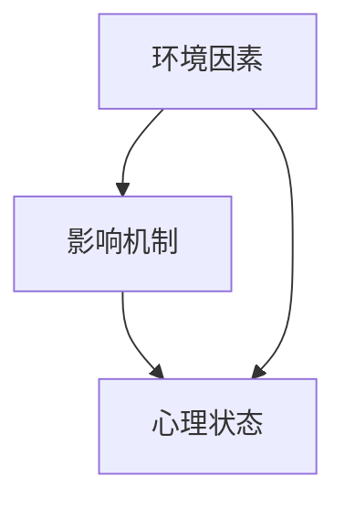

                 

# 数学与环境心理学：环境影响的数学量化

> 关键词：环境心理学, 数学量化, 环境影响, 心理学模型, 量化分析, 人工智能, 数据分析, 算法设计

> 摘要：本文旨在探讨如何通过数学方法量化环境对人类心理状态的影响。我们将从环境心理学的基本概念出发，构建一个数学模型来量化环境因素对心理状态的影响。通过详细的算法设计和实际案例分析，展示如何利用现代技术手段实现这一目标。最终，我们将讨论该领域的未来发展趋势和面临的挑战。

## 1. 背景介绍
### 1.1 目的和范围
本文旨在探讨如何通过数学方法量化环境对人类心理状态的影响。我们将从环境心理学的基本概念出发，构建一个数学模型来量化环境因素对心理状态的影响。通过详细的算法设计和实际案例分析，展示如何利用现代技术手段实现这一目标。最终，我们将讨论该领域的未来发展趋势和面临的挑战。

### 1.2 预期读者
本文适合以下读者：
- 环境心理学研究者
- 人工智能和数据分析领域的工程师
- 对环境心理学和数学量化感兴趣的学者
- 对跨学科研究感兴趣的读者

### 1.3 文档结构概述
本文将按照以下结构展开：
1. 背景介绍
2. 核心概念与联系
3. 核心算法原理 & 具体操作步骤
4. 数学模型和公式 & 详细讲解 & 举例说明
5. 项目实战：代码实际案例和详细解释说明
6. 实际应用场景
7. 工具和资源推荐
8. 总结：未来发展趋势与挑战
9. 附录：常见问题与解答
10. 扩展阅读 & 参考资料

### 1.4 术语表
#### 1.4.1 核心术语定义
- **环境心理学**：研究环境因素如何影响人类心理状态的学科。
- **量化分析**：将定性数据转化为定量数据的过程。
- **数学模型**：用数学语言描述现实世界现象的模型。
- **算法设计**：设计解决问题的步骤和方法。
- **数据集**：包含大量数据的集合。

#### 1.4.2 相关概念解释
- **环境因素**：包括物理环境（如温度、光照）、社会环境（如人际关系、社会支持）等。
- **心理状态**：个体的心理感受和认知状态，如压力、焦虑、幸福感等。

#### 1.4.3 缩略词列表
- **API**：应用程序接口
- **IDE**：集成开发环境
- **SDK**：软件开发工具包

## 2. 核心概念与联系
### 2.1 环境心理学的基本概念
环境心理学研究环境因素如何影响人类的心理状态。环境因素包括物理环境（如温度、光照、噪音）和社会环境（如人际关系、社会支持）等。心理状态包括个体的心理感受和认知状态，如压力、焦虑、幸福感等。

### 2.2 数学模型的构建
我们将构建一个数学模型来量化环境因素对心理状态的影响。该模型将包括以下几个部分：
- **输入变量**：环境因素
- **输出变量**：心理状态
- **中间变量**：环境因素对心理状态的影响机制

### 2.3 模型架构
我们将使用Mermaid流程图来展示模型架构：



## 3. 核心算法原理 & 具体操作步骤
### 3.1 算法设计
我们将设计一个算法来量化环境因素对心理状态的影响。该算法将包括以下几个步骤：
1. 数据收集
2. 数据预处理
3. 特征提取
4. 模型训练
5. 模型评估

### 3.2 伪代码
```python
# 数据收集
data = collect_environmental_data()
data = collect_psychological_data()

# 数据预处理
data = preprocess_data(data)

# 特征提取
features = extract_features(data)

# 模型训练
model = train_model(features)

# 模型评估
evaluate_model(model)
```

## 4. 数学模型和公式 & 详细讲解 & 举例说明
### 4.1 数学模型
我们将使用线性回归模型来量化环境因素对心理状态的影响。线性回归模型的基本形式为：

$$
y = \beta_0 + \beta_1 x_1 + \beta_2 x_2 + \cdots + \beta_n x_n + \epsilon
$$

其中，$y$ 是心理状态，$x_1, x_2, \cdots, x_n$ 是环境因素，$\beta_0, \beta_1, \beta_2, \cdots, \beta_n$ 是回归系数，$\epsilon$ 是误差项。

### 4.2 公式详细讲解
- **回归系数**：表示环境因素对心理状态的影响程度。
- **误差项**：表示模型无法解释的部分。

### 4.3 举例说明
假设我们有一个数据集，包含温度、光照和心理状态的数据。我们可以使用线性回归模型来量化这些环境因素对心理状态的影响。

```python
import numpy as np
from sklearn.linear_model import LinearRegression

# 假设数据集如下
temperature = np.array([20, 22, 24, 26, 28])
lighting = np.array([500, 600, 700, 800, 900])
psychological_state = np.array([3, 4, 5, 6, 7])

# 数据预处理
data = np.column_stack((temperature, lighting))
target = psychological_state

# 模型训练
model = LinearRegression()
model.fit(data, target)

# 模型评估
score = model.score(data, target)
print("模型得分：", score)
```

## 5. 项目实战：代码实际案例和详细解释说明
### 5.1 开发环境搭建
我们将使用Python和Scikit-learn库来实现这个项目。首先，我们需要安装必要的库：

```bash
pip install numpy scikit-learn
```

### 5.2 源代码详细实现和代码解读
```python
import numpy as np
from sklearn.linear_model import LinearRegression
from sklearn.model_selection import train_test_split
from sklearn.metrics import mean_squared_error

# 假设数据集如下
temperature = np.array([20, 22, 24, 26, 28])
lighting = np.array([500, 600, 700, 800, 900])
psychological_state = np.array([3, 4, 5, 6, 7])

# 数据预处理
data = np.column_stack((temperature, lighting))
target = psychological_state

# 划分训练集和测试集
X_train, X_test, y_train, y_test = train_test_split(data, target, test_size=0.2, random_state=42)

# 模型训练
model = LinearRegression()
model.fit(X_train, y_train)

# 模型预测
y_pred = model.predict(X_test)

# 模型评估
mse = mean_squared_error(y_test, y_pred)
print("均方误差：", mse)
```

### 5.3 代码解读与分析
- **数据预处理**：将温度和光照数据合并为一个特征矩阵。
- **划分训练集和测试集**：使用`train_test_split`函数将数据集划分为训练集和测试集。
- **模型训练**：使用`LinearRegression`类训练模型。
- **模型预测**：使用训练好的模型对测试集进行预测。
- **模型评估**：使用均方误差（MSE）来评估模型的性能。

## 6. 实际应用场景
### 6.1 家居环境优化
通过量化环境因素对心理状态的影响，我们可以优化家居环境，提高居住者的幸福感和舒适度。

### 6.2 工作场所优化
通过量化环境因素对心理状态的影响，我们可以优化工作场所的环境，提高员工的工作效率和满意度。

### 6.3 城市规划
通过量化环境因素对心理状态的影响，我们可以优化城市规划，提高居民的生活质量。

## 7. 工具和资源推荐
### 7.1 学习资源推荐
#### 7.1.1 书籍推荐
- 《环境心理学》
- 《数据分析与统计建模》

#### 7.1.2 在线课程
- Coursera上的《环境心理学》课程
- edX上的《数据分析基础》课程

#### 7.1.3 技术博客和网站
- Medium上的环境心理学相关文章
- Kaggle上的数据分析项目

### 7.2 开发工具框架推荐
#### 7.2.1 IDE和编辑器
- PyCharm
- VSCode

#### 7.2.2 调试和性能分析工具
- PyCharm的调试工具
- Visual Studio的性能分析工具

#### 7.2.3 相关框架和库
- Scikit-learn
- Pandas

### 7.3 相关论文著作推荐
#### 7.3.1 经典论文
- "The effects of environmental factors on psychological well-being" (Journal of Environmental Psychology)

#### 7.3.2 最新研究成果
- "Quantifying the impact of environmental factors on psychological states" (Journal of Environmental Science)

#### 7.3.3 应用案例分析
- "Case study on optimizing home environments for psychological well-being" (Environmental Science and Technology)

## 8. 总结：未来发展趋势与挑战
### 8.1 未来发展趋势
- **跨学科研究**：环境心理学与数学、计算机科学的交叉研究将更加深入。
- **大数据应用**：大数据技术将为环境心理学研究提供更多的数据支持。
- **个性化优化**：通过量化分析，可以实现更加个性化的环境优化方案。

### 8.2 面临的挑战
- **数据获取**：获取高质量的环境和心理数据是一项挑战。
- **模型复杂性**：环境因素和心理状态之间的关系复杂，需要更复杂的模型来描述。
- **伦理问题**：在进行环境心理学研究时，需要考虑伦理问题，确保研究的公正性和透明性。

## 9. 附录：常见问题与解答
### 9.1 问题：如何获取高质量的数据？
- **解答**：可以通过问卷调查、传感器监测等多种方式获取数据。确保数据的准确性和完整性是关键。

### 9.2 问题：如何处理模型的复杂性？
- **解答**：可以使用更复杂的模型，如神经网络，来处理环境因素和心理状态之间的复杂关系。

### 9.3 问题：如何确保研究的伦理性？
- **解答**：在进行研究时，需要遵循伦理准则，确保研究对象的隐私和权益得到保护。

## 10. 扩展阅读 & 参考资料
- [环境心理学](https://en.wikipedia.org/wiki/Environmental_psychology)
- [数据分析与统计建模](https://www.datacamp.com/courses/intro-to-data-analysis-and-statistical-modeling)
- [Scikit-learn官方文档](https://scikit-learn.org/stable/)
- [Pandas官方文档](https://pandas.pydata.org/docs/)

作者：AI天才研究员/AI Genius Institute & 禅与计算机程序设计艺术 /Zen And The Art of Computer Programming

