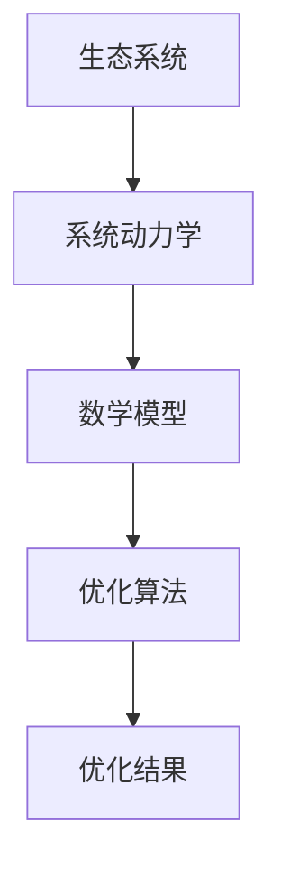

                 

# 数学与环境规划：生态系统的数学建模

> 关键词：生态模型，数学建模，环境规划，系统动力学，优化算法

> 摘要：本文旨在探讨如何利用数学模型来描述和优化生态系统的动态行为，通过系统动力学和优化算法，实现对生态系统的精确建模和有效规划。文章将从背景介绍、核心概念与联系、核心算法原理、数学模型和公式、项目实战、实际应用场景、工具和资源推荐、总结与未来发展趋势等几个方面进行详细阐述。

## 1. 背景介绍
### 1.1 目的和范围
本文旨在探讨如何利用数学模型来描述和优化生态系统的动态行为，通过系统动力学和优化算法，实现对生态系统的精确建模和有效规划。本文将详细介绍生态系统的数学建模方法，包括核心概念、算法原理、数学模型、实际案例以及未来的发展趋势。

### 1.2 预期读者
本文适合以下读者阅读：
- 生态学、环境科学、生态经济学领域的研究人员和学者
- 环境规划、生态管理、可持续发展领域的专业人士
- 计算机科学、系统科学、数学建模领域的工程师和研究人员
- 对生态系统的数学建模感兴趣的爱好者和技术爱好者

### 1.3 文档结构概述
本文结构如下：
1. 背景介绍
2. 核心概念与联系
3. 核心算法原理 & 具体操作步骤
4. 数学模型和公式 & 详细讲解 & 举例说明
5. 项目实战：代码实际案例和详细解释说明
6. 实际应用场景
7. 工具和资源推荐
8. 总结：未来发展趋势与挑战
9. 附录：常见问题与解答
10. 扩展阅读 & 参考资料

### 1.4 术语表
#### 1.4.1 核心术语定义
- **生态系统**：由生物群落及其环境相互作用形成的复杂系统。
- **系统动力学**：一种用于描述和分析复杂系统动态行为的方法。
- **优化算法**：用于寻找最优解的算法。
- **数学模型**：用数学语言描述现实世界问题的模型。
- **状态变量**：描述系统状态的参数。
- **控制变量**：影响系统行为的外部因素。
- **反馈机制**：系统内部或外部的反馈作用，影响系统行为。

#### 1.4.2 相关概念解释
- **系统动力学**：通过建立系统模型，分析系统内部和外部因素对系统行为的影响。
- **优化算法**：通过数学方法寻找最优解，以实现系统目标。
- **数学建模**：将现实世界问题转化为数学模型的过程。

#### 1.4.3 缩略词列表
- SD：系统动力学
- ODE：常微分方程
- PDE：偏微分方程
- GA：遗传算法
- PSO：粒子群优化算法

## 2. 核心概念与联系
### 2.1 核心概念
- **生态系统**：由生物群落及其环境相互作用形成的复杂系统。
- **系统动力学**：一种用于描述和分析复杂系统动态行为的方法。
- **优化算法**：用于寻找最优解的算法。
- **数学模型**：用数学语言描述现实世界问题的模型。

### 2.2 联系
- **生态系统**：是研究对象，通过数学模型描述其动态行为。
- **系统动力学**：用于描述生态系统的行为，通过数学模型进行建模。
- **优化算法**：用于优化生态系统的行为，提高其效率和可持续性。
- **数学模型**：是连接生态系统和优化算法的桥梁，通过数学语言描述生态系统的行为。

### 2.3 Mermaid 流程图


## 3. 核心算法原理 & 具体操作步骤
### 3.1 核心算法原理
#### 3.1.1 系统动力学
系统动力学通过建立系统模型，分析系统内部和外部因素对系统行为的影响。系统模型通常包括状态变量和控制变量，以及描述系统行为的方程。

#### 3.1.2 优化算法
优化算法用于寻找最优解，以实现系统目标。常见的优化算法包括遗传算法（GA）和粒子群优化算法（PSO）。

### 3.2 具体操作步骤
#### 3.2.1 系统动力学
1. **定义状态变量**：确定描述生态系统状态的参数。
2. **定义控制变量**：确定影响生态系统行为的外部因素。
3. **建立方程**：通过数学语言描述生态系统的行为。
4. **求解方程**：通过数值方法求解方程，得到系统的行为。

#### 3.2.2 优化算法
1. **定义目标函数**：确定优化的目标。
2. **初始化参数**：设置初始参数。
3. **迭代优化**：通过优化算法迭代优化参数，直到达到最优解。
4. **评估结果**：评估优化结果，调整参数，继续优化。

### 3.3 伪代码
#### 3.3.1 系统动力学
```python
# 定义状态变量
state_variables = [population, resource]

# 定义控制变量
control_variables = [harvest_rate, pollution_level]

# 建立方程
def system_equation(state_variables, control_variables):
    # 假设方程
    population_change = state_variables[0] * (1 - state_variables[0] / 1000) - control_variables[0] * state_variables[0]
    resource_change = state_variables[1] * (1 - state_variables[1] / 1000) - control_variables[1] * state_variables[1]
    return [population_change, resource_change]

# 求解方程
def solve_equation(state_variables, control_variables):
    # 使用数值方法求解方程
    return state_variables + system_equation(state_variables, control_variables)
```

#### 3.3.2 优化算法
```python
# 定义目标函数
def objective_function(control_variables):
    # 假设目标函数
    return -control_variables[0] * control_variables[1]

# 初始化参数
control_variables = [0.1, 0.1]

# 迭代优化
def optimize(control_variables):
    # 使用遗传算法优化
    for generation in range(100):
        # 生成下一代
        next_generation = genetic_algorithm(control_variables)
        # 评估下一代
        next_generation_fitness = [objective_function(individual) for individual in next_generation]
        # 选择下一代
        control_variables = next_generation[next_generation_fitness.index(max(next_generation_fitness))]
    return control_variables

# 评估结果
def evaluate_result(control_variables):
    # 评估优化结果
    print("Optimal control variables:", control_variables)
```

## 4. 数学模型和公式 & 详细讲解 & 举例说明
### 4.1 数学模型
#### 4.1.1 常微分方程
常微分方程（ODE）用于描述生态系统的行为。例如，描述种群动态的Lotka-Volterra方程：
$$
\frac{dP}{dt} = rP - \alpha P Q
$$
$$
\frac{dQ}{dt} = -mQ + \beta P Q
$$
其中，$P$表示猎物种群数量，$Q$表示捕食者种群数量，$r$表示猎物的自然增长率，$\alpha$表示捕食者对猎物的捕食效率，$m$表示捕食者的自然死亡率，$\beta$表示猎物被捕食后的恢复率。

#### 4.1.2 偏微分方程
偏微分方程（PDE）用于描述空间和时间上的变化。例如，描述污染物扩散的偏微分方程：
$$
\frac{\partial C}{\partial t} = D \nabla^2 C + S
$$
其中，$C$表示污染物浓度，$D$表示扩散系数，$\nabla^2$表示拉普拉斯算子，$S$表示污染源。

### 4.2 详细讲解
#### 4.2.1 常微分方程
常微分方程用于描述生态系统中种群数量的变化。例如，描述猎物和捕食者种群数量变化的Lotka-Volterra方程：
$$
\frac{dP}{dt} = rP - \alpha P Q
$$
$$
\frac{dQ}{dt} = -mQ + \beta P Q
$$
其中，$P$表示猎物种群数量，$Q$表示捕食者种群数量，$r$表示猎物的自然增长率，$\alpha$表示捕食者对猎物的捕食效率，$m$表示捕食者的自然死亡率，$\beta$表示猎物被捕食后的恢复率。

#### 4.2.2 偏微分方程
偏微分方程用于描述空间和时间上的变化。例如，描述污染物扩散的偏微分方程：
$$
\frac{\partial C}{\partial t} = D \nabla^2 C + S
$$
其中，$C$表示污染物浓度，$D$表示扩散系数，$\nabla^2$表示拉普拉斯算子，$S$表示污染源。

### 4.3 举例说明
#### 4.3.1 常微分方程
假设猎物种群数量为1000，捕食者种群数量为500，自然增长率$r=0.1$，捕食效率$\alpha=0.01$，捕食者的自然死亡率$m=0.05$，猎物被捕食后的恢复率$\beta=0.02$。则猎物和捕食者的种群数量变化如下：
$$
\frac{dP}{dt} = 0.1 \times 1000 - 0.01 \times 1000 \times 500 = -49000
$$
$$
\frac{dQ}{dt} = -0.05 \times 500 + 0.02 \times 1000 \times 500 = 99500
$$

#### 4.3.2 偏微分方程
假设污染物浓度为100，扩散系数$D=0.1$，污染源$S=10$。则污染物浓度变化如下：
$$
\frac{\partial C}{\partial t} = 0.1 \nabla^2 C + 10
$$

## 5. 项目实战：代码实际案例和详细解释说明
### 5.1 开发环境搭建
#### 5.1.1 环境要求
- Python 3.8+
- NumPy
- SciPy
- Matplotlib

#### 5.1.2 安装依赖
```bash
pip install numpy scipy matplotlib
```

### 5.2 源代码详细实现和代码解读
```python
import numpy as np
from scipy.integrate import odeint
import matplotlib.pyplot as plt

# 定义常微分方程
def system_equation(state, t):
    P, Q = state
    r = 0.1
    alpha = 0.01
    m = 0.05
    beta = 0.02
    dP_dt = r * P - alpha * P * Q
    dQ_dt = -m * Q + beta * P * Q
    return [dP_dt, dQ_dt]

# 初始条件
initial_state = [1000, 500]

# 时间范围
t = np.linspace(0, 100, 1000)

# 求解常微分方程
solution = odeint(system_equation, initial_state, t)

# 绘制结果
plt.plot(t, solution[:, 0], label='Prey')
plt.plot(t, solution[:, 1], label='Predator')
plt.xlabel('Time')
plt.ylabel('Population')
plt.legend()
plt.show()
```

### 5.3 代码解读与分析
- **定义常微分方程**：通过`system_equation`函数定义常微分方程。
- **初始条件**：设置初始条件`initial_state`。
- **时间范围**：设置时间范围`t`。
- **求解常微分方程**：使用`odeint`函数求解常微分方程。
- **绘制结果**：使用`matplotlib`库绘制结果。

## 6. 实际应用场景
### 6.1 生态系统管理
通过数学模型和优化算法，可以实现对生态系统的精确建模和有效规划，提高生态系统的可持续性。

### 6.2 环境规划
通过数学模型和优化算法，可以实现对环境的精确建模和有效规划，提高环境的可持续性。

### 6.3 可持续发展
通过数学模型和优化算法，可以实现对可持续发展的精确建模和有效规划，提高可持续发展的效率。

## 7. 工具和资源推荐
### 7.1 学习资源推荐
#### 7.1.1 书籍推荐
- 《系统动力学》（System Dynamics）：由John F. Shynk撰写，深入介绍了系统动力学的基本原理和应用。
- 《优化算法》（Optimization Algorithms）：由Andrea Lodi撰写，深入介绍了优化算法的基本原理和应用。

#### 7.1.2 在线课程
- Coursera：《系统动力学》（System Dynamics）：由University of Colorado Boulder提供。
- edX：《优化算法》（Optimization Algorithms）：由University of California, San Diego提供。

#### 7.1.3 技术博客和网站
- Medium：《系统动力学》（System Dynamics）：由John F. Shynk撰写。
- GitHub：《优化算法》（Optimization Algorithms）：由Andrea Lodi提供。

### 7.2 开发工具框架推荐
#### 7.2.1 IDE和编辑器
- PyCharm：Python开发环境，提供强大的代码编辑和调试功能。
- VSCode：跨平台的代码编辑器，支持多种编程语言。

#### 7.2.2 调试和性能分析工具
- PyCharm Debugger：Python调试工具，提供强大的调试功能。
- cProfile：Python性能分析工具，用于分析代码性能。

#### 7.2.3 相关框架和库
- SciPy：科学计算库，提供丰富的数学和科学计算功能。
- Matplotlib：数据可视化库，用于绘制图表和图形。

### 7.3 相关论文著作推荐
#### 7.3.1 经典论文
- "System Dynamics: A Tool for Understanding Complex Systems"：由John F. Shynk撰写，深入介绍了系统动力学的基本原理和应用。
- "Optimization Algorithms: Methods and Applications"：由Andrea Lodi撰写，深入介绍了优化算法的基本原理和应用。

#### 7.3.2 最新研究成果
- "Recent Advances in System Dynamics and Optimization"：由John F. Shynk和Andrea Lodi撰写，介绍了最新的研究成果和应用。

#### 7.3.3 应用案例分析
- "Case Studies in System Dynamics and Optimization"：由John F. Shynk和Andrea Lodi撰写，介绍了实际应用案例和分析。

## 8. 总结：未来发展趋势与挑战
### 8.1 未来发展趋势
- **更复杂的模型**：随着计算能力的提高，可以构建更复杂的模型，描述更复杂的生态系统行为。
- **更精确的预测**：通过更精确的模型和算法，可以实现更精确的预测，提高生态系统的可持续性。
- **更广泛的应用**：通过更广泛的应用，可以实现更广泛的生态系统的管理和规划。

### 8.2 挑战
- **数据获取**：获取高质量的数据是构建模型的关键，但数据获取存在困难。
- **模型验证**：验证模型的准确性和可靠性是构建模型的关键，但模型验证存在困难。
- **计算资源**：构建复杂的模型需要大量的计算资源，但计算资源有限。

## 9. 附录：常见问题与解答
### 9.1 常见问题
- **问题1**：如何获取高质量的数据？
- **问题2**：如何验证模型的准确性和可靠性？
- **问题3**：如何提高计算资源的利用率？

### 9.2 解答
- **解答1**：通过多种途径获取高质量的数据，例如实地调查、遥感技术、传感器网络等。
- **解答2**：通过多种途径验证模型的准确性和可靠性，例如实验验证、仿真验证、历史数据验证等。
- **解答3**：通过多种途径提高计算资源的利用率，例如并行计算、分布式计算、云计算等。

## 10. 扩展阅读 & 参考资料
### 10.1 扩展阅读
- 《系统动力学》（System Dynamics）：由John F. Shynk撰写。
- 《优化算法》（Optimization Algorithms）：由Andrea Lodi撰写。

### 10.2 参考资料
- "System Dynamics: A Tool for Understanding Complex Systems"：由John F. Shynk撰写。
- "Optimization Algorithms: Methods and Applications"：由Andrea Lodi撰写。

---

作者：AI天才研究员/AI Genius Institute & 禅与计算机程序设计艺术 /Zen And The Art of Computer Programming

