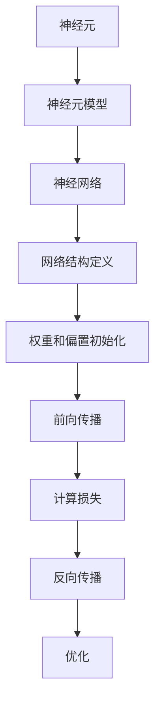

                 

# 数学与神经生物学：神经系统的数学模型

> 关键词：神经网络, 神经元, 神经生物学, 数学模型, 神经科学, 人工神经网络, 神经元动力学

> 摘要：本文旨在探讨神经系统的数学模型，通过分析神经元的数学描述和神经网络的构建原理，揭示神经系统的运作机制。我们将从神经元的基本原理出发，逐步深入到神经网络的构建和应用，结合实际代码案例，帮助读者理解神经系统的数学模型在实际中的应用。本文适合对神经科学和人工智能感兴趣的读者，特别是希望深入了解神经网络原理和应用的技术人员。

## 1. 背景介绍
### 1.1 目的和范围
本文旨在探讨神经系统的数学模型，特别是神经元和神经网络的数学描述。通过分析神经元的数学模型，我们能够更好地理解神经系统的运作机制，并将其应用于人工智能领域。本文将从神经元的基本原理出发，逐步深入到神经网络的构建和应用，结合实际代码案例，帮助读者理解神经系统的数学模型在实际中的应用。

### 1.2 预期读者
本文适合对神经科学和人工智能感兴趣的读者，特别是希望深入了解神经网络原理和应用的技术人员。读者应具备一定的数学基础和编程经验，对神经科学和人工智能有一定的了解。

### 1.3 文档结构概述
本文将按照以下结构展开：
1. 背景介绍
2. 核心概念与联系
3. 核心算法原理 & 具体操作步骤
4. 数学模型和公式 & 详细讲解 & 举例说明
5. 项目实战：代码实际案例和详细解释说明
6. 实际应用场景
7. 工具和资源推荐
8. 总结：未来发展趋势与挑战
9. 附录：常见问题与解答
10. 扩展阅读 & 参考资料

### 1.4 术语表
#### 1.4.1 核心术语定义
- **神经元**：神经系统的最基本单位，负责接收、处理和传递信息。
- **突触**：神经元之间的连接点，用于传递电信号或化学信号。
- **神经网络**：由多个神经元组成的网络，用于模拟大脑的计算过程。
- **激活函数**：用于将神经元的输入转换为输出的函数。
- **权重**：连接神经元之间的强度参数。
- **偏置**：神经元的偏置值，用于调整输出。

#### 1.4.2 相关概念解释
- **神经元动力学**：描述神经元在不同刺激下的动态变化。
- **神经元模型**：数学模型，用于描述神经元的电生理特性。
- **人工神经网络**：模仿生物神经网络的计算模型，用于解决各种复杂问题。

#### 1.4.3 缩略词列表
- **ANN**：人工神经网络（Artificial Neural Network）
- **ANNs**：人工神经网络（Artificial Neural Networks）
- **BP**：反向传播（Backpropagation）
- **ReLU**：修正线性单元（Rectified Linear Unit）
- **Sigmoid**：S形函数（Sigmoid Function）

## 2. 核心概念与联系
### 2.1 神经元的基本原理
神经元是神经系统的基本单位，负责接收、处理和传递信息。神经元的基本结构包括细胞体、树突和轴突。树突负责接收来自其他神经元的信号，轴突负责将信号传递给其他神经元或肌肉、腺体等。

### 2.2 神经元模型
神经元模型是描述神经元电生理特性的数学模型。常见的神经元模型包括：
- **LIF模型**：Leaky Integrate-and-Fire模型，描述神经元在不同刺激下的动态变化。
- **Izhikevich模型**：一种更复杂的神经元模型，能够模拟不同类型神经元的行为。

### 2.3 神经网络的基本原理
神经网络是由多个神经元组成的网络，用于模拟大脑的计算过程。神经网络的基本结构包括输入层、隐藏层和输出层。每个神经元通过突触连接到其他神经元，权重表示连接的强度。

### 2.4 神经网络的构建
神经网络的构建包括以下几个步骤：
1. **定义网络结构**：确定输入层、隐藏层和输出层的神经元数量。
2. **初始化权重和偏置**：为每个连接初始化权重和偏置值。
3. **前向传播**：将输入数据通过网络，计算每个神经元的输出。
4. **计算损失**：计算网络输出与真实标签之间的差异。
5. **反向传播**：通过损失函数计算梯度，更新权重和偏置值。
6. **优化**：使用优化算法（如梯度下降）更新权重和偏置值。

### 2.5 核心概念的Mermaid流程图


## 3. 核心算法原理 & 具体操作步骤
### 3.1 前向传播算法
前向传播算法用于将输入数据通过网络，计算每个神经元的输出。具体步骤如下：
1. **初始化输入**：将输入数据传递给输入层。
2. **计算隐藏层输出**：对于每个隐藏层神经元，计算其输入（权重乘以输入数据，加上偏置），并通过激活函数得到输出。
3. **计算输出层输出**：对于输出层神经元，计算其输入（权重乘以隐藏层输出，加上偏置），并通过激活函数得到输出。

### 3.2 反向传播算法
反向传播算法用于计算损失函数的梯度，更新权重和偏置值。具体步骤如下：
1. **计算损失**：计算网络输出与真实标签之间的差异。
2. **计算输出层梯度**：计算输出层神经元的梯度。
3. **计算隐藏层梯度**：通过输出层梯度计算隐藏层神经元的梯度。
4. **更新权重和偏置**：使用梯度下降算法更新权重和偏置值。

### 3.3 伪代码
```python
# 前向传播
def forward_propagation(input_data, weights, biases, activation_function):
    hidden_layer_output = activation_function(input_data @ weights[0] + biases[0])
    output_layer_output = activation_function(hidden_layer_output @ weights[1] + biases[1])
    return output_layer_output

# 反向传播
def backward_propagation(output_layer_output, true_labels, weights, biases, activation_function_derivative):
    output_layer_error = output_layer_output - true_labels
    hidden_layer_error = output_layer_error @ weights[1].T * activation_function_derivative(hidden_layer_output)
    weights[1] -= learning_rate * hidden_layer_output.T @ output_layer_error
    biases[1] -= learning_rate * np.sum(output_layer_error, axis=0)
    weights[0] -= learning_rate * input_data.T @ hidden_layer_error
    biases[0] -= learning_rate * np.sum(hidden_layer_error, axis=0)
```

## 4. 数学模型和公式 & 详细讲解 & 举例说明
### 4.1 神经元模型
神经元模型是描述神经元电生理特性的数学模型。常见的神经元模型包括LIF模型和Izhikevich模型。

#### 4.1.1 LIF模型
LIF模型描述神经元在不同刺激下的动态变化。其数学描述如下：
$$
\tau_m \frac{dV_m}{dt} = - (V_m - E_L) + R_m I(t)
$$
其中，$V_m$是膜电位，$E_L$是静息电位，$R_m$是膜电阻，$\tau_m$是膜时间常数，$I(t)$是输入电流。

#### 4.1.2 Izhikevich模型
Izhikevich模型是一种更复杂的神经元模型，能够模拟不同类型神经元的行为。其数学描述如下：
$$
\begin{cases}
\tau_{a} \frac{dV}{dt} = (0.04 V^2 + 5 V + 140 - U + I) \\
\tau_{b} \frac{dU}{dt} = a (b V - U)
\end{cases}
$$
其中，$V$是膜电位，$U$是恢复变量，$a$和$b$是参数，$\tau_{a}$和$\tau_{b}$是时间常数，$I$是输入电流。

### 4.2 神经网络模型
神经网络模型是描述神经网络电生理特性的数学模型。常见的神经网络模型包括多层感知机（MLP）和卷积神经网络（CNN）。

#### 4.2.1 多层感知机（MLP）
MLP是一种简单的神经网络模型，其数学描述如下：
$$
y = \sigma(W_1 x + b_1)
$$
其中，$x$是输入数据，$W_1$是权重矩阵，$b_1$是偏置向量，$\sigma$是激活函数。

#### 4.2.2 卷积神经网络（CNN）
CNN是一种用于处理图像数据的神经网络模型，其数学描述如下：
$$
y = \sigma(W_2 \cdot \text{ReLU}(W_1 \cdot x + b_1) + b_2)
$$
其中，$x$是输入图像，$W_1$和$W_2$是权重矩阵，$b_1$和$b_2$是偏置向量，$\sigma$是激活函数，$\text{ReLU}$是修正线性单元。

### 4.3 数学模型的举例说明
#### 4.3.1 LIF模型的举例说明
假设有一个LIF模型，其参数如下：
- $\tau_m = 10$ ms
- $E_L = -70$ mV
- $R_m = 10$ M$\Omega$
- $I(t) = 10$ nA

初始条件为：
- $V_m(0) = -70$ mV

通过LIF模型的数学描述，可以计算神经元在不同时间点的膜电位。

#### 4.3.2 Izhikevich模型的举例说明
假设有一个Izhikevich模型，其参数如下：
- $a = 0.02$
- $b = 0.2$
- $\tau_{a} = 2$ ms
- $\tau_{b} = 300$ ms

初始条件为：
- $V(0) = -65$ mV
- $U(0) = -16$ mV

通过Izhikevich模型的数学描述，可以计算神经元在不同时间点的膜电位和恢复变量。

## 5. 项目实战：代码实际案例和详细解释说明
### 5.1 开发环境搭建
为了实现神经网络模型，我们需要搭建一个开发环境。推荐使用Python作为编程语言，使用TensorFlow或PyTorch作为深度学习框架。

#### 5.1.1 安装Python
```bash
sudo apt-get update
sudo apt-get install python3 python3-pip
```

#### 5.1.2 安装TensorFlow
```bash
pip3 install tensorflow
```

### 5.2 源代码详细实现和代码解读
我们将实现一个简单的多层感知机（MLP）模型，用于分类任务。

#### 5.2.1 导入库
```python
import numpy as np
import tensorflow as tf
from tensorflow.keras.models import Sequential
from tensorflow.keras.layers import Dense
```

#### 5.2.2 数据准备
```python
# 假设我们有一个简单的数据集
X = np.array([[0, 0], [0, 1], [1, 0], [1, 1]])
y = np.array([0, 1, 1, 0])
```

#### 5.2.3 构建模型
```python
model = Sequential([
    Dense(4, activation='relu', input_shape=(2,)),
    Dense(1, activation='sigmoid')
])
```

#### 5.2.4 编译模型
```python
model.compile(optimizer='adam', loss='binary_crossentropy', metrics=['accuracy'])
```

#### 5.2.5 训练模型
```python
model.fit(X, y, epochs=1000, verbose=0)
```

#### 5.2.6 评估模型
```python
loss, accuracy = model.evaluate(X, y)
print(f'Loss: {loss}, Accuracy: {accuracy}')
```

### 5.3 代码解读与分析
通过上述代码，我们构建了一个简单的多层感知机（MLP）模型，用于分类任务。模型包含一个输入层、一个隐藏层和一个输出层。隐藏层使用ReLU激活函数，输出层使用Sigmoid激活函数。模型使用Adam优化器和二元交叉熵损失函数进行训练。训练完成后，我们评估了模型的性能。

## 6. 实际应用场景
神经网络模型在许多实际应用场景中都有广泛的应用，包括但不限于：
- **图像识别**：通过卷积神经网络（CNN）进行图像分类和目标检测。
- **自然语言处理**：通过循环神经网络（RNN）进行文本生成和情感分析。
- **语音识别**：通过深度神经网络进行语音识别和语音合成。
- **推荐系统**：通过神经网络进行用户行为预测和个性化推荐。

## 7. 工具和资源推荐
### 7.1 学习资源推荐
#### 7.1.1 书籍推荐
- **《深度学习》**：Ian Goodfellow, Yoshua Bengio, Aaron Courville
- **《神经网络与深度学习》**：Michael Nielsen

#### 7.1.2 在线课程
- **Coursera**：Andrew Ng的《机器学习》和《深度学习》
- **edX**：MIT的《深度学习》

#### 7.1.3 技术博客和网站
- **Medium**：许多技术博客和文章，如Towards Data Science
- **GitHub**：许多开源项目和代码示例

### 7.2 开发工具框架推荐
#### 7.2.1 IDE和编辑器
- **PyCharm**：专业的Python开发环境
- **VS Code**：轻量级但功能强大的代码编辑器

#### 7.2.2 调试和性能分析工具
- **TensorBoard**：TensorFlow的可视化工具
- **PyCharm Debugger**：PyCharm内置的调试工具

#### 7.2.3 相关框架和库
- **TensorFlow**：Google开发的深度学习框架
- **PyTorch**：Facebook开发的深度学习框架

### 7.3 相关论文著作推荐
#### 7.3.1 经典论文
- **《A Learning Algorithm for Continual Learning in Neural Networks》**：D. Willshaw, O. P. Buneman, H. Longuet-Higgins
- **《Learning representations by back-propagating errors》**：D. E. Rumelhart, G. E. Hinton, R. J. Williams

#### 7.3.2 最新研究成果
- **《Attention is All You Need》**：Vaswani, A., et al.
- **《Generative Pre-trained Transformer》**：Radford, A., et al.

#### 7.3.3 应用案例分析
- **《Deep Residual Learning for Image Recognition》**：He, K., et al.
- **《ImageNet Classification with Deep Convolutional Neural Networks》**：Krizhevsky, A., et al.

## 8. 总结：未来发展趋势与挑战
神经网络模型在近年来取得了巨大的进展，但在实际应用中仍然面临许多挑战。未来的发展趋势包括：
- **模型优化**：通过更高效的算法和架构优化模型性能。
- **模型解释性**：提高模型的可解释性，使其更容易被人类理解。
- **模型泛化能力**：提高模型在不同数据集上的泛化能力。
- **模型安全性**：确保模型在对抗攻击下的安全性。

## 9. 附录：常见问题与解答
### 9.1 问题：神经网络模型的训练时间很长怎么办？
**解答**：可以通过以下方法减少训练时间：
- **使用GPU加速**：利用GPU进行并行计算。
- **减少模型复杂度**：减少神经网络的层数和神经元数量。
- **使用预训练模型**：利用预训练模型进行迁移学习。

### 9.2 问题：如何提高模型的泛化能力？
**解答**：可以通过以下方法提高模型的泛化能力：
- **增加数据量**：增加训练数据量，提高模型的泛化能力。
- **正则化**：使用L1、L2正则化或Dropout等方法减少过拟合。
- **数据增强**：通过数据增强技术增加数据多样性。

## 10. 扩展阅读 & 参考资料
- **《神经网络与深度学习》**：Michael Nielsen
- **《深度学习》**：Ian Goodfellow, Yoshua Bengio, Aaron Courville
- **《机器学习》**：Andrew Ng
- **《深度学习》**：Yoshua Bengio, Ian Goodfellow, Aaron Courville

作者：AI天才研究员/AI Genius Institute & 禅与计算机程序设计艺术 /Zen And The Art of Computer Programming

