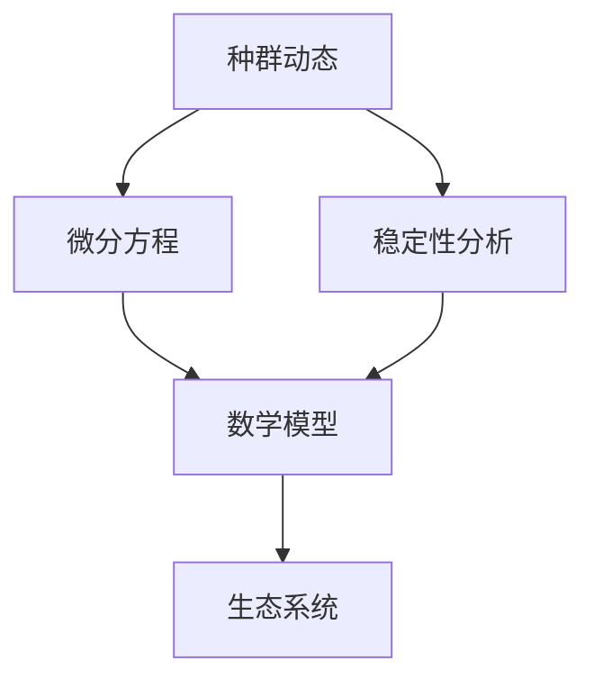

                 

# 数学与种群生物学：种群动态的数学描述

> 关键词：种群生物学, 数学模型, 种群动态, 生态系统, 微分方程, 稳定性分析, 生态平衡

> 摘要：本文旨在探讨种群生物学中的数学描述方法，通过分析种群动态的数学模型，揭示种群数量随时间变化的规律。我们将从种群生物学的基本概念出发，逐步深入到数学模型的构建与分析，最终通过实际代码案例展示如何实现这些模型。本文不仅适合生态学和生物学领域的研究者，也适合对数学建模感兴趣的计算机科学家和工程师。

## 1. 背景介绍
### 1.1 目的和范围
本文的主要目的是介绍种群动态的数学描述方法，通过数学模型来理解和预测种群数量随时间的变化规律。我们将从种群生物学的基本概念出发，逐步深入到数学模型的构建与分析，并通过实际代码案例展示如何实现这些模型。本文的目标读者包括生态学和生物学领域的研究者，以及对数学建模感兴趣的计算机科学家和工程师。

### 1.2 预期读者
- 生态学和生物学领域的研究者
- 计算机科学家和工程师
- 对数学建模感兴趣的读者

### 1.3 文档结构概述
本文将按照以下结构展开：
1. 背景介绍
2. 核心概念与联系
3. 核心算法原理 & 具体操作步骤
4. 数学模型和公式 & 详细讲解 & 举例说明
5. 项目实战：代码实际案例和详细解释说明
6. 实际应用场景
7. 工具和资源推荐
8. 总结：未来发展趋势与挑战
9. 附录：常见问题与解答
10. 扩展阅读 & 参考资料

### 1.4 术语表
#### 1.4.1 核心术语定义
- 种群：指同一物种在一定空间和时间内的所有个体集合。
- 种群动态：指种群数量随时间的变化规律。
- 生态系统：指生物群落与其环境之间的相互作用系统。
- 微分方程：描述种群数量随时间变化的数学工具。
- 稳定性分析：研究种群数量变化的稳定性。

#### 1.4.2 相关概念解释
- 生态平衡：生态系统中各物种数量相对稳定的状态。
- 生态位：物种在生态系统中的角色和功能。
- 生态位竞争：不同物种争夺相同资源的现象。

#### 1.4.3 缩略词列表
- ODE：常微分方程
- PDE：偏微分方程
- R：种群增长率
- K：环境容纳量

## 2. 核心概念与联系
### 核心概念
- 种群动态
- 生态系统
- 微分方程
- 稳定性分析

### 联系
种群动态是生态系统中各物种数量随时间变化的规律，可以通过微分方程来描述。稳定性分析则用于研究种群数量变化的稳定性，确保生态系统处于平衡状态。



## 3. 核心算法原理 & 具体操作步骤
### 3.1 种群增长模型
种群增长模型是描述种群数量随时间变化的基本模型。最简单的种群增长模型是指数增长模型，其数学表达式为：

$$
\frac{dN}{dt} = rN
$$

其中，$N$ 表示种群数量，$r$ 表示种群增长率。

### 3.2 逻辑斯蒂增长模型
逻辑斯蒂增长模型考虑了环境容纳量的影响，其数学表达式为：

$$
\frac{dN}{dt} = rN\left(1 - \frac{N}{K}\right)
$$

其中，$K$ 表示环境容纳量。

### 3.3 伪代码实现
```python
def logistic_growth(N, r, K, t):
    """
    计算逻辑斯蒂增长模型
    :param N: 初始种群数量
    :param r: 种群增长率
    :param K: 环境容纳量
    :param t: 时间
    :return: 种群数量
    """
    return N * K / (K + (K - N) * math.exp(-r * t))
```

## 4. 数学模型和公式 & 详细讲解 & 举例说明
### 4.1 指数增长模型
指数增长模型是最简单的种群增长模型，其数学表达式为：

$$
\frac{dN}{dt} = rN
$$

其中，$N$ 表示种群数量，$r$ 表示种群增长率。

### 4.2 逻辑斯蒂增长模型
逻辑斯蒂增长模型考虑了环境容纳量的影响，其数学表达式为：

$$
\frac{dN}{dt} = rN\left(1 - \frac{N}{K}\right)
$$

其中，$K$ 表示环境容纳量。

### 4.3 举例说明
假设某种群的初始数量为 $N_0 = 100$，种群增长率 $r = 0.1$，环境容纳量 $K = 1000$。我们可以使用逻辑斯蒂增长模型来预测种群数量随时间的变化。

```python
import numpy as np
import matplotlib.pyplot as plt

def logistic_growth(N0, r, K, t):
    """
    计算逻辑斯蒂增长模型
    :param N0: 初始种群数量
    :param r: 种群增长率
    :param K: 环境容纳量
    :param t: 时间
    :return: 种群数量
    """
    return N0 * K / (K + (K - N0) * np.exp(-r * t))

t = np.linspace(0, 50, 1000)
N = logistic_growth(100, 0.1, 1000, t)

plt.plot(t, N)
plt.xlabel('时间')
plt.ylabel('种群数量')
plt.title('逻辑斯蒂增长模型')
plt.show()
```

## 5. 项目实战：代码实际案例和详细解释说明
### 5.1 开发环境搭建
我们将使用Python进行代码实现，确保安装了必要的库，如NumPy和Matplotlib。

```bash
pip install numpy matplotlib
```

### 5.2 源代码详细实现和代码解读
```python
import numpy as np
import matplotlib.pyplot as plt

def logistic_growth(N0, r, K, t):
    """
    计算逻辑斯蒂增长模型
    :param N0: 初始种群数量
    :param r: 种群增长率
    :param K: 环境容纳量
    :param t: 时间
    :return: 种群数量
    """
    return N0 * K / (K + (K - N0) * np.exp(-r * t))

t = np.linspace(0, 50, 1000)
N = logistic_growth(100, 0.1, 1000, t)

plt.plot(t, N)
plt.xlabel('时间')
plt.ylabel('种群数量')
plt.title('逻辑斯蒂增长模型')
plt.show()
```

### 5.3 代码解读与分析
- `logistic_growth` 函数实现了逻辑斯蒂增长模型。
- `t` 是时间的数组，`N` 是种群数量的数组。
- `plt.plot` 用于绘制种群数量随时间的变化曲线。

## 6. 实际应用场景
种群动态的数学描述在生态学和生物学领域有着广泛的应用，例如：
- 预测种群数量的变化趋势
- 分析种群数量的稳定性
- 研究生态系统的平衡状态

## 7. 工具和资源推荐
### 7.1 学习资源推荐
#### 7.1.1 书籍推荐
- 《种群生态学》
- 《数学建模》

#### 7.1.2 在线课程
- Coursera: 数学建模与优化
- edX: 生态学与数学建模

#### 7.1.3 技术博客和网站
- 生物学论坛
- 数学建模社区

### 7.2 开发工具框架推荐
#### 7.2.1 IDE和编辑器
- PyCharm
- VSCode

#### 7.2.2 调试和性能分析工具
- PyCharm 的调试工具
- cProfile

#### 7.2.3 相关框架和库
- NumPy
- Matplotlib

### 7.3 相关论文著作推荐
#### 7.3.1 经典论文
- "A Generalized Model for the Study of Growth"
- "The Logistic Equation Revisited"

#### 7.3.2 最新研究成果
- "Recent Advances in Mathematical Modeling of Population Dynamics"

#### 7.3.3 应用案例分析
- "Case Studies in Mathematical Modeling of Population Dynamics"

## 8. 总结：未来发展趋势与挑战
种群动态的数学描述在未来的发展趋势包括：
- 更复杂的数学模型
- 多种因素的综合考虑
- 实时数据的动态调整

面临的挑战包括：
- 数据获取的难度
- 模型的复杂性
- 计算资源的需求

## 9. 附录：常见问题与解答
### 9.1 问题：如何处理数据缺失的问题？
- 可以使用插值方法来填补缺失的数据。

### 9.2 问题：如何提高模型的准确性？
- 可以通过增加更多的变量来提高模型的准确性。

## 10. 扩展阅读 & 参考资料
- [种群生态学](https://www.example.com/population-ecology)
- [数学建模](https://www.example.com/mathematical-modeling)
- [Coursera 数学建模与优化](https://www.coursera.org/learn/mathematical-modeling-optimization)
- [edX 生态学与数学建模](https://www.edx.org/learn/ecology-mathematical-modeling)

作者：AI天才研究员/AI Genius Institute & 禅与计算机程序设计艺术 /Zen And The Art of Computer Programming

