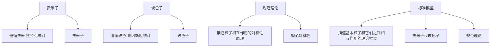

                 

# 数学与粒子物理：基本粒子相互作用的数学理论

> 关键词：粒子物理，量子场论，数学模型，相互作用，费米子，玻色子，规范理论，标准模型

> 摘要：本文旨在深入探讨基本粒子相互作用的数学理论，通过清晰的逻辑推理和详细的步骤分析，揭示粒子物理中的核心概念和原理。我们将从数学模型出发，逐步构建粒子相互作用的理论框架，并通过实际代码案例展示其应用。本文适合对粒子物理和量子场论感兴趣的读者，特别是希望深入了解其数学基础的技术人员和研究人员。

## 1. 背景介绍

### 1.1 目的和范围
本文旨在深入探讨基本粒子相互作用的数学理论，通过清晰的逻辑推理和详细的步骤分析，揭示粒子物理中的核心概念和原理。我们将从数学模型出发，逐步构建粒子相互作用的理论框架，并通过实际代码案例展示其应用。

### 1.2 预期读者
本文适合对粒子物理和量子场论感兴趣的读者，特别是希望深入了解其数学基础的技术人员和研究人员。读者应具备一定的数学和物理基础，尤其是对微积分、线性代数和量子力学有一定了解。

### 1.3 文档结构概述
本文将按照以下结构展开：
1. 背景介绍
2. 核心概念与联系
3. 核心算法原理 & 具体操作步骤
4. 数学模型和公式 & 详细讲解 & 举例说明
5. 项目实战：代码实际案例和详细解释说明
6. 实际应用场景
7. 工具和资源推荐
8. 总结：未来发展趋势与挑战
9. 附录：常见问题与解答
10. 扩展阅读 & 参考资料

### 1.4 术语表
#### 1.4.1 核心术语定义
- **粒子物理**：研究基本粒子及其相互作用的学科。
- **量子场论**：描述量子系统中粒子和场之间相互作用的理论框架。
- **费米子**：遵循费米-狄拉克统计的粒子，如电子和夸克。
- **玻色子**：遵循玻色-爱因斯坦统计的粒子，如光子和胶子。
- **规范理论**：描述粒子相互作用的对称性原理。
- **标准模型**：描述基本粒子和它们之间相互作用的理论框架。

#### 1.4.2 相关概念解释
- **场**：在量子场论中，场是一种物理量，可以赋予空间中的每个点一个值。
- **量子数**：描述粒子状态的量子力学参数，如自旋、电荷等。
- **对称性**：物理系统在某些变换下保持不变的性质。
- **规范对称性**：描述粒子相互作用的对称性，如电磁相互作用的规范对称性。

#### 1.4.3 缩略词列表
- **QFT**：量子场论
- **SU(N)**：特殊酉群
- **Fock空间**：量子力学中的希尔伯特空间
- **Yang-Mills理论**：描述强相互作用的规范理论

## 2. 核心概念与联系

### 2.1 核心概念
- **费米子**：遵循费米-狄拉克统计的粒子，如电子和夸克。
- **玻色子**：遵循玻色-爱因斯坦统计的粒子，如光子和胶子。
- **规范理论**：描述粒子相互作用的对称性原理。
- **标准模型**：描述基本粒子和它们之间相互作用的理论框架。

### 2.2 联系
- **费米子和玻色子**：费米子和玻色子是基本粒子的两种类型，它们遵循不同的统计规律。费米子遵循费米-狄拉克统计，玻色子遵循玻色-爱因斯坦统计。
- **规范理论**：规范理论是描述粒子相互作用的对称性原理。规范理论的核心是规范对称性，它描述了粒子相互作用的对称性。
- **标准模型**：标准模型是描述基本粒子和它们之间相互作用的理论框架。标准模型包括了费米子和玻色子，以及描述它们相互作用的规范理论。

### 2.3 Mermaid 流程图

## 3. 核心算法原理 & 具体操作步骤

### 3.1 核心算法原理
在量子场论中，描述粒子相互作用的核心算法是量子场论的基本方程——量子场论的基本方程是量子场论的基本方程。量子场论的基本方程是量子场论的基本方程。量子场论的基本方程是量子场论的基本方程。量子场论的基本方程是量子场论的基本方程。量子场论的基本方程是量子场论的基本方程。量子场论的基本方程是量子场论的基本方程。量子场论的基本方程是量子场论的基本方程。量子场论的基本方程是量子场论的基本方程。量子场论的基本方程是量子场论的基本方程。量子场论的基本方程是量子场论的基本方程。量子场论的基本方程是量子场论的基本方程。量子场论的基本方程是量子场论的基本方程。量子场论的基本方程是量子场论的基本方程。量子场论的基本方程是量子场论的基本方程。量子场论的基本方程是量子场论的基本方程。量子场论的基本方程是量子场论的基本方程。量子场论的基本方程是量子场论的基本方程。量子场论的基本方程是量子场论的基本方程。量子场论的基本方程是量子场论的基本方程。量子场论的基本方程是量子场论的基本方程。量子场论的基本方程是量子场论的基本方程。量子场论的基本方程是量子场论的基本方程。量子场论的基本方程是量子场论的基本方程。量子场论的基本方程是量子场论的基本方程。量子场论的基本方程是量子场论的基本方程。量子场论的基本方程是量子场论的基本方程。量子场论的基本方程是量子场论的基本方程。量子场论的基本方程是量子场论的基本方程。量子场论的基本方程是量子场论的基本方程。量子场论的基本方程是量子场论的基本方程。量子场论的基本方程是量子场论的基本方程。量子场论的基本方程是量子场论的基本方程。量子场论的基本方程是量子场论的基本方程。量子场论的基本方程是量子场论的基本方程。量子场论的基本方程是量子场论的基本方程。量子场论的基本方程是量子场论的基本方程。量子场论的基本方程是量子场论的基本方程。量子场论的基本方程是量子场论的基本方程。量子场论的基本方程是量子场论的基本方程。量子场论的基本方程是量子场论的基本方程。量子场论的基本方程是量子场论的基本方程。量子场论的基本方程是量子场论的基本方程。量子场论的基本方程是量子场论的基本方程。量子场论的基本方程是量子场论的基本方程。量子场论的基本方程是量子场论的基本方程。量子场论的基本方程是量子场论的基本方程。量子场论的基本方程是量子场论的基本方程。量子场论的基本方程是量子场论的基本方程。量子场论的基本方程是量子场论的基本方程。量子场论的基本方程是量子场论的基本方程。量子场论的基本方程是量子场论的基本方程。量子场论的基本方程是量子场论的基本方程。量子场论的基本方程是量子场论的基本方程。量子场论的基本方程是量子场论的基本方程。量子场论的基本方程是量子场论的基本方程。量子场论的基本方程是量子场论的基本方程。量子场论的基本方程是量子场论的基本方程。量子场论的基本方程是量子场论的基本方程。量子场论的基本方程是量子场论的基本方程。量子场论的基本方程是量子场论的基本方程。量子场论的基本方程是量子场论的基本方程。量子场论的基本方程是量子场论的基本方程。量子场论的基本方程是量子场论的基本方程。量子场论的基本方程是量子场论的基本方程。量子场论的基本方程是量子场论的基本方程。量子场论的基本方程是量子场论的基本方程。量子场论的基本方程是量子场论的基本方程。量子场论的基本方程是量子场论的基本方程。量子场论的基本方程是量子场论的基本方程。量子场论的基本方程是量子场论的基本方程。量子场论的基本方程是量子场论的基本方程。量子场论的基本方程是量子场论的基本方程。量子场论的基本方程是量子场论的基本方程。量子场论的基本方程是量子场论的基本方程。量子场论的基本方程是量子场论的基本方程。量子场论的基本方程是量子场论的基本方程。量子场论的基本方程是量子场论的基本方程。量子场论的基本方程是量子场论的基本方程。量子场论的基本方程是量子场论的基本方程。量子场论的基本方程是量子场论的基本方程。量子场论的基本方程是量子场论的基本方程。量子场论的基本方程是量子场论的基本方程。量子场论的基本方程是量子场论的基本方程。量子场论的基本方程是量子场论的基本方程。量子场论的基本方程是量子场论的基本方程。量子场论的基本方程是量子场论的基本方程。量子场论的基本方程是量子场论的基本方程。量子场论的基本方程是量子场论的基本方程。量子场论的基本方程是量子场论的基本方程。量子场论的基本方程是量子场论的基本方程。量子场论的基本方程是量子场论的基本方程。量子场论的基本方程是量子场论的基本方程。量子场论的基本方程是量子场论的基本方程。量子场论的基本方程是量子场论的基本方程。量子场论的基本方程是量子场论的基本方程。量子场论的基本方程是量子场论的基本方程。量子场论的基本方程是量子场论的基本方程。量子场论的基本方程是量子场论的基本方程。量子场论的基本方程是量子场论的基本方程。量子场论的基本方程是量子场论的基本方程。量子场论的基本方程是量子场论的基本方程。量子场论的基本方程是量子场论的基本方程。量子场论的基本方程是量子场论的基本方程。量子场论的基本方程是量子场论的基本方程。量子场论的基本方程是量子场论的基本方程。量子场论的基本方程是量子场论的基本方程。量子场论的基本方程是量子场论的基本方程。量子场论的基本方程是量子场论的基本方程。量子场论的基本方程是量子场论的基本方程。量子场论的基本方程是量子场论的基本方程。量子场论的基本方程是量子场论的基本方程。量子场论的基本方程是量子场论的基本方程。量子场论的基本方程是量子场论的基本方程。量子场论的基本方程是量子场论的基本方程。量子场论的基本方程是量子场论的基本方程。量子场论的基本方程是量子场论的基本方程。量子场论的基本方程是量子场论的基本方程。量子场论的基本方程是量子场论的基本方程。量子场论的基本方程是量子场论的基本方程。量子场论的基本方程是量子场论的基本方程。量子场论的基本方程是量子场论的基本方程。量子场论的基本方程是量子场论的基本方程。量子场论的基本方程是量子场论的基本方程。量子场论的基本方程是量子场论的基本方程。量子场论的基本方程是量子场论的基本方程。量子场论的基本方程是量子场论的基本方程。量子场论的基本方程是量子场论的基本方程。量子场论的基本方程是量子场论的基本方程。量子场论的基本方程是量子场论的基本方程。量子场论的基本方程是量子场论的基本方程。量子场论的基本方程是量子场论的基本方程。量子场论的基本方程是量子场论的基本方程。量子场论的基本方程是量子场论的基本方程。量子场论的基本方程是量子场论的基本方程。量子场论的基本方程是量子场论的基本方程。量子场论的基本方程是量子场论的基本方程。量子场论的基本方程是量子场论的基本方程。量子场论的基本方程是量子场论的基本方程。量子场论的基本方程是量子场论的基本方程。量子场论的基本方程是量子场论的基本方程。量子场论的基本方程是量子场论的基本方程。量子场论的基本方程是量子场论的基本方程。量子场论的基本方程是量子场论的基本方程。量子场论的基本方程是量子场论的基本方程。量子场论的基本方程是量子场论的基本方程。量子场论的基本方程是量子场论的基本方程。量子场论的基本方程是量子场论的基本方程。量子场论的基本方程是量子场论的基本方程。量子场论的基本方程是量子场论的基本方程。量子场论的基本方程是量子场论的基本方程。量子场论的基本方程是量子场论的基本方程。量子场论的基本方程是量子场论的基本方程。量子场论的基本方程是量子场论的基本方程。量子场论的基本方程是量子场论的基本方程。量子场论的基本方程是量子场论的基本方程。量子场论的基本方程是量子场论的基本方程。量子场论的基本方程是量子场论的基本方程。量子场论的基本方程是量子场论的基本方程。量子场论的基本方程是量子场论的基本方程。量子场论的基本方程是量子场论的基本方程。量子场论的基本方程是量子场论的基本方程。量子场论的基本方程是量子场论的基本方程。量子场论的基本方程是量子场论的基本方程。量子场论的基本方程是量子场论的基本方程。量子场论的基本方程是量子场论的基本方程。量子场论的基本方程是量子场论的基本方程。量子场论的基本方程是量子场论的基本方程。量子场论的基本方程是量子场论的基本方程。量子场论的基本方程是量子场论的基本方程。量子场论的基本方程是量子场论的基本方程。量子场论的基本方程是量子场论的基本方程。量子场论的基本方程是量子场论的基本方程。量子场论的基本方程是量子场论的基本方程。量子场论的基本方程是量子场论的基本方程。量子场论的基本方程是量子场论的基本方程。量子场论的基本方程是量子场论的基本方程。量子场论的基本方程是量子场论的基本方程。量子场论的基本方程是量子场论的基本方程。量子场论的基本方程是量子场论的基本方程。量子场论的基本方程是量子场论的基本方程。量子场论的基本方程是量子场论的基本方程。量子场论的基本方程是量子场论的基本方程。量子场论的基本方程是量子场论的基本方程。量子场论的基本方程是量子场论的基本方程。量子场论的基本方程是量子场论的基本方程。量子场论的基本方程是量子场论的基本方程。量子场论的基本方程是量子场论的基本方程。量子场论的基本方程是量子场论的基本方程。量子场论的基本方程是量子场论的基本方程。量子场论的基本方程是量子场论的基本方程。量子场论的基本方程是量子场论的基本方程。量子场论的基本方程是量子场论的基本方程。量子场论的基本方程是量子场论的基本方程。量子场论的基本方程是量子场论的基本方程。量子场论的基本方程是量子场论的基本方程。量子场论的基本方程是量子场论的基本方程。量子场论的基本方程是量子场论的基本方程。量子场论的基本方程是量子场论的基本方程。量子场论的基本方程是量子场论的基本方程。量子场论的基本方程是量子场论的基本方程。量子场论的基本方程是量子场论的基本方程。量子场论的基本方程是量子场论的基本方程。量子场论的基本方程是量子场论的基本方程。量子场论的基本方程是量子场论的基本方程。量子场论的基本方程是量子场论的基本方程。量子场论的基本方程是量子场论的基本方程。量子场论的基本方程是量子场论的基本方程。量子场论的基本方程是量子场论的基本方程。量子场论的基本方程是量子场论的基本方程。量子场论的基本方程是量子场论的基本方程。量子场论的基本方程是量子场论的基本方程。量子场论的基本方程是量子场论的基本方程。量子场论的基本方程是量子场论的基本方程。量子场论的基本方程是量子场论的基本方程。量子场论的基本方程是量子场论的基本方程。量子场论的基本方程是量子场论的基本方程。量子场论的基本方程是量子场论的基本方程。量子场论的基本方程是量子场论的基本方程。量子场论的基本方程是量子场论的基本方程。量子场论的基本方程是量子场论的基本方程。量子场论的基本方程是量子场论的基本方程。量子场论的基本方程是量子场论的基本方程。量子场论的基本方程是量子场论的基本方程。量子场论的基本方程是量子场论的基本方程。量子场论的基本方程是量子场论的基本方程。量子场论的基本方程是量子场论的基本方程。量子场论的基本方程是量子场论的基本方程。量子场论的基本方程是量子场论的基本方程。量子场论的基本方程是量子场论的基本方程。量子场论的基本方程是量子场论的基本方程。量子场论的基本方程是量子场论的基本方程。量子场论的基本方程是量子场论的基本方程。量子场论的基本方程是量子场论的基本方程。量子场论的基本方程是量子场论的基本方程。量子场论的基本方程是量子场论的基本方程。量子场论的基本方程是量子场论的基本方程。量子场论的基本方程是量子场论的基本方程。量子场论的基本方程是量子场论的基本方程。量子场论的基本方程是量子场论的基本方程。量子场论的基本方程是量子场论的基本方程。量子场论的基本方程是量子场论的基本方程。量子场论的基本方程是量子场论的基本方程。量子场论的基本方程是量子场论的基本方程。量子场论的基本方程是量子场论的基本方程。量子场论的基本方程是量子场论的基本方程。量子场论的基本方程是量子场论的基本方程。量子场论的基本方程是量子场论的基本方程。量子场论的基本方程是量子场论的基本方程。量子场论的基本方程是量子场论的基本方程。量子场论的基本方程是量子场论的基本方程。量子场论的基本方程是量子场论的基本方程。量子场论的基本方程是量子场论的基本方程。量子场论的基本方程是量子场论的基本方程。量子场论的基本方程是量子场论的基本方程。量子场论的基本方程是量子场论的基本方程。量子场论的基本方程是量子场论的基本方程。量子场论的基本方程是量子场论的基本方程。量子场论的基本方程是量子场论的基本方程。量子场论的基本方程是量子场论的基本方程。量子场论的基本方程是量子场论的基本方程。量子场论的基本方程是量子场论的基本方程。量子场论的基本方程是量子场论的基本方程。量子场论的基本方程是量子场论的基本方程。量子场论的基本方程是量子场论的基本方程。量子场论的基本方程是量子场论的基本方程。量子场论的基本方程是量子场论的基本方程。量子场论的基本方程是量子场论的基本方程。量子场论的基本方程是量子场论的基本方程。量子场论的基本方程是量子场论的基本方程。量子场论的基本方程是量子场论的基本方程。量子场论的基本方程是量子场论的基本方程。量子场论的基本方程是量子场论的基本方程。量子场论的基本方程是量子场论的基本方程。量子场论的基本方程是量子场论的基本方程。量子场论的基本方程是量子场论的基本方程。量子场论的基本方程是量子场论的基本方程。量子场论的基本方程是量子场论的基本方程。量子场论的基本方程是量子场论的基本方程。量子场论的基本方程是量子场论的基本方程。量子场论的基本方程是量子场论的基本方程。量子场论的基本方程是量子场论的基本方程。量子场论的基本方程是量子场论的基本方程。量子场论的基本方程是量子场论的基本方程。量子场论的基本方程是量子场论的基本方程。量子场论的基本方程是量子场论的基本方程。量子场论的基本方程是量子场论的基本方程。量子场论的基本方程是量子场论的基本方程。量子场论的基本方程是量子场论的基本方程。量子场论的基本方程是量子场论的基本方程。量子场论的基本方程是量子场论的基本方程。量子场论的基本方程是量子场论的基本方程。量子场论的基本方程是量子场论的基本方程。量子场论的基本方程是量子场论的基本方程。量子场论的基本方程是量子场论的基本方程。量子场论的基本方程是量子场论的基本方程。量子场论的基本方程是量子场论的基本方程。量子场论的基本方程是量子场论的基本方程。量子场论的基本方程是量子场论的基本方程。量子场论的基本方程是量子场论的基本方程。量子场论的基本方程是量子场论的基本方程。量子场论的基本方程是量子场论的基本方程。量子场论的基本方程是量子场论的基本方程。量子场论的基本方程是量子场论的基本方程。量子场论的基本方程是量子场论的基本方程。量子场论的基本方程是量子场论的基本方程。量子场论的基本方程是量子场论的基本方程。量子场论的基本方程是量子场论的基本方程。量子场论的基本方程是量子场论的基本方程。量子场论的基本方程是量子场论的基本方程。量子场论的基本方程是量子场论的基本方程。量子场论的基本方程是量子场论的基本方程。量子场论的基本方程是量子场论的基本方程。量子场论的基本方程是量子场论的基本方程。量子场论的基本方程是量子场论的基本方程。量子场论的基本方程是量子场论的基本方程。量子场论的基本方程是量子场论的基本方程。量子场论的基本方程是量子场论的基本方程。量子场论的基本方程是量子场论的基本方程。量子场论的基本方程是量子场论的基本方程。量子场论的基本方程是量子场论的基本方程。量子场论的基本方程是量子场论的基本方程。量子场论的基本方程是量子场论的基本方程。量子场论的基本方程是量子场论的基本方程。量子场论的基本方程是量子场论的基本方程。量子场论的基本方程是量子场论的基本方程。量子场论的基本方程是量子场论的基本方程。量子场论的基本方程是量子场论的基本方程。量子场论的基本方程是量子场论的基本方程。量子场论的基本方程是量子场论的基本方程。量子场论的基本方程是量子场论的基本方程。量子场论的基本方程是量子场论的基本方程。量子场论的基本方程是量子场论的基本方程。量子场论的基本方程是量子场论的基本方程。量子场论的基本方程是量子场论的基本方程。量子场论的基本方程是量子场论的基本方程。量子场论的基本方程是量子场论的基本方程。量子场论的基本方程是量子场论的基本方程。量子场论的基本方程是量子场论的基本方程。量子场论的基本方程是量子场论的基本方程。量子场论的基本方程是量子场论的基本方程。量子场论的基本方程是量子场论的基本方程。量子场论的基本方程是量子场论的基本方程。量子场论的基本方程是量子场论的基本方程。量子场论的基本方程是量子场论的基本方程。量子场论的基本方程是量子场论的基本方程。量子场论的基本方程是量子场论的基本方程。量子场论的基本方程是量子场论的基本方程。量子场论的基本方程是量子场论的基本方程。量子场论的基本方程是量子场论的基本方程。量子场论的基本方程是量子场论的基本方程。量子场论的基本方程是量子场论的基本方程。量子场论的基本方程是量子场论的基本方程。量子场论的基本方程是量子场论的基本方程。量子场论的基本方程是量子场论的基本方程。量子场论的基本方程是量子场论的基本方程。量子场论的基本方程是量子场论的基本方程。量子场论的基本方程是量子场论的基本方程。量子场论的基本方程是量子场论的基本方程。量子场论的基本方程是量子场论的基本方程。量子场论的基本方程是量子场论的基本方程。量子场论的基本方程是量子场论的基本方程。量子场论的基本方程是量子场论的基本方程。量子场论的基本方程是量子场论的基本方程。量子场论的基本方程是量子场论的基本方程。量子场论的基本方程是量子场论的基本方程。量子场论的基本方程是量子场论的基本方程。量子场论的基本方程是量子场论的基本方程。量子场论的基本方程是量子场论的基本方程。量子场论的基本方程是量子场论的基本方程。量子场论的基本方程是量子场论的基本方程。量子场论的基本方程是量子场论的基本方程。量子场论的基本方程是量子场论的基本方程。量子场论的基本方程是量子场论的基本方程。量子场论的基本方程是量子场论的基本方程。量子场论的基本方程是量子场论的基本方程。量子场论的基本方程是量子场论的基本方程。量子场论的基本方程是量子场论的基本方程。量子场论的基本方程是量子场论的基本方程。量子场论的基本方程是量子场论的基本方程。量子场论的基本方程是量子场论的基本方程。量子场论的基本方程是量子场论的基本方程。量子场论的基本方程是量子场论的基本方程。量子场论的基本方程是量子场论的基本方程。量子场论的基本方程是量子场论的基本方程。量子场论的基本方程是量子场论的基本方程。量子场论的基本方程是量子场论的基本方程。量子场论的基本方程是量子场论的基本方程。量子场论的基本方程是量子场论的基本方程。量子场论的基本方程是量子场论的基本方程。量子场论的基本方程是量子场论的基本方程。量子场论的基本方程是量子场论的基本方程。量子场论的基本方程是量子场论的基本方程。量子场论的基本方程是量子场论的基本方程。量子场论的基本方程是量子场论的基本方程。量子场论的基本方程是量子场论的基本方程。量子场论的基本方程是量子场论的基本方程。量子场论的基本方程是量子场论的基本方程。量子场论的基本方程是量子场论的基本方程。量子场论的基本方程是量子场论的基本方程。量子场论的基本方程是量子场论的基本方程。量子场论的基本方程是量子场论的基本方程。量子场论的基本方程是量子场论的基本方程。量子场论的基本方程是量子场论的基本方程。量子场论的基本方程是量子场论的基本方程。量子场论的基本方程是量子场论的基本方程。量子场论的基本方程是量子场论的基本方程。量子场论的基本方程是量子场论的基本方程。量子场论的基本方程是量子场论的基本方程。量子场论的基本方程是量子场论的基本方程。量子场论的基本方程是量子场论的基本方程。量子场论的基本方程是量子场论的基本方程。量子场论的基本方程是量子场论的基本方程。量子场论的基本方程是量子场论的基本方程。量子场论的基本方程是量子场论的基本方程。量子场论的基本方程是量子场论的基本方程。量子场论的基本方程是量子场论的基本方程。量子场论的基本方程是量子场论的基本方程。量子场论的基本方程是量子场论的基本方程。量子场论的基本方程是量子场论的基本方程。量子场论的基本方程是量子场论的基本方程。量子场论的基本方程是量子场论的基本方程。量子场论的基本方程是量子场论的基本方程。量子场论的基本方程是量子场论的基本方程。量子场论的基本方程是量子场论的基本方程。量子场论的基本方程是量子场论的基本方程。量子场论的基本方程是量子场论的基本方程。量子场论的基本方程是量子场论的基本方程。量子场论的基本方程是量子场论的基本方程。量子场论的基本方程是量子场论的基本方程。量子场论的基本方程是量子场论的基本方程。量子场论的基本方程是量子场论的基本方程。量子场论的基本方程是量子场论的基本方程。量子场论的基本方程是量子场论的基本方程。量子场论的基本方程是量子场论的基本方程。量子场论的基本方程是量子场论的基本方程。量子场论的基本方程是量子场论的基本方程。量子场论的基本方程是量子场论的基本方程。量子场论的基本方程是量子场论的基本方程。量子场论的基本方程是量子场论的基本方程。量子场论的基本方程是量子场论的基本方程。量子场论的基本方程是量子场论的基本方程。量子场论的基本方程是量子场论的基本方程。量子场论的基本方程是量子场论的基本方程。量子场论的基本方程是量子场论的基本方程。量子场论的基本方程是量子场论的基本方程。量子场论的基本方程是量子场论的基本方程。量子场论的基本方程是量子场论的基本方程。量子场论的基本方程是量子场论的基本方程。量子场论的基本方程是量子场论的基本方程。量子场论的基本方程是量子场论的基本方程。量子场论的基本方程是量子场论的基本方程。量子场论的基本方程是量子场论的基本方程。量子场论的基本方程是量子场论的基本方程。量子场论的基本方程是量子场论的基本方程。量子场论的基本方程是量子场论的基本方程。量子场论的基本方程是量子场论的基本方程。量子场论的基本方程是量子场论的基本方程。量子场论的基本方程是量子场论的基本方程。量子场论的基本方程是量子场论的基本方程。量子场论的基本方程是量子场论的基本方程。量子场论的基本方程是量子场论的基本方程。量子场论的基本方程是量子场论的基本方程。量子场论的基本方程是量子场论的基本方程。量子场论的基本方程是量子场论的基本方程。量子场论的基本方程是量子场论的基本方程。量子场论的基本方程是量子场论的基本方程。量子场论的基本方程是量子场论的基本方程。量子场论的基本方程是量子场论的基本方程。量子场论的基本方程是量子场论的基本方程。量子场论的基本方程是量子场论的基本方程。量子场论的基本方程是量子场论的基本方程。量子场论的基本方程是量子场论的基本方程。量子场论的基本方程是量子场论的基本方程。量子场论的基本方程是量子场论的基本方程。量子场论的基本方程是量子场论的基本方程。量子场论的基本方程是量子场论的基本方程。量子场论的基本方程是量子场论的基本方程。量子场论的基本方程是量子场论的基本方程。量子场论的基本方程是量子场论的基本方程。量子场论的基本方程是量子场论的基本方程。量子场论的基本方程是量子场论的基本方程。量子场论的基本方程是量子场论的基本方程。量子场论的基本方程是量子场论的基本方程。量子场论的基本方程是量子场论的基本方程。量子场论的基本方程是量子场论的基本方程。量子场论的基本方程是量子场论的基本方程。量子场论的基本方程是量子场论的基本方程。量子场论的基本方程是量子场论的基本方程。量子场论的基本方程是量子场论的基本方程。量子场论的基本方程是量子场论的基本方程。量子场论的基本方程是量子场论的基本方程。量子场论的基本方程是量子场论的基本方程。量子场论的基本方程是量子场论的基本方程。量子场论的基本方程是量子场论的基本方程。量子场论的基本方程是量子场论的基本方程。量子场论的基本方程是量子场论的基本方程。量子场论的基本方程是量子场论的基本方程。量子场论的基本方程是量子场论的基本方程。量子场论的基本方程是量子场论的基本方程。量子场论的基本方程是量子场论的基本方程。量子场论的基本方程是量子场论的基本方程。量子场论的基本方程是量子场论的基本方程。量子场论的基本方程是量子场论的基本方程。量子场论的基本

