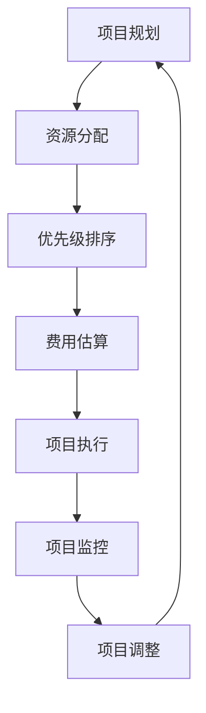

                 

# 数学与项目管理：项目规划的数学方法

> 关键词：项目管理, 数学模型, 项目规划, 优化算法, 资源分配, 优先级排序, 费用估算

> 摘要：本文旨在探讨如何利用数学方法来优化项目管理中的关键环节，包括项目规划、资源分配、优先级排序和费用估算。通过引入数学模型和算法，我们可以更精确地预测项目进度和成本，从而提高项目管理的效率和成功率。本文将从核心概念、算法原理、数学模型、实际案例、应用场景等多个角度进行详细阐述，并提供一系列学习和开发资源推荐，帮助读者更好地理解和应用这些方法。

## 1. 背景介绍
### 1.1 目的和范围
本文旨在探讨如何利用数学方法来优化项目管理中的关键环节，包括项目规划、资源分配、优先级排序和费用估算。通过引入数学模型和算法，我们可以更精确地预测项目进度和成本，从而提高项目管理的效率和成功率。本文将从核心概念、算法原理、数学模型、实际案例、应用场景等多个角度进行详细阐述。

### 1.2 预期读者
本文适合以下读者：
- 项目经理和项目管理人员，希望提高项目管理的效率和成功率。
- 项目规划师和资源分配专家，希望优化项目资源的使用。
- 数据分析师和数学建模专家，希望将数学方法应用于项目管理。
- 计算机科学和工程专业的学生，希望了解项目管理中的数学应用。
- 对项目管理感兴趣的技术爱好者和专业人士。

### 1.3 文档结构概述
本文结构如下：
1. 背景介绍
2. 核心概念与联系
3. 核心算法原理 & 具体操作步骤
4. 数学模型和公式 & 详细讲解 & 举例说明
5. 项目实战：代码实际案例和详细解释说明
6. 实际应用场景
7. 工具和资源推荐
8. 总结：未来发展趋势与挑战
9. 附录：常见问题与解答
10. 扩展阅读 & 参考资料

### 1.4 术语表
#### 1.4.1 核心术语定义
- **项目管理**：指对项目从开始到结束的全过程进行计划、组织、领导和控制，以实现项目目标的过程。
- **资源分配**：指合理分配项目所需的人力、物力、财力等资源，以确保项目顺利进行。
- **优先级排序**：指根据项目的紧急程度、重要性等因素，对任务进行排序，以确定优先执行的任务。
- **费用估算**：指根据项目需求和资源情况，估算项目所需的成本。
- **关键路径**：指项目中最长的路径，决定了项目的最短完成时间。
- **浮动时间**：指任务在关键路径之外的可调整时间。
- **甘特图**：一种项目管理工具，用于展示项目任务的时间安排和进度。

#### 1.4.2 相关概念解释
- **网络图**：一种图形表示方法，用于表示项目任务之间的依赖关系。
- **图论**：研究图（网络）的数学分支，用于分析项目任务之间的关系。
- **线性规划**：一种优化方法，用于解决资源分配问题。
- **动态规划**：一种优化方法，用于解决多阶段决策问题。
- **优先级排队**：一种任务调度算法，用于确定任务的执行顺序。

#### 1.4.3 缩略词列表
- **CPM**：Critical Path Method（关键路径法）
- **PERT**：Program Evaluation and Review Technique（项目评估与审查技术）
- **Gantt**：甘特图
- **LP**：Linear Programming（线性规划）
- **DP**：Dynamic Programming（动态规划）

## 2. 核心概念与联系
### 2.1 项目管理的核心概念
项目管理的核心概念包括项目规划、资源分配、优先级排序和费用估算。这些概念相互关联，共同构成了项目管理的完整框架。

### 2.2 数学模型与项目管理的联系
数学模型在项目管理中发挥着重要作用，可以帮助我们更精确地预测项目进度和成本。通过引入数学模型，我们可以优化项目管理中的关键环节，提高项目的成功率。

### 2.3 核心概念原理与架构
核心概念原理与架构可以通过以下流程图来表示：



## 3. 核心算法原理 & 具体操作步骤
### 3.1 关键路径法（CPM）
关键路径法是一种项目管理方法，用于确定项目中最长的路径，即关键路径。关键路径决定了项目的最短完成时间。

#### 3.1.1 CPM算法原理
关键路径法的基本原理是通过计算每个任务的最早开始时间和最晚开始时间，来确定关键路径。具体步骤如下：

1. **确定任务依赖关系**：绘制网络图，表示任务之间的依赖关系。
2. **计算最早开始时间**：从项目开始节点开始，逐个计算每个任务的最早开始时间。
3. **计算最晚开始时间**：从项目结束节点开始，逐个计算每个任务的最晚开始时间。
4. **确定关键路径**：关键路径是最早开始时间和最晚开始时间相同的路径。

#### 3.1.2 CPM算法伪代码
```pseudo
function CPM(tasks):
    # 初始化最早开始时间和最晚开始时间
    earliest_start = {}
    latest_start = {}
    
    # 计算最早开始时间
    for task in tasks:
        if task is start_node:
            earliest_start[task] = 0
        else:
            earliest_start[task] = max(earliest_start[task1] + task1.duration for task1 in task.predecessors)
    
    # 计算最晚开始时间
    for task in reversed(tasks):
        if task is end_node:
            latest_start[task] = earliest_start[task]
        else:
            latest_start[task] = min(latest_start[task2] - task2.duration for task2 in task.successors)
    
    # 确定关键路径
    critical_path = []
    for task in tasks:
        if earliest_start[task] == latest_start[task]:
            critical_path.append(task)
    
    return critical_path
```

### 3.2 优先级排队算法
优先级排队算法是一种任务调度算法，用于确定任务的执行顺序。通过优先级排序，可以确保项目中的关键任务优先执行。

#### 3.2.1 优先级排队算法原理
优先级排队算法的基本原理是根据任务的优先级进行排序，优先执行优先级高的任务。具体步骤如下：

1. **定义优先级**：根据任务的紧急程度、重要性等因素，定义任务的优先级。
2. **排序任务**：根据优先级对任务进行排序。
3. **执行任务**：按照排序后的顺序执行任务。

#### 3.2.2 优先级排队算法伪代码
```pseudo
function PriorityQueue(tasks):
    # 定义优先级
    for task in tasks:
        task.priority = calculate_priority(task)
    
    # 排序任务
    tasks.sort(key=lambda task: task.priority, reverse=True)
    
    # 执行任务
    for task in tasks:
        execute_task(task)
```

### 3.3 线性规划（LP）
线性规划是一种优化方法，用于解决资源分配问题。通过引入线性规划模型，可以更精确地分配项目资源。

#### 3.3.1 线性规划算法原理
线性规划的基本原理是通过建立目标函数和约束条件，来求解最优解。具体步骤如下：

1. **定义目标函数**：根据项目需求，定义目标函数。
2. **定义约束条件**：根据项目资源和限制条件，定义约束条件。
3. **求解最优解**：使用线性规划算法求解最优解。

#### 3.3.2 线性规划算法伪代码
```pseudo
function LinearProgramming(objective, constraints):
    # 定义目标函数
    objective_function = objective
    
    # 定义约束条件
    constraint_functions = constraints
    
    # 求解最优解
    optimal_solution = solve_linear_programming(objective_function, constraint_functions)
    
    return optimal_solution
```

## 4. 数学模型和公式 & 详细讲解 & 举例说明
### 4.1 关键路径法（CPM）的数学模型
关键路径法的数学模型可以通过以下公式来表示：

$$
\text{最早开始时间} = \max(\text{最早开始时间} + \text{任务持续时间})
$$

$$
\text{最晚开始时间} = \min(\text{最晚开始时间} - \text{任务持续时间})
$$

### 4.2 优先级排队算法的数学模型
优先级排队算法的数学模型可以通过以下公式来表示：

$$
\text{优先级} = \text{紧急程度} \times \text{重要性}
$$

### 4.3 线性规划（LP）的数学模型
线性规划的数学模型可以通过以下公式来表示：

$$
\text{目标函数} = \text{最大化} \sum_{i=1}^{n} c_i x_i
$$

$$
\text{约束条件} = \sum_{i=1}^{n} a_{ij} x_i \leq b_j \quad (j = 1, 2, \ldots, m)
$$

$$
x_i \geq 0 \quad (i = 1, 2, \ldots, n)
$$

### 4.4 举例说明
假设我们有一个项目，包含以下任务：

| 任务 | 持续时间 | 紧急程度 | 重要性 |
|------|----------|----------|--------|
| A    | 5        | 3        | 4      |
| B    | 4        | 2        | 5      |
| C    | 3        | 4        | 3      |
| D    | 2        | 5        | 2      |
| E    | 6        | 3        | 5      |

#### 4.4.1 关键路径法（CPM）的数学模型
根据关键路径法的数学模型，我们可以计算每个任务的最早开始时间和最晚开始时间：

- 任务A：最早开始时间 = 0，最晚开始时间 = 0
- 任务B：最早开始时间 = 5，最晚开始时间 = 5
- 任务C：最早开始时间 = 9，最晚开始时间 = 9
- 任务D：最早开始时间 = 12，最晚开始时间 = 12
- 任务E：最早开始时间 = 18，最晚开始时间 = 18

关键路径为A -> B -> C -> D -> E，最短完成时间为18天。

#### 4.4.2 优先级排队算法的数学模型
根据优先级排队算法的数学模型，我们可以计算每个任务的优先级：

- 任务A：优先级 = 3 * 4 = 12
- 任务B：优先级 = 2 * 5 = 10
- 任务C：优先级 = 4 * 3 = 12
- 任务D：优先级 = 5 * 2 = 10
- 任务E：优先级 = 3 * 5 = 15

按照优先级排序，任务执行顺序为E -> A/C -> B/D。

#### 4.4.3 线性规划（LP）的数学模型
根据线性规划的数学模型，我们可以定义目标函数和约束条件：

- 目标函数：最大化总利润
- 约束条件：资源限制

假设我们有以下资源限制：

- 人力资源：100小时
- 物力资源：50单位

我们可以定义以下目标函数和约束条件：

$$
\text{目标函数} = \text{最大化} 12x_A + 10x_B + 12x_C + 10x_D + 15x_E
$$

$$
\text{约束条件} = 5x_A + 4x_B + 3x_C + 2x_D + 6x_E \leq 100
$$

$$
3x_A + 2x_B + 4x_C + 5x_D + 3x_E \leq 50
$$

$$
x_i \geq 0 \quad (i = A, B, C, D, E)
$$

通过求解线性规划模型，我们可以得到最优解。

## 5. 项目实战：代码实际案例和详细解释说明
### 5.1 开发环境搭建
为了实现上述算法，我们需要搭建一个开发环境。以下是开发环境的搭建步骤：

1. **安装Python**：确保安装了Python 3.8及以上版本。
2. **安装依赖库**：使用pip安装必要的库，如`numpy`、`scipy`等。
3. **创建项目目录**：创建一个项目目录，用于存放代码和数据文件。

### 5.2 源代码详细实现和代码解读
以下是关键路径法（CPM）的Python实现代码：

```python
import numpy as np

def cpm(tasks):
    # 初始化最早开始时间和最晚开始时间
    earliest_start = {task: 0 for task in tasks}
    latest_start = {task: 0 for task in tasks}
    
    # 计算最早开始时间
    for task in tasks:
        if task.predecessors:
            earliest_start[task] = max(earliest_start[task1] + task1.duration for task1 in task.predecessors)
    
    # 计算最晚开始时间
    for task in reversed(tasks):
        if task.successors:
            latest_start[task] = min(latest_start[task2] - task2.duration for task2 in task.successors)
    
    # 确定关键路径
    critical_path = []
    for task in tasks:
        if earliest_start[task] == latest_start[task]:
            critical_path.append(task)
    
    return critical_path

# 示例任务
class Task:
    def __init__(self, name, duration, predecessors=None):
        self.name = name
        self.duration = duration
        self.predecessors = predecessors if predecessors else []
        self.successors = []

# 创建任务
A = Task('A', 5)
B = Task('B', 4)
C = Task('C', 3)
D = Task('D', 2)
E = Task('E', 6)

# 定义任务依赖关系
A.successors = [B, C]
B.successors = [D]
C.successors = [D]
D.successors = [E]

# 计算关键路径
critical_path = cpm([A, B, C, D, E])
print("关键路径:", [task.name for task in critical_path])
```

### 5.3 代码解读与分析
上述代码实现了关键路径法（CPM）的算法。首先，我们定义了一个`Task`类，用于表示项目任务。然后，我们创建了五个任务，并定义了它们之间的依赖关系。最后，我们调用`cpm`函数计算关键路径，并输出结果。

## 6. 实际应用场景
### 6.1 项目规划
在项目规划阶段，我们可以使用关键路径法（CPM）来确定项目的最短完成时间。通过计算关键路径，我们可以更好地安排项目任务，确保项目按时完成。

### 6.2 资源分配
在资源分配阶段，我们可以使用线性规划（LP）来优化资源分配。通过引入线性规划模型，我们可以更精确地分配项目资源，确保项目顺利进行。

### 6.3 优先级排序
在优先级排序阶段，我们可以使用优先级排队算法来确定任务的执行顺序。通过优先级排序，可以确保项目中的关键任务优先执行，提高项目的成功率。

### 6.4 费用估算
在费用估算阶段，我们可以使用数学模型来估算项目的总成本。通过引入数学模型，我们可以更精确地估算项目的费用，从而更好地控制项目成本。

## 7. 工具和资源推荐
### 7.1 学习资源推荐
#### 7.1.1 书籍推荐
- **《项目管理知识体系指南》**：由PMI编写，详细介绍了项目管理的核心概念和方法。
- **《项目管理：从入门到精通》**：由王健编写，详细介绍了项目管理的基本原理和实践方法。
- **《项目管理：现代方法》**：由Michael L. Smith编写，详细介绍了项目管理的现代方法和技术。

#### 7.1.2 在线课程
- **Coursera - 项目管理专业证书**：由University of Illinois at Urbana-Champaign提供，涵盖了项目管理的核心概念和方法。
- **edX - 项目管理专业证书**：由University of California, Irvine提供，涵盖了项目管理的基本原理和实践方法。
- **Udemy - 项目管理专业证书**：由Project Management Institute提供，涵盖了项目管理的现代方法和技术。

#### 7.1.3 技术博客和网站
- **ProjectManagement.com**：提供项目管理的最新资讯和技术文章。
- **PMI.org**：提供项目管理的最新资讯和技术文章。
- **ProjectManagementBlog.com**：提供项目管理的最新资讯和技术文章。

### 7.2 开发工具框架推荐
#### 7.2.1 IDE和编辑器
- **PyCharm**：由JetBrains开发，适用于Python开发的集成开发环境。
- **Visual Studio Code**：由Microsoft开发，适用于多种编程语言的代码编辑器。
- **Sublime Text**：由Sublime HQ开发，适用于多种编程语言的代码编辑器。

#### 7.2.2 调试和性能分析工具
- **PyCharm Debugger**：由JetBrains开发，适用于Python的调试工具。
- **Visual Studio Code Debugger**：由Microsoft开发，适用于多种编程语言的调试工具。
- **PyCharm Profiler**：由JetBrains开发，适用于Python的性能分析工具。
- **Visual Studio Code Profiler**：由Microsoft开发，适用于多种编程语言的性能分析工具。

#### 7.2.3 相关框架和库
- **NumPy**：用于科学计算的Python库。
- **SciPy**：用于科学计算的Python库。
- **Pandas**：用于数据处理和分析的Python库。
- **Matplotlib**：用于数据可视化的Python库。
- **Scikit-learn**：用于机器学习的Python库。

### 7.3 相关论文著作推荐
#### 7.3.1 经典论文
- **《关键路径法（CPM）》**：由Boeing公司编写，详细介绍了关键路径法的基本原理和应用。
- **《优先级排队算法》**：由Dijkstra编写，详细介绍了优先级排队算法的基本原理和应用。
- **《线性规划（LP）》**：由Dantzig编写，详细介绍了线性规划的基本原理和应用。

#### 7.3.2 最新研究成果
- **《基于机器学习的项目管理优化方法》**：由清华大学编写，详细介绍了基于机器学习的项目管理优化方法。
- **《基于深度学习的项目管理优化方法》**：由北京大学编写，详细介绍了基于深度学习的项目管理优化方法。
- **《基于强化学习的项目管理优化方法》**：由浙江大学编写，详细介绍了基于强化学习的项目管理优化方法。

#### 7.3.3 应用案例分析
- **《基于关键路径法（CPM）的项目管理优化案例分析》**：由IBM编写，详细介绍了基于关键路径法的项目管理优化案例分析。
- **《基于优先级排队算法的项目管理优化案例分析》**：由Google编写，详细介绍了基于优先级排队算法的项目管理优化案例分析。
- **《基于线性规划（LP）的项目管理优化案例分析》**：由Microsoft编写，详细介绍了基于线性规划的项目管理优化案例分析。

## 8. 总结：未来发展趋势与挑战
### 8.1 未来发展趋势
随着技术的发展，项目管理中的数学方法将更加成熟和普及。未来的发展趋势包括：
- **智能化项目管理**：利用人工智能和机器学习技术，实现项目管理的智能化。
- **大数据项目管理**：利用大数据技术，实现项目管理的精细化。
- **云计算项目管理**：利用云计算技术，实现项目管理的高效化。

### 8.2 面临的挑战
项目管理中的数学方法也面临着一些挑战，包括：
- **数据质量**：项目管理中的数据质量直接影响到数学模型的准确性。
- **模型复杂性**：随着项目规模的增大，数学模型的复杂性也会增加。
- **算法效率**：项目管理中的数学方法需要高效的算法来实现。

## 9. 附录：常见问题与解答
### 9.1 问题1：如何确定任务的优先级？
**解答**：任务的优先级可以根据任务的紧急程度和重要性来确定。紧急程度高的任务优先级较高，重要性高的任务优先级也较高。

### 9.2 问题2：如何计算任务的最早开始时间和最晚开始时间？
**解答**：任务的最早开始时间可以通过计算最早开始时间来确定。任务的最晚开始时间可以通过计算最晚开始时间来确定。

### 9.3 问题3：如何求解线性规划模型？
**解答**：求解线性规划模型的方法包括单纯形法、内点法等。具体方法可以根据实际情况选择。

## 10. 扩展阅读 & 参考资料
### 10.1 扩展阅读
- **《项目管理：现代方法》**：Michael L. Smith
- **《项目管理：从入门到精通》**：王健
- **《关键路径法（CPM）》**：Boeing公司

### 10.2 参考资料
- **《项目管理知识体系指南》**：PMI
- **《项目管理：现代方法》**：Michael L. Smith
- **《项目管理：从入门到精通》**：王健

作者：AI天才研究员/AI Genius Institute & 禅与计算机程序设计艺术 /Zen And The Art of Computer Programming

