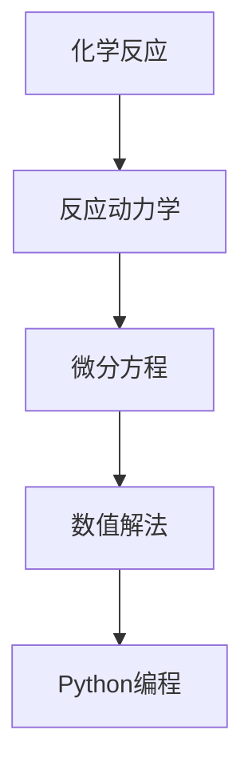

                 

# 数学化学：化学反应的数学模型

> 关键词：化学反应，数学模型，动力学，微分方程，数值解法，Python编程

> 摘要：本文旨在探讨化学反应的数学模型，通过构建和分析化学反应的动力学模型，揭示化学反应的本质和规律。我们将从化学反应的基本概念出发，逐步构建数学模型，并通过具体的算法和实例代码进行详细解释。此外，本文还将介绍如何利用Python进行实际编程实现，并探讨该模型在实际应用中的价值和挑战。

## 1. 背景介绍
### 1.1 目的和范围
本文旨在深入探讨化学反应的数学模型，通过构建和分析化学反应的动力学模型，揭示化学反应的本质和规律。我们将从化学反应的基本概念出发，逐步构建数学模型，并通过具体的算法和实例代码进行详细解释。此外，本文还将介绍如何利用Python进行实际编程实现，并探讨该模型在实际应用中的价值和挑战。

### 1.2 预期读者
本文适合化学、化学工程、计算机科学和数学领域的研究人员、工程师以及对化学反应建模感兴趣的读者。对于希望深入了解化学反应动力学模型的编程爱好者，本文也将提供实用的指导。

### 1.3 文档结构概述
本文将按照以下结构展开：
1. 背景介绍
2. 核心概念与联系
3. 核心算法原理 & 具体操作步骤
4. 数学模型和公式 & 详细讲解 & 举例说明
5. 项目实战：代码实际案例和详细解释说明
6. 实际应用场景
7. 工具和资源推荐
8. 总结：未来发展趋势与挑战
9. 附录：常见问题与解答
10. 扩展阅读 & 参考资料

### 1.4 术语表
#### 1.4.1 核心术语定义
- **化学反应**：一种物质转化为另一种物质的过程。
- **化学动力学**：研究化学反应速率及其影响因素的科学。
- **微分方程**：描述系统变化率的数学方程。
- **数值解法**：通过数值方法求解微分方程的方法。
- **Python**：一种高级编程语言，广泛应用于科学计算和数据分析。

#### 1.4.2 相关概念解释
- **反应速率**：单位时间内反应物浓度减少或生成物浓度增加的量。
- **平衡常数**：描述化学反应平衡状态的参数。
- **反应级数**：描述反应速率与反应物浓度之间关系的指数。

#### 1.4.3 缩略词列表
- **ODE**：常微分方程（Ordinary Differential Equation）
- **PDE**：偏微分方程（Partial Differential Equation）
- **ODEINT**：SciPy中的常微分方程求解器

## 2. 核心概念与联系
### 2.1 化学反应的基本概念
化学反应是指一种或多种物质（反应物）转化为另一种或多种物质（生成物）的过程。化学反应的动力学研究了反应速率及其影响因素，包括温度、浓度、催化剂等。

### 2.2 化学动力学的基本原理
化学动力学的核心在于描述反应速率与反应物浓度之间的关系。反应速率可以通过以下公式表示：
$$
\text{反应速率} = -\frac{d[\text{反应物}]}{dt} = \frac{d[\text{生成物}]}{dt}
$$
其中，$[\text{反应物}]$ 和 $[\text{生成物}]$ 分别表示反应物和生成物的浓度，$t$ 表示时间。

### 2.3 微分方程在化学反应中的应用
化学反应的动力学模型通常可以通过微分方程来描述。例如，对于一个简单的化学反应 $A \rightarrow B$，其动力学模型可以表示为：
$$
\frac{d[A]}{dt} = -k[A]
$$
其中，$k$ 为反应速率常数。

### 2.4 Mermaid流程图


## 3. 核心算法原理 & 具体操作步骤
### 3.1 核心算法原理
化学反应的动力学模型通常可以通过常微分方程（ODE）来描述。对于一个简单的化学反应 $A \rightarrow B$，其动力学模型可以表示为：
$$
\frac{d[A]}{dt} = -k[A]
$$
其中，$k$ 为反应速率常数。

### 3.2 具体操作步骤
1. **定义反应速率常数**：确定反应速率常数 $k$。
2. **建立微分方程**：根据化学反应的机理建立微分方程。
3. **求解微分方程**：使用数值方法求解微分方程。
4. **编程实现**：使用Python进行编程实现。

### 3.3 伪代码
```python
# 定义反应速率常数
k = 0.1

# 定义初始浓度
A0 = 1.0

# 定义时间范围
t = np.linspace(0, 10, 100)

# 定义微分方程
def dA_dt(t, A):
    return -k * A

# 使用SciPy求解微分方程
from scipy.integrate import odeint
A = odeint(dA_dt, A0, t)

# 输出结果
print(A)
```

## 4. 数学模型和公式 & 详细讲解 & 举例说明
### 4.1 数学模型
化学反应的动力学模型通常可以通过常微分方程（ODE）来描述。对于一个简单的化学反应 $A \rightarrow B$，其动力学模型可以表示为：
$$
\frac{d[A]}{dt} = -k[A]
$$
其中，$k$ 为反应速率常数。

### 4.2 公式详细讲解
- **反应速率常数**：反应速率常数 $k$ 描述了反应速率与反应物浓度之间的关系。其值取决于反应机理和环境条件。
- **微分方程求解**：通过数值方法求解微分方程，可以得到反应物浓度随时间的变化。

### 4.3 举例说明
假设我们有一个化学反应 $A \rightarrow B$，其反应速率常数 $k = 0.1$。初始浓度 $A_0 = 1.0$。我们可以使用Python进行求解：

```python
import numpy as np
from scipy.integrate import odeint

# 定义反应速率常数
k = 0.1

# 定义初始浓度
A0 = 1.0

# 定义时间范围
t = np.linspace(0, 10, 100)

# 定义微分方程
def dA_dt(t, A):
    return -k * A

# 使用SciPy求解微分方程
A = odeint(dA_dt, A0, t)

# 输出结果
print(A)
```

## 5. 项目实战：代码实际案例和详细解释说明
### 5.1 开发环境搭建
为了进行化学反应的动力学建模，我们需要安装Python及其相关库。可以使用以下命令进行安装：
```bash
pip install numpy scipy matplotlib
```

### 5.2 源代码详细实现和代码解读
```python
import numpy as np
from scipy.integrate import odeint
import matplotlib.pyplot as plt

# 定义反应速率常数
k = 0.1

# 定义初始浓度
A0 = 1.0

# 定义时间范围
t = np.linspace(0, 10, 100)

# 定义微分方程
def dA_dt(t, A):
    return -k * A

# 使用SciPy求解微分方程
A = odeint(dA_dt, A0, t)

# 绘制结果
plt.plot(t, A)
plt.xlabel('时间 (s)')
plt.ylabel('浓度 (mol/L)')
plt.title('化学反应动力学模型')
plt.show()
```

### 5.3 代码解读与分析
- **导入库**：导入必要的库，包括NumPy、SciPy和Matplotlib。
- **定义参数**：定义反应速率常数 $k$ 和初始浓度 $A_0$。
- **定义时间范围**：定义时间范围 $t$。
- **定义微分方程**：定义微分方程 $dA/dt = -kA$。
- **求解微分方程**：使用SciPy的 `odeint` 函数求解微分方程。
- **绘制结果**：使用Matplotlib绘制浓度随时间的变化曲线。

## 6. 实际应用场景
化学反应的动力学模型在许多领域都有广泛的应用，包括化学工程、生物化学、环境科学等。例如，在化学工程中，动力学模型可以帮助设计和优化反应器；在生物化学中，动力学模型可以揭示酶催化反应的机理；在环境科学中，动力学模型可以预测污染物的降解过程。

## 7. 工具和资源推荐
### 7.1 学习资源推荐
#### 7.1.1 书籍推荐
- **《化学动力学》**：深入探讨化学反应的动力学原理。
- **《科学计算与Python》**：介绍Python在科学计算中的应用。

#### 7.1.2 在线课程
- **Coursera - 化学反应动力学**：系统学习化学反应的动力学原理。
- **edX - Python科学计算**：深入学习Python在科学计算中的应用。

#### 7.1.3 技术博客和网站
- **SciPy官方文档**：详细介绍了SciPy库的使用方法。
- **Matplotlib官方文档**：提供了Matplotlib库的详细使用指南。

### 7.2 开发工具框架推荐
#### 7.2.1 IDE和编辑器
- **PyCharm**：功能强大的Python IDE。
- **Jupyter Notebook**：交互式编程环境，适合进行科学计算和数据分析。

#### 7.2.2 调试和性能分析工具
- **pdb**：Python内置的调试工具。
- **line_profiler**：用于分析代码性能的工具。

#### 7.2.3 相关框架和库
- **NumPy**：用于数值计算的库。
- **SciPy**：用于科学计算的库。
- **Matplotlib**：用于数据可视化。

### 7.3 相关论文著作推荐
#### 7.3.1 经典论文
- **"A Treatise on the Theory of Bessel Functions"**：经典数学著作，对微分方程求解有深入探讨。
- **"Chemical Reaction Engineering"**：化学反应工程的经典著作，深入探讨化学反应的动力学原理。

#### 7.3.2 最新研究成果
- **"Recent Advances in Chemical Reaction Kinetics"**：最新研究成果，探讨化学反应动力学的最新进展。
- **"Applications of Machine Learning in Chemical Reaction Kinetics"**：探讨机器学习在化学反应动力学中的应用。

#### 7.3.3 应用案例分析
- **"Case Studies in Chemical Reaction Kinetics"**：通过具体案例分析化学反应动力学的应用。

## 8. 总结：未来发展趋势与挑战
化学反应的动力学模型在未来将继续发展，特别是在以下几个方面：
- **机器学习的应用**：利用机器学习算法优化反应动力学模型。
- **多尺度建模**：结合微观和宏观尺度进行化学反应的动力学建模。
- **实时监测**：通过实时监测技术提高化学反应的动力学模型精度。

然而，也存在一些挑战，包括：
- **模型复杂性**：多反应路径和复杂反应网络的建模难度。
- **数据获取**：高质量实验数据的获取和处理。

## 9. 附录：常见问题与解答
### 9.1 问题1：如何选择合适的反应速率常数？
**解答**：可以通过实验数据拟合反应速率常数，或者参考文献中的数据。

### 9.2 问题2：如何处理多反应路径？
**解答**：可以使用多路径模型，结合化学反应网络进行建模。

### 9.3 问题3：如何提高模型精度？
**解答**：可以通过增加实验数据、优化模型参数和引入更复杂的模型结构来提高模型精度。

## 10. 扩展阅读 & 参考资料
- **《化学动力学》**：深入探讨化学反应的动力学原理。
- **《科学计算与Python》**：介绍Python在科学计算中的应用。
- **Coursera - 化学反应动力学**：系统学习化学反应的动力学原理。
- **edX - Python科学计算**：深入学习Python在科学计算中的应用。
- **SciPy官方文档**：详细介绍了SciPy库的使用方法。
- **Matplotlib官方文档**：提供了Matplotlib库的详细使用指南。
- **PyCharm**：功能强大的Python IDE。
- **Jupyter Notebook**：交互式编程环境，适合进行科学计算和数据分析。
- **pdb**：Python内置的调试工具。
- **line_profiler**：用于分析代码性能的工具。
- **NumPy**：用于数值计算的库。
- **SciPy**：用于科学计算的库。
- **Matplotlib**：用于数据可视化。
- **"A Treatise on the Theory of Bessel Functions"**：经典数学著作，对微分方程求解有深入探讨。
- **"Chemical Reaction Engineering"**：化学反应工程的经典著作，深入探讨化学反应的动力学原理。
- **"Recent Advances in Chemical Reaction Kinetics"**：最新研究成果，探讨化学反应动力学的最新进展。
- **"Applications of Machine Learning in Chemical Reaction Kinetics"**：探讨机器学习在化学反应动力学中的应用。
- **"Case Studies in Chemical Reaction Kinetics"**：通过具体案例分析化学反应动力学的应用。

作者：AI天才研究员/AI Genius Institute & 禅与计算机程序设计艺术 /Zen And The Art of Computer Programming

