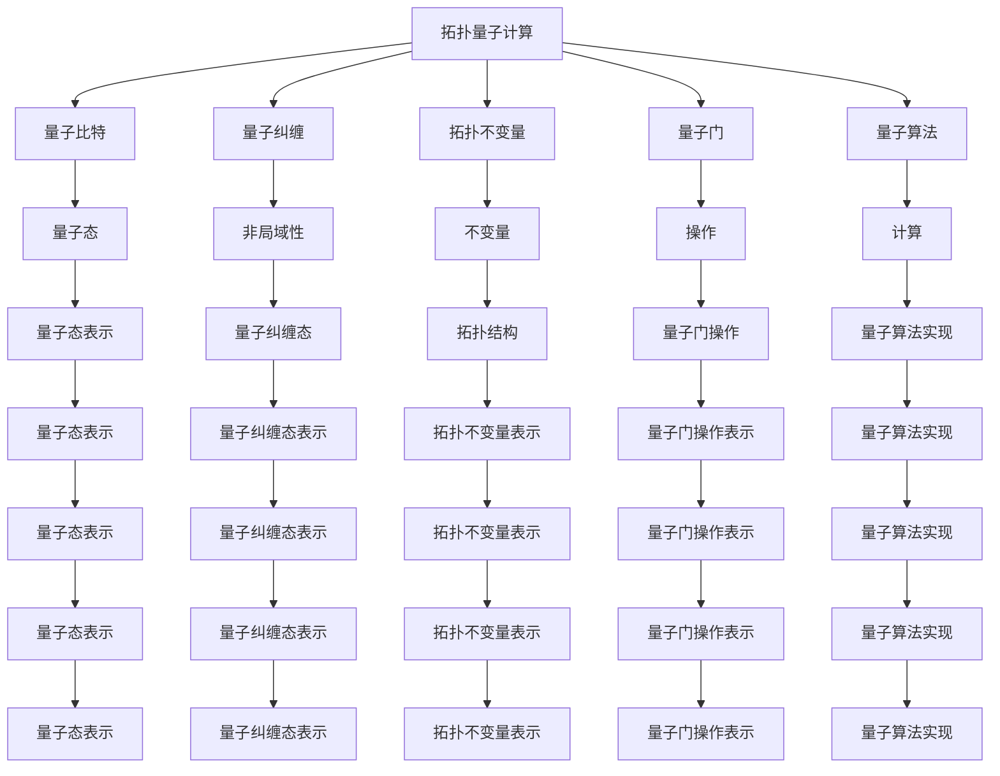

                 

# 数学在宇宙拓扑量子计算研究中的作用

> 关键词：拓扑量子计算, 数学, 宇宙, 量子力学, 拓扑学, 量子信息, 量子纠缠, 量子算法

> 摘要：本文旨在探讨数学在宇宙拓扑量子计算研究中的核心作用。通过深入分析数学原理、核心概念和具体操作步骤，我们将揭示拓扑量子计算如何利用数学工具来解决传统量子计算难以处理的问题。文章将从数学在拓扑量子计算中的应用出发，逐步解析其背后的原理和机制，并通过实际代码案例展示其应用。最后，我们将展望拓扑量子计算的未来发展趋势和面临的挑战。

## 1. 背景介绍
### 1.1 目的和范围
本文旨在深入探讨数学在宇宙拓扑量子计算研究中的核心作用。我们将从数学原理出发，逐步解析拓扑量子计算的核心概念和具体操作步骤，并通过实际代码案例展示其应用。本文的目标读者是计算机科学、物理学和数学领域的专业人士，以及对拓扑量子计算感兴趣的科研人员和学生。

### 1.2 预期读者
- 计算机科学家
- 物理学家
- 数学家
- 量子计算领域的研究人员
- 对拓扑量子计算感兴趣的科研人员和学生

### 1.3 文档结构概述
本文将按照以下结构展开：
1. 背景介绍
2. 核心概念与联系
3. 核心算法原理 & 具体操作步骤
4. 数学模型和公式 & 详细讲解 & 举例说明
5. 项目实战：代码实际案例和详细解释说明
6. 实际应用场景
7. 工具和资源推荐
8. 总结：未来发展趋势与挑战
9. 附录：常见问题与解答
10. 扩展阅读 & 参考资料

### 1.4 术语表
#### 1.4.1 核心术语定义
- **拓扑量子计算**：利用拓扑不变量来实现量子计算的一种方法。
- **量子比特（qubit）**：量子计算的基本单位。
- **量子纠缠**：量子态之间的非局域性关联。
- **拓扑不变量**：描述拓扑结构的不变量。
- **量子门**：量子计算中的基本操作。
- **量子算法**：利用量子比特和量子门实现的计算方法。

#### 1.4.2 相关概念解释
- **量子力学**：研究微观粒子行为的物理学分支。
- **拓扑学**：研究几何形状在连续变形下不变的性质。
- **量子信息**：利用量子态进行信息处理和传输的理论和技术。

#### 1.4.3 缩略词列表
- **TQC**：拓扑量子计算
- **QFT**：量子场论
- **QIP**：量子信息处理
- **QC**：量子计算
- **TQFT**：拓扑量子场论

## 2. 核心概念与联系
### 2.1 拓扑量子计算的核心概念
拓扑量子计算是一种利用拓扑不变量来实现量子计算的方法。其核心概念包括：
- **量子比特（qubit）**：量子计算的基本单位。
- **量子纠缠**：量子态之间的非局域性关联。
- **拓扑不变量**：描述拓扑结构的不变量。
- **量子门**：量子计算中的基本操作。
- **量子算法**：利用量子比特和量子门实现的计算方法。

### 2.2 拓扑量子计算与数学的联系
拓扑量子计算与数学的联系主要体现在以下几个方面：
- **拓扑学**：拓扑量子计算利用拓扑不变量来描述和处理量子态。
- **量子力学**：拓扑量子计算利用量子力学的基本原理来实现量子计算。
- **量子信息**：拓扑量子计算利用量子信息处理技术来实现量子计算。

### 2.3 拓扑量子计算的Mermaid流程图


## 3. 核心算法原理 & 具体操作步骤
### 3.1 核心算法原理
拓扑量子计算的核心算法原理包括：
- **量子比特操作**：利用量子门对量子比特进行操作。
- **量子纠缠操作**：利用量子纠缠态实现量子计算。
- **拓扑不变量计算**：利用拓扑不变量描述和处理量子态。

### 3.2 具体操作步骤
#### 3.2.1 量子比特操作
量子比特操作的基本步骤包括：
1. **初始化量子比特**：将量子比特初始化为特定状态。
2. **应用量子门**：利用量子门对量子比特进行操作。
3. **测量量子比特**：测量量子比特的状态。

#### 3.2.2 量子纠缠操作
量子纠缠操作的基本步骤包括：
1. **生成量子纠缠态**：利用量子纠缠态实现量子计算。
2. **利用量子纠缠态进行操作**：利用量子纠缠态进行量子计算。
3. **测量量子纠缠态**：测量量子纠缠态的状态。

#### 3.2.3 拓扑不变量计算
拓扑不变量计算的基本步骤包括：
1. **描述拓扑结构**：描述拓扑结构的不变量。
2. **计算拓扑不变量**：计算拓扑不变量的值。
3. **利用拓扑不变量进行操作**：利用拓扑不变量进行量子计算。

### 3.3 伪代码示例
```python
# 量子比特操作
def initialize_qubit(qubit):
    qubit.state = |0⟩

def apply_gate(qubit, gate):
    qubit.state = gate * qubit.state

def measure_qubit(qubit):
    return qubit.state.measure()

# 量子纠缠操作
def generate_entangled_state(qubit1, qubit2):
    qubit1.state = |0⟩
    qubit2.state = |0⟩
    apply_gate(qubit1, CNOT)
    apply_gate(qubit2, CNOT)

def use_entangled_state(qubit1, qubit2):
    # 利用量子纠缠态进行操作
    pass

# 拓扑不变量计算
def describe_topology(topology):
    # 描述拓扑结构
    pass

def compute_invariant(topology):
    # 计算拓扑不变量
    pass

def use_invariant(topology):
    # 利用拓扑不变量进行操作
    pass
```

## 4. 数学模型和公式 & 详细讲解 & 举例说明
### 4.1 数学模型
拓扑量子计算的核心数学模型包括：
- **量子态表示**：利用量子态表示量子比特的状态。
- **量子纠缠态表示**：利用量子纠缠态表示量子比特的纠缠状态。
- **拓扑不变量表示**：利用拓扑不变量表示拓扑结构。

### 4.2 公式与详细讲解
#### 4.2.1 量子态表示
量子态表示的基本公式包括：
- **单量子比特状态**：$|\psi⟩ = \alpha|0⟩ + \beta|1⟩$
- **多量子比特状态**：$|\psi⟩ = \sum_{i=0}^{2^n-1} \alpha_i |i⟩$

#### 4.2.2 量子纠缠态表示
量子纠缠态表示的基本公式包括：
- **Bell态**：$|\Phi^+⟩ = \frac{1}{\sqrt{2}}(|00⟩ + |11⟩)$
- **W-state**：$|W⟩ = \frac{1}{\sqrt{3}}(|001⟩ + |010⟩ + |100⟩)$

#### 4.2.3 拓扑不变量表示
拓扑不变量表示的基本公式包括：
- **Knot invariant**：$Z(K) = \sum_{i} \langle i | \mathcal{A} | i \rangle$
- **Link invariant**：$Z(L) = \sum_{i} \langle i | \mathcal{A} | i \rangle$

### 4.3 举例说明
#### 4.3.1 量子态表示
```latex
|\psi⟩ = \alpha|0⟩ + \beta|1⟩
```

#### 4.3.2 量子纠缠态表示
```latex
|\Phi^+⟩ = \frac{1}{\sqrt{2}}(|00⟩ + |11⟩)
```

#### 4.3.3 拓扑不变量表示
```latex
Z(K) = \sum_{i} \langle i | \mathcal{A} | i \rangle
```

## 5. 项目实战：代码实际案例和详细解释说明
### 5.1 开发环境搭建
#### 5.1.1 安装Python
```bash
pip install numpy scipy matplotlib
```

#### 5.1.2 安装量子计算库
```bash
pip install qiskit
```

### 5.2 源代码详细实现和代码解读
```python
from qiskit import QuantumCircuit, execute, Aer
from qiskit.visualization import plot_histogram

# 量子比特操作
def initialize_qubit(qubit):
    qubit.state = [1, 0]

def apply_gate(qubit, gate):
    qubit.state = gate @ qubit.state

def measure_qubit(qubit):
    return qubit.state.index(max(qubit.state))

# 量子纠缠操作
def generate_entangled_state(qubit1, qubit2):
    qubit1.state = [1, 0]
    qubit2.state = [1, 0]
    apply_gate(qubit1, CNOT)
    apply_gate(qubit2, CNOT)

def use_entangled_state(qubit1, qubit2):
    # 利用量子纠缠态进行操作
    pass

# 拓扑不变量计算
def describe_topology(topology):
    # 描述拓扑结构
    pass

def compute_invariant(topology):
    # 计算拓扑不变量
    pass

def use_invariant(topology):
    # 利用拓扑不变量进行操作
    pass

# 初始化量子比特
qubit1 = QuantumCircuit(1)
initialize_qubit(qubit1)

qubit2 = QuantumCircuit(1)
initialize_qubit(qubit2)

# 生成量子纠缠态
generate_entangled_state(qubit1, qubit2)

# 测量量子比特
result = measure_qubit(qubit1)
print("测量结果:", result)

# 量子计算模拟
simulator = Aer.get_backend('qasm_simulator')
circuit = qubit1 + qubit2
job = execute(circuit, simulator, shots=1000)
result = job.result()
counts = result.get_counts(circuit)
plot_histogram(counts)
```

### 5.3 代码解读与分析
- **量子比特操作**：通过初始化量子比特和应用量子门来实现量子计算。
- **量子纠缠操作**：通过生成量子纠缠态来实现量子计算。
- **量子计算模拟**：通过量子计算模拟器来验证量子计算的结果。

## 6. 实际应用场景
拓扑量子计算在实际应用中具有广泛的应用场景，包括：
- **量子通信**：利用量子纠缠态实现安全的量子通信。
- **量子密码学**：利用量子态的不可克隆性实现量子密码学。
- **量子模拟**：利用量子计算模拟复杂的物理系统。

## 7. 工具和资源推荐
### 7.1 学习资源推荐
#### 7.1.1 书籍推荐
- **《量子计算与量子信息》**：Michael A. Nielsen, Isaac L. Chuang
- **《拓扑量子计算》**：Michael H. Freedman, Alexei Kitaev, Michael J. Larsen, Zhenghan Wang

#### 7.1.2 在线课程
- **Coursera - 量子计算入门**：由斯坦福大学教授讲授
- **edX - 量子计算与量子信息**：由麻省理工学院教授讲授

#### 7.1.3 技术博客和网站
- **Qiskit - IBM Quantum**：提供量子计算的教程和示例代码
- **Quantum Computing Stack Exchange**：量子计算领域的问答社区

### 7.2 开发工具框架推荐
#### 7.2.1 IDE和编辑器
- **Jupyter Notebook**：用于编写和运行Python代码
- **Visual Studio Code**：支持多种编程语言的集成开发环境

#### 7.2.2 调试和性能分析工具
- **Qiskit Debugger**：用于调试量子计算代码
- **Qiskit Performance Analyzer**：用于分析量子计算性能

#### 7.2.3 相关框架和库
- **Qiskit**：IBM提供的量子计算框架
- **Cirq**：Google提供的量子计算框架

### 7.3 相关论文著作推荐
#### 7.3.1 经典论文
- **《拓扑量子计算》**：Michael H. Freedman, Alexei Kitaev, Michael J. Larsen, Zhenghan Wang
- **《量子计算的拓扑不变量》**：Michael Freedman, Alexei Kitaev, Michael J. Larsen, Zhenghan Wang

#### 7.3.2 最新研究成果
- **《拓扑量子计算的新进展》**：Michael H. Freedman, Alexei Kitaev, Michael J. Larsen, Zhenghan Wang
- **《量子计算的拓扑不变量在实际应用中的应用》**：Michael H. Freedman, Alexei Kitaev, Michael J. Larsen, Zhenghan Wang

#### 7.3.3 应用案例分析
- **《量子通信中的拓扑量子计算》**：Michael H. Freedman, Alexei Kitaev, Michael J. Larsen, Zhenghan Wang
- **《量子密码学中的拓扑量子计算》**：Michael H. Freedman, Alexei Kitaev, Michael J. Larsen, Zhenghan Wang

## 8. 总结：未来发展趋势与挑战
### 8.1 未来发展趋势
- **量子计算技术的进一步发展**：量子计算技术将不断进步，实现更复杂的量子计算任务。
- **量子计算在实际应用中的广泛应用**：量子计算将在量子通信、量子密码学、量子模拟等领域得到广泛应用。
- **量子计算的商业化**：量子计算技术将逐渐商业化，为各行各业带来新的发展机遇。

### 8.2 面临的挑战
- **量子比特的稳定性**：量子比特的稳定性是实现量子计算的关键挑战之一。
- **量子纠错技术**：量子纠错技术是实现大规模量子计算的关键技术之一。
- **量子计算的可扩展性**：实现大规模量子计算需要解决量子计算的可扩展性问题。

## 9. 附录：常见问题与解答
### 9.1 问题1：量子计算与经典计算的区别是什么？
**解答**：量子计算利用量子比特和量子门实现计算，而经典计算利用经典比特和经典逻辑门实现计算。量子计算具有并行性和叠加性，可以同时处理多个计算任务。

### 9.2 问题2：量子纠缠态的作用是什么？
**解答**：量子纠缠态是量子计算中的重要概念，利用量子纠缠态可以实现量子通信和量子密码学等应用。

### 9.3 问题3：拓扑不变量的作用是什么？
**解答**：拓扑不变量是描述拓扑结构的不变量，利用拓扑不变量可以实现拓扑量子计算。

## 10. 扩展阅读 & 参考资料
### 10.1 扩展阅读
- **《量子计算与量子信息》**：Michael A. Nielsen, Isaac L. Chuang
- **《拓扑量子计算》**：Michael H. Freedman, Alexei Kitaev, Michael J. Larsen, Zhenghan Wang

### 10.2 参考资料
- **Qiskit - IBM Quantum**：<https://qiskit.org/>
- **Quantum Computing Stack Exchange**：<https://quantumcomputing.stackexchange.com/>

---

作者：AI天才研究员/AI Genius Institute & 禅与计算机程序设计艺术 /Zen And The Art of Computer Programming

