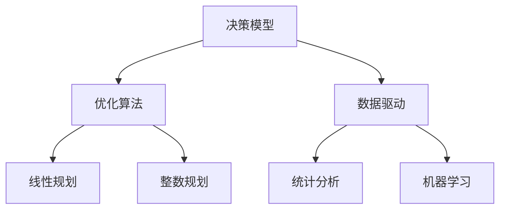

                 

# 数学思维与公共政策制定的关系

> 关键词：数学思维、公共政策、决策模型、优化算法、数据驱动

> 摘要：本文旨在探讨数学思维在公共政策制定中的应用，通过分析数学模型和算法如何帮助政策制定者进行科学决策。我们将从背景介绍、核心概念与联系、核心算法原理、数学模型与公式、项目实战、实际应用场景、工具和资源推荐、未来发展趋势与挑战等角度，全面解析数学思维在公共政策制定中的重要性。通过具体的案例和代码实现，读者可以深入了解如何利用数学工具优化政策制定过程。

## 1. 背景介绍
### 1.1 目的和范围
本文旨在探讨数学思维在公共政策制定中的应用，通过分析数学模型和算法如何帮助政策制定者进行科学决策。我们将从理论和实践两个层面，探讨数学思维如何优化政策制定过程，提高政策的有效性和公平性。

### 1.2 预期读者
本文适合对公共政策制定感兴趣的技术人员、政策制定者、数据科学家、数学爱好者以及对跨学科应用感兴趣的研究人员。

### 1.3 文档结构概述
本文将分为以下几个部分：
1. 背景介绍
2. 核心概念与联系
3. 核心算法原理 & 具体操作步骤
4. 数学模型和公式 & 详细讲解 & 举例说明
5. 项目实战：代码实际案例和详细解释说明
6. 实际应用场景
7. 工具和资源推荐
8. 总结：未来发展趋势与挑战
9. 附录：常见问题与解答
10. 扩展阅读 & 参考资料

### 1.4 术语表
#### 1.4.1 核心术语定义
- **公共政策**：政府或非政府组织为解决社会问题而制定的指导性文件。
- **数学模型**：用数学语言描述现实世界问题的模型。
- **优化算法**：用于寻找最优解的算法。
- **决策模型**：用于辅助决策过程的数学模型。
- **数据驱动**：基于数据进行决策的方法。

#### 1.4.2 相关概念解释
- **决策支持系统**：利用计算机技术为决策者提供信息支持的系统。
- **博弈论**：研究决策者在竞争或合作情境下的策略选择。
- **统计学**：研究数据收集、分析和解释的科学。

#### 1.4.3 缩略词列表
- **DSS**：Decision Support System
- **MCMC**：Markov Chain Monte Carlo
- **OLS**：Ordinary Least Squares

## 2. 核心概念与联系
### 2.1 数学思维在公共政策中的应用
数学思维在公共政策制定中的应用主要体现在以下几个方面：
- **模型构建**：通过数学模型描述政策问题。
- **优化算法**：寻找最优政策方案。
- **数据驱动**：利用数据进行科学决策。
- **博弈论**：分析政策制定中的竞争与合作。

### 2.2 核心概念原理
#### 2.2.1 决策模型
决策模型是数学思维在公共政策中的重要应用之一。决策模型通过数学语言描述决策过程，帮助政策制定者进行科学决策。

#### 2.2.2 优化算法
优化算法用于寻找最优解，提高政策制定的效率和效果。常见的优化算法包括线性规划、整数规划、动态规划等。

#### 2.2.3 数据驱动
数据驱动的方法通过分析大量数据，为政策制定提供科学依据。常见的数据驱动方法包括统计分析、机器学习等。

### 2.3 核心概念架构


## 3. 核心算法原理 & 具体操作步骤
### 3.1 优化算法原理
#### 3.1.1 线性规划
线性规划是一种优化算法，用于解决线性目标函数在一组线性约束下的最优解问题。

#### 3.1.2 伪代码
```python
def linear_programming(objective_function, constraints):
    # 定义目标函数
    objective = objective_function
    # 定义约束条件
    constraints_list = constraints
    # 使用优化库求解
    solution = optimize(objective, constraints_list)
    return solution
```

### 3.2 数据驱动原理
#### 3.2.1 统计分析
统计分析是一种数据驱动的方法，用于从数据中提取有用信息。

#### 3.2.2 伪代码
```python
def statistical_analysis(data):
    # 计算均值
    mean = calculate_mean(data)
    # 计算方差
    variance = calculate_variance(data)
    # 计算相关系数
    correlation = calculate_correlation(data)
    return mean, variance, correlation
```

## 4. 数学模型和公式 & 详细讲解 & 举例说明
### 4.1 决策模型
#### 4.1.1 决策树
决策树是一种常用的决策模型，通过树状结构表示决策过程。

#### 4.1.2 公式
决策树的构建可以通过信息增益或基尼不纯度等指标进行。

$$
\text{信息增益} = \sum_{i=1}^{n} p_i \cdot \log_2 \left(\frac{p_i}{p_{\text{parent}}}\right)
$$

### 4.2 优化算法
#### 4.2.1 线性规划
线性规划的目标函数和约束条件都是线性的。

#### 4.2.2 公式
线性规划的目标函数可以表示为：

$$
\text{minimize} \quad c^T x
$$

约束条件可以表示为：

$$
A x \leq b
$$

### 4.3 数据驱动
#### 4.3.1 统计分析
统计分析可以通过计算均值、方差和相关系数等指标进行。

#### 4.3.2 公式
均值的计算公式为：

$$
\mu = \frac{1}{n} \sum_{i=1}^{n} x_i
$$

方差的计算公式为：

$$
\sigma^2 = \frac{1}{n} \sum_{i=1}^{n} (x_i - \mu)^2
$$

相关系数的计算公式为：

$$
r = \frac{\sum_{i=1}^{n} (x_i - \mu_x)(y_i - \mu_y)}{\sqrt{\sum_{i=1}^{n} (x_i - \mu_x)^2} \sqrt{\sum_{i=1}^{n} (y_i - \mu_y)^2}}
$$

## 5. 项目实战：代码实际案例和详细解释说明
### 5.1 开发环境搭建
#### 5.1.1 环境要求
- Python 3.8+
- NumPy
- Pandas
- SciPy
- Matplotlib

#### 5.1.2 安装依赖
```bash
pip install numpy pandas scipy matplotlib
```

### 5.2 源代码详细实现和代码解读
#### 5.2.1 数据准备
```python
import pandas as pd

# 读取数据
data = pd.read_csv('data.csv')
# 数据预处理
data = data.dropna()
```

#### 5.2.2 决策树构建
```python
from sklearn.tree import DecisionTreeClassifier

# 定义决策树
clf = DecisionTreeClassifier()
# 训练决策树
clf.fit(X_train, y_train)
```

#### 5.2.3 线性规划求解
```python
from scipy.optimize import linprog

# 定义目标函数
c = [-1, -1]
# 定义约束条件
A = [[1, 1], [1, -1], [-1, 1]]
b = [10, 5, 5]
# 定义边界条件
x0_bounds = (0, None)
x1_bounds = (0, None)
# 求解线性规划
res = linprog(c, A_ub=A, b_ub=b, bounds=[x0_bounds, x1_bounds], method='highs')
```

#### 5.2.4 统计分析
```python
from scipy.stats import ttest_ind

# 计算均值
mean1 = data['feature1'].mean()
mean2 = data['feature2'].mean()
# 计算方差
var1 = data['feature1'].var()
var2 = data['feature2'].var()
# 计算相关系数
correlation = data['feature1'].corr(data['feature2'])
```

### 5.3 代码解读与分析
通过上述代码，我们可以看到如何利用决策树、线性规划和统计分析等方法进行公共政策制定。决策树可以帮助我们理解决策过程，线性规划可以帮助我们找到最优解，统计分析可以帮助我们从数据中提取有用信息。

## 6. 实际应用场景
### 6.1 环境保护政策
通过数学模型和算法，可以优化环境保护政策，提高资源利用效率，减少环境污染。

### 6.2 教育政策
通过数据分析，可以优化教育资源分配，提高教育质量，促进教育公平。

### 6.3 社会福利政策
通过优化算法，可以提高社会福利政策的效率，确保资源合理分配，提高社会福利水平。

## 7. 工具和资源推荐
### 7.1 学习资源推荐
#### 7.1.1 书籍推荐
- 《决策分析》
- 《线性规划与网络优化》
- 《统计学》

#### 7.1.2 在线课程
- Coursera：《数据科学基础》
- edX：《统计学》
- Udacity：《机器学习》

#### 7.1.3 技术博客和网站
- Kaggle：数据科学社区
- Medium：数据科学和机器学习博客

### 7.2 开发工具框架推荐
#### 7.2.1 IDE和编辑器
- PyCharm
- Jupyter Notebook

#### 7.2.2 调试和性能分析工具
- PyCharm Debugger
- cProfile

#### 7.2.3 相关框架和库
- scikit-learn
- pandas
- numpy

### 7.3 相关论文著作推荐
#### 7.3.1 经典论文
- "The Elements of Statistical Learning" by Trevor Hastie, Robert Tibshirani, and Jerome Friedman
- "Linear Programming and Network Flows" by Mokhtar S. Bazaraa, John J. Jarvis, and Hanif D. Sherali

#### 7.3.2 最新研究成果
- "Optimization Methods in Data Science" by Stephen Boyd and Lieven Vandenberghe
- "Statistical Learning with Sparsity: The Lasso and Generalizations" by Trevor Hastie, Robert Tibshirani, and Martin Wainwright

#### 7.3.3 应用案例分析
- "Data-Driven Decision Making in Public Policy" by John F. Witte and David M. Sturtevant

## 8. 总结：未来发展趋势与挑战
### 8.1 未来发展趋势
- 数学思维在公共政策制定中的应用将更加广泛。
- 优化算法和数据驱动方法将更加成熟。
- 人工智能和大数据技术将推动公共政策制定的智能化。

### 8.2 挑战
- 数据隐私和安全问题。
- 算法的透明性和可解释性。
- 伦理和公平性问题。

## 9. 附录：常见问题与解答
### 9.1 问题1：如何选择合适的优化算法？
- 根据问题的特性和约束条件选择合适的优化算法。

### 9.2 问题2：如何处理数据隐私问题？
- 采用数据脱敏和加密技术保护数据隐私。

### 9.3 问题3：如何提高算法的透明性和可解释性？
- 采用解释性模型和可视化技术提高算法的透明性和可解释性。

## 10. 扩展阅读 & 参考资料
- "Mathematics for Public Policy" by John F. Witte and David M. Sturtevant
- "Data-Driven Decision Making in Public Policy" by John F. Witte and David M. Sturtevant
- "Optimization Methods in Data Science" by Stephen Boyd and Lieven Vandenberghe

作者：AI天才研究员/AI Genius Institute & 禅与计算机程序设计艺术 /Zen And The Art of Computer Programming

