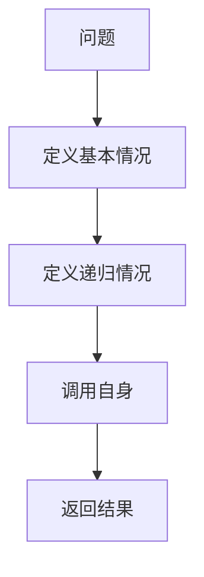
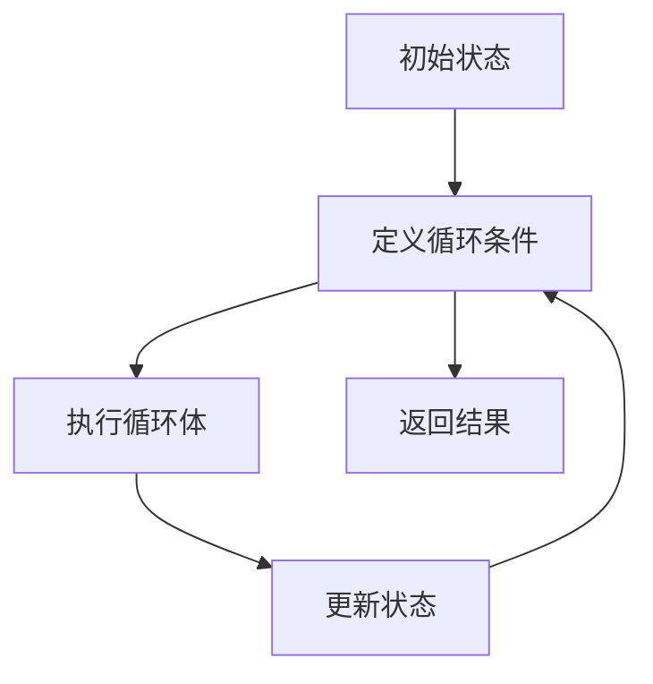

                 

# 数学思维与创新教育的关系

> 关键词：数学思维、创新教育、逻辑推理、算法原理、数学模型、代码实现、应用场景

> 摘要：本文旨在探讨数学思维在创新教育中的重要性及其应用。通过分析数学思维的核心概念、算法原理、数学模型和实际代码案例，揭示数学思维如何促进创新教育的发展。文章将从背景介绍、核心概念与联系、核心算法原理与具体操作步骤、数学模型与公式、项目实战、实际应用场景、工具和资源推荐、未来发展趋势与挑战等多方面进行详细阐述。

## 1. 背景介绍
### 1.1 目的和范围
本文旨在探讨数学思维在创新教育中的重要性及其应用。通过分析数学思维的核心概念、算法原理、数学模型和实际代码案例，揭示数学思维如何促进创新教育的发展。文章将从背景介绍、核心概念与联系、核心算法原理与具体操作步骤、数学模型与公式、项目实战、实际应用场景、工具和资源推荐、未来发展趋势与挑战等多方面进行详细阐述。

### 1.2 预期读者
本文预期读者包括教育工作者、计算机科学家、工程师、学生以及对数学思维和创新教育感兴趣的读者。读者应具备一定的数学基础和编程经验，以便更好地理解文章内容。

### 1.3 文档结构概述
本文结构如下：
1. 背景介绍
2. 核心概念与联系
3. 核心算法原理 & 具体操作步骤
4. 数学模型和公式 & 详细讲解 & 举例说明
5. 项目实战：代码实际案例和详细解释说明
6. 实际应用场景
7. 工具和资源推荐
8. 总结：未来发展趋势与挑战
9. 附录：常见问题与解答
10. 扩展阅读 & 参考资料

### 1.4 术语表
#### 1.4.1 核心术语定义
- **数学思维**：指运用数学方法和逻辑推理解决实际问题的能力。
- **创新教育**：旨在培养学生的创新意识和创新能力的教育模式。
- **算法**：解决问题的步骤和方法。
- **数学模型**：用数学语言描述实际问题的抽象表达。
- **伪代码**：一种介于自然语言和编程语言之间的描述算法的形式。
- **IDE**：集成开发环境（Integrated Development Environment）。

#### 1.4.2 相关概念解释
- **逻辑推理**：通过已知信息推导出未知信息的过程。
- **递归**：一种解决问题的方法，将问题分解为更小的子问题，直到可以直接解决为止。
- **迭代**：通过重复执行相同的操作来解决问题的方法。

#### 1.4.3 缩略词列表
- **IDE**：Integrated Development Environment
- **API**：Application Programming Interface
- **GUI**：Graphical User Interface

## 2. 核心概念与联系
### 2.1 数学思维的核心概念
数学思维的核心概念包括逻辑推理、抽象思维、问题解决和模式识别。这些概念相互关联，共同构成了数学思维的基础。

### 2.2 创新教育的核心概念
创新教育的核心概念包括创新意识、创新能力、批判性思维和团队合作。这些概念相互支持，共同促进了学生的全面发展。

### 2.3 数学思维与创新教育的联系
数学思维与创新教育之间存在密切联系。数学思维能够培养学生的逻辑推理能力、抽象思维能力和问题解决能力，这些都是创新教育的重要组成部分。通过数学思维的训练，学生能够更好地理解和应用创新教育的理念。

## 3. 核心算法原理 & 具体操作步骤
### 3.1 递归算法原理
递归是一种解决问题的方法，将问题分解为更小的子问题，直到可以直接解决为止。递归算法的基本步骤如下：



### 3.2 迭代算法原理
迭代是一种通过重复执行相同的操作来解决问题的方法。迭代算法的基本步骤如下：



## 4. 数学模型和公式 & 详细讲解 & 举例说明
### 4.1 数学模型
数学模型是用数学语言描述实际问题的抽象表达。例如，线性回归模型可以用来预测一个变量随另一个变量的变化趋势。

### 4.2 公式举例
线性回归模型的公式如下：

$$
y = \beta_0 + \beta_1 x + \epsilon
$$

其中，$y$ 是因变量，$x$ 是自变量，$\beta_0$ 和 $\beta_1$ 是回归系数，$\epsilon$ 是误差项。

## 5. 项目实战：代码实际案例和详细解释说明
### 5.1 开发环境搭建
开发环境搭建包括安装Python、Jupyter Notebook和相关库。具体步骤如下：

1. 安装Python：访问Python官网下载并安装最新版本的Python。
2. 安装Jupyter Notebook：使用pip安装Jupyter Notebook。
3. 安装相关库：使用pip安装NumPy、Pandas和Matplotlib。

### 5.2 源代码详细实现和代码解读
以下是一个简单的线性回归模型实现：

```python
import numpy as np
import pandas as pd
import matplotlib.pyplot as plt

# 生成数据
np.random.seed(0)
x = np.random.rand(100, 1)
y = 2 + 3 * x + np.random.rand(100, 1)

# 训练模型
def train_model(x, y):
    x_b = np.c_[np.ones((100, 1)), x]
    theta_best = np.linalg.inv(x_b.T.dot(x_b)).dot(x_b.T).dot(y)
    return theta_best

theta_best = train_model(x, y)

# 预测
def predict(x, theta):
    x_b = np.c_[np.ones((x.shape[0], 1)), x]
    return x_b.dot(theta)

y_pred = predict(x, theta_best)

# 绘制结果
plt.scatter(x, y, label='Training data')
plt.plot(x, y_pred, color='red', label='Predicted line')
plt.legend()
plt.show()
```

### 5.3 代码解读与分析
- `np.random.rand(100, 1)`：生成100个随机数，作为自变量$x$。
- `y = 2 + 3 * x + np.random.rand(100, 1)`：生成因变量$y$，包含线性关系和随机误差。
- `train_model(x, y)`：训练线性回归模型，返回最优参数$\theta$。
- `predict(x, theta)`：使用训练好的模型进行预测。
- `plt.scatter(x, y, label='Training data')`：绘制训练数据。
- `plt.plot(x, y_pred, color='red', label='Predicted line')`：绘制预测结果。

## 6. 实际应用场景
数学思维和创新教育在多个领域都有广泛的应用，例如金融分析、医疗诊断、自动驾驶等。通过数学思维的训练，学生能够更好地理解和应用这些领域的知识。

## 7. 工具和资源推荐
### 7.1 学习资源推荐
#### 7.1.1 书籍推荐
- 《数学之美》：吴军
- 《算法导论》：Thomas H. Cormen

#### 7.1.2 在线课程
- Coursera：《机器学习》
- edX：《数据科学基础》

#### 7.1.3 技术博客和网站
- Medium：《机器学习》
- GitHub：《机器学习项目》

### 7.2 开发工具框架推荐
#### 7.2.1 IDE和编辑器
- PyCharm
- VSCode

#### 7.2.2 调试和性能分析工具
- PyCharm Debugger
- cProfile

#### 7.2.3 相关框架和库
- scikit-learn
- TensorFlow

### 7.3 相关论文著作推荐
#### 7.3.1 经典论文
-《线性回归模型》：James, G., Witten, D., Hastie, T., & Tibshirani, R. (2013). An Introduction to Statistical Learning.

#### 7.3.2 最新研究成果
-《深度学习》：Goodfellow, I., Bengio, Y., & Courville, A. (2016). Deep Learning.

#### 7.3.3 应用案例分析
-《金融数据分析》：Lam, K. (2018). Financial Data Analysis.

## 8. 总结：未来发展趋势与挑战
数学思维和创新教育在未来将继续发挥重要作用。随着技术的发展，数学思维将更加深入地应用于各个领域，促进创新教育的发展。然而，也面临着一些挑战，如如何更好地培养学生的数学思维能力，如何将数学思维与实际问题相结合等。

## 9. 附录：常见问题与解答
### 9.1 问题：如何培养学生的数学思维能力？
- 答案：通过数学课程、编程实践和实际问题解决来培养学生的数学思维能力。

### 9.2 问题：如何将数学思维与实际问题相结合？
- 答案：通过项目实战和案例分析，让学生将数学思维应用于实际问题中。

## 10. 扩展阅读 & 参考资料
- 《数学之美》：吴军
- 《算法导论》：Thomas H. Cormen
- Coursera：《机器学习》
- edX：《数据科学基础》
- Medium：《机器学习》
- GitHub：《机器学习项目》
- PyCharm
- VSCode
- PyCharm Debugger
- cProfile
- scikit-learn
- TensorFlow
- James, G., Witten, D., Hastie, T., & Tibshirani, R. (2013). An Introduction to Statistical Learning.
- Goodfellow, I., Bengio, Y., & Courville, A. (2016). Deep Learning.
- Lam, K. (2018). Financial Data Analysis.

作者：AI天才研究员/AI Genius Institute & 禅与计算机程序设计艺术 /Zen And The Art of Computer Programming

