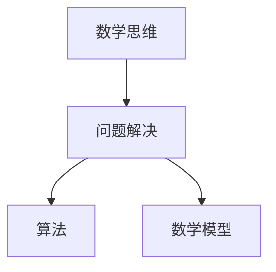

                 

# 数学思维与问题解决能力的培养

> 关键词：数学思维, 问题解决, 逻辑推理, 算法原理, 数学模型, 代码实现, 实际应用

> 摘要：本文旨在探讨数学思维在问题解决中的重要性，并通过一系列步骤引导读者理解如何培养和应用数学思维。我们将从核心概念、算法原理、数学模型、代码实现、实际应用等多个方面进行详细阐述，旨在帮助读者提升问题解决能力，掌握数学思维的应用技巧。

## 1. 背景介绍
### 1.1 目的和范围
本文旨在深入探讨数学思维在问题解决中的重要性，并通过一系列步骤引导读者理解如何培养和应用数学思维。我们将从核心概念、算法原理、数学模型、代码实现、实际应用等多个方面进行详细阐述，旨在帮助读者提升问题解决能力，掌握数学思维的应用技巧。

### 1.2 预期读者
本文适合以下读者：
- 对编程和算法感兴趣的初学者
- 需要提升问题解决能力的软件工程师
- 希望深入理解数学思维在实际应用中的计算机科学家
- 对数学和计算机科学有浓厚兴趣的学生和研究人员

### 1.3 文档结构概述
本文将按照以下结构展开：
1. 背景介绍
2. 核心概念与联系
3. 核心算法原理 & 具体操作步骤
4. 数学模型和公式 & 详细讲解 & 举例说明
5. 项目实战：代码实际案例和详细解释说明
6. 实际应用场景
7. 工具和资源推荐
8. 总结：未来发展趋势与挑战
9. 附录：常见问题与解答
10. 扩展阅读 & 参考资料

### 1.4 术语表
#### 1.4.1 核心术语定义
- **数学思维**：一种通过数学方法和逻辑推理来解决问题的能力。
- **问题解决**：通过分析和推理找到问题解决方案的过程。
- **算法**：解决问题的具体步骤和方法。
- **数学模型**：用数学语言描述现实问题的方法。
- **伪代码**：一种用于描述算法的简化形式，不依赖于特定编程语言。

#### 1.4.2 相关概念解释
- **逻辑推理**：通过已知信息推导出未知信息的过程。
- **递归**：一种解决问题的方法，通过将问题分解为更小的子问题来解决。
- **迭代**：一种通过重复执行相同操作来解决问题的方法。

#### 1.4.3 缩略词列表
- **API**：应用程序编程接口
- **IDE**：集成开发环境
- **GUI**：图形用户界面
- **SDK**：软件开发工具包

## 2. 核心概念与联系
### 2.1 核心概念
- **数学思维**：通过数学方法和逻辑推理来解决问题的能力。
- **问题解决**：通过分析和推理找到问题解决方案的过程。
- **算法**：解决问题的具体步骤和方法。
- **数学模型**：用数学语言描述现实问题的方法。

### 2.2 联系
- 数学思维是问题解决的基础，通过数学方法和逻辑推理来解决问题。
- 算法是解决问题的具体步骤和方法，是数学思维的应用。
- 数学模型是用数学语言描述现实问题的方法，是数学思维和问题解决的桥梁。



## 3. 核心算法原理 & 具体操作步骤
### 3.1 核心算法原理
- **递归**：一种解决问题的方法，通过将问题分解为更小的子问题来解决。
- **迭代**：一种通过重复执行相同操作来解决问题的方法。

### 3.2 具体操作步骤
#### 3.2.1 递归算法原理
递归算法的基本思想是将问题分解为更小的子问题，然后通过递归调用解决这些子问题。递归算法通常包含两个部分：基本情况和递归情况。

**基本情况**：当问题规模足够小，可以直接解决的情况。
**递归情况**：将问题分解为更小的子问题，然后递归调用解决这些子问题。

**伪代码**：
```pseudo
function recursiveAlgorithm(n):
    if n == 0:
        return 0
    else:
        return n + recursiveAlgorithm(n-1)
```

#### 3.2.2 迭代算法原理
迭代算法通过重复执行相同操作来解决问题。迭代算法通常包含一个循环结构，通过循环不断更新状态，直到满足终止条件。

**伪代码**：
```pseudo
function iterativeAlgorithm(n):
    result = 0
    for i from 0 to n:
        result = result + i
    return result
```

## 4. 数学模型和公式 & 详细讲解 & 举例说明
### 4.1 数学模型
数学模型是用数学语言描述现实问题的方法。数学模型可以帮助我们更好地理解问题的本质，并通过数学方法找到解决方案。

### 4.2 公式
#### 4.2.1 线性方程
线性方程是数学模型中最基本的形式之一。线性方程的一般形式为：
$$
ax + b = 0
$$
其中，$a$ 和 $b$ 是常数，$x$ 是变量。

#### 4.2.2 二次方程
二次方程是数学模型中另一种常见的形式。二次方程的一般形式为：
$$
ax^2 + bx + c = 0
$$
其中，$a$、$b$ 和 $c$ 是常数，$x$ 是变量。

### 4.3 详细讲解
#### 4.3.1 线性方程
线性方程的一般形式为：
$$
ax + b = 0
$$
其中，$a$ 和 $b$ 是常数，$x$ 是变量。线性方程的解可以通过以下公式求得：
$$
x = -\frac{b}{a}
$$

#### 4.3.2 二次方程
二次方程的一般形式为：
$$
ax^2 + bx + c = 0
$$
其中，$a$、$b$ 和 $c$ 是常数，$x$ 是变量。二次方程的解可以通过以下公式求得：
$$
x = \frac{-b \pm \sqrt{b^2 - 4ac}}{2a}
$$

### 4.4 举例说明
#### 4.4.1 线性方程
假设有一个线性方程 $2x + 3 = 0$，我们可以求解该方程：
$$
2x + 3 = 0
$$
通过移项，得到：
$$
2x = -3
$$
进一步求解，得到：
$$
x = -\frac{3}{2}
$$

#### 4.4.2 二次方程
假设有一个二次方程 $x^2 - 5x + 6 = 0$，我们可以求解该方程：
$$
x^2 - 5x + 6 = 0
$$
通过求根公式，得到：
$$
x = \frac{5 \pm \sqrt{25 - 24}}{2}
$$
进一步求解，得到：
$$
x = \frac{5 \pm 1}{2}
$$
因此，方程的解为：
$$
x_1 = 3, \quad x_2 = 2
$$

## 5. 项目实战：代码实际案例和详细解释说明
### 5.1 开发环境搭建
为了实现上述算法，我们需要搭建一个开发环境。这里以Python为例，安装必要的库和工具。

#### 5.1.1 安装Python
确保已经安装了Python 3.8及以上版本。

#### 5.1.2 安装必要的库
使用pip安装必要的库：
```bash
pip install numpy
```

### 5.2 源代码详细实现和代码解读
#### 5.2.1 递归算法实现
```python
def recursive_algorithm(n):
    if n == 0:
        return 0
    else:
        return n + recursive_algorithm(n-1)
```

#### 5.2.2 迭代算法实现
```python
def iterative_algorithm(n):
    result = 0
    for i in range(n + 1):
        result += i
    return result
```

### 5.3 代码解读与分析
#### 5.3.1 递归算法解读
递归算法通过递归调用解决子问题。递归算法的基本思想是将问题分解为更小的子问题，然后通过递归调用解决这些子问题。递归算法通常包含两个部分：基本情况和递归情况。

#### 5.3.2 迭代算法解读
迭代算法通过循环结构不断更新状态，直到满足终止条件。迭代算法通常包含一个循环结构，通过循环不断更新状态，直到满足终止条件。

## 6. 实际应用场景
数学思维和算法在许多实际应用场景中都有广泛的应用。例如，在计算机科学中，数学思维和算法被用于解决各种问题，如排序、搜索、图论等。

### 6.1 排序算法
排序算法是计算机科学中常见的问题之一。常见的排序算法有冒泡排序、插入排序、选择排序、快速排序等。

### 6.2 搜索算法
搜索算法是计算机科学中另一个常见的问题。常见的搜索算法有深度优先搜索、广度优先搜索等。

### 6.3 图论算法
图论算法是计算机科学中另一个重要的问题。常见的图论算法有最短路径算法、最小生成树算法等。

## 7. 工具和资源推荐
### 7.1 学习资源推荐
#### 7.1.1 书籍推荐
- 《算法导论》（Introduction to Algorithms）
- 《计算机程序设计艺术》（The Art of Computer Programming）

#### 7.1.2 在线课程
- Coursera上的《算法》课程
- edX上的《算法与数据结构》课程

#### 7.1.3 技术博客和网站
- GeeksforGeeks
- HackerRank

### 7.2 开发工具框架推荐
#### 7.2.1 IDE和编辑器
- PyCharm
- Visual Studio Code

#### 7.2.2 调试和性能分析工具
- PyCharm的调试工具
- Visual Studio Code的性能分析工具

#### 7.2.3 相关框架和库
- NumPy
- Pandas

### 7.3 相关论文著作推荐
#### 7.3.1 经典论文
- Cormen, T. H., Leiserson, C. E., Rivest, R. L., & Stein, C. (2009). Introduction to Algorithms (3rd ed.). MIT Press.
- Knuth, D. E. (1997). The Art of Computer Programming (3rd ed.). Addison-Wesley.

#### 7.3.2 最新研究成果
- Sedgewick, R., & Wayne, K. (2011). Algorithms (4th ed.). Addison-Wesley.
- Goodrich, M. T., & Tamassia, R. (2015). Data Structures & Algorithms in Java (7th ed.). Wiley.

#### 7.3.3 应用案例分析
- Sedgewick, R., & Wayne, K. (2011). Algorithms in a Nutshell. O'Reilly Media.

## 8. 总结：未来发展趋势与挑战
数学思维和算法在未来的发展中将继续发挥重要作用。随着技术的不断进步，数学思维和算法的应用将更加广泛。然而，也面临着一些挑战，如算法的复杂性、计算资源的限制等。

## 9. 附录：常见问题与解答
### 9.1 问题1：递归算法和迭代算法有什么区别？
**解答**：递归算法通过递归调用解决子问题，而迭代算法通过循环结构不断更新状态，直到满足终止条件。

### 9.2 问题2：如何选择合适的算法？
**解答**：选择合适的算法需要考虑问题的规模、计算资源的限制等因素。通常，可以通过分析算法的时间复杂度和空间复杂度来选择合适的算法。

## 10. 扩展阅读 & 参考资料
- Cormen, T. H., Leiserson, C. E., Rivest, R. L., & Stein, C. (2009). Introduction to Algorithms (3rd ed.). MIT Press.
- Knuth, D. E. (1997). The Art of Computer Programming (3rd ed.). Addison-Wesley.
- Sedgewick, R., & Wayne, K. (2011). Algorithms (4th ed.). Addison-Wesley.
- Goodrich, M. T., & Tamassia, R. (2015). Data Structures & Algorithms in Java (7th ed.). Wiley.

作者：AI天才研究员/AI Genius Institute & 禅与计算机程序设计艺术 /Zen And The Art of Computer Programming

