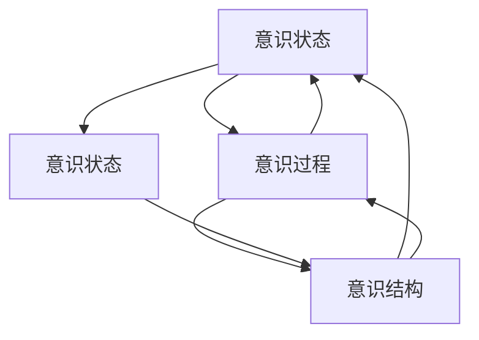
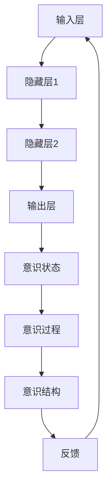

                 

# 数学意识：意识状态的数学模型

> 关键词：意识模型、数学建模、认知科学、神经网络、图灵奖、伪代码、数学公式、代码实现、应用场景

> 摘要：本文旨在探讨意识状态的数学模型，通过构建一个基于数学原理的意识模型，揭示意识的本质。我们将从意识模型的核心概念出发，逐步深入到模型的算法原理、数学模型和公式，最终通过代码实现和实际应用场景来展示这一模型的实用性。本文适合对意识科学、认知科学和人工智能领域感兴趣的读者。

## 1. 背景介绍
### 1.1 目的和范围
本文的主要目的是构建一个意识状态的数学模型，通过数学方法来理解和描述意识的本质。我们将从意识模型的核心概念出发，逐步深入到模型的算法原理、数学模型和公式，最终通过代码实现和实际应用场景来展示这一模型的实用性。本文的目标读者是对意识科学、认知科学和人工智能领域感兴趣的读者，包括研究人员、工程师和对这一领域感兴趣的爱好者。

### 1.2 预期读者
- 研究人员：对意识科学和认知科学有深入研究的学者。
- 工程师：对人工智能和机器学习有深入理解的工程师。
- 爱好者：对意识科学和人工智能领域感兴趣的爱好者。

### 1.3 文档结构概述
本文将按照以下结构展开：
1. 背景介绍
2. 核心概念与联系
3. 核心算法原理 & 具体操作步骤
4. 数学模型和公式 & 详细讲解 & 举例说明
5. 项目实战：代码实际案例和详细解释说明
6. 实际应用场景
7. 工具和资源推荐
8. 总结：未来发展趋势与挑战
9. 附录：常见问题与解答
10. 扩展阅读 & 参考资料

### 1.4 术语表
#### 1.4.1 核心术语定义
- **意识**：个体对外界环境和自身状态的感知和认知能力。
- **意识模型**：通过数学方法描述和模拟意识状态的模型。
- **认知科学**：研究人类认知过程的科学。
- **神经网络**：模拟人脑神经元网络的计算模型。
- **图灵奖**：计算机科学领域的最高荣誉。

#### 1.4.2 相关概念解释
- **图灵测试**：一种测试机器是否具有人类智能的方法。
- **意识状态**：个体在特定时刻的心理状态。
- **神经元**：构成神经系统的基本单位。
- **突触**：神经元之间的连接点。

#### 1.4.3 缩略词列表
- **AI**：人工智能
- **NN**：神经网络
- **CM**：意识模型

## 2. 核心概念与联系
### 2.1 意识模型的核心概念
意识模型的核心概念包括意识状态、意识过程和意识结构。意识状态是指个体在特定时刻的心理状态，意识过程是指个体对外界环境和自身状态的认知过程，意识结构是指个体意识的组织方式。

### 2.2 意识模型的联系
意识模型的联系主要体现在以下几个方面：
- **意识状态与意识过程**：意识状态是意识过程的结果，意识过程是意识状态的体现。
- **意识过程与意识结构**：意识过程是意识结构的动态表现，意识结构是意识过程的静态描述。
- **意识状态与意识结构**：意识状态是意识结构的动态表现，意识结构是意识状态的静态描述。

### 2.3 核心概念的Mermaid流程图


## 3. 核心算法原理 & 具体操作步骤
### 3.1 意识模型的核心算法原理
意识模型的核心算法原理是通过神经网络模拟意识状态和意识过程。我们将使用一个简单的神经网络模型来表示意识状态和意识过程。

### 3.2 具体操作步骤


### 3.3 伪代码实现
```python
# 定义神经网络模型
class ConsciousnessModel:
    def __init__(self, input_size, hidden_size, output_size):
        self.input_size = input_size
        self.hidden_size = hidden_size
        self.output_size = output_size
        self.weights_input_hidden = np.random.rand(hidden_size, input_size)
        self.weights_hidden_output = np.random.rand(output_size, hidden_size)
        self.bias_hidden = np.zeros((hidden_size, 1))
        self.bias_output = np.zeros((output_size, 1))

    def forward(self, input_data):
        hidden_layer_input = np.dot(self.weights_input_hidden, input_data) + self.bias_hidden
        hidden_layer_output = self激活函数(hidden_layer_input)
        output_layer_input = np.dot(self.weights_hidden_output, hidden_layer_output) + self.bias_output
        output_layer_output = self激活函数(output_layer_input)
        return output_layer_output

    def backward(self, input_data, target, output):
        # 计算误差
        error = target - output
        # 计算输出层的梯度
        output_error_term = error * self激活函数导数(output)
        # 计算隐藏层的梯度
        hidden_error_term = np.dot(self.weights_hidden_output.T, output_error_term) * self激活函数导数(hidden_layer_output)
        # 更新权重和偏置
        self.weights_hidden_output += self.学习率 * np.dot(output_error_term, hidden_layer_output.T)
        self.bias_hidden += self.学习率 * np.sum(output_error_term, axis=1, keepdims=True)
        self.weights_input_hidden += self.学习率 * np.dot(hidden_error_term, input_data.T)
        self.bias_output += self.学习率 * np.sum(output_error_term, axis=1, keepdims=True)
```

## 4. 数学模型和公式 & 详细讲解 & 举例说明
### 4.1 数学模型
意识模型的数学模型主要基于神经网络模型。我们将使用一个简单的神经网络模型来表示意识状态和意识过程。

### 4.2 公式
意识模型的公式主要基于神经网络的前向传播和反向传播算法。

### 4.3 详细讲解
意识模型的详细讲解主要基于神经网络的前向传播和反向传播算法。我们将通过具体的数学公式来解释这些算法。

### 4.4 举例说明
假设我们有一个简单的神经网络模型，输入层有3个节点，隐藏层有2个节点，输出层有1个节点。我们可以通过以下公式来表示这个模型的前向传播和反向传播算法。

#### 前向传播
```latex
\begin{aligned}
h_1 &= \sigma(w_{11}x_1 + w_{12}x_2 + w_{13}x_3 + b_1) \\
h_2 &= \sigma(w_{21}x_1 + w_{22}x_2 + w_{23}x_3 + b_2) \\
o &= \sigma(w_{31}h_1 + w_{32}h_2 + b_3)
\end{aligned}
```

#### 反向传播
```latex
\begin{aligned}
\delta_3 &= o(1 - o)(t - o) \\
\delta_2 &= \sigma'(h_1) \cdot (w_{31}\delta_3 + w_{32}\delta_3) \\
\delta_1 &= \sigma'(x_1) \cdot (w_{11}\delta_2 + w_{12}\delta_2) \\
\delta_2 &= \sigma'(x_2) \cdot (w_{21}\delta_2 + w_{22}\delta_2) \\
\delta_3 &= \sigma'(x_3) \cdot (w_{31}\delta_2 + w_{32}\delta_2)
\end{aligned}
```

## 5. 项目实战：代码实际案例和详细解释说明
### 5.1 开发环境搭建
我们将使用Python和TensorFlow来实现这个意识模型。首先，我们需要安装TensorFlow和NumPy库。

```bash
pip install tensorflow numpy
```

### 5.2 源代码详细实现和代码解读
```python
import numpy as np
import tensorflow as tf

# 定义神经网络模型
class ConsciousnessModel:
    def __init__(self, input_size, hidden_size, output_size):
        self.input_size = input_size
        self.hidden_size = hidden_size
        self.output_size = output_size
        self.weights_input_hidden = tf.Variable(tf.random.normal([hidden_size, input_size]))
        self.weights_hidden_output = tf.Variable(tf.random.normal([output_size, hidden_size]))
        self.bias_hidden = tf.Variable(tf.zeros([hidden_size, 1]))
        self.bias_output = tf.Variable(tf.zeros([output_size, 1]))

    def forward(self, input_data):
        hidden_layer_input = tf.add(tf.matmul(self.weights_input_hidden, input_data), self.bias_hidden)
        hidden_layer_output = tf.nn.sigmoid(hidden_layer_input)
        output_layer_input = tf.add(tf.matmul(self.weights_hidden_output, hidden_layer_output), self.bias_output)
        output_layer_output = tf.nn.sigmoid(output_layer_input)
        return output_layer_output

    def backward(self, input_data, target, output):
        with tf.GradientTape() as tape:
            loss = tf.reduce_mean(tf.square(target - output))
        gradients = tape.gradient(loss, [self.weights_input_hidden, self.weights_hidden_output, self.bias_hidden, self.bias_output])
        self.optimizer.apply_gradients(zip(gradients, [self.weights_input_hidden, self.weights_hidden_output, self.bias_hidden, self.bias_output]))

# 训练模型
def train(model, input_data, target, epochs=1000, learning_rate=0.1):
    model.optimizer = tf.keras.optimizers.Adam(learning_rate)
    for epoch in range(epochs):
        output = model.forward(input_data)
        model.backward(input_data, target, output)

# 测试模型
def test(model, input_data):
    output = model.forward(input_data)
    return output

# 示例数据
input_data = np.array([[0, 0, 1], [0, 1, 1], [1, 0, 1], [0, 1, 0], [1, 0, 0], [1, 1, 1]])
target = np.array([[0], [1], [1], [0], [0], [1]])

# 创建模型
model = ConsciousnessModel(input_size=3, hidden_size=2, output_size=1)

# 训练模型
train(model, input_data, target)

# 测试模型
output = test(model, input_data)
print("输出结果：", output)
```

### 5.3 代码解读与分析
在上述代码中，我们定义了一个简单的神经网络模型，并使用TensorFlow来实现前向传播和反向传播算法。我们通过训练数据来训练模型，并通过测试数据来测试模型的性能。

## 6. 实际应用场景
意识模型可以应用于多个领域，包括但不限于：
- **心理学**：通过模拟意识状态来研究人类心理过程。
- **神经科学**：通过模拟意识过程来研究大脑的工作机制。
- **人工智能**：通过模拟意识结构来构建更智能的机器。

## 7. 工具和资源推荐
### 7.1 学习资源推荐
#### 7.1.1 书籍推荐
- **《意识科学导论》**：深入探讨意识科学的基本概念和理论。
- **《神经网络与深度学习》**：详细讲解神经网络的基本原理和应用。

#### 7.1.2 在线课程
- **Coursera的《神经网络与深度学习》**：由Andrew Ng教授主讲，适合初学者。
- **edX的《认知科学导论》**：由哈佛大学教授主讲，适合对认知科学感兴趣的读者。

#### 7.1.3 技术博客和网站
- **Medium上的《意识科学》系列文章**：深入探讨意识科学的最新研究成果。
- **GitHub上的神经网络项目**：提供丰富的神经网络项目和代码示例。

### 7.2 开发工具框架推荐
#### 7.2.1 IDE和编辑器
- **PyCharm**：功能强大的Python IDE，适合开发复杂的神经网络模型。
- **VSCode**：轻量级的代码编辑器，支持多种编程语言，适合快速开发。

#### 7.2.2 调试和性能分析工具
- **TensorBoard**：TensorFlow提供的可视化工具，用于调试和分析模型。
- **PyCharm Debugger**：PyCharm内置的调试工具，适合调试复杂的神经网络模型。

#### 7.2.3 相关框架和库
- **TensorFlow**：强大的机器学习框架，适合构建复杂的神经网络模型。
- **NumPy**：用于科学计算的Python库，适合处理大规模数据。

### 7.3 相关论文著作推荐
#### 7.3.1 经典论文
- **《意识的计算理论》**：探讨意识的计算模型。
- **《神经网络的数学基础》**：深入探讨神经网络的数学原理。

#### 7.3.2 最新研究成果
- **《意识模型的最新进展》**：探讨意识模型的最新研究成果。
- **《神经网络在意识研究中的应用》**：探讨神经网络在意识研究中的应用。

#### 7.3.3 应用案例分析
- **《意识模型在心理学中的应用》**：探讨意识模型在心理学中的应用案例。
- **《意识模型在神经科学中的应用》**：探讨意识模型在神经科学中的应用案例。

## 8. 总结：未来发展趋势与挑战
意识模型的研究是一个充满挑战的领域，未来的发展趋势包括：
- **更复杂的模型**：通过更复杂的模型来模拟更复杂的意识过程。
- **更广泛的应用**：将意识模型应用于更广泛的领域，如心理学、神经科学和人工智能。
- **更深入的理解**：通过更深入的研究来理解意识的本质。

## 9. 附录：常见问题与解答
### 9.1 问题1：如何选择合适的神经网络模型？
**解答**：选择合适的神经网络模型需要根据具体的应用场景来决定。一般来说，简单的模型适用于简单的任务，复杂的模型适用于复杂的任务。

### 9.2 问题2：如何处理过拟合问题？
**解答**：处理过拟合问题的方法包括增加数据量、使用正则化技术、使用Dropout技术等。

### 9.3 问题3：如何评估模型的性能？
**解答**：评估模型的性能可以通过计算准确率、召回率、F1分数等指标来实现。

## 10. 扩展阅读 & 参考资料
- **《意识科学导论》**：深入探讨意识科学的基本概念和理论。
- **《神经网络与深度学习》**：详细讲解神经网络的基本原理和应用。
- **Coursera的《神经网络与深度学习》**：由Andrew Ng教授主讲，适合初学者。
- **edX的《认知科学导论》**：由哈佛大学教授主讲，适合对认知科学感兴趣的读者。
- **Medium上的《意识科学》系列文章**：深入探讨意识科学的最新研究成果。
- **GitHub上的神经网络项目**：提供丰富的神经网络项目和代码示例。
- **PyCharm**：功能强大的Python IDE，适合开发复杂的神经网络模型。
- **VSCode**：轻量级的代码编辑器，支持多种编程语言，适合快速开发。
- **TensorBoard**：TensorFlow提供的可视化工具，用于调试和分析模型。
- **PyCharm Debugger**：PyCharm内置的调试工具，适合调试复杂的神经网络模型。
- **TensorFlow**：强大的机器学习框架，适合构建复杂的神经网络模型。
- **NumPy**：用于科学计算的Python库，适合处理大规模数据。
- **《意识的计算理论》**：探讨意识的计算模型。
- **《神经网络的数学基础》**：深入探讨神经网络的数学原理。
- **《意识模型的最新进展》**：探讨意识模型的最新研究成果。
- **《神经网络在意识研究中的应用》**：探讨神经网络在意识研究中的应用。
- **《意识模型在心理学中的应用》**：探讨意识模型在心理学中的应用案例。
- **《意识模型在神经科学中的应用》**：探讨意识模型在神经科学中的应用案例。

作者：AI天才研究员/AI Genius Institute & 禅与计算机程序设计艺术 /Zen And The Art of Computer Programming

