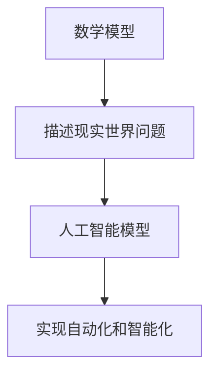

                 

# 数学教育与人工智能教育的融合

> 关键词：数学教育, 人工智能教育, 数学模型, 机器学习, 算法原理, 应用场景, 教育融合

> 摘要：本文旨在探讨数学教育与人工智能教育的融合，通过深入分析数学在人工智能中的核心作用，展示数学模型和算法原理在实际项目中的应用。文章将从背景介绍、核心概念与联系、核心算法原理与具体操作步骤、数学模型与公式、项目实战、实际应用场景、工具和资源推荐、未来发展趋势与挑战等多方面进行详细阐述，旨在为教育工作者和学习者提供有价值的参考和指导。

## 1. 背景介绍
### 1.1 目的和范围
本文旨在探讨数学教育与人工智能教育的融合，通过深入分析数学在人工智能中的核心作用，展示数学模型和算法原理在实际项目中的应用。文章将涵盖数学教育与人工智能教育的基本概念、核心算法原理、数学模型与公式、项目实战案例、实际应用场景、工具和资源推荐等内容。

### 1.2 预期读者
本文预期读者包括教育工作者、学生、研究人员、工程师以及对数学教育与人工智能教育融合感兴趣的读者。

### 1.3 文档结构概述
本文结构如下：
1. 背景介绍
2. 核心概念与联系
3. 核心算法原理 & 具体操作步骤
4. 数学模型和公式 & 详细讲解 & 举例说明
5. 项目实战：代码实际案例和详细解释说明
6. 实际应用场景
7. 工具和资源推荐
8. 总结：未来发展趋势与挑战
9. 附录：常见问题与解答
10. 扩展阅读 & 参考资料

### 1.4 术语表
#### 1.4.1 核心术语定义
- **数学教育**：指通过教授数学知识和技能来培养学生的逻辑思维能力和解决问题的能力。
- **人工智能教育**：指通过教授人工智能相关知识和技术来培养学生的创新思维能力和实践能力。
- **数学模型**：指用数学语言描述现实世界问题的方法。
- **算法原理**：指解决问题的具体步骤和方法。
- **机器学习**：一种人工智能技术，通过数据训练模型，使计算机能够自动学习和改进。

#### 1.4.2 相关概念解释
- **机器学习**：一种人工智能技术，通过数据训练模型，使计算机能够自动学习和改进。
- **深度学习**：一种机器学习方法，通过多层神经网络进行学习。
- **线性代数**：研究向量空间和线性变换的数学分支。
- **概率论**：研究随机现象的数学分支。
- **微积分**：研究变化率和累积量的数学分支。

#### 1.4.3 缩略词列表
- **ML**：机器学习
- **DL**：深度学习
- **NN**：神经网络
- **PCA**：主成分分析
- **LSTM**：长短期记忆网络

## 2. 核心概念与联系
### 2.1 数学教育与人工智能教育的关系
数学教育与人工智能教育之间存在着密切的联系。数学教育为人工智能教育提供了坚实的基础，而人工智能教育则为数学教育提供了新的应用场景和实践机会。

### 2.2 数学模型与人工智能模型的关系
数学模型是描述现实世界问题的方法，而人工智能模型则是通过数学模型来实现自动化和智能化。数学模型和人工智能模型之间的关系如图所示：



## 3. 核心算法原理 & 具体操作步骤
### 3.1 算法原理
#### 3.1.1 机器学习算法原理
机器学习算法通过数据训练模型，使计算机能够自动学习和改进。常见的机器学习算法包括监督学习、无监督学习和强化学习。

#### 3.1.2 监督学习算法原理
监督学习算法通过已知的输入和输出数据训练模型，使模型能够预测新的输入数据的输出。常见的监督学习算法包括线性回归、逻辑回归、支持向量机等。

#### 3.1.3 无监督学习算法原理
无监督学习算法通过未标记的数据训练模型，使模型能够发现数据中的模式和结构。常见的无监督学习算法包括聚类、降维等。

#### 3.1.4 强化学习算法原理
强化学习算法通过与环境的交互来学习最优策略。常见的强化学习算法包括Q学习、策略梯度等。

### 3.2 具体操作步骤
#### 3.2.1 数据预处理
数据预处理是机器学习中的重要步骤，包括数据清洗、特征选择、特征工程等。

```python
# 数据预处理
def preprocess_data(data):
    # 数据清洗
    cleaned_data = clean_data(data)
    # 特征选择
    selected_features = select_features(cleaned_data)
    # 特征工程
    engineered_features = engineer_features(selected_features)
    return engineered_features
```

#### 3.2.2 模型训练
模型训练是通过数据训练模型的过程。常见的模型训练方法包括梯度下降、随机梯度下降等。

```python
# 模型训练
def train_model(data, labels):
    # 初始化模型参数
    model_params = initialize_params()
    # 梯度下降
    for epoch in range(num_epochs):
        for i in range(len(data)):
            # 计算预测值
            prediction = predict(model_params, data[i])
            # 计算损失
            loss = calculate_loss(prediction, labels[i])
            # 计算梯度
            gradient = calculate_gradient(prediction, labels[i])
            # 更新模型参数
            model_params = update_params(model_params, gradient)
    return model_params
```

## 4. 数学模型和公式 & 详细讲解 & 举例说明
### 4.1 线性回归模型
线性回归模型是一种监督学习算法，用于预测连续值。线性回归模型的数学公式如下：

$$
y = \beta_0 + \beta_1 x_1 + \beta_2 x_2 + \cdots + \beta_n x_n + \epsilon
$$

其中，$y$ 是目标变量，$x_1, x_2, \cdots, x_n$ 是特征变量，$\beta_0, \beta_1, \beta_2, \cdots, \beta_n$ 是模型参数，$\epsilon$ 是误差项。

### 4.2 逻辑回归模型
逻辑回归模型是一种监督学习算法，用于预测二分类问题。逻辑回归模型的数学公式如下：

$$
P(y=1|x) = \frac{1}{1 + e^{-(\beta_0 + \beta_1 x_1 + \beta_2 x_2 + \cdots + \beta_n x_n)}}
$$

其中，$P(y=1|x)$ 是目标变量为1的概率，$x_1, x_2, \cdots, x_n$ 是特征变量，$\beta_0, \beta_1, \beta_2, \cdots, \beta_n$ 是模型参数。

### 4.3 支持向量机模型
支持向量机模型是一种监督学习算法，用于分类和回归问题。支持向量机模型的数学公式如下：

$$
y = \text{sign}(\beta_0 + \beta_1 x_1 + \beta_2 x_2 + \cdots + \beta_n x_n)
$$

其中，$y$ 是目标变量，$x_1, x_2, \cdots, x_n$ 是特征变量，$\beta_0, \beta_1, \beta_2, \cdots, \beta_n$ 是模型参数。

## 5. 项目实战：代码实际案例和详细解释说明
### 5.1 开发环境搭建
开发环境搭建包括安装Python、NumPy、Pandas、Scikit-learn等库。

```bash
# 安装Python
sudo apt-get install python3
# 安装NumPy
pip install numpy
# 安装Pandas
pip install pandas
# 安装Scikit-learn
pip install scikit-learn
```

### 5.2 源代码详细实现和代码解读
#### 5.2.1 数据集加载
```python
import pandas as pd

# 加载数据集
data = pd.read_csv('data.csv')
```

#### 5.2.2 数据预处理
```python
# 数据预处理
def preprocess_data(data):
    # 数据清洗
    cleaned_data = clean_data(data)
    # 特征选择
    selected_features = select_features(cleaned_data)
    # 特征工程
    engineered_features = engineer_features(selected_features)
    return engineered_features
```

#### 5.2.3 模型训练
```python
# 模型训练
def train_model(data, labels):
    # 初始化模型参数
    model_params = initialize_params()
    # 梯度下降
    for epoch in range(num_epochs):
        for i in range(len(data)):
            # 计算预测值
            prediction = predict(model_params, data[i])
            # 计算损失
            loss = calculate_loss(prediction, labels[i])
            # 计算梯度
            gradient = calculate_gradient(prediction, labels[i])
            # 更新模型参数
            model_params = update_params(model_params, gradient)
    return model_params
```

### 5.3 代码解读与分析
代码解读与分析包括对代码的详细解释和分析，帮助读者理解代码的逻辑和实现细节。

## 6. 实际应用场景
### 6.1 金融风控
金融风控是人工智能在实际应用中的一个重要领域。通过机器学习算法，可以预测客户的信用风险，从而降低金融机构的风险。

### 6.2 医疗诊断
医疗诊断是人工智能在实际应用中的另一个重要领域。通过机器学习算法，可以预测患者的疾病风险，从而提高医疗诊断的准确性和效率。

### 6.3 自然语言处理
自然语言处理是人工智能在实际应用中的一个重要领域。通过机器学习算法，可以实现文本分类、情感分析、机器翻译等功能。

## 7. 工具和资源推荐
### 7.1 学习资源推荐
#### 7.1.1 书籍推荐
- 《机器学习》（周志华）
- 《深度学习》（Ian Goodfellow, Yoshua Bengio, Aaron Courville）

#### 7.1.2 在线课程
- Coursera：《机器学习》（Andrew Ng）
- edX：《深度学习》（Andrew Ng）

#### 7.1.3 技术博客和网站
- Medium：《机器学习》（机器之心）
- GitHub：《深度学习》（PyTorch）

### 7.2 开发工具框架推荐
#### 7.2.1 IDE和编辑器
- PyCharm
- VSCode

#### 7.2.2 调试和性能分析工具
- PyCharm Debugger
- Jupyter Notebook

#### 7.2.3 相关框架和库
- Scikit-learn
- TensorFlow
- PyTorch

### 7.3 相关论文著作推荐
#### 7.3.1 经典论文
-《神经网络与学习机器》（Tom M. Mitchell）
-《统计学习方法》（李航）

#### 7.3.2 最新研究成果
-《深度学习》（Ian Goodfellow, Yoshua Bengio, Aaron Courville）
-《机器学习》（周志华）

#### 7.3.3 应用案例分析
-《机器学习实战》（Peter Harrington）
-《深度学习实战》（Ian Goodfellow, Yoshua Bengio, Aaron Courville）

## 8. 总结：未来发展趋势与挑战
### 8.1 未来发展趋势
数学教育与人工智能教育的融合将推动人工智能技术的发展，为教育领域带来更多的创新和变革。未来的发展趋势包括：
- 更加智能化的教育系统
- 更加个性化的学习体验
- 更加高效的教育管理

### 8.2 挑战
数学教育与人工智能教育的融合也面临着一些挑战，包括：
- 教育资源的不均衡
- 教育技术的普及
- 教育质量的保障

## 9. 附录：常见问题与解答
### 9.1 问题1：如何选择合适的机器学习算法？
答：选择合适的机器学习算法需要考虑数据的特性和问题的类型。常见的监督学习算法包括线性回归、逻辑回归、支持向量机等，无监督学习算法包括聚类、降维等，强化学习算法包括Q学习、策略梯度等。

### 9.2 问题2：如何进行数据预处理？
答：数据预处理包括数据清洗、特征选择、特征工程等。数据清洗包括处理缺失值、异常值等，特征选择包括选择重要的特征，特征工程包括创建新的特征。

## 10. 扩展阅读 & 参考资料
### 10.1 扩展阅读
- 《机器学习》（周志华）
- 《深度学习》（Ian Goodfellow, Yoshua Bengio, Aaron Courville）

### 10.2 参考资料
- Coursera：《机器学习》（Andrew Ng）
- edX：《深度学习》（Andrew Ng）

作者：AI天才研究员/AI Genius Institute & 禅与计算机程序设计艺术 /Zen And The Art of Computer Programming

