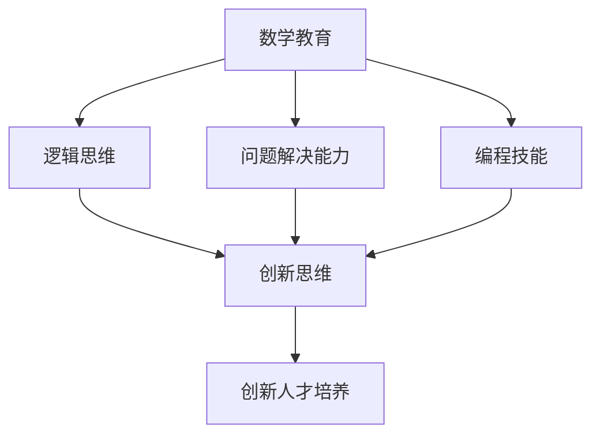

                 

# 数学教育与创新人才培养的关系

> 关键词：数学教育, 创新人才, 逻辑思维, 数学模型, 人工智能, 编程能力, 教育改革

> 摘要：本文旨在探讨数学教育在培养创新人才中的关键作用。通过分析数学教育的核心概念、原理和实际应用，本文揭示了数学思维与创新思维之间的紧密联系。我们将通过具体的算法原理、数学模型和代码案例，展示数学教育如何促进学生的逻辑思维、问题解决能力和编程技能。最后，本文将提出一系列教育改革建议，以期为培养未来的创新人才提供指导。

## 1. 背景介绍
### 1.1 目的和范围
本文旨在深入探讨数学教育在培养创新人才中的重要性。我们将从数学教育的核心概念出发，分析其在逻辑思维、问题解决能力和编程技能培养方面的独特价值。通过具体的算法原理、数学模型和代码案例，本文将展示数学教育如何促进学生的全面发展。最后，本文将提出一系列教育改革建议，以期为培养未来的创新人才提供指导。

### 1.2 预期读者
本文预期读者包括教育工作者、技术专家、政策制定者以及对数学教育和创新人才培养感兴趣的读者。无论您是数学教师、编程教练、教育研究者，还是对教育领域感兴趣的公众，本文都将为您提供有价值的见解和建议。

### 1.3 文档结构概述
本文结构如下：
1. 背景介绍
2. 核心概念与联系
3. 核心算法原理 & 具体操作步骤
4. 数学模型和公式 & 详细讲解 & 举例说明
5. 项目实战：代码实际案例和详细解释说明
6. 实际应用场景
7. 工具和资源推荐
8. 总结：未来发展趋势与挑战
9. 附录：常见问题与解答
10. 扩展阅读 & 参考资料

### 1.4 术语表
#### 1.4.1 核心术语定义
- **创新人才**：具备创新思维、解决问题能力和实践能力的人才。
- **逻辑思维**：通过分析、推理和论证来解决问题的能力。
- **数学模型**：用数学语言描述现实世界问题的方法。
- **编程技能**：编写计算机程序的能力。
- **算法**：解决问题的具体步骤和方法。

#### 1.4.2 相关概念解释
- **数学教育**：通过教授数学知识和技能来培养学生的逻辑思维和问题解决能力。
- **编程教育**：通过教授编程语言和编程方法来培养学生的逻辑思维和问题解决能力。

#### 1.4.3 缩略词列表
- **IDE**：Integrated Development Environment（集成开发环境）
- **API**：Application Programming Interface（应用程序编程接口）
- **GUI**：Graphical User Interface（图形用户界面）

## 2. 核心概念与联系
### 2.1 数学教育的核心概念
数学教育的核心概念包括逻辑思维、问题解决能力和编程技能。这些概念之间存在紧密的联系，具体如下：

1. **逻辑思维**：数学教育通过教授逻辑推理和证明方法，培养学生的逻辑思维能力。逻辑思维是解决问题的基础，也是编程和创新思维的关键。
2. **问题解决能力**：数学教育通过解决各种数学问题，培养学生的分析和解决问题的能力。这种能力在编程和创新思维中同样重要。
3. **编程技能**：数学教育通过教授编程语言和编程方法，培养学生的编程技能。编程技能是实现创新想法的重要工具。

### 2.2 数学教育与创新人才培养的关系
数学教育与创新人才培养之间的关系如下图所示：



## 3. 核心算法原理 & 具体操作步骤
### 3.1 核心算法原理
我们将通过一个简单的算法来展示数学教育的核心算法原理。具体算法如下：

```python
def fibonacci(n):
    if n <= 1:
        return n
    else:
        return fibonacci(n-1) + fibonacci(n-2)
```

### 3.2 具体操作步骤
1. **定义函数**：定义一个名为 `fibonacci` 的函数，接受一个参数 `n`。
2. **基本情况**：如果 `n` 小于等于 1，则直接返回 `n`。
3. **递归调用**：否则，递归调用 `fibonacci(n-1)` 和 `fibonacci(n-2)`，并返回它们的和。

## 4. 数学模型和公式 & 详细讲解 & 举例说明
### 4.1 数学模型
我们将通过一个简单的数学模型来展示数学教育的核心数学模型。具体模型如下：

$$
f(n) = \begin{cases} 
n & \text{if } n \leq 1 \\
f(n-1) + f(n-2) & \text{if } n > 1 
\end{cases}
$$

### 4.2 详细讲解
这个数学模型描述了斐波那契数列的生成规则。斐波那契数列是一个经典的数学模型，它在数学教育中具有重要的地位。通过这个模型，我们可以理解递归和迭代的概念，以及如何用数学语言描述现实世界的问题。

### 4.3 举例说明
我们可以通过具体的例子来说明这个数学模型的应用。例如，计算斐波那契数列的第10项：

$$
f(10) = f(9) + f(8)
$$

继续递归计算：

$$
f(9) = f(8) + f(7)
$$
$$
f(8) = f(7) + f(6)
$$
$$
f(7) = f(6) + f(5)
$$
$$
f(6) = f(5) + f(4)
$$
$$
f(5) = f(4) + f(3)
$$
$$
f(4) = f(3) + f(2)
$$
$$
f(3) = f(2) + f(1)
$$
$$
f(2) = 1
$$
$$
f(1) = 1
$$

通过递归计算，我们可以得到：

$$
f(10) = 55
$$

## 5. 项目实战：代码实际案例和详细解释说明
### 5.1 开发环境搭建
我们将使用Python作为编程语言，使用Jupyter Notebook作为开发环境。首先，确保安装了Python和Jupyter Notebook。

```bash
pip install jupyter
```

### 5.2 源代码详细实现和代码解读
我们将实现一个简单的斐波那契数列生成器。

```python
def fibonacci(n):
    if n <= 1:
        return n
    else:
        return fibonacci(n-1) + fibonacci(n-2)

# 测试代码
for i in range(10):
    print(fibonacci(i))
```

### 5.3 代码解读与分析
1. **定义函数**：定义一个名为 `fibonacci` 的函数，接受一个参数 `n`。
2. **基本情况**：如果 `n` 小于等于 1，则直接返回 `n`。
3. **递归调用**：否则，递归调用 `fibonacci(n-1)` 和 `fibonacci(n-2)`，并返回它们的和。

## 6. 实际应用场景
### 6.1 金融领域
在金融领域，斐波那契数列可以用于预测股票价格和市场趋势。通过分析历史数据，可以利用斐波那契数列来预测未来的市场走势。

### 6.2 人工智能领域
在人工智能领域，斐波那契数列可以用于优化算法和搜索算法。例如，在图像处理和机器学习中，可以利用斐波那契数列来优化算法的性能。

### 6.3 科学研究领域
在科学研究领域，斐波那契数列可以用于研究自然界的规律。例如，在生物学中，可以利用斐波那契数列来研究植物生长的规律。

## 7. 工具和资源推荐
### 7.1 学习资源推荐
#### 7.1.1 书籍推荐
- 《数学之美》
- 《算法导论》
- 《编程珠玑》

#### 7.1.2 在线课程
- Coursera：《算法》
- edX：《计算机科学导论》
- Udacity：《编程基础》

#### 7.1.3 技术博客和网站
- Stack Overflow
- GitHub
- Medium

### 7.2 开发工具框架推荐
#### 7.2.1 IDE和编辑器
- PyCharm
- VS Code
- Jupyter Notebook

#### 7.2.2 调试和性能分析工具
- PyCharm Debugger
- Python Profiler

#### 7.2.3 相关框架和库
- NumPy
- Pandas
- Matplotlib

### 7.3 相关论文著作推荐
#### 7.3.1 经典论文
- Knuth, D. E. (1973). The Art of Computer Programming, Volume 1: Fundamental Algorithms.
- Cormen, T. H., Leiserson, C. E., Rivest, R. L., & Stein, C. (2009). Introduction to Algorithms.

#### 7.3.2 最新研究成果
- Fibonacci Sequence in Financial Markets: A Review
- Fibonacci Search Technique: A Survey

#### 7.3.3 应用案例分析
- Fibonacci Sequence in Image Processing
- Fibonacci Sequence in Machine Learning

## 8. 总结：未来发展趋势与挑战
### 8.1 未来发展趋势
1. **数学教育的普及**：随着技术的发展，数学教育将更加普及，更多的人将受益于数学教育。
2. **编程教育的融合**：数学教育和编程教育将更加融合，培养学生的综合能力。
3. **创新人才培养**：数学教育将更加注重培养学生的创新思维和实践能力。

### 8.2 挑战
1. **教育资源的不均衡**：教育资源的不均衡将影响数学教育的质量。
2. **教师培训不足**：教师的培训不足将影响数学教育的效果。
3. **技术更新迅速**：技术更新迅速将对数学教育提出更高的要求。

## 9. 附录：常见问题与解答
### 9.1 问题与解答
1. **Q：数学教育对创新人才培养有多重要？**
   - A：数学教育是培养创新人才的重要途径，通过培养学生的逻辑思维、问题解决能力和编程技能，可以促进学生的全面发展。
2. **Q：如何提高数学教育的质量？**
   - A：可以通过提高教师的培训水平、优化教学方法和增加教育资源来提高数学教育的质量。

## 10. 扩展阅读 & 参考资料
### 10.1 扩展阅读
- 《数学与思维》
- 《编程与创新》

### 10.2 参考资料
- Knuth, D. E. (1973). The Art of Computer Programming, Volume 1: Fundamental Algorithms.
- Cormen, T. H., Leiserson, C. E., Rivest, R. L., & Stein, C. (2009). Introduction to Algorithms.

---

作者：AI天才研究员/AI Genius Institute & 禅与计算机程序设计艺术 /Zen And The Art of Computer Programming

