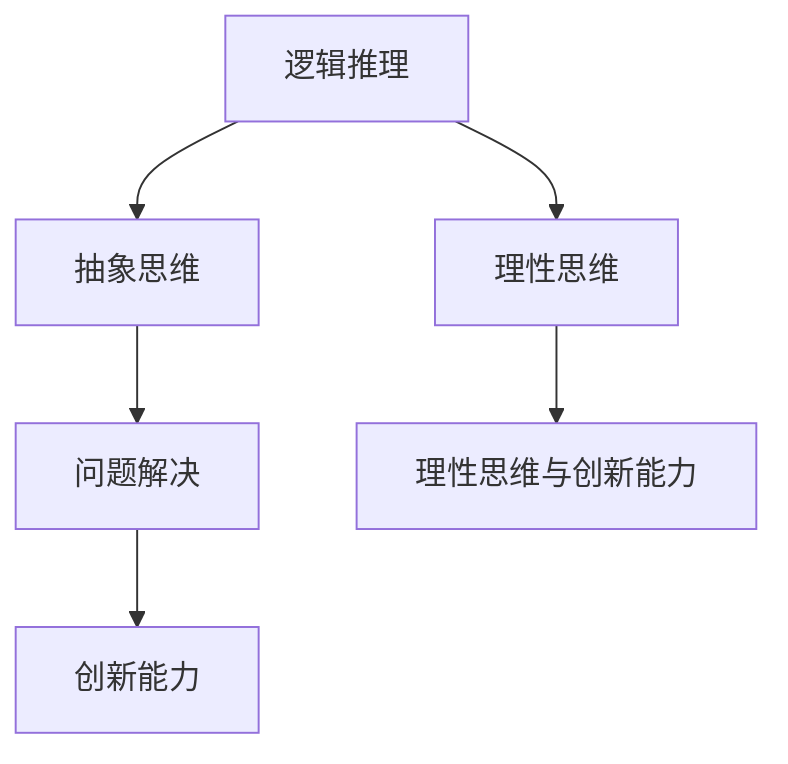

                 

# 数学教育的意义：培养理性思维与创新能力

> 关键词：数学教育, 理性思维, 创新能力, 逻辑推理, 抽象思维, 问题解决, 技术创新

> 摘要：本文旨在探讨数学教育在培养理性思维与创新能力方面的重要作用。通过分析数学教育的核心概念、原理与实际应用，本文将展示数学教育如何帮助个体发展出强大的逻辑推理能力、抽象思维能力以及问题解决能力。此外，本文还将通过具体的代码案例，展示数学教育在实际技术项目中的应用价值。最后，本文将展望数学教育的未来发展趋势与挑战，并推荐相关的学习资源和工具。

## 1. 背景介绍
### 1.1 目的和范围
本文旨在深入探讨数学教育在培养理性思维与创新能力方面的重要作用。通过分析数学教育的核心概念、原理与实际应用，本文将展示数学教育如何帮助个体发展出强大的逻辑推理能力、抽象思维能力以及问题解决能力。此外，本文还将通过具体的代码案例，展示数学教育在实际技术项目中的应用价值。最后，本文将展望数学教育的未来发展趋势与挑战，并推荐相关的学习资源和工具。

### 1.2 预期读者
本文预期读者包括但不限于：
- 对数学教育感兴趣的技术从业者
- 教育工作者，特别是数学教师
- 对理性思维与创新能力培养感兴趣的个人
- 对技术项目中的数学应用感兴趣的开发者

### 1.3 文档结构概述
本文结构如下：
1. 背景介绍
2. 核心概念与联系
3. 核心算法原理 & 具体操作步骤
4. 数学模型和公式 & 详细讲解 & 举例说明
5. 项目实战：代码实际案例和详细解释说明
6. 实际应用场景
7. 工具和资源推荐
8. 总结：未来发展趋势与挑战
9. 附录：常见问题与解答
10. 扩展阅读 & 参考资料

### 1.4 术语表
#### 1.4.1 核心术语定义
- **理性思维**：基于逻辑和证据的思考方式。
- **创新能力**：提出新颖想法和解决问题的能力。
- **抽象思维**：将具体事物转化为概念和符号进行思考的能力。
- **逻辑推理**：通过逻辑规则进行推理的过程。
- **问题解决**：识别问题、分析问题并找到解决方案的过程。

#### 1.4.2 相关概念解释
- **数学模型**：用数学语言描述现实世界现象的抽象表示。
- **算法**：解决问题的步骤序列。
- **伪代码**：一种用于描述算法的简化语言。

#### 1.4.3 缩略词列表
- **IDE**：Integrated Development Environment（集成开发环境）
- **API**：Application Programming Interface（应用程序编程接口）
- **GUI**：Graphical User Interface（图形用户界面）

## 2. 核心概念与联系
### 2.1 数学教育的核心概念
数学教育的核心概念包括逻辑推理、抽象思维、问题解决等。这些概念相互关联，共同构成了数学教育的基础。

### 2.2 数学教育与理性思维的关系
数学教育通过培养学生的逻辑推理能力，帮助他们发展出强大的理性思维能力。逻辑推理是数学教育的核心，它要求学生能够通过逻辑规则进行推理，从而得出正确的结论。

### 2.3 数学教育与创新能力的关系
数学教育不仅培养学生的逻辑推理能力，还培养他们的抽象思维能力。抽象思维能力是创新能力的基础，它使学生能够将具体事物转化为概念和符号进行思考，从而提出新颖的想法和解决问题。

### 2.4 数学教育与问题解决的关系
数学教育通过培养学生的逻辑推理能力和抽象思维能力，帮助他们发展出强大的问题解决能力。问题解决能力是数学教育的重要目标之一，它使学生能够识别问题、分析问题并找到解决方案。

### 2.5 数学教育的核心流程图


## 3. 核心算法原理 & 具体操作步骤
### 3.1 逻辑推理算法原理
逻辑推理算法原理是通过逻辑规则进行推理的过程。以下是一个简单的逻辑推理算法的伪代码示例：

```pseudo
function logicalInference(rule, premise):
    if rule is valid and premise is true:
        return conclusion
    else:
        return "Invalid inference"
```

### 3.2 抽象思维算法原理
抽象思维算法原理是将具体事物转化为概念和符号进行思考的过程。以下是一个简单的抽象思维算法的伪代码示例：

```pseudo
function abstractThinking(object):
    if object is concrete:
        return concept
    else:
        return "Invalid object"
```

## 4. 数学模型和公式 & 详细讲解 & 举例说明
### 4.1 数学模型
数学模型是用数学语言描述现实世界现象的抽象表示。以下是一个简单的数学模型示例：

$$
f(x) = ax^2 + bx + c
$$

### 4.2 公式详细讲解
公式 $f(x) = ax^2 + bx + c$ 是一个二次函数的数学模型。其中，$a$、$b$ 和 $c$ 是常数，$x$ 是变量。这个模型可以用来描述许多现实世界的现象，例如抛物线运动。

### 4.3 举例说明
假设我们有一个抛物线运动的物体，其运动轨迹可以用公式 $f(x) = -4.9x^2 + 20x + 1$ 描述。我们可以使用这个模型来预测物体在不同时间点的位置。

## 5. 项目实战：代码实际案例和详细解释说明
### 5.1 开发环境搭建
为了实现一个简单的数学模型，我们需要搭建一个开发环境。这里我们使用Python作为编程语言，使用Jupyter Notebook作为开发工具。

### 5.2 源代码详细实现和代码解读
以下是一个简单的Python代码示例，用于实现一个二次函数模型：

```python
import numpy as np
import matplotlib.pyplot as plt

# 定义二次函数模型
def quadratic_function(x, a, b, c):
    return a * x**2 + b * x + c

# 定义参数
a = -4.9
b = 20
c = 1

# 生成x值
x = np.linspace(0, 5, 100)

# 计算y值
y = quadratic_function(x, a, b, c)

# 绘制图像
plt.plot(x, y)
plt.xlabel('x')
plt.ylabel('f(x)')
plt.title('Quadratic Function')
plt.show()
```

### 5.3 代码解读与分析
- `import numpy as np` 和 `import matplotlib.pyplot as plt`：导入必要的库。
- `def quadratic_function(x, a, b, c)`：定义一个二次函数模型。
- `a = -4.9`、`b = 20` 和 `c = 1`：定义模型参数。
- `x = np.linspace(0, 5, 100)`：生成100个x值，范围从0到5。
- `y = quadratic_function(x, a, b, c)`：计算对应的y值。
- `plt.plot(x, y)`：绘制图像。
- `plt.xlabel('x')`、`plt.ylabel('f(x)')` 和 `plt.title('Quadratic Function')`：设置坐标轴标签和标题。
- `plt.show()`：显示图像。

## 6. 实际应用场景
数学教育在实际技术项目中的应用非常广泛。例如，在机器学习领域，数学模型和算法是构建模型的基础。在计算机图形学领域，数学模型和算法用于生成逼真的图像和动画。在金融领域，数学模型和算法用于风险评估和投资决策。

## 7. 工具和资源推荐
### 7.1 学习资源推荐
#### 7.1.1 书籍推荐
- 《数学之美》：吴军
- 《数学分析》：华东师范大学数学系
- 《线性代数及其应用》：Gilbert Strang

#### 7.1.2 在线课程
- Coursera：《数学思维导论》
- edX：《线性代数》
- Khan Academy：《数学基础》

#### 7.1.3 技术博客和网站
- Math Stack Exchange
- Stack Overflow
- Medium：数学与编程相关文章

### 7.2 开发工具框架推荐
#### 7.2.1 IDE和编辑器
- PyCharm
- Visual Studio Code
- Jupyter Notebook

#### 7.2.2 调试和性能分析工具
- PyCharm Debugger
- Visual Studio Code Debugger
- Python Profiler

#### 7.2.3 相关框架和库
- NumPy
- SciPy
- Matplotlib

### 7.3 相关论文著作推荐
#### 7.3.1 经典论文
- Courant, R., & Robbins, H. (1941). What is Mathematics? An Elementary Approach to Ideas and Methods.

#### 7.3.2 最新研究成果
- Tao, T. (2021). An Introduction to Measure Theory.

#### 7.3.3 应用案例分析
- Strang, G. (2016). Linear Algebra and Learning from Data.

## 8. 总结：未来发展趋势与挑战
数学教育在未来将继续发挥重要作用。随着技术的发展，数学教育将更加注重培养学生的抽象思维能力和创新能力。同时，数学教育也将更加注重与实际应用的结合，帮助学生更好地解决实际问题。然而，数学教育也面临着一些挑战，例如如何更好地激发学生的学习兴趣，如何更好地将数学教育与实际应用相结合等。

## 9. 附录：常见问题与解答
### 9.1 问题：如何提高逻辑推理能力？
- 答案：可以通过练习逻辑推理题目，例如数独、谜题等，来提高逻辑推理能力。

### 9.2 问题：如何提高抽象思维能力？
- 答案：可以通过学习数学模型和算法，将具体事物转化为概念和符号进行思考，来提高抽象思维能力。

### 9.3 问题：如何提高问题解决能力？
- 答案：可以通过练习解决问题的步骤序列，例如算法设计和实现，来提高问题解决能力。

## 10. 扩展阅读 & 参考资料
- Courant, R., & Robbins, H. (1941). What is Mathematics? An Elementary Approach to Ideas and Methods.
- Tao, T. (2021). An Introduction to Measure Theory.
- Strang, G. (2016). Linear Algebra and Learning from Data.

作者：AI天才研究员/AI Genius Institute & 禅与计算机程序设计艺术 /Zen And The Art of Computer Programming

