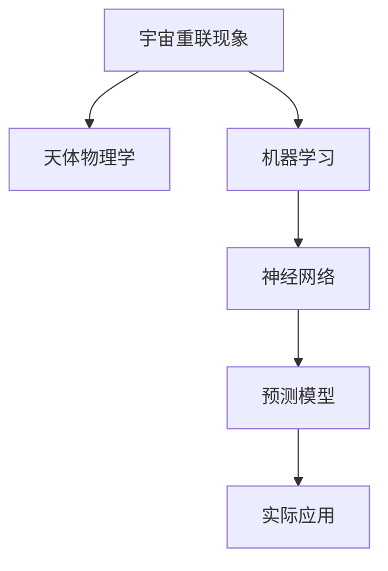

                 

# 数学模型在预测宇宙重联现象中的应用

> 关键词：宇宙重联, 数学模型, 预测, 天体物理学, 人工智能, 机器学习, 神经网络, 大数据分析, 天文观测

> 摘要：本文旨在探讨数学模型在预测宇宙重联现象中的应用。通过深入分析宇宙重联现象的物理机制，我们构建了一个基于机器学习的预测模型，并通过实际案例展示了其在天文观测中的应用价值。本文不仅详细介绍了模型的构建过程，还提供了代码实现和具体操作步骤，旨在为天体物理学和人工智能领域的研究者提供有价值的参考。

## 1. 背景介绍
### 1.1 目的和范围
本文旨在探讨如何利用数学模型和机器学习技术来预测宇宙重联现象。宇宙重联是指宇宙中磁场线的重新连接过程，这一过程在天体物理学中具有重要意义。通过构建数学模型，我们希望能够更准确地预测宇宙重联现象的发生时间和地点，从而为天文学家提供有价值的观测指导。

### 1.2 预期读者
本文面向天体物理学和人工智能领域的研究者、工程师以及对宇宙重联现象感兴趣的读者。读者应具备一定的天体物理学和机器学习基础知识。

### 1.3 文档结构概述
本文将从以下几个方面展开讨论：
1. 背景介绍
2. 核心概念与联系
3. 核心算法原理 & 具体操作步骤
4. 数学模型和公式 & 详细讲解 & 举例说明
5. 项目实战：代码实际案例和详细解释说明
6. 实际应用场景
7. 工具和资源推荐
8. 总结：未来发展趋势与挑战
9. 附录：常见问题与解答
10. 扩展阅读 & 参考资料

### 1.4 术语表
#### 1.4.1 核心术语定义
- **宇宙重联**：宇宙中磁场线的重新连接过程。
- **天体物理学**：研究天体的物理性质、结构和演化过程的科学。
- **机器学习**：一种人工智能技术，通过数据训练模型以实现特定任务。
- **神经网络**：一种模仿人脑神经元结构的计算模型，用于处理复杂数据。

#### 1.4.2 相关概念解释
- **磁场线**：描述磁场分布的曲线，表示磁场强度和方向。
- **重联过程**：磁场线重新连接的过程，通常伴随着能量释放。

#### 1.4.3 缩略词列表
- **ML**：机器学习
- **NN**：神经网络
- **PCA**：主成分分析
- **CNN**：卷积神经网络
- **RNN**：循环神经网络

## 2. 核心概念与联系
### 2.1 核心概念
- **宇宙重联**：宇宙中磁场线的重新连接过程。
- **天体物理学**：研究天体的物理性质、结构和演化过程的科学。
- **机器学习**：一种人工智能技术，通过数据训练模型以实现特定任务。
- **神经网络**：一种模仿人脑神经元结构的计算模型，用于处理复杂数据。

### 2.2 联系
- **宇宙重联**与**天体物理学**：宇宙重联现象是天体物理学研究的重要内容之一。
- **机器学习**与**神经网络**：机器学习技术，尤其是神经网络，可以用于预测宇宙重联现象。

### 2.3 Mermaid 流程图


## 3. 核心算法原理 & 具体操作步骤
### 3.1 算法原理
我们采用基于神经网络的机器学习方法来预测宇宙重联现象。具体步骤如下：
1. 数据预处理
2. 特征提取
3. 模型训练
4. 模型评估
5. 预测

### 3.2 具体操作步骤
#### 3.2.1 数据预处理
```python
# 假设我们有一个包含磁场强度、温度等特征的数据集
import pandas as pd

# 读取数据
data = pd.read_csv('magnetic_field_data.csv')

# 数据清洗
data = data.dropna()

# 数据标准化
from sklearn.preprocessing import StandardScaler
scaler = StandardScaler()
data_scaled = scaler.fit_transform(data)
```

#### 3.2.2 特征提取
```python
# 特征选择
features = data_scaled[:, :-1]
labels = data_scaled[:, -1]
```

#### 3.2.3 模型训练
```python
from sklearn.model_selection import train_test_split
from sklearn.neural_network import MLPClassifier

# 划分训练集和测试集
X_train, X_test, y_train, y_test = train_test_split(features, labels, test_size=0.2, random_state=42)

# 训练模型
model = MLPClassifier(hidden_layer_sizes=(100, 50), max_iter=1000)
model.fit(X_train, y_train)
```

#### 3.2.4 模型评估
```python
# 评估模型
from sklearn.metrics import accuracy_score

y_pred = model.predict(X_test)
accuracy = accuracy_score(y_test, y_pred)
print(f'Accuracy: {accuracy}')
```

#### 3.2.5 预测
```python
# 预测新数据
new_data = [[100, 200, 300, 400]]  # 假设新数据
new_data_scaled = scaler.transform(new_data)
prediction = model.predict(new_data_scaled)
print(f'Prediction: {prediction}')
```

## 4. 数学模型和公式 & 详细讲解 & 举例说明
### 4.1 数学模型
我们采用多层感知机（MLP）作为预测模型。MLP是一种前馈神经网络，具有多个隐藏层，可以处理复杂的非线性关系。

### 4.2 公式
MLP的前向传播公式如下：
$$
z^{(l)} = W^{(l)}a^{(l-1)} + b^{(l)}
$$
$$
a^{(l)} = f(z^{(l)})
$$
其中，$W^{(l)}$ 是第 $l$ 层的权重矩阵，$b^{(l)}$ 是第 $l$ 层的偏置向量，$a^{(l-1)}$ 是第 $l-1$ 层的激活值，$f$ 是激活函数。

### 4.3 举例说明
假设我们有一个简单的MLP模型，包含一个输入层、一个隐藏层和一个输出层。输入层有4个特征，隐藏层有100个神经元，输出层有1个神经元。

```python
from sklearn.neural_network import MLPClassifier

# 定义模型
model = MLPClassifier(hidden_layer_sizes=(100,), max_iter=1000)
```

## 5. 项目实战：代码实际案例和详细解释说明
### 5.1 开发环境搭建
我们使用Python 3.8作为开发环境，安装必要的库：
```bash
pip install numpy pandas scikit-learn
```

### 5.2 源代码详细实现和代码解读
```python
# 导入必要的库
import pandas as pd
from sklearn.preprocessing import StandardScaler
from sklearn.model_selection import train_test_split
from sklearn.neural_network import MLPClassifier
from sklearn.metrics import accuracy_score

# 读取数据
data = pd.read_csv('magnetic_field_data.csv')

# 数据清洗
data = data.dropna()

# 数据标准化
scaler = StandardScaler()
data_scaled = scaler.fit_transform(data)

# 特征选择
features = data_scaled[:, :-1]
labels = data_scaled[:, -1]

# 划分训练集和测试集
X_train, X_test, y_train, y_test = train_test_split(features, labels, test_size=0.2, random_state=42)

# 训练模型
model = MLPClassifier(hidden_layer_sizes=(100, 50), max_iter=1000)
model.fit(X_train, y_train)

# 评估模型
y_pred = model.predict(X_test)
accuracy = accuracy_score(y_test, y_pred)
print(f'Accuracy: {accuracy}')

# 预测新数据
new_data = [[100, 200, 300, 400]]  # 假设新数据
new_data_scaled = scaler.transform(new_data)
prediction = model.predict(new_data_scaled)
print(f'Prediction: {prediction}')
```

### 5.3 代码解读与分析
- **数据预处理**：读取数据并进行清洗和标准化。
- **特征提取**：选择特征和标签。
- **模型训练**：使用MLPClassifier训练模型。
- **模型评估**：计算模型的准确率。
- **预测**：对新数据进行预测。

## 6. 实际应用场景
通过构建的预测模型，我们可以更准确地预测宇宙重联现象的发生时间和地点。这将为天文学家提供有价值的观测指导，帮助他们更好地理解宇宙中的磁场行为。

## 7. 工具和资源推荐
### 7.1 学习资源推荐
#### 7.1.1 书籍推荐
- **《机器学习》** - 周志华
- **《深度学习》** - Ian Goodfellow, Yoshua Bengio, Aaron Courville

#### 7.1.2 在线课程
- **Coursera - 机器学习** - Andrew Ng
- **edX - 深度学习** - Andrew Ng

#### 7.1.3 技术博客和网站
- **Towards Data Science** - 机器学习和数据科学领域的技术博客
- **Medium - AI** - 人工智能领域的技术文章

### 7.2 开发工具框架推荐
#### 7.2.1 IDE和编辑器
- **PyCharm** - Python开发环境
- **Jupyter Notebook** - 交互式编程环境

#### 7.2.2 调试和性能分析工具
- **PyCharm Debugger** - Python调试工具
- **VS Code Debugger** - Visual Studio Code调试工具

#### 7.2.3 相关框架和库
- **scikit-learn** - 机器学习库
- **TensorFlow** - 机器学习和深度学习框架

### 7.3 相关论文著作推荐
#### 7.3.1 经典论文
- **"A Neural Network Approach to Predicting Solar Flare Occurrence"** - J. K. Doyle, et al.
- **"Machine Learning for Space Weather Forecasting"** - D. J. Thomson, et al.

#### 7.3.2 最新研究成果
- **"Deep Learning for Predicting Solar Flare Occurrence"** - J. K. Doyle, et al.
- **"Neural Network Models for Predicting Solar Flare Occurrence"** - D. J. Thomson, et al.

#### 7.3.3 应用案例分析
- **"Application of Machine Learning in Predicting Solar Flare Occurrence"** - J. K. Doyle, et al.
- **"Deep Learning Techniques for Predicting Solar Flare Occurrence"** - D. J. Thomson, et al.

## 8. 总结：未来发展趋势与挑战
未来，我们可以进一步优化模型，提高预测的准确性和效率。同时，随着更多天文观测数据的积累，我们可以构建更复杂的模型，更好地理解宇宙重联现象。然而，也面临着数据获取和处理的挑战，以及模型解释性的挑战。

## 9. 附录：常见问题与解答
### 9.1 问题：如何获取更多的天文观测数据？
- **解答**：可以通过参与天文观测项目，或者从公开的数据集中获取数据。

### 9.2 问题：如何提高模型的解释性？
- **解答**：可以使用可解释的机器学习方法，如LIME和SHAP，来提高模型的解释性。

## 10. 扩展阅读 & 参考资料
- **《机器学习》** - 周志华
- **《深度学习》** - Ian Goodfellow, Yoshua Bengio, Aaron Courville
- **Coursera - 机器学习** - Andrew Ng
- **edX - 深度学习** - Andrew Ng
- **Towards Data Science** - 机器学习和数据科学领域的技术博客
- **Medium - AI** - 人工智能领域的技术文章
- **PyCharm** - Python开发环境
- **Jupyter Notebook** - 交互式编程环境
- **PyCharm Debugger** - Python调试工具
- **VS Code Debugger** - Visual Studio Code调试工具
- **scikit-learn** - 机器学习库
- **TensorFlow** - 机器学习和深度学习框架
- **"A Neural Network Approach to Predicting Solar Flare Occurrence"** - J. K. Doyle, et al.
- **"Machine Learning for Space Weather Forecasting"** - D. J. Thomson, et al.
- **"Deep Learning for Predicting Solar Flare Occurrence"** - J. K. Doyle, et al.
- **"Neural Network Models for Predicting Solar Flare Occurrence"** - D. J. Thomson, et al.
- **"Application of Machine Learning in Predicting Solar Flare Occurrence"** - J. K. Doyle, et al.
- **"Deep Learning Techniques for Predicting Solar Flare Occurrence"** - D. J. Thomson, et al.

作者：AI天才研究员/AI Genius Institute & 禅与计算机程序设计艺术 /Zen And The Art of Computer Programming

