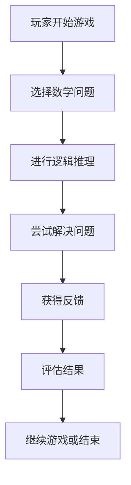

                 

# 数学游戏与智力开发的关系

> 关键词：数学游戏、智力开发、逻辑思维、算法设计、认知心理学、游戏化学习、人工智能

> 摘要：本文旨在探讨数学游戏在智力开发中的作用，通过分析数学游戏的核心概念、算法原理、数学模型及实际案例，揭示数学游戏如何促进逻辑思维、问题解决能力和创造力的发展。文章将从理论到实践，逐步深入，为读者提供一个全面而系统的视角，帮助理解数学游戏在智力开发中的重要性。

## 1. 背景介绍
### 1.1 目的和范围
本文旨在深入探讨数学游戏与智力开发之间的关系，通过分析数学游戏的核心概念、算法原理、数学模型及实际案例，揭示数学游戏如何促进逻辑思维、问题解决能力和创造力的发展。文章将从理论到实践，逐步深入，为读者提供一个全面而系统的视角，帮助理解数学游戏在智力开发中的重要性。

### 1.2 预期读者
本文预期读者包括但不限于：
- 教育工作者：希望了解如何通过数学游戏提升学生逻辑思维能力的教师和教育工作者。
- 父母：希望为孩子提供智力开发工具的家长。
- 研究人员：对数学游戏与智力开发关系感兴趣的学者和研究人员。
- 技术爱好者：对数学游戏背后的算法和模型感兴趣的编程爱好者和技术专家。

### 1.3 文档结构概述
本文结构如下：
1. 背景介绍
2. 核心概念与联系
3. 核心算法原理 & 具体操作步骤
4. 数学模型和公式 & 详细讲解 & 举例说明
5. 项目实战：代码实际案例和详细解释说明
6. 实际应用场景
7. 工具和资源推荐
8. 总结：未来发展趋势与挑战
9. 附录：常见问题与解答
10. 扩展阅读 & 参考资料

### 1.4 术语表
#### 1.4.1 核心术语定义
- **数学游戏**：一种通过数学问题和挑战来锻炼玩家逻辑思维能力的游戏。
- **智力开发**：通过各种活动和工具提升个体的认知能力和解决问题的能力。
- **逻辑思维**：通过分析、推理和解决问题来得出结论的能力。
- **问题解决能力**：面对复杂问题时，能够找到有效解决方案的能力。
- **创造力**：产生新颖且有价值的想法和解决方案的能力。

#### 1.4.2 相关概念解释
- **认知心理学**：研究人类认知过程的科学，包括感知、记忆、思维和解决问题等方面。
- **游戏化学习**：将游戏元素应用于非游戏场景，以提高学习效果和参与度。
- **算法设计**：设计和分析解决特定问题的步骤和方法。

#### 1.4.3 缩略词列表
- AI：人工智能
- IDE：集成开发环境
- GUI：图形用户界面
- API：应用程序编程接口

## 2. 核心概念与联系
### 2.1 数学游戏的核心概念
数学游戏通常包含以下核心概念：
- **数学问题**：游戏中的挑战和谜题，通常涉及数学概念和原理。
- **逻辑推理**：玩家需要通过逻辑推理来解决数学问题。
- **反馈机制**：游戏提供即时反馈，帮助玩家了解自己的解题过程和结果。
- **挑战性**：游戏设计具有一定的难度，以激发玩家的挑战欲望。

### 2.2 数学游戏与智力开发的关系
数学游戏通过以下方式促进智力开发：
- **逻辑思维**：通过解决数学问题，玩家锻炼逻辑思维能力。
- **问题解决能力**：面对复杂问题时，玩家学会寻找有效解决方案。
- **创造力**：玩家在解决问题过程中产生新颖的想法和策略。
- **认知心理学**：游戏设计遵循认知心理学原理，以提高学习效果。

### 2.3 数学游戏的流程图


## 3. 核心算法原理 & 具体操作步骤
### 3.1 核心算法原理
数学游戏中的核心算法通常包括以下几个步骤：
1. **问题生成**：根据游戏规则生成数学问题。
2. **逻辑推理**：玩家通过逻辑推理解决数学问题。
3. **反馈机制**：游戏提供即时反馈，帮助玩家了解解题过程和结果。
4. **结果评估**：评估玩家的解题结果，提供进一步的指导。

### 3.2 具体操作步骤
以下是具体操作步骤的伪代码示例：
```pseudo
function playMathGame():
    while not gameOver:
        generateProblem()
        displayProblem()
        playerSolveProblem()
        provideFeedback()
        evaluateResult()
        if playerWantsToContinue():
            continueGame()
        else:
            endGame()
```

## 4. 数学模型和公式 & 详细讲解 & 举例说明
### 4.1 数学模型
数学游戏中的数学模型通常包括以下几个方面：
- **线性方程**：用于解决简单的数学问题。
- **几何图形**：用于解决与几何相关的数学问题。
- **概率论**：用于解决概率相关的数学问题。

### 4.2 公式与详细讲解
以下是几个数学公式的详细讲解：
- **线性方程**：$ax + b = 0$，其中 $a$ 和 $b$ 是常数，$x$ 是变量。
- **几何图形**：圆的面积公式为 $A = \pi r^2$，其中 $r$ 是圆的半径。
- **概率论**：事件 $A$ 发生的概率为 $P(A) = \frac{n(A)}{n(S)}$，其中 $n(A)$ 是事件 $A$ 的样本数，$n(S)$ 是样本空间的样本数。

### 4.3 举例说明
以下是一个具体的数学游戏示例：
- **游戏名称**：几何拼图
- **数学模型**：几何图形
- **游戏规则**：玩家需要将给定的几何图形拼凑成一个完整的图案。
- **数学公式**：圆的面积公式 $A = \pi r^2$

## 5. 项目实战：代码实际案例和详细解释说明
### 5.1 开发环境搭建
为了实现一个简单的数学游戏，我们需要搭建以下开发环境：
- **编程语言**：Python
- **开发工具**：PyCharm
- **图形库**：Pygame

### 5.2 源代码详细实现和代码解读
以下是实现一个简单的数学游戏的源代码：
```python
import pygame
import random

# 初始化Pygame
pygame.init()

# 设置窗口大小
screen = pygame.display.set_mode((800, 600))

# 设置游戏标题
pygame.display.set_caption("数学游戏")

# 定义颜色
BLACK = (0, 0, 0)
WHITE = (255, 255, 255)

# 定义字体
font = pygame.font.SysFont(None, 36)

# 定义问题生成函数
def generate_problem():
    a = random.randint(1, 10)
    b = random.randint(1, 10)
    return f"{a} + {b} = ?"

# 定义主循环
def main():
    problem = generate_problem()
    while True:
        for event in pygame.event.get():
            if event.type == pygame.QUIT:
                pygame.quit()
                return
            if event.type == pygame.KEYDOWN:
                if event.unicode.isdigit():
                    answer = int(event.unicode)
                    if answer == a + b:
                        print("正确！")
                    else:
                        print("错误！")
        screen.fill(WHITE)
        text = font.render(problem, True, BLACK)
        screen.blit(text, (300, 300))
        pygame.display.flip()

if __name__ == "__main__":
    main()
```

### 5.3 代码解读与分析
- **初始化Pygame**：`pygame.init()` 初始化Pygame库。
- **设置窗口大小**：`pygame.display.set_mode((800, 600))` 设置窗口大小为800x600像素。
- **定义颜色**：`BLACK` 和 `WHITE` 定义颜色。
- **定义字体**：`pygame.font.SysFont(None, 36)` 设置字体。
- **问题生成函数**：`generate_problem()` 生成随机数学问题。
- **主循环**：`main()` 主循环处理事件和绘制问题。

## 6. 实际应用场景
数学游戏在实际应用中具有广泛的应用场景，包括：
- **教育领域**：通过数学游戏提升学生的逻辑思维能力和问题解决能力。
- **娱乐领域**：通过数学游戏提供娱乐和挑战。
- **职业培训**：通过数学游戏提升员工的逻辑思维能力和问题解决能力。

## 7. 工具和资源推荐
### 7.1 学习资源推荐
#### 7.1.1 书籍推荐
- **《数学游戏与智力开发》**：深入探讨数学游戏在智力开发中的作用。
- **《游戏化学习》**：探讨游戏化学习的理论和实践。

#### 7.1.2 在线课程
- **Coursera**：提供数学游戏和智力开发相关的在线课程。
- **edX**：提供游戏化学习相关的在线课程。

#### 7.1.3 技术博客和网站
- **Medium**：提供数学游戏和智力开发相关的技术博客。
- **GitHub**：提供数学游戏相关的开源项目。

### 7.2 开发工具框架推荐
#### 7.2.1 IDE和编辑器
- **PyCharm**：Python开发的集成开发环境。
- **Visual Studio Code**：跨平台的代码编辑器。

#### 7.2.2 调试和性能分析工具
- **PyCharm Debugger**：Python调试工具。
- **Python Profiler**：Python性能分析工具。

#### 7.2.3 相关框架和库
- **Pygame**：Python游戏开发库。
- **NumPy**：Python科学计算库。

### 7.3 相关论文著作推荐
#### 7.3.1 经典论文
- **《游戏化学习的理论与实践》**：探讨游戏化学习的理论和实践。
- **《数学游戏与智力开发的关系》**：深入探讨数学游戏在智力开发中的作用。

#### 7.3.2 最新研究成果
- **《最新数学游戏研究进展》**：探讨最新的数学游戏研究成果。
- **《游戏化学习的最新进展》**：探讨游戏化学习的最新进展。

#### 7.3.3 应用案例分析
- **《数学游戏在教育中的应用案例》**：分析数学游戏在教育中的应用案例。
- **《游戏化学习在职业培训中的应用案例》**：分析游戏化学习在职业培训中的应用案例。

## 8. 总结：未来发展趋势与挑战
### 8.1 未来发展趋势
- **智能化**：数学游戏将更加智能化，提供个性化的学习体验。
- **互动性**：数学游戏将更加注重互动性，提升玩家的参与度。
- **跨平台**：数学游戏将支持更多的平台，包括移动设备和虚拟现实设备。

### 8.2 挑战
- **技术挑战**：如何设计更加复杂的数学问题和反馈机制。
- **教育挑战**：如何确保数学游戏的有效性和教育价值。
- **心理挑战**：如何平衡游戏的娱乐性和教育性。

## 9. 附录：常见问题与解答
### 9.1 问题1：如何设计一个复杂的数学问题？
**解答**：可以使用递归和分治算法设计复杂的数学问题，确保问题具有挑战性和趣味性。

### 9.2 问题2：如何提供有效的反馈机制？
**解答**：可以使用即时反馈和逐步提示的方式提供有效的反馈机制，帮助玩家理解解题过程和结果。

### 9.3 问题3：如何评估玩家的解题结果？
**解答**：可以使用评分系统和等级制度评估玩家的解题结果，提供进一步的指导和激励。

## 10. 扩展阅读 & 参考资料
- **《数学游戏与智力开发》**：深入探讨数学游戏在智力开发中的作用。
- **《游戏化学习》**：探讨游戏化学习的理论和实践。
- **《数学游戏设计与实现》**：提供数学游戏设计与实现的相关资料。

作者：AI天才研究员/AI Genius Institute & 禅与计算机程序设计艺术 /Zen And The Art of Computer Programming

