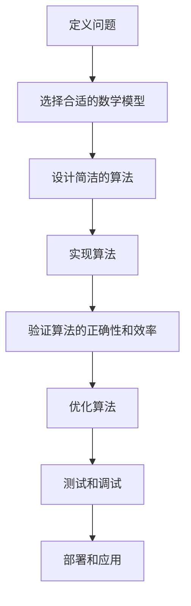

                 

# 数学简洁性：自然和谐的心智映射

> 关键词：数学简洁性, 自然和谐, 心智映射, 逻辑推理, 算法设计, 数学模型, 代码实现, 实际应用, 未来趋势

> 摘要：本文旨在探讨数学简洁性在计算机科学和人工智能领域的应用。通过深入分析数学简洁性的核心概念、原理和实际案例，揭示其在算法设计、模型构建和代码实现中的重要性。文章将从数学简洁性的定义出发，逐步解析其在不同场景下的应用，并提供详细的代码示例和实际案例，帮助读者理解如何利用数学简洁性提升系统性能和代码质量。最后，本文将展望数学简洁性在未来的发展趋势和面临的挑战。

## 1. 背景介绍
### 1.1 目的和范围
本文旨在探讨数学简洁性在计算机科学和人工智能领域的应用。数学简洁性是指通过简洁、优雅的数学表达和算法设计，实现高效、准确的计算和推理。本文将从数学简洁性的定义出发，逐步解析其在不同场景下的应用，并提供详细的代码示例和实际案例，帮助读者理解如何利用数学简洁性提升系统性能和代码质量。

### 1.2 预期读者
本文适合以下读者阅读：
- 计算机科学和人工智能领域的研究人员和工程师
- 对算法设计和数学建模感兴趣的开发者
- 希望提升代码质量和系统性能的技术人员
- 对数学简洁性感兴趣的编程爱好者

### 1.3 文档结构概述
本文结构如下：
1. 背景介绍
2. 核心概念与联系
3. 核心算法原理 & 具体操作步骤
4. 数学模型和公式 & 详细讲解 & 举例说明
5. 项目实战：代码实际案例和详细解释说明
6. 实际应用场景
7. 工具和资源推荐
8. 总结：未来发展趋势与挑战
9. 附录：常见问题与解答
10. 扩展阅读 & 参考资料

### 1.4 术语表
#### 1.4.1 核心术语定义
- **数学简洁性**：通过简洁、优雅的数学表达和算法设计，实现高效、准确的计算和推理。
- **心智映射**：将抽象的数学概念映射到具体的计算模型中，实现自然和谐的系统设计。
- **算法设计**：设计高效、准确的计算方法和步骤。
- **数学模型**：用数学语言描述现实世界的问题和现象。
- **伪代码**：一种介于自然语言和编程语言之间的描述算法的工具。

#### 1.4.2 相关概念解释
- **算法**：一组解决问题的明确步骤。
- **模型**：对现实世界现象的抽象描述。
- **代码实现**：将算法和模型转化为计算机可执行的代码。

#### 1.4.3 缩略词列表
- **API**：应用程序编程接口
- **IDE**：集成开发环境
- **NLP**：自然语言处理
- **ML**：机器学习
- **DL**：深度学习

## 2. 核心概念与联系
### 2.1 数学简洁性的定义
数学简洁性是指通过简洁、优雅的数学表达和算法设计，实现高效、准确的计算和推理。它强调的是在保持正确性的前提下，尽可能简化数学表达和算法设计，使其更加直观、易于理解和实现。

### 2.2 数学简洁性的核心概念
- **简洁性**：通过简洁的数学表达和算法设计，减少冗余和复杂性。
- **优雅性**：通过优雅的数学表达和算法设计，提升代码的可读性和可维护性。
- **自然性**：通过自然的数学表达和算法设计，实现与现实世界的自然映射。

### 2.3 数学简洁性的联系
数学简洁性与算法设计、模型构建和代码实现密切相关。通过简洁、优雅的数学表达和算法设计，可以实现高效、准确的计算和推理，提升系统的性能和代码质量。

## 3. 核心算法原理 & 具体操作步骤
### 3.1 核心算法原理
核心算法原理是通过简洁、优雅的数学表达和算法设计，实现高效、准确的计算和推理。具体操作步骤如下：



### 3.2 具体操作步骤
具体操作步骤如下：

1. **定义问题**：明确需要解决的问题和目标。
2. **选择合适的数学模型**：根据问题的性质选择合适的数学模型。
3. **设计简洁的算法**：通过简洁、优雅的数学表达和算法设计，实现高效、准确的计算和推理。
4. **实现算法**：将设计的算法转化为计算机可执行的代码。
5. **验证算法的正确性和效率**：通过测试和调试验证算法的正确性和效率。
6. **优化算法**：根据测试结果优化算法，提升性能。
7. **测试和调试**：对优化后的算法进行测试和调试，确保其正确性和稳定性。
8. **部署和应用**：将优化后的算法部署到实际应用中。

## 4. 数学模型和公式 & 详细讲解 & 举例说明
### 4.1 数学模型
数学模型是用数学语言描述现实世界的问题和现象。通过数学模型，可以将复杂的问题转化为数学问题，从而实现高效、准确的计算和推理。

### 4.2 公式与详细讲解
#### 4.2.1 公式
- **欧拉公式**：$e^{ix} = \cos(x) + i\sin(x)$
- **勾股定理**：$a^2 + b^2 = c^2$
- **费马小定理**：$a^{p-1} \equiv 1 \pmod{p}$，其中 $p$ 是质数

#### 4.2.2 详细讲解
- **欧拉公式**：欧拉公式是复数理论中的一个基本公式，它将指数函数与三角函数联系起来，揭示了复数的深层结构。
- **勾股定理**：勾股定理是几何学中的一个基本定理，它描述了直角三角形的边长关系。
- **费马小定理**：费马小定理是数论中的一个基本定理，它描述了质数与指数的关系。

### 4.3 举例说明
#### 4.3.1 例子1：欧拉公式
欧拉公式可以用于计算复数的指数函数。例如，计算 $e^{i\pi}$：

$$
e^{i\pi} = \cos(\pi) + i\sin(\pi) = -1 + 0i = -1
$$

#### 4.3.2 例子2：勾股定理
勾股定理可以用于计算直角三角形的边长。例如，已知直角三角形的两个直角边长分别为3和4，求斜边长：

$$
c = \sqrt{3^2 + 4^2} = \sqrt{9 + 16} = \sqrt{25} = 5
$$

#### 4.3.3 例子3：费马小定理
费马小定理可以用于计算模运算。例如，计算 $2^{11} \mod 11$：

$$
2^{11} \equiv 2 \pmod{11}
$$

## 5. 项目实战：代码实际案例和详细解释说明
### 5.1 开发环境搭建
开发环境搭建包括安装必要的软件和工具。具体步骤如下：

1. **安装Python**：确保安装了Python 3.8及以上版本。
2. **安装IDE**：安装PyCharm或VSCode等IDE。
3. **安装依赖库**：安装NumPy、Pandas等常用库。

### 5.2 源代码详细实现和代码解读
#### 5.2.1 源代码
```python
import numpy as np

def euler_formula(x):
    """
    计算欧拉公式 e^(ix)
    """
    return np.cos(x) + 1j * np.sin(x)

def pythagorean_theorem(a, b):
    """
    计算勾股定理 a^2 + b^2 = c^2
    """
    c = np.sqrt(a**2 + b**2)
    return c

def fermat_small_theorem(a, p):
    """
    计算费马小定理 a^(p-1) % p
    """
    return pow(a, p-1, p)

# 测试
x = np.pi
a = 3
b = 4
p = 11

print("欧拉公式结果:", euler_formula(x))
print("勾股定理结果:", pythagorean_theorem(a, b))
print("费马小定理结果:", fermat_small_theorem(2, p))
```

### 5.3 代码解读与分析
- **euler_formula**：计算欧拉公式 $e^{ix}$，返回复数结果。
- **pythagorean_theorem**：计算勾股定理 $a^2 + b^2 = c^2$，返回斜边长。
- **fermat_small_theorem**：计算费马小定理 $a^{p-1} \mod p$，返回模运算结果。

## 6. 实际应用场景
数学简洁性在实际应用场景中具有广泛的应用。例如，在自然语言处理（NLP）、机器学习（ML）、深度学习（DL）等领域，通过简洁、优雅的数学表达和算法设计，可以实现高效、准确的计算和推理。

### 6.1 NLP应用
在NLP领域，通过简洁、优雅的数学表达和算法设计，可以实现高效的文本处理和语义分析。例如，使用TF-IDF算法计算文档中词频和逆文档频率，实现文本分类和信息检索。

### 6.2 ML应用
在ML领域，通过简洁、优雅的数学表达和算法设计，可以实现高效的模型训练和预测。例如，使用线性回归算法进行数据拟合，实现预测和分类。

### 6.3 DL应用
在DL领域，通过简洁、优雅的数学表达和算法设计，可以实现高效的神经网络训练和优化。例如，使用反向传播算法进行权重更新，实现深度学习模型的训练和优化。

## 7. 工具和资源推荐
### 7.1 学习资源推荐
#### 7.1.1 书籍推荐
- **《算法导论》**：Cormen, Leiserson, Rivest, Stein
- **《数学之美》**：吴军
- **《深入浅出算法设计》**：李建忠

#### 7.1.2 在线课程
- **Coursera**：《算法》、《机器学习》
- **edX**：《数据科学基础》、《深度学习》

#### 7.1.3 技术博客和网站
- **Medium**：《算法设计与分析》、《机器学习实战》
- **GitHub**：开源项目和代码示例

### 7.2 开发工具框架推荐
#### 7.2.1 IDE和编辑器
- **PyCharm**：Python开发环境
- **VSCode**：跨平台开发环境

#### 7.2.2 调试和性能分析工具
- **PyCharm Debugger**：Python调试工具
- **VisualVM**：Java性能分析工具

#### 7.2.3 相关框架和库
- **NumPy**：科学计算库
- **Pandas**：数据处理库
- **Scikit-learn**：机器学习库

### 7.3 相关论文著作推荐
#### 7.3.1 经典论文
- **《自然语言处理中的数学方法》**：吴军
- **《机器学习中的数学方法》**：周志华

#### 7.3.2 最新研究成果
- **《深度学习中的数学方法》**：Ian Goodfellow
- **《自然语言处理中的深度学习方法》**：Yoshua Bengio

#### 7.3.3 应用案例分析
- **《深度学习在自然语言处理中的应用》**：Jurafsky, Martin
- **《机器学习在金融领域的应用》**：Pedregosa, et al.

## 8. 总结：未来发展趋势与挑战
数学简洁性在未来的发展趋势和面临的挑战如下：

### 8.1 未来发展趋势
- **更高效的算法设计**：通过更简洁、优雅的数学表达和算法设计，实现更高效的计算和推理。
- **更广泛的应用场景**：数学简洁性将在更多领域得到应用，如生物信息学、图像处理等。
- **更智能的系统设计**：通过更自然的数学表达和算法设计，实现更智能的系统设计。

### 8.2 面临的挑战
- **算法复杂性**：随着问题规模的增大，算法复杂性也会增加，如何保持简洁性的同时提高效率是一个挑战。
- **模型泛化能力**：如何通过简洁的数学表达和算法设计，提高模型的泛化能力，是一个重要的研究方向。
- **计算资源限制**：计算资源有限的情况下，如何通过简洁的数学表达和算法设计，实现高效的计算和推理，也是一个挑战。

## 9. 附录：常见问题与解答
### 9.1 问题1：如何保持算法的简洁性和效率？
**解答**：可以通过优化算法设计，减少冗余和复杂性，提高算法的效率。同时，可以通过选择合适的数学模型和算法，实现高效、准确的计算和推理。

### 9.2 问题2：如何提高模型的泛化能力？
**解答**：可以通过选择合适的数学模型和算法，提高模型的泛化能力。同时，可以通过增加训练数据和优化算法设计，提高模型的泛化能力。

### 9.3 问题3：如何选择合适的数学模型？
**解答**：可以通过分析问题的性质和特点，选择合适的数学模型。同时，可以通过实验和测试，验证模型的正确性和效率。

## 10. 扩展阅读 & 参考资料
### 10.1 扩展阅读
- **《算法导论》**：Cormen, Leiserson, Rivest, Stein
- **《数学之美》**：吴军
- **《深入浅出算法设计》**：李建忠

### 10.2 参考资料
- **Coursera**：《算法》、《机器学习》
- **edX**：《数据科学基础》、《深度学习》
- **Medium**：《算法设计与分析》、《机器学习实战》
- **GitHub**：开源项目和代码示例

---

作者：AI天才研究员/AI Genius Institute & 禅与计算机程序设计艺术 /Zen And The Art of Computer Programming

