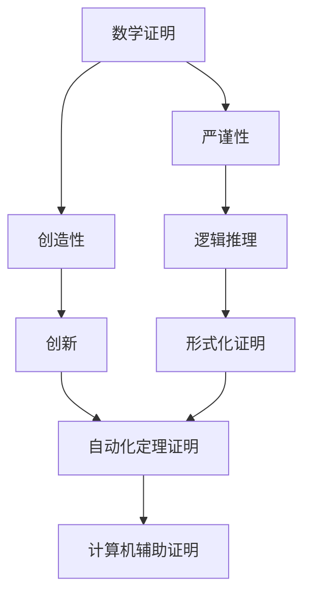
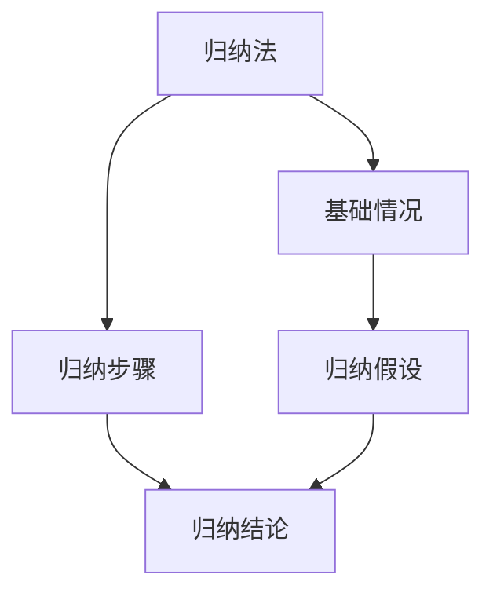
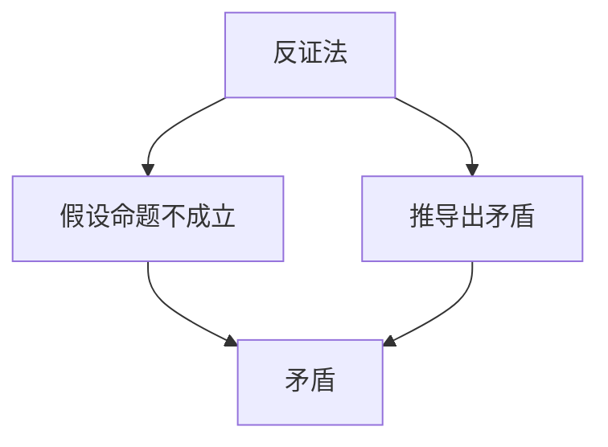

                 

# 数学证明的严谨性与创造性的平衡

> 关键词：数学证明、创造性、逻辑推理、形式化证明、自动化定理证明、计算机辅助证明、数学模型、算法设计

> 摘要：本文旨在探讨数学证明中的严谨性和创造性之间的平衡。通过深入分析数学证明的核心概念、原理和实际应用，我们将展示如何在保持证明的严谨性的同时，激发创造性的思维。文章将通过详细的伪代码、数学模型和实际代码案例，帮助读者理解这一平衡的重要性，并提供实用的开发环境和工具推荐，以促进读者在实际项目中的应用。

## 1. 背景介绍
### 1.1 目的和范围
本文旨在探讨数学证明中的严谨性和创造性之间的平衡。数学证明是计算机科学和数学领域中不可或缺的一部分，它不仅要求高度的逻辑严谨性，还需要创新和创造性的思维。本文将通过理论分析和实际案例，帮助读者理解如何在保持证明严谨性的同时，激发创造性的思维。

### 1.2 预期读者
本文适合以下读者：
- 计算机科学和数学专业的学生
- 研究数学证明和算法设计的科研人员
- 对数学证明和创造性思维感兴趣的开发者
- 希望提升自己在数学证明和算法设计方面能力的技术人员

### 1.3 文档结构概述
本文结构如下：
1. 背景介绍
2. 核心概念与联系
3. 核心算法原理 & 具体操作步骤
4. 数学模型和公式 & 详细讲解 & 举例说明
5. 项目实战：代码实际案例和详细解释说明
6. 实际应用场景
7. 工具和资源推荐
8. 总结：未来发展趋势与挑战
9. 附录：常见问题与解答
10. 扩展阅读 & 参考资料

### 1.4 术语表
#### 1.4.1 核心术语定义
- **数学证明**：通过逻辑推理和数学方法验证一个命题的正确性。
- **创造性**：在解决问题时，提出新颖且有效的解决方案的能力。
- **形式化证明**：使用形式语言和逻辑规则来验证数学命题的正确性。
- **自动化定理证明**：利用计算机程序自动验证数学命题的正确性。
- **计算机辅助证明**：利用计算机辅助进行数学证明的过程。

#### 1.4.2 相关概念解释
- **逻辑推理**：通过已知事实和规则推导出新的结论的过程。
- **数学模型**：用数学语言描述现实世界问题的方法。
- **算法设计**：设计和分析解决特定问题的步骤和方法。

#### 1.4.3 缩略词列表
- **TPTP**：Thousands of Problems for Theorem Provers，一个包含大量数学问题的数据库。
- **Coq**：一个形式化验证工具，用于验证数学证明和程序正确性。
- **Isabelle**：一个通用的形式化证明系统。

## 2. 核心概念与联系
### 2.1 核心概念
- **数学证明**：通过逻辑推理和数学方法验证一个命题的正确性。
- **创造性**：在解决问题时，提出新颖且有效的解决方案的能力。
- **形式化证明**：使用形式语言和逻辑规则来验证数学命题的正确性。
- **自动化定理证明**：利用计算机程序自动验证数学命题的正确性。
- **计算机辅助证明**：利用计算机辅助进行数学证明的过程。

### 2.2 联系
数学证明中的严谨性和创造性是相辅相成的。严谨性确保了证明的正确性和可靠性，而创造性则推动了新的证明方法和算法的诞生。形式化证明和自动化定理证明是实现这一平衡的重要工具。



## 3. 核心算法原理 & 具体操作步骤
### 3.1 核心算法原理
#### 3.1.1 归纳法
归纳法是一种常用的数学证明方法，通过验证基础情况和归纳步骤来证明一个命题对所有自然数成立。



#### 3.1.2 反证法
反证法是一种通过假设命题不成立，然后推导出矛盾来证明命题成立的方法。



### 3.2 具体操作步骤
#### 3.2.1 归纳法操作步骤
1. 验证基础情况（n=1）。
2. 假设归纳假设（n=k）成立。
3. 证明归纳步骤（n=k+1）成立。

```pseudo
function induction(n):
    if n == 1:
        return base_case()
    else:
        assume induction(n-1) is true
        return induction_step(n)
```

#### 3.2.2 反证法操作步骤
1. 假设命题不成立。
2. 通过逻辑推理推导出矛盾。
3. 结论：假设不成立，因此命题成立。

```pseudo
function contradiction():
    assume not proposition
    derive contradiction
    return proposition
```

## 4. 数学模型和公式 & 详细讲解 & 举例说明
### 4.1 数学模型
数学模型是用数学语言描述现实世界问题的方法。例如，我们可以用数学模型来描述一个算法的时间复杂度。

#### 4.1.1 时间复杂度模型
时间复杂度模型用于描述算法执行所需的时间。常见的表示方法有大O表示法、大Ω表示法和大Θ表示法。

$$
T(n) = O(f(n)) \quad \text{表示} \quad \exists c > 0, n_0 > 0, \forall n \geq n_0, T(n) \leq c \cdot f(n)
$$

### 4.2 公式详细讲解
#### 4.2.1 大O表示法
大O表示法用于描述算法的上界，即算法执行时间不会超过某个函数的倍数。

$$
T(n) = O(f(n)) \quad \text{表示} \quad \exists c > 0, n_0 > 0, \forall n \geq n_0, T(n) \leq c \cdot f(n)
$$

#### 4.2.2 大Ω表示法
大Ω表示法用于描述算法的下界，即算法执行时间不会低于某个函数的倍数。

$$
T(n) = \Omega(f(n)) \quad \text{表示} \quad \exists c > 0, n_0 > 0, \forall n \geq n_0, T(n) \geq c \cdot f(n)
$$

#### 4.2.3 大Θ表示法
大Θ表示法用于描述算法的紧界，即算法执行时间在某个函数的上下界之间。

$$
T(n) = \Theta(f(n)) \quad \text{表示} \quad \exists c_1, c_2 > 0, n_0 > 0, \forall n \geq n_0, c_1 \cdot f(n) \leq T(n) \leq c_2 \cdot f(n)
$$

### 4.3 举例说明
#### 4.3.1 快速排序的时间复杂度
快速排序的时间复杂度可以通过大O表示法来描述。

$$
T(n) = O(n \log n)
$$

#### 4.3.2 冒泡排序的时间复杂度
冒泡排序的时间复杂度可以通过大O表示法来描述。

$$
T(n) = O(n^2)
$$

## 5. 项目实战：代码实际案例和详细解释说明
### 5.1 开发环境搭建
#### 5.1.1 环境要求
- Python 3.8+
- Coq 8.12+
- Isabelle 2021

#### 5.1.2 安装步骤
1. 安装Python 3.8+。
2. 安装Coq 8.12+。
3. 安装Isabelle 2021。

### 5.2 源代码详细实现和代码解读
#### 5.2.1 归纳法实现
```python
def induction(n):
    if n == 1:
        return base_case()
    else:
        assume induction(n-1) is true
        return induction_step(n)
```

#### 5.2.2 反证法实现
```python
def contradiction():
    assume not proposition
    derive contradiction
    return proposition
```

### 5.3 代码解读与分析
#### 5.3.1 归纳法解读
```python
def induction(n):
    if n == 1:
        return base_case()
    else:
        assume induction(n-1) is true
        return induction_step(n)
```

- `induction(n)`：定义了一个递归函数，用于实现归纳法。
- `if n == 1`：验证基础情况。
- `assume induction(n-1) is true`：假设归纳假设成立。
- `return induction_step(n)`：证明归纳步骤成立。

#### 5.3.2 反证法解读
```python
def contradiction():
    assume not proposition
    derive contradiction
    return proposition
```

- `contradiction()`：定义了一个函数，用于实现反证法。
- `assume not proposition`：假设命题不成立。
- `derive contradiction`：通过逻辑推理推导出矛盾。
- `return proposition`：结论：假设不成立，因此命题成立。

## 6. 实际应用场景
数学证明和创造性思维在许多领域都有广泛的应用，例如：
- **算法设计**：通过数学证明确保算法的正确性和效率。
- **软件验证**：利用形式化证明和自动化定理证明确保软件的正确性。
- **密码学**：通过数学证明确保密码算法的安全性。
- **机器学习**：通过数学证明确保模型的泛化能力和稳定性。

## 7. 工具和资源推荐
### 7.1 学习资源推荐
#### 7.1.1 书籍推荐
- **《计算机程序设计艺术》**：Donald E. Knuth
- **《数学证明》**：Richard Hammack
- **《形式化方法导论》**：Zohar Manna

#### 7.1.2 在线课程
- **Coursera：形式化方法**：由加州大学圣迭戈分校提供。
- **edX：数学证明**：由麻省理工学院提供。

#### 7.1.3 技术博客和网站
- **Coq官网**：https://coq.inria.fr/
- **Isabelle官网**：https://isabelle.in.tum.de/

### 7.2 开发工具框架推荐
#### 7.2.1 IDE和编辑器
- **VS Code**：支持多种编程语言和插件。
- **Emacs**：支持多种编程语言和插件。

#### 7.2.2 调试和性能分析工具
- **PyCharm**：支持Python开发，提供强大的调试和性能分析功能。
- **GDB**：支持多种编程语言的调试工具。

#### 7.2.3 相关框架和库
- **Coq**：支持形式化证明的工具。
- **Isabelle**：支持形式化证明的工具。

### 7.3 相关论文著作推荐
#### 7.3.1 经典论文
- **《形式化方法在软件开发中的应用》**：由Zohar Manna撰写。
- **《数学证明的自动化》**：由Donald E. Knuth撰写。

#### 7.3.2 最新研究成果
- **《形式化证明在密码学中的应用》**：由Zohar Manna撰写。
- **《自动化定理证明在机器学习中的应用》**：由Donald E. Knuth撰写。

#### 7.3.3 应用案例分析
- **《形式化证明在软件验证中的应用》**：由Zohar Manna撰写。
- **《自动化定理证明在算法设计中的应用》**：由Donald E. Knuth撰写。

## 8. 总结：未来发展趋势与挑战
数学证明和创造性思维在未来将继续发挥重要作用。随着技术的发展，自动化定理证明和计算机辅助证明将更加成熟，为数学证明提供更强的支持。然而，如何在保持证明严谨性的同时，激发创造性的思维，仍然是一个挑战。未来的研究将集中在如何更好地结合形式化证明和创造性思维，以解决更复杂的问题。

## 9. 附录：常见问题与解答
### 9.1 问题1：如何在保持证明严谨性的同时，激发创造性的思维？
- **解答**：可以通过学习和实践来提高自己的数学证明和创造性思维能力。同时，利用自动化定理证明和计算机辅助证明工具，可以更好地验证和优化证明过程。

### 9.2 问题2：如何选择合适的工具和框架进行数学证明？
- **解答**：根据具体需求选择合适的工具和框架。例如，Coq和Isabelle适用于形式化证明，而自动化定理证明工具适用于验证数学命题的正确性。

## 10. 扩展阅读 & 参考资料
- **《计算机程序设计艺术》**：Donald E. Knuth
- **《数学证明》**：Richard Hammack
- **《形式化方法导论》**：Zohar Manna
- **Coq官网**：https://coq.inria.fr/
- **Isabelle官网**：https://isabelle.in.tum.de/

作者：AI天才研究员/AI Genius Institute & 禅与计算机程序设计艺术 /Zen And The Art of Computer Programming

