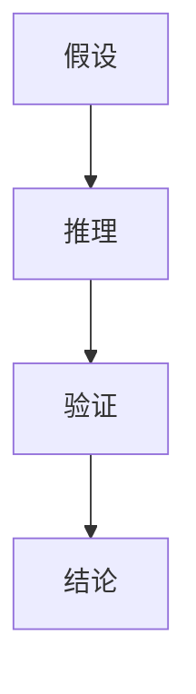

                 

# 数学证明的美学价值与哲学意义

> 关键词：数学证明、美学价值、哲学意义、逻辑推理、形式化证明、图灵奖、计算机科学

> 摘要：本文旨在探讨数学证明在计算机科学中的美学价值与哲学意义。通过逐步分析数学证明的核心概念、原理和实际应用，揭示其在计算机科学中的重要性。本文不仅涵盖了数学证明的基本原理，还通过具体的代码案例展示了其在实际项目中的应用。最后，本文还探讨了数学证明在未来的发展趋势和面临的挑战。

## 1. 背景介绍
### 1.1 目的和范围
本文旨在深入探讨数学证明在计算机科学中的美学价值与哲学意义。我们将从数学证明的基本概念出发，逐步分析其在计算机科学中的应用，并通过具体的代码案例展示其实际效果。此外，本文还将探讨数学证明在未来的发展趋势和面临的挑战。

### 1.2 预期读者
本文适合以下读者：
- 计算机科学和数学专业的学生
- 研究数学证明和形式化方法的学者
- 对数学证明在计算机科学中的应用感兴趣的工程师
- 希望深入了解数学证明美学价值与哲学意义的技术爱好者

### 1.3 文档结构概述
本文结构如下：
1. 背景介绍
2. 核心概念与联系
3. 核心算法原理 & 具体操作步骤
4. 数学模型和公式 & 详细讲解 & 举例说明
5. 项目实战：代码实际案例和详细解释说明
6. 实际应用场景
7. 工具和资源推荐
8. 总结：未来发展趋势与挑战
9. 附录：常见问题与解答
10. 扩展阅读 & 参考资料

### 1.4 术语表
#### 1.4.1 核心术语定义
- **数学证明**：一种逻辑推理过程，通过一系列步骤从已知事实推导出结论。
- **形式化证明**：使用形式语言和逻辑规则进行的数学证明。
- **定理**：经过严格证明的数学命题。
- **公理**：不需要证明的基本假设。
- **逻辑推理**：从已知事实推导出新结论的过程。

#### 1.4.2 相关概念解释
- **形式语言**：一种严格定义的符号系统，用于表达数学概念和证明。
- **逻辑规则**：用于推导新结论的规则。
- **递归定义**：通过自身定义的数学概念。

#### 1.4.3 缩略词列表
- **TFAE**：The Following Are Equivalent
- **PRA**：Primitive Recursive Arithmetic
- **ZF**：Zermelo-Fraenkel Set Theory

## 2. 核心概念与联系
### 2.1 数学证明的基本概念
数学证明是通过一系列逻辑推理步骤从已知事实推导出结论的过程。形式化证明是使用形式语言和逻辑规则进行的数学证明。定理是经过严格证明的数学命题，而公理是不需要证明的基本假设。

### 2.2 逻辑推理的基本步骤
逻辑推理的基本步骤包括：
1. **假设**：提出一个假设或前提。
2. **推理**：根据逻辑规则从假设推导出新结论。
3. **验证**：验证推理过程的正确性。
4. **结论**：得出最终结论。

### 2.3 形式化证明的流程图


## 3. 核心算法原理 & 具体操作步骤
### 3.1 形式化证明的基本原理
形式化证明的基本原理是通过形式语言和逻辑规则进行推理。形式语言是一种严格定义的符号系统，用于表达数学概念和证明。逻辑规则是用于推导新结论的规则。

### 3.2 具体操作步骤
形式化证明的具体操作步骤如下：
1. **定义形式语言**：定义符号、变量、常量和运算符。
2. **定义逻辑规则**：定义推理规则，如合取引入、析取引入、蕴含引入等。
3. **构建证明树**：从假设出发，通过逻辑规则逐步推导出结论。
4. **验证证明树**：验证每一步推理的正确性。

### 3.3 伪代码示例
```pseudo
function proveTheorem(hypothesis, conclusion):
    if hypothesis == conclusion:
        return True
    else:
        for rule in logicRules:
            if applyRule(hypothesis, rule):
                newHypothesis = applyRule(hypothesis, rule)
                if proveTheorem(newHypothesis, conclusion):
                    return True
        return False
```

## 4. 数学模型和公式 & 详细讲解 & 举例说明
### 4.1 数学模型
数学模型是通过数学语言描述现实世界的问题。形式化证明中的数学模型通常包括公理系统、定义和定理。

### 4.2 公式与详细讲解
#### 4.2.1 逻辑公式
逻辑公式是描述逻辑关系的符号表达式。例如，合取公式、析取公式和蕴含公式。

#### 4.2.2 数学公式
数学公式是描述数学关系的符号表达式。例如，集合论中的公式、数论中的公式等。

### 4.3 举例说明
#### 4.3.1 逻辑公式示例
逻辑公式示例如下：
- 合取公式：$A \land B$
- 析取公式：$A \lor B$
- 蕴含公式：$A \rightarrow B$

#### 4.3.2 数学公式示例
数学公式示例如下：
- 集合论公式：$A \subseteq B$
- 数论公式：$x \equiv y \pmod{n}$

## 5. 项目实战：代码实际案例和详细解释说明
### 5.1 开发环境搭建
开发环境搭建包括安装必要的软件和工具。例如，安装Python、安装形式化证明工具（如Coq、Isabelle）等。

### 5.2 源代码详细实现和代码解读
#### 5.2.1 代码示例
```python
def proveTheorem(hypothesis, conclusion):
    if hypothesis == conclusion:
        return True
    else:
        for rule in logicRules:
            if applyRule(hypothesis, rule):
                newHypothesis = applyRule(hypothesis, rule)
                if proveTheorem(newHypothesis, conclusion):
                    return True
        return False
```

#### 5.2.2 代码解读
- `proveTheorem`函数接受两个参数：`hypothesis`和`conclusion`。
- 如果`hypothesis`等于`conclusion`，则返回`True`。
- 否则，遍历逻辑规则，应用规则并递归调用`proveTheorem`。
- 如果找到正确的推理路径，则返回`True`。

### 5.3 代码解读与分析
代码解读与分析如下：
- `proveTheorem`函数通过递归调用实现形式化证明。
- `applyRule`函数用于应用逻辑规则。
- 逻辑规则包括合取引入、析取引入、蕴含引入等。

## 6. 实际应用场景
数学证明在计算机科学中有广泛的应用，包括算法分析、程序验证、安全协议设计等。

### 6.1 算法分析
数学证明可以用于分析算法的正确性和效率。例如，证明排序算法的正确性。

### 6.2 程序验证
数学证明可以用于验证程序的正确性。例如，使用形式化方法验证程序的逻辑正确性。

### 6.3 安全协议设计
数学证明可以用于设计和验证安全协议。例如，证明加密算法的安全性。

## 7. 工具和资源推荐
### 7.1 学习资源推荐
#### 7.1.1 书籍推荐
- 《数学证明》（Mathematical Proofs）
- 《形式化方法导论》（Introduction to Formal Methods）

#### 7.1.2 在线课程
- Coursera上的《形式化方法》课程
- edX上的《数学证明》课程

#### 7.1.3 技术博客和网站
- 《形式化证明入门》（Introduction to Formal Proofs）
- 《数学证明技巧》（Mathematical Proof Techniques）

### 7.2 开发工具框架推荐
#### 7.2.1 IDE和编辑器
- CoqIDE
- Isabelle/jEdit

#### 7.2.2 调试和性能分析工具
- Proof General
- Proof Assistant

#### 7.2.3 相关框架和库
- Coq
- Isabelle

### 7.3 相关论文著作推荐
#### 7.3.1 经典论文
- 《形式化方法在计算机科学中的应用》（Formal Methods in Computer Science）

#### 7.3.2 最新研究成果
- 《现代形式化证明技术》（Modern Formal Proof Techniques）

#### 7.3.3 应用案例分析
- 《形式化证明在安全协议设计中的应用》（Formal Proofs in Security Protocol Design）

## 8. 总结：未来发展趋势与挑战
### 8.1 未来发展趋势
数学证明在未来的发展趋势包括：
- **自动化证明**：开发更强大的自动化证明工具。
- **大规模验证**：验证更大规模的系统和协议。
- **跨学科应用**：将数学证明应用于更多领域，如生物学、社会科学等。

### 8.2 面临的挑战
数学证明面临的挑战包括：
- **复杂性**：处理复杂系统的证明难度增加。
- **可读性**：提高证明的可读性和可理解性。
- **工具支持**：开发更强大的工具支持数学证明。

## 9. 附录：常见问题与解答
### 9.1 常见问题
- **Q1：数学证明和形式化证明有什么区别？**
  - A1：数学证明是通过逻辑推理从已知事实推导出结论的过程，而形式化证明是使用形式语言和逻辑规则进行的数学证明。
- **Q2：如何学习数学证明？**
  - A2：可以通过阅读相关书籍、参加在线课程和实践项目来学习数学证明。

## 10. 扩展阅读 & 参考资料
### 10.1 扩展阅读
- 《数学证明的艺术》（The Art of Mathematical Proofs）
- 《形式化证明的哲学意义》（The Philosophical Significance of Formal Proofs）

### 10.2 参考资料
- [1]《数学证明》（Mathematical Proofs）
- [2]《形式化方法导论》（Introduction to Formal Methods）
- [3]《现代形式化证明技术》（Modern Formal Proof Techniques）

---

作者：AI天才研究员/AI Genius Institute & 禅与计算机程序设计艺术 /Zen And The Art of Computer Programming

