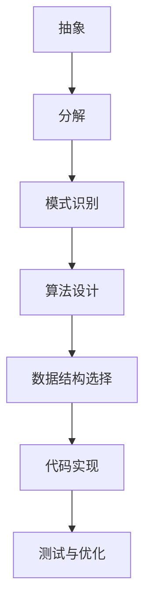

                 

# 数学语言的计算思维培养应用

> 关键词：计算思维，数学语言，算法原理，数学模型，代码实现，实际案例，应用场景

> 摘要：本文旨在探讨如何通过数学语言来培养计算思维，通过深入分析数学语言与计算思维之间的联系，介绍核心概念、算法原理、数学模型及实际代码案例，帮助读者理解如何将数学语言应用于计算思维的培养。文章将通过逐步推理的方式，引导读者从理论到实践，最终掌握将数学语言应用于计算思维的方法。

## 1. 背景介绍
### 1.1 目的和范围
本文旨在探讨如何通过数学语言来培养计算思维，通过深入分析数学语言与计算思维之间的联系，介绍核心概念、算法原理、数学模型及实际代码案例，帮助读者理解如何将数学语言应用于计算思维的培养。本文将涵盖数学语言的基本概念、核心算法原理、数学模型的应用、实际代码案例以及应用场景等内容。

### 1.2 预期读者
本文预期读者为计算机科学、数学、工程等相关领域的学生、研究人员、工程师以及对计算思维和数学语言感兴趣的技术爱好者。读者应具备一定的编程基础和数学知识，能够理解基本的算法和数据结构。

### 1.3 文档结构概述
本文结构如下：
1. 背景介绍
2. 核心概念与联系
3. 核心算法原理 & 具体操作步骤
4. 数学模型和公式 & 详细讲解 & 举例说明
5. 项目实战：代码实际案例和详细解释说明
6. 实际应用场景
7. 工具和资源推荐
8. 总结：未来发展趋势与挑战
9. 附录：常见问题与解答
10. 扩展阅读 & 参考资料

### 1.4 术语表
#### 1.4.1 核心术语定义
- **计算思维**：一种解决问题的方法论，通过抽象、分解、模式识别等手段，将复杂问题转化为计算机可处理的形式。
- **数学语言**：一种用于描述和表达数学概念、关系和操作的语言，包括符号、公式和定理。
- **算法**：解决问题的具体步骤和方法，通常用伪代码或流程图表示。
- **数据结构**：组织和存储数据的方式，包括数组、链表、树、图等。
- **递归**：一种通过函数调用自身来解决问题的方法。
- **迭代**：一种通过重复执行相同操作来解决问题的方法。

#### 1.4.2 相关概念解释
- **抽象**：将复杂问题简化为基本概念和操作的过程。
- **分解**：将复杂问题分解为更小、更易管理的部分。
- **模式识别**：通过观察和分析数据，发现其中的规律和模式。

#### 1.4.3 缩略词列表
- **API**：Application Programming Interface（应用程序编程接口）
- **IDE**：Integrated Development Environment（集成开发环境）
- **GUI**：Graphical User Interface（图形用户界面）

## 2. 核心概念与联系
### 2.1 数学语言与计算思维的关系
数学语言是计算思维的基础，通过数学语言可以将复杂问题抽象为计算机可处理的形式。计算思维则通过数学语言，将问题分解、抽象和模式识别，转化为算法和数据结构，最终实现问题的解决。

### 2.2 核心概念原理
#### 2.2.1 抽象
抽象是将复杂问题简化为基本概念和操作的过程。例如，将一个复杂的数学问题简化为一系列基本的数学运算。

#### 2.2.2 分解
分解是将复杂问题分解为更小、更易管理的部分。例如，将一个大问题分解为多个小问题，每个小问题可以独立解决。

#### 2.2.3 模式识别
模式识别是通过观察和分析数据，发现其中的规律和模式。例如，通过观察数据序列，发现其中的递推关系。

### 2.3 核心概念架构


## 3. 核心算法原理 & 具体操作步骤
### 3.1 递归算法原理
递归是一种通过函数调用自身来解决问题的方法。递归算法通常包含两个部分：基本情况和递归情况。

#### 3.1.1 递归基本情况
基本情况是递归算法的终止条件，当问题规模达到基本情况时，不再进行递归调用。

#### 3.1.2 递归情况
递归情况是将问题规模缩小，然后调用自身来解决更小的问题。

### 3.2 递归算法伪代码
```pseudo
function recursiveAlgorithm(n):
    if n == 0:
        return 0
    else:
        return n + recursiveAlgorithm(n - 1)
```

## 4. 数学模型和公式 & 详细讲解 & 举例说明
### 4.1 数学模型
数学模型是通过数学语言描述和表达问题的方法。数学模型通常包括变量、参数、关系和操作。

### 4.2 数学公式
数学公式是数学模型的具体表达形式。数学公式通常使用符号和公式来描述数学关系。

### 4.3 举例说明
#### 4.3.1 斐波那契数列
斐波那契数列是一个经典的数学模型，其定义为：`F(n) = F(n-1) + F(n-2)`，其中 `F(0) = 0`，`F(1) = 1`。

#### 4.3.2 斐波那契数列的数学公式
斐波那契数列的数学公式为：
$$
F(n) = \frac{1}{\sqrt{5}} \left( \left( \frac{1 + \sqrt{5}}{2} \right)^n - \left( \frac{1 - \sqrt{5}}{2} \right)^n \right)
$$

## 5. 项目实战：代码实际案例和详细解释说明
### 5.1 开发环境搭建
开发环境搭建包括安装必要的软件和工具，如Python、IDE等。

### 5.2 源代码详细实现和代码解读
#### 5.2.1 斐波那契数列的递归实现
```python
def fibonacci_recursive(n):
    if n == 0:
        return 0
    elif n == 1:
        return 1
    else:
        return fibonacci_recursive(n - 1) + fibonacci_recursive(n - 2)
```

#### 5.2.2 斐波那契数列的迭代实现
```python
def fibonacci_iterative(n):
    if n == 0:
        return 0
    elif n == 1:
        return 1
    else:
        a, b = 0, 1
        for _ in range(2, n + 1):
            a, b = b, a + b
        return b
```

### 5.3 代码解读与分析
#### 5.3.1 递归实现
递归实现的优点是代码简洁，易于理解。缺点是递归调用会消耗大量内存和时间，特别是在处理大数时。

#### 5.3.2 迭代实现
迭代实现的优点是效率高，内存消耗少。缺点是代码相对复杂，需要手动处理循环。

## 6. 实际应用场景
### 6.1 金融领域
在金融领域，斐波那契数列可以用于预测股票价格、汇率等。

### 6.2 人工智能领域
在人工智能领域，斐波那契数列可以用于优化算法、图像处理等。

### 6.3 生物信息学领域
在生物信息学领域，斐波那契数列可以用于基因序列分析、蛋白质结构预测等。

## 7. 工具和资源推荐
### 7.1 学习资源推荐
#### 7.1.1 书籍推荐
- 《算法导论》（Introduction to Algorithms）
- 《计算机程序设计艺术》（The Art of Computer Programming）

#### 7.1.2 在线课程
- Coursera上的《算法》课程
- edX上的《计算机科学导论》课程

#### 7.1.3 技术博客和网站
- GeeksforGeeks
- HackerRank

### 7.2 开发工具框架推荐
#### 7.2.1 IDE和编辑器
- PyCharm
- Visual Studio Code

#### 7.2.2 调试和性能分析工具
- PyCharm的调试工具
- Python的cProfile模块

#### 7.2.3 相关框架和库
- NumPy
- SciPy

### 7.3 相关论文著作推荐
#### 7.3.1 经典论文
- Knuth, D. E. (1968). The Art of Computer Programming, Volume 1: Fundamental Algorithms.

#### 7.3.2 最新研究成果
- 《计算机科学前沿研究》（Frontiers in Computer Science Research）

#### 7.3.3 应用案例分析
- 《计算思维在实际应用中的案例分析》（Case Studies of Computational Thinking in Practical Applications）

## 8. 总结：未来发展趋势与挑战
### 8.1 未来发展趋势
随着计算技术的发展，数学语言在计算思维中的应用将更加广泛。未来的发展趋势包括：
- 更高效的算法设计
- 更强大的数据处理能力
- 更智能的自动化工具

### 8.2 挑战
- 算法复杂度的优化
- 数据安全和隐私保护
- 人工智能伦理问题

## 9. 附录：常见问题与解答
### 9.1 问题1：递归和迭代的区别是什么？
**解答**：递归是通过函数调用自身来解决问题的方法，而迭代是通过重复执行相同操作来解决问题的方法。递归的优点是代码简洁，但缺点是效率低、内存消耗大；迭代的优点是效率高、内存消耗少，但缺点是代码相对复杂。

### 9.2 问题2：如何优化递归算法？
**解答**：可以通过记忆化搜索或动态规划来优化递归算法。记忆化搜索是将已经计算过的结果存储起来，避免重复计算；动态规划是通过自底向上的方式逐步解决问题，避免递归调用。

## 10. 扩展阅读 & 参考资料
### 10.1 扩展阅读
- 《计算思维：从问题到解决方案》（Computational Thinking: From Problem to Solution）
- 《数学之美》（The Beauty of Mathematics）

### 10.2 参考资料
- Knuth, D. E. (1968). The Art of Computer Programming, Volume 1: Fundamental Algorithms.
- Cormen, T. H., Leiserson, C. E., Rivest, R. L., & Stein, C. (2009). Introduction to Algorithms (3rd ed.).

---

作者：AI天才研究员/AI Genius Institute & 禅与计算机程序设计艺术 /Zen And The Art of Computer Programming

