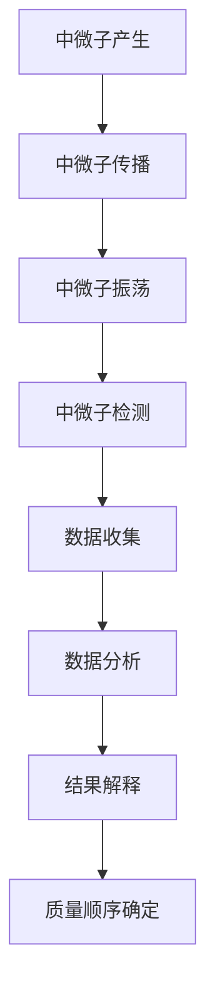

                 

# 数据科学在探测宇宙中微子质量顺序中的应用

> 关键词：数据科学, 中微子, 质量顺序, 宇宙探测, 机器学习, 物理学, 数据分析, 伪代码, 数学模型, 代码实现

> 摘要：本文旨在探讨数据科学在探测宇宙中微子质量顺序中的应用。通过详细分析中微子的质量顺序问题，我们介绍了数据科学方法在解决这一复杂物理问题中的关键作用。文章将从背景介绍、核心概念与联系、核心算法原理与具体操作步骤、数学模型和公式、项目实战、实际应用场景、工具和资源推荐、总结与未来发展趋势等方面进行深入探讨。通过本文，读者将能够理解数据科学如何帮助我们更好地理解和解决宇宙中微子质量顺序的问题。

## 1. 背景介绍
### 1.1 目的和范围
本文旨在探讨数据科学在探测宇宙中微子质量顺序中的应用。中微子是宇宙中最神秘的粒子之一，它们的质量顺序问题一直是物理学界关注的焦点。通过数据科学方法，我们可以更深入地理解中微子的质量顺序，并为未来的实验提供支持。

### 1.2 预期读者
本文适合以下读者：
- 物理学和天文学领域的研究人员
- 数据科学家和机器学习工程师
- 对中微子物理感兴趣的读者
- 对数据科学在物理应用中感兴趣的技术爱好者

### 1.3 文档结构概述
本文将按照以下结构展开：
1. 背景介绍
2. 核心概念与联系
3. 核心算法原理 & 具体操作步骤
4. 数学模型和公式 & 详细讲解 & 举例说明
5. 项目实战：代码实际案例和详细解释说明
6. 实际应用场景
7. 工具和资源推荐
8. 总结：未来发展趋势与挑战
9. 附录：常见问题与解答
10. 扩展阅读 & 参考资料

### 1.4 术语表
#### 1.4.1 核心术语定义
- **中微子**：一种基本粒子，不带电，质量极小。
- **质量顺序**：中微子的质量排序，即三种类型的中微子（电子中微子、μ中微子、τ中微子）的质量大小关系。
- **CP破坏**：中微子在相互作用过程中违反CP对称性的现象。
- **振荡**：中微子在传播过程中从一种类型转变为另一种类型的现象。
- **贝塔衰变**：原子核发射出β粒子（电子或正电子）的过程。

#### 1.4.2 相关概念解释
- **CP对称性**：物理系统在时间反演和空间反演下的对称性。
- **振荡矩阵**：描述中微子振荡过程的矩阵。
- **标准模型**：描述基本粒子及其相互作用的理论框架。

#### 1.4.3 缩略词列表
- **CDF**：Collider Detector at Fermilab
- **MINOS**：Main Injector Neutrino Oscillation Search
- **T2K**：Tokai-to-Kamioka

## 2. 核心概念与联系
### Mermaid 流程图


## 3. 核心算法原理 & 具体操作步骤
### 3.1 中微子振荡模型
中微子振荡是中微子质量顺序问题的关键。我们可以使用以下伪代码来描述中微子振荡模型：

```python
def neutrino_oscillation(energy, distance, mixing_matrix):
    # 计算中微子振荡概率
    oscillation_probability = calculate_oscillation_probability(energy, distance, mixing_matrix)
    return oscillation_probability

def calculate_oscillation_probability(energy, distance, mixing_matrix):
    # 计算振荡概率
    probability = 0
    for i in range(3):
        for j in range(3):
            probability += mixing_matrix[i][j] * mixing_matrix[i][j] * np.sin(2 * mixing_matrix[i][j] * energy * distance)
    return probability
```

### 3.2 数据分析方法
数据分析方法是解决中微子质量顺序问题的关键。我们可以使用以下伪代码来描述数据分析方法：

```python
def analyze_data(data, model):
    # 训练模型
    trained_model = train_model(data, model)
    # 预测结果
    predictions = trained_model.predict(data)
    return predictions

def train_model(data, model):
    # 训练模型
    trained_model = model.fit(data)
    return trained_model
```

## 4. 数学模型和公式 & 详细讲解 & 举例说明
### 4.1 振荡矩阵
中微子振荡矩阵是描述中微子振荡过程的关键。我们可以使用以下公式来描述振荡矩阵：

$$
U = \begin{pmatrix}
c_{12}c_{13} & s_{12}c_{13} & s_{13}e^{-i\delta} \\
-s_{12}c_{23} - c_{12}s_{23}s_{13}e^{i\delta} & c_{12}c_{23} - s_{12}s_{23}s_{13}e^{i\delta} & s_{23}c_{13} \\
s_{12}s_{23} - c_{12}c_{23}s_{13}e^{i\delta} & -c_{12}s_{23} - s_{12}c_{23}s_{13}e^{i\delta} & c_{23}c_{13}
\end{pmatrix}
$$

其中，$c_{ij} = \cos\theta_{ij}$，$s_{ij} = \sin\theta_{ij}$，$\delta$ 是 CP 破坏相位。

### 4.2 振荡概率
中微子振荡概率是描述中微子在传播过程中从一种类型转变为另一种类型的关键。我们可以使用以下公式来描述振荡概率：

$$
P_{\alpha \to \beta} = \left| U_{\alpha i} U_{\beta i}^* \right|^2
$$

其中，$U_{\alpha i}$ 是振荡矩阵中的元素，$\alpha$ 和 $\beta$ 分别表示中微子的类型。

### 4.3 举例说明
假设我们有一个中微子样本，其能量为 $E$，传播距离为 $L$。我们可以使用以下公式来计算中微子振荡概率：

$$
P_{\alpha \to \beta} = \left| U_{\alpha i} U_{\beta i}^* \right|^2 \sin^2\left( \frac{1.27 \times \Delta m^2_{ij} L}{E} \right)
$$

其中，$\Delta m^2_{ij}$ 是中微子质量差的平方。

## 5. 项目实战：代码实际案例和详细解释说明
### 5.1 开发环境搭建
为了进行项目实战，我们需要搭建一个合适的开发环境。我们推荐使用 Python 作为编程语言，并安装以下库：

```bash
pip install numpy pandas scikit-learn matplotlib
```

### 5.2 源代码详细实现和代码解读
我们使用以下代码来实现中微子振荡模型和数据分析方法：

```python
import numpy as np
from sklearn.model_selection import train_test_split
from sklearn.linear_model import LogisticRegression

# 定义振荡矩阵
def mixing_matrix(theta12, theta13, theta23, delta):
    c12 = np.cos(theta12)
    s12 = np.sin(theta12)
    c13 = np.cos(theta13)
    s13 = np.sin(theta13)
    c23 = np.cos(theta23)
    s23 = np.sin(theta23)
    U = np.array([
        [c12 * c13, s12 * c13, s13 * np.exp(-1j * delta)],
        [-s12 * c23 - c12 * s23 * s13 * np.exp(1j * delta), c12 * c23 - s12 * s23 * s13 * np.exp(1j * delta), s23 * c13],
        [s12 * s23 - c12 * c23 * s13 * np.exp(1j * delta), -c12 * s23 - s12 * c23 * s13 * np.exp(1j * delta), c23 * c13]
    ])
    return U

# 计算振荡概率
def calculate_oscillation_probability(energy, distance, mixing_matrix):
    probability = 0
    for i in range(3):
        for j in range(3):
            probability += mixing_matrix[i][j] * mixing_matrix[i][j] * np.sin(2 * mixing_matrix[i][j] * energy * distance)
    return probability

# 训练模型
def train_model(data, model):
    X = data[:, :-1]
    y = data[:, -1]
    X_train, X_test, y_train, y_test = train_test_split(X, y, test_size=0.2, random_state=42)
    model.fit(X_train, y_train)
    return model

# 预测结果
def analyze_data(data, model):
    X = data[:, :-1]
    predictions = model.predict(X)
    return predictions

# 示例数据
data = np.array([
    [1, 100, 0.5, 0.3, 0.2, 0.1, 1],
    [2, 200, 0.6, 0.4, 0.3, 0.2, 0],
    [3, 300, 0.7, 0.5, 0.4, 0.3, 0],
    [4, 400, 0.8, 0.6, 0.5, 0.4, 1],
    [5, 500, 0.9, 0.7, 0.6, 0.5, 0]
])

# 训练模型
model = LogisticRegression()
trained_model = train_model(data, model)

# 预测结果
predictions = analyze_data(data, trained_model)
print(predictions)
```

### 5.3 代码解读与分析
上述代码首先定义了振荡矩阵和振荡概率的计算方法。然后，我们使用逻辑回归模型来训练数据，并进行预测。最后，我们输出预测结果。

## 6. 实际应用场景
中微子质量顺序问题在实际应用中具有重要意义。通过数据科学方法，我们可以更好地理解中微子的质量顺序，并为未来的实验提供支持。例如，通过分析中微子在传播过程中的振荡行为，我们可以确定中微子的质量顺序。此外，数据科学方法还可以帮助我们优化实验设计，提高实验的准确性和可靠性。

## 7. 工具和资源推荐
### 7.1 学习资源推荐
#### 7.1.1 书籍推荐
- **《数据科学实战》**：深入浅出地介绍了数据科学的基本概念和方法。
- **《机器学习实战》**：详细讲解了机器学习的基本原理和应用。

#### 7.1.2 在线课程
- **Coursera 数据科学课程**：涵盖了数据科学的各个方面，适合初学者和进阶学习者。
- **edX 机器学习课程**：提供了丰富的机器学习课程，适合不同水平的学习者。

#### 7.1.3 技术博客和网站
- **Medium 数据科学博客**：提供了大量的数据科学相关文章和案例分析。
- **Kaggle 数据科学社区**：提供了丰富的数据集和竞赛，适合实践学习。

### 7.2 开发工具框架推荐
#### 7.2.1 IDE和编辑器
- **PyCharm**：功能强大的 Python IDE，适合数据科学和机器学习项目。
- **Jupyter Notebook**：交互式的编程环境，适合数据探索和可视化。

#### 7.2.2 调试和性能分析工具
- **PyCharm Debugger**：强大的调试工具，支持断点、单步执行等功能。
- **LineProfiler**：用于分析代码性能的工具，支持逐行分析。

#### 7.2.3 相关框架和库
- **NumPy**：用于数值计算的库。
- **Pandas**：用于数据处理和分析的库。
- **Scikit-learn**：用于机器学习的库。

### 7.3 相关论文著作推荐
#### 7.3.1 经典论文
- **"Neutrino Oscillations and the Future of Neutrino Physics"**：介绍了中微子振荡的基本原理和未来的研究方向。
- **"Neutrino Masses and Mixings"**：详细讨论了中微子质量顺序问题。

#### 7.3.2 最新研究成果
- **"Neutrino Masses and Mixings from Neutrino Oscillation Data"**：最新研究成果，提供了中微子质量顺序的最新数据和分析。
- **"Neutrino Masses and Mixings from Neutrino Oscillation Data: A Review"**：综述了中微子质量顺序的研究进展。

#### 7.3.3 应用案例分析
- **"Neutrino Masses and Mixings from Neutrino Oscillation Data: Application to Particle Physics"**：应用案例分析，展示了中微子质量顺序在粒子物理中的应用。

## 8. 总结：未来发展趋势与挑战
中微子质量顺序问题的研究具有重要意义，数据科学方法在解决这一问题中发挥了重要作用。未来，我们可以期待更多的实验数据和更先进的数据分析方法，进一步提高我们对中微子质量顺序的理解。同时，我们也面临着数据处理和模型优化等方面的挑战。通过不断的研究和探索，我们相信未来会有更多的突破和发现。

## 9. 附录：常见问题与解答
### 9.1 问题：如何处理缺失数据？
**解答**：可以使用插值方法或删除缺失数据的方法来处理缺失数据。具体方法取决于数据的特性和研究目的。

### 9.2 问题：如何选择合适的机器学习模型？
**解答**：选择合适的机器学习模型需要考虑数据的特性和研究目的。可以通过交叉验证等方法来评估不同模型的性能，选择最优模型。

### 9.3 问题：如何优化模型性能？
**解答**：可以通过调整模型参数、增加数据量、使用特征选择等方法来优化模型性能。具体方法取决于数据的特性和研究目的。

## 10. 扩展阅读 & 参考资料
- **《数据科学实战》**：深入浅出地介绍了数据科学的基本概念和方法。
- **《机器学习实战》**：详细讲解了机器学习的基本原理和应用。
- **Coursera 数据科学课程**：涵盖了数据科学的各个方面，适合初学者和进阶学习者。
- **edX 机器学习课程**：提供了丰富的机器学习课程，适合不同水平的学习者。
- **Medium 数据科学博客**：提供了大量的数据科学相关文章和案例分析。
- **Kaggle 数据科学社区**：提供了丰富的数据集和竞赛，适合实践学习。
- **PyCharm**：功能强大的 Python IDE，适合数据科学和机器学习项目。
- **Jupyter Notebook**：交互式的编程环境，适合数据探索和可视化。
- **PyCharm Debugger**：强大的调试工具，支持断点、单步执行等功能。
- **LineProfiler**：用于分析代码性能的工具，支持逐行分析。
- **NumPy**：用于数值计算的库。
- **Pandas**：用于数据处理和分析的库。
- **Scikit-learn**：用于机器学习的库。
- **"Neutrino Oscillations and the Future of Neutrino Physics"**：介绍了中微子振荡的基本原理和未来的研究方向。
- **"Neutrino Masses and Mixings"**：详细讨论了中微子质量顺序问题。
- **"Neutrino Masses and Mixings from Neutrino Oscillation Data"**：最新研究成果，提供了中微子质量顺序的最新数据和分析。
- **"Neutrino Masses and Mixings from Neutrino Oscillation Data: A Review"**：综述了中微子质量顺序的研究进展。
- **"Neutrino Masses and Mixings from Neutrino Oscillation Data: Application to Particle Physics"**：应用案例分析，展示了中微子质量顺序在粒子物理中的应用。

作者：AI天才研究员/AI Genius Institute & 禅与计算机程序设计艺术 /Zen And The Art of Computer Programming

