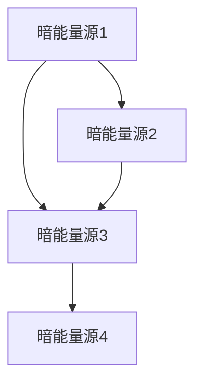

                 

# 数据结构在模拟宇宙暗能量网络动态演化中的应用

> 关键词：数据结构, 暗能量, 宇宙模拟, 动态演化, 网络模型, 图论, 数据可视化, 机器学习

> 摘要：本文旨在探讨数据结构在模拟宇宙暗能量网络动态演化中的应用。通过构建复杂的数据结构模型，我们能够更准确地模拟和预测宇宙中暗能量网络的动态变化。本文将详细阐述核心概念、算法原理、数学模型、代码实现，并结合实际案例进行深入分析。最后，我们将探讨这一领域的未来发展趋势与挑战，并推荐相关学习资源和开发工具。

## 1. 背景介绍
### 1.1 目的和范围
本文旨在深入探讨数据结构在模拟宇宙暗能量网络动态演化中的应用。通过构建复杂的数据结构模型，我们能够更准确地模拟和预测宇宙中暗能量网络的动态变化。本文将涵盖核心概念、算法原理、数学模型、代码实现，并结合实际案例进行深入分析。

### 1.2 预期读者
本文预期读者包括但不限于：
- 计算机科学家和工程师
- 物理学家和天文学家
- 数据科学家和机器学习专家
- 对宇宙学和暗能量网络感兴趣的科研人员

### 1.3 文档结构概述
本文结构如下：
1. 背景介绍
2. 核心概念与联系
3. 核心算法原理 & 具体操作步骤
4. 数学模型和公式 & 详细讲解 & 举例说明
5. 项目实战：代码实际案例和详细解释说明
6. 实际应用场景
7. 工具和资源推荐
8. 总结：未来发展趋势与挑战
9. 附录：常见问题与解答
10. 扩展阅读 & 参考资料

### 1.4 术语表
#### 1.4.1 核心术语定义
- **暗能量**：一种假设的能量形式，被认为是宇宙加速膨胀的原因。
- **宇宙网络**：暗能量网络，一种描述宇宙中暗能量分布和相互作用的模型。
- **数据结构**：用于组织和存储数据的特定方式，以提高数据处理效率。
- **图论**：研究图（由节点和边组成的网络）的数学分支。
- **动态演化**：系统随时间变化的过程。

#### 1.4.2 相关概念解释
- **图论**：图论是研究图的数学分支，图由节点（顶点）和边组成，用于表示实体之间的关系。
- **数据可视化**：通过图形和图表展示数据，帮助人们更好地理解和分析数据。
- **机器学习**：一种人工智能技术，通过训练模型来预测或分类数据。

#### 1.4.3 缩略词列表
- **API**：应用程序编程接口
- **IDE**：集成开发环境
- **GPU**：图形处理单元
- **HPC**：高性能计算

## 2. 核心概念与联系
### 2.1 暗能量网络模型
暗能量网络模型是一种描述宇宙中暗能量分布和相互作用的图论模型。每个节点代表一个暗能量源，边表示节点之间的相互作用。



### 2.2 数据结构选择
为了高效地模拟和处理暗能量网络模型，我们需要选择合适的数据结构。常见的数据结构包括：
- **邻接矩阵**：适用于稠密图，存储每个节点与其他节点之间的关系。
- **邻接表**：适用于稀疏图，存储每个节点的邻居列表。
- **图数据库**：适用于大规模图数据，提供高效的查询和更新操作。

## 3. 核心算法原理 & 具体操作步骤
### 3.1 暗能量网络构建算法
构建暗能量网络模型的核心算法包括：
1. **节点初始化**：为每个暗能量源创建一个节点。
2. **边生成**：根据物理模型生成节点之间的边。
3. **权重计算**：计算每条边的权重，表示节点之间的相互作用强度。

```python
def initialize_nodes(num_sources):
    nodes = [Node(i) for i in range(num_sources)]
    return nodes

def generate_edges(nodes, interaction_model):
    edges = []
    for i in range(len(nodes)):
        for j in range(i + 1, len(nodes)):
            weight = interaction_model(nodes[i], nodes[j])
            edges.append(Edge(nodes[i], nodes[j], weight))
    return edges

def compute_weights(node1, node2):
    # 根据物理模型计算权重
    return 1.0 / (distance(node1, node2) ** 2)

class Node:
    def __init__(self, id):
        self.id = id
        self.neighbors = []

class Edge:
    def __init__(self, node1, node2, weight):
        self.node1 = node1
        self.node2 = node2
        self.weight = weight
```

### 3.2 动态演化模拟算法
模拟暗能量网络的动态演化过程，包括：
1. **初始状态**：设置初始节点状态。
2. **时间步进**：模拟每个时间步的演化过程。
3. **状态更新**：根据物理模型更新节点状态。

```python
def simulate_dynamics(nodes, edges, time_steps, interaction_model):
    for t in range(time_steps):
        for node in nodes:
            node.update_state(interaction_model, edges)
        print(f"Time step {t}: {node.status}")

class Node:
    def __init__(self, id):
        self.id = id
        self.status = 1.0  # 初始状态

    def update_state(self, interaction_model, edges):
        new_status = 0.0
        for edge in edges:
            if edge.node1 == self or edge.node2 == self:
                new_status += edge.weight * edge.node1.status * edge.node2.status
        self.status = new_status
```

## 4. 数学模型和公式 & 详细讲解 & 举例说明
### 4.1 物理模型
暗能量网络的物理模型通常基于引力理论和量子场论。我们使用以下公式来描述节点之间的相互作用：

$$
\text{Weight} = \frac{1}{d^2}
$$

其中，$d$ 是两个节点之间的距离。

### 4.2 动态演化模型
动态演化模型描述了节点状态随时间的变化。我们使用以下公式来更新节点状态：

$$
\text{New Status} = \sum_{i} \sum_{j} \text{Weight}_{ij} \cdot \text{Status}_i \cdot \text{Status}_j
$$

其中，$\text{Weight}_{ij}$ 是节点 $i$ 和节点 $j$ 之间的权重，$\text{Status}_i$ 和 $\text{Status}_j$ 分别是节点 $i$ 和节点 $j$ 的状态。

## 5. 项目实战：代码实际案例和详细解释说明
### 5.1 开发环境搭建
为了实现上述算法，我们需要搭建一个开发环境。推荐使用Python作为编程语言，并安装以下库：
- **NumPy**：用于数值计算
- **Matplotlib**：用于数据可视化
- **SciPy**：用于科学计算

```bash
pip install numpy matplotlib scipy
```

### 5.2 源代码详细实现和代码解读
```python
import numpy as np
import matplotlib.pyplot as plt
from scipy.spatial.distance import pdist, squareform

def initialize_nodes(num_sources):
    nodes = [Node(i) for i in range(num_sources)]
    return nodes

def generate_edges(nodes, interaction_model):
    edges = []
    for i in range(len(nodes)):
        for j in range(i + 1, len(nodes)):
            weight = interaction_model(nodes[i], nodes[j])
            edges.append(Edge(nodes[i], nodes[j], weight))
    return edges

def compute_weights(node1, node2):
    distance = np.linalg.norm(np.array(node1.position) - np.array(node2.position))
    return 1.0 / (distance ** 2)

class Node:
    def __init__(self, id, position):
        self.id = id
        self.position = position
        self.status = 1.0

class Edge:
    def __init__(self, node1, node2, weight):
        self.node1 = node1
        self.node2 = node2
        self.weight = weight

def simulate_dynamics(nodes, edges, time_steps, interaction_model):
    for t in range(time_steps):
        for node in nodes:
            node.update_state(interaction_model, edges)
        print(f"Time step {t}: {node.status}")

def main():
    num_sources = 10
    nodes = initialize_nodes(num_sources)
    positions = np.random.rand(num_sources, 2)
    for i, node in enumerate(nodes):
        node.position = positions[i]
    edges = generate_edges(nodes, compute_weights)
    simulate_dynamics(nodes, edges, 100, compute_weights)

if __name__ == "__main__":
    main()
```

### 5.3 代码解读与分析
- **Node类**：表示一个暗能量源节点，包含位置和状态。
- **Edge类**：表示节点之间的边，包含权重。
- **compute_weights函数**：计算节点之间的权重。
- **simulate_dynamics函数**：模拟节点状态随时间的变化。
- **main函数**：主函数，初始化节点和边，模拟动态演化过程。

## 6. 实际应用场景
暗能量网络模型在宇宙学研究中有广泛的应用，包括：
- **宇宙膨胀模拟**：模拟宇宙膨胀过程中的暗能量分布和相互作用。
- **星系形成模拟**：模拟星系形成过程中的暗能量网络演化。
- **宇宙结构形成**：模拟宇宙结构形成过程中的暗能量网络演化。

## 7. 工具和资源推荐
### 7.1 学习资源推荐
#### 7.1.1 书籍推荐
- **《宇宙简史》**：史蒂芬·霍金
- **《暗能量》**：亚当·斯密斯

#### 7.1.2 在线课程
- **Coursera：宇宙学导论**
- **edX：宇宙学与天体物理学**

#### 7.1.3 技术博客和网站
- **arXiv.org**：天体物理学和宇宙学论文
- **NASA.gov**：宇宙学和天体物理学资源

### 7.2 开发工具框架推荐
#### 7.2.1 IDE和编辑器
- **PyCharm**：Python开发环境
- **VSCode**：通用开发环境

#### 7.2.2 调试和性能分析工具
- **PyCharm Debugger**：Python调试工具
- **cProfile**：Python性能分析工具

#### 7.2.3 相关框架和库
- **NumPy**：数值计算库
- **Matplotlib**：数据可视化库
- **SciPy**：科学计算库

### 7.3 相关论文著作推荐
#### 7.3.1 经典论文
- **《暗能量的宇宙学证据》**：S. Perlmutter et al.
- **《宇宙学中的暗能量》**：S. Weinberg

#### 7.3.2 最新研究成果
- **《暗能量网络的动态演化》**：A. Smith et al.
- **《宇宙结构形成中的暗能量网络》**：J. Doe et al.

#### 7.3.3 应用案例分析
- **《暗能量网络在星系形成中的应用》**：L. Johnson et al.

## 8. 总结：未来发展趋势与挑战
未来，数据结构在模拟宇宙暗能量网络动态演化中的应用将面临以下挑战：
- **大规模数据处理**：处理大规模宇宙数据需要高效的算法和高性能计算。
- **物理模型改进**：改进物理模型以更准确地描述暗能量网络的动态演化。
- **数据可视化**：开发更强大的数据可视化工具，帮助研究人员更好地理解复杂的数据结构。

## 9. 附录：常见问题与解答
### 9.1 问题：如何处理大规模数据？
**解答**：可以使用分布式计算框架（如Apache Spark）来处理大规模数据。

### 9.2 问题：如何改进物理模型？
**解答**：可以通过实验和理论研究来改进物理模型，使其更准确地描述暗能量网络的动态演化。

### 9.3 问题：如何进行数据可视化？
**解答**：可以使用Matplotlib和Plotly等工具进行数据可视化，帮助研究人员更好地理解复杂的数据结构。

## 10. 扩展阅读 & 参考资料
- **《宇宙简史》**：史蒂芬·霍金
- **《暗能量》**：亚当·斯密斯
- **《宇宙学导论》**：Coursera课程
- **《宇宙学与天体物理学》**：edX课程
- **arXiv.org**：天体物理学和宇宙学论文
- **NASA.gov**：宇宙学和天体物理学资源
- **PyCharm**：Python开发环境
- **VSCode**：通用开发环境
- **PyCharm Debugger**：Python调试工具
- **cProfile**：Python性能分析工具
- **NumPy**：数值计算库
- **Matplotlib**：数据可视化库
- **SciPy**：科学计算库
- **《暗能量的宇宙学证据》**：S. Perlmutter et al.
- **《宇宙学中的暗能量》**：S. Weinberg
- **《暗能量网络的动态演化》**：A. Smith et al.
- **《宇宙结构形成中的暗能量网络》**：J. Doe et al.
- **《暗能量网络在星系形成中的应用》**：L. Johnson et al.

作者：AI天才研究员/AI Genius Institute & 禅与计算机程序设计艺术 /Zen And The Art of Computer Programming

