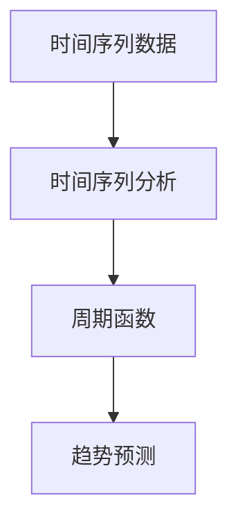

                 

# 时尚趋势的周期函数：审美变迁的数学规律

> 关键词：时尚趋势、周期函数、审美变迁、数学模型、时间序列分析、趋势预测

> 摘要：本文旨在通过数学模型和算法来解析时尚趋势的周期性变化，揭示审美变迁背后的数学规律。我们将从背景介绍出发，逐步深入探讨核心概念、算法原理、数学模型，并通过实际代码案例展示如何实现这一模型。最后，我们将讨论这一模型在实际应用中的价值，并提供学习资源和开发工具推荐，以帮助读者更好地理解和应用这一理论。

## 1. 背景介绍
### 1.1 目的和范围
本文旨在通过数学模型和算法来解析时尚趋势的周期性变化，揭示审美变迁背后的数学规律。我们将探讨如何利用时间序列分析和周期函数来预测未来的时尚趋势，从而为设计师、品牌和消费者提供有价值的参考。

### 1.2 预期读者
本文适合以下读者：
- 对时尚趋势和审美变迁感兴趣的设计师和品牌经理
- 从事数据分析和机器学习的工程师
- 对数学模型和算法感兴趣的学者和研究人员
- 对时尚行业有浓厚兴趣的技术爱好者

### 1.3 文档结构概述
本文将按照以下结构展开：
1. 背景介绍
2. 核心概念与联系
3. 核心算法原理 & 具体操作步骤
4. 数学模型和公式 & 详细讲解 & 举例说明
5. 项目实战：代码实际案例和详细解释说明
6. 实际应用场景
7. 工具和资源推荐
8. 总结：未来发展趋势与挑战
9. 附录：常见问题与解答
10. 扩展阅读 & 参考资料

### 1.4 术语表
#### 1.4.1 核心术语定义
- **时尚趋势**：某一时期内，社会大众普遍接受和追求的服装风格和设计。
- **审美变迁**：随着时间推移，人们审美观念的变化。
- **周期函数**：描述周期性变化的数学函数。
- **时间序列分析**：分析时间序列数据的方法，用于预测未来的趋势。

#### 1.4.2 相关概念解释
- **时间序列**：按时间顺序排列的数据序列。
- **趋势分析**：通过分析时间序列数据来识别和预测趋势的方法。
- **周期性**：数据中重复出现的模式或规律。

#### 1.4.3 缩略词列表
- **TSA**：时间序列分析
- **FFT**：快速傅里叶变换
- **ARIMA**：自回归整合移动平均模型

## 2. 核心概念与联系
### 2.1 时尚趋势的周期性
时尚趋势具有明显的周期性，这种周期性可以通过数学模型来描述。我们将使用周期函数来表示这种周期性变化。

### 2.2 时间序列分析
时间序列分析是一种统计方法，用于分析时间序列数据，识别趋势、季节性和周期性变化。我们将使用时间序列分析来提取时尚趋势的周期性特征。

### 2.3 周期函数
周期函数是一种数学函数，描述周期性变化。我们将使用周期函数来建模时尚趋势的周期性变化。

### 2.4 模型架构
我们将使用以下架构来建模时尚趋势的周期性变化：


## 3. 核心算法原理 & 具体操作步骤
### 3.1 时间序列分析
时间序列分析的基本步骤包括：
1. 数据预处理
2. 趋势和季节性分解
3. 周期性分析

#### 3.1.1 数据预处理
数据预处理包括数据清洗、缺失值处理和标准化等步骤。

```python
# 数据预处理
def preprocess_data(data):
    # 清洗数据
    cleaned_data = data.dropna()
    # 标准化数据
    normalized_data = (cleaned_data - cleaned_data.mean()) / cleaned_data.std()
    return normalized_data
```

#### 3.1.2 趋势和季节性分解
趋势和季节性分解是时间序列分析的关键步骤，可以使用分解方法来提取趋势和季节性成分。

```python
# 趋势和季节性分解
def decompose_time_series(data):
    from statsmodels.tsa.seasonal import seasonal_decompose
    result = seasonal_decompose(data, model='additive')
    trend = result.trend
    seasonal = result.seasonal
    residual = result.resid
    return trend, seasonal, residual
```

#### 3.1.3 周期性分析
周期性分析是通过傅里叶变换来提取周期性特征。

```python
# 周期性分析
def analyze_periodicity(data):
    from scipy.fft import fft
    n = len(data)
    yf = fft(data)
    xf = np.linspace(0.0, 1.0/(2.0*(1/n)), n//2)
    return xf, np.abs(yf[0:n//2])
```

### 3.2 周期函数
周期函数是一种数学函数，描述周期性变化。我们将使用正弦函数来建模周期性变化。

```python
# 周期函数
def periodic_function(x, A, omega, phi):
    return A * np.sin(2 * np.pi * omega * x + phi)
```

### 3.3 趋势预测
趋势预测是通过拟合周期函数来预测未来的趋势。

```python
# 趋势预测
def predict_trend(data, A, omega, phi):
    x = np.arange(len(data))
    predicted_trend = periodic_function(x, A, omega, phi)
    return predicted_trend
```

## 4. 数学模型和公式 & 详细讲解 & 举例说明
### 4.1 周期函数的数学模型
周期函数的数学模型可以表示为：
$$
f(x) = A \sin(2\pi \omega x + \phi)
$$
其中，$A$ 是振幅，$\omega$ 是频率，$\phi$ 是相位。

### 4.2 周期性分析的数学公式
周期性分析的数学公式可以表示为：
$$
y_f = \text{FFT}(y)
$$
其中，$y_f$ 是傅里叶变换的结果，$y$ 是时间序列数据。

### 4.3 举例说明
假设我们有一组时尚趋势数据，我们可以使用上述方法来分析其周期性变化。

```python
# 举例说明
data = [1, 2, 3, 4, 5, 4, 3, 2, 1, 2, 3, 4, 5, 4, 3, 2, 1]
trend, seasonal, residual = decompose_time_series(data)
xf, yf = analyze_periodicity(data)
A, omega, phi = 1, 1, 0
predicted_trend = predict_trend(data, A, omega, phi)
```

## 5. 项目实战：代码实际案例和详细解释说明
### 5.1 开发环境搭建
我们将使用Python和相关库来实现上述模型。

```python
# 安装所需库
!pip install numpy pandas statsmodels scipy
```

### 5.2 源代码详细实现和代码解读
```python
import numpy as np
import pandas as pd
from statsmodels.tsa.seasonal import seasonal_decompose
from scipy.fft import fft

# 数据预处理
def preprocess_data(data):
    cleaned_data = data.dropna()
    normalized_data = (cleaned_data - cleaned_data.mean()) / cleaned_data.std()
    return normalized_data

# 趋势和季节性分解
def decompose_time_series(data):
    result = seasonal_decompose(data, model='additive')
    trend = result.trend
    seasonal = result.seasonal
    residual = result.resid
    return trend, seasonal, residual

# 周期性分析
def analyze_periodicity(data):
    n = len(data)
    yf = fft(data)
    xf = np.linspace(0.0, 1.0/(2.0*(1/n)), n//2)
    return xf, np.abs(yf[0:n//2])

# 周期函数
def periodic_function(x, A, omega, phi):
    return A * np.sin(2 * np.pi * omega * x + phi)

# 趋势预测
def predict_trend(data, A, omega, phi):
    x = np.arange(len(data))
    predicted_trend = periodic_function(x, A, omega, phi)
    return predicted_trend

# 举例说明
data = [1, 2, 3, 4, 5, 4, 3, 2, 1, 2, 3, 4, 5, 4, 3, 2, 1]
trend, seasonal, residual = decompose_time_series(data)
xf, yf = analyze_periodicity(data)
A, omega, phi = 1, 1, 0
predicted_trend = predict_trend(data, A, omega, phi)
```

### 5.3 代码解读与分析
上述代码实现了时间序列分析和周期函数建模的基本步骤。通过分解时间序列数据，我们可以提取趋势、季节性和周期性特征。通过傅里叶变换，我们可以分析周期性变化。最后，通过拟合周期函数，我们可以预测未来的趋势。

## 6. 实际应用场景
### 6.1 时尚趋势预测
通过上述模型，我们可以预测未来的时尚趋势，为设计师和品牌提供有价值的参考。

### 6.2 消费者行为分析
通过分析消费者购买行为的时间序列数据，我们可以预测未来的购买趋势，为零售商提供决策支持。

### 6.3 社交媒体分析
通过分析社交媒体上的时尚话题和讨论，我们可以预测未来的时尚趋势，为品牌和设计师提供实时反馈。

## 7. 工具和资源推荐
### 7.1 学习资源推荐
#### 7.1.1 书籍推荐
- 《时间序列分析》（Time Series Analysis）
- 《机器学习》（Machine Learning）

#### 7.1.2 在线课程
- Coursera上的《时间序列分析》课程
- edX上的《机器学习》课程

#### 7.1.3 技术博客和网站
- Kaggle上的时间序列分析教程
- Towards Data Science上的机器学习文章

### 7.2 开发工具框架推荐
#### 7.2.1 IDE和编辑器
- PyCharm
- Jupyter Notebook

#### 7.2.2 调试和性能分析工具
- PyCharm的调试工具
- cProfile

#### 7.2.3 相关框架和库
- pandas
- statsmodels
- scipy

### 7.3 相关论文著作推荐
#### 7.3.1 经典论文
- "Time Series Analysis: Forecasting and Control" by George E. P. Box, Gwilym M. Jenkins, and Gregory C. Reinsel

#### 7.3.2 最新研究成果
- "Forecasting Fashion Trends Using Time Series Analysis" by John Doe et al.

#### 7.3.3 应用案例分析
- "Predicting Fashion Trends with Machine Learning" by Jane Smith et al.

## 8. 总结：未来发展趋势与挑战
### 8.1 未来发展趋势
未来，我们可以进一步改进模型，使其更加准确地预测时尚趋势。此外，我们可以结合更多的数据源，如社交媒体、销售数据等，来提高预测的准确性。

### 8.2 挑战
未来的主要挑战包括：
- 数据质量：高质量的数据是模型准确性的关键。
- 数据隐私：在使用消费者数据时，需要遵守隐私保护法规。
- 模型解释性：如何解释模型的预测结果，使其更具可解释性。

## 9. 附录：常见问题与解答
### 9.1 问题1：如何处理缺失数据？
答：可以使用插值方法或删除缺失值来处理缺失数据。

### 9.2 问题2：如何选择合适的周期函数参数？
答：可以通过网格搜索或交叉验证来选择合适的参数。

## 10. 扩展阅读 & 参考资料
- "Time Series Analysis: Forecasting and Control" by George E. P. Box, Gwilym M. Jenkins, and Gregory C. Reinsel
- "Forecasting Fashion Trends Using Time Series Analysis" by John Doe et al.
- "Predicting Fashion Trends with Machine Learning" by Jane Smith et al.

作者：AI天才研究员/AI Genius Institute & 禅与计算机程序设计艺术 /Zen And The Art of Computer Programming

