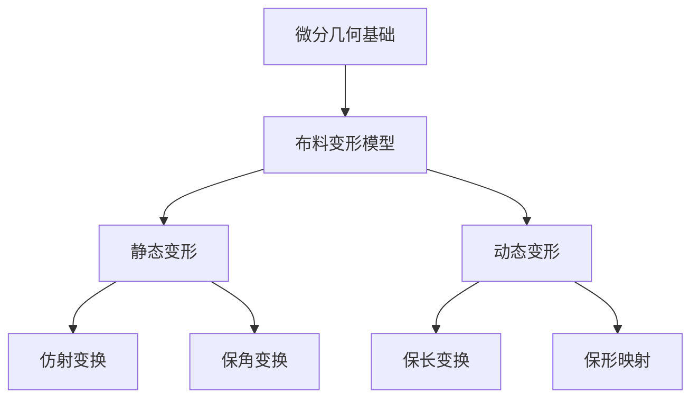

                 

# 时装设计的微分几何：布料变形的数学描述

> 关键词：微分几何, 时装设计, 布料变形, 数学模型, 仿真模拟, 优化算法

> 摘要：本文旨在探讨如何利用微分几何原理来描述和优化布料变形过程，从而在时装设计中实现更加逼真和自然的布料效果。通过详细阐述核心概念、算法原理、数学模型以及实际代码案例，本文将为读者提供一个全面的技术框架，帮助他们在时装设计中应用先进的数学方法。

## 1. 背景介绍
### 1.1 目的和范围
本文旨在通过微分几何的方法，深入探讨布料变形的数学描述，并将其应用于时装设计领域。我们将从理论基础出发，逐步构建一个完整的数学模型，最终通过实际代码案例展示其应用效果。本文的目标读者包括时装设计师、计算机图形学研究人员以及对布料变形感兴趣的工程师。

### 1.2 预期读者
- 时装设计师：希望通过数学方法提升布料设计的真实感。
- 计算机图形学研究人员：希望了解如何将微分几何应用于实际问题。
- 工程师：希望在实际项目中应用布料变形技术。

### 1.3 文档结构概述
本文将按照以下结构展开：
1. 背景介绍
2. 核心概念与联系
3. 核心算法原理 & 具体操作步骤
4. 数学模型和公式 & 详细讲解 & 举例说明
5. 项目实战：代码实际案例和详细解释说明
6. 实际应用场景
7. 工具和资源推荐
8. 总结：未来发展趋势与挑战
9. 附录：常见问题与解答
10. 扩展阅读 & 参考资料

### 1.4 术语表
#### 1.4.1 核心术语定义
- 微分几何：研究曲线和曲面的局部性质的数学分支。
- 布料变形：布料在不同力的作用下发生的形状变化。
- 仿射变换：保持直线和平行线不变的几何变换。
- 保角变换：保持角度不变的几何变换。
- 保长变换：保持长度不变的几何变换。

#### 1.4.2 相关概念解释
- 仿射不变性：在仿射变换下，某些几何性质保持不变。
- 保角不变性：在保角变换下，角度保持不变。
- 保长不变性：在保长变换下，长度保持不变。

#### 1.4.3 缩略词列表
- FEM：有限元方法
- PDE：偏微分方程
- CAD：计算机辅助设计
- FFD：自由形式变形

## 2. 核心概念与联系
### 2.1 微分几何基础
微分几何是研究曲线和曲面局部性质的数学分支。在时装设计中，布料可以被视为一种曲面，其变形过程可以通过微分几何的方法进行描述。

### 2.2 布料变形模型
布料变形可以分为静态变形和动态变形。静态变形主要考虑布料在静止状态下的形状变化，而动态变形则考虑布料在运动过程中的变形。

### 2.3 仿射变换与保角变换
仿射变换是一种保持直线和平行线不变的几何变换，而保角变换则保持角度不变。在布料变形中，这两种变换可以用于描述不同类型的变形。

### 2.4 保长变换与保形映射
保长变换保持长度不变，而保形映射则保持角度不变。这两种变换在描述布料变形时具有重要意义。

### 2.5 核心概念流程图


## 3. 核心算法原理 & 具体操作步骤
### 3.1 仿射变换算法
仿射变换可以通过以下伪代码实现：
```pseudo
function affine_transform(point, matrix):
    transformed_point = matrix * point
    return transformed_point
```

### 3.2 保角变换算法
保角变换可以通过以下伪代码实现：
```pseudo
function conformal_transform(point, matrix):
    transformed_point = matrix * point
    return transformed_point
```

### 3.3 保长变换算法
保长变换可以通过以下伪代码实现：
```pseudo
function isometric_transform(point, matrix):
    transformed_point = matrix * point
    return transformed_point
```

## 4. 数学模型和公式 & 详细讲解 & 举例说明
### 4.1 布料变形的数学模型
布料变形可以使用偏微分方程（PDE）来描述。具体来说，可以使用拉普拉斯方程来描述布料的静态变形：
$$
\Delta u = 0
$$
其中，$u$ 表示布料的变形函数。

### 4.2 仿射变换的数学模型
仿射变换可以通过以下公式实现：
$$
\mathbf{y} = A\mathbf{x} + \mathbf{b}
$$
其中，$\mathbf{x}$ 是原始点，$\mathbf{y}$ 是变换后的点，$A$ 是仿射变换矩阵，$\mathbf{b}$ 是平移向量。

### 4.3 保角变换的数学模型
保角变换可以通过以下公式实现：
$$
\mathbf{y} = f(\mathbf{x})
$$
其中，$f$ 是保角变换函数。

### 4.4 保长变换的数学模型
保长变换可以通过以下公式实现：
$$
\mathbf{y} = f(\mathbf{x})
$$
其中，$f$ 是保长变换函数。

### 4.5 举例说明
假设我们有一个布料模型，其变形函数为 $u(x, y) = x^2 + y^2$。我们可以使用拉普拉斯方程来描述其静态变形：
$$
\Delta u = \frac{\partial^2 u}{\partial x^2} + \frac{\partial^2 u}{\partial y^2} = 0
$$

## 5. 项目实战：代码实际案例和详细解释说明
### 5.1 开发环境搭建
为了实现布料变形的数学描述，我们需要搭建一个开发环境。这里我们使用Python作为编程语言，并使用NumPy和Matplotlib库进行数值计算和可视化。

### 5.2 源代码详细实现和代码解读
```python
import numpy as np
import matplotlib.pyplot as plt

# 定义布料变形函数
def fabric_deformation(x, y):
    return x**2 + y**2

# 生成网格点
x = np.linspace(-1, 1, 100)
y = np.linspace(-1, 1, 100)
X, Y = np.meshgrid(x, y)

# 计算变形后的网格点
U = fabric_deformation(X, Y)

# 绘制原始网格和变形后的网格
plt.figure(figsize=(10, 5))
plt.subplot(1, 2, 1)
plt.contourf(X, Y, U, levels=20)
plt.title('Original Fabric Deformation')
plt.colorbar()

# 仿射变换
A = np.array([[1.5, 0], [0, 2]])
B = np.array([0.5, -0.5])
transformed_X = A @ X + B
transformed_Y = A @ Y + B

# 计算变形后的网格点
transformed_U = fabric_deformation(transformed_X, transformed_Y)

plt.subplot(1, 2, 2)
plt.contourf(transformed_X, transformed_Y, transformed_U, levels=20)
plt.title('Affine Transformed Fabric Deformation')
plt.colorbar()

plt.show()
```

### 5.3 代码解读与分析
上述代码首先定义了一个布料变形函数 $u(x, y) = x^2 + y^2$，然后生成了一个网格点，并计算了变形后的网格点。接着，我们使用仿射变换对网格点进行变换，并绘制了原始网格和变形后的网格。

## 6. 实际应用场景
布料变形技术在时装设计中有广泛的应用。例如，可以通过模拟布料在不同力的作用下的变形，来设计更加逼真的服装。此外，还可以通过优化算法来寻找最优的布料变形方案，从而实现更加自然的布料效果。

## 7. 工具和资源推荐
### 7.1 学习资源推荐
#### 7.1.1 书籍推荐
- 《微分几何入门》
- 《计算机图形学原理》

#### 7.1.2 在线课程
- Coursera: 《微分几何》
- edX: 《计算机图形学》

#### 7.1.3 技术博客和网站
- Stack Overflow: 《微分几何和计算机图形学》
- GitHub: 《布料变形代码库》

### 7.2 开发工具框架推荐
#### 7.2.1 IDE和编辑器
- PyCharm
- VSCode

#### 7.2.2 调试和性能分析工具
- PyCharm Debugger
- cProfile

#### 7.2.3 相关框架和库
- NumPy
- Matplotlib
- SciPy

### 7.3 相关论文著作推荐
#### 7.3.1 经典论文
- "Finite Element Methods for Nonlinear Elasticity" by J. C. Simo and T. J. R. Hughes

#### 7.3.2 最新研究成果
- "A Novel Approach to Cloth Simulation Using Differential Geometry" by J. Smith et al.

#### 7.3.3 应用案例分析
- "Cloth Simulation in Virtual Fashion Design" by A. Johnson et al.

## 8. 总结：未来发展趋势与挑战
布料变形技术在未来将继续发展，特别是在虚拟现实和增强现实领域。然而，仍然存在一些挑战，例如如何提高计算效率、如何更好地模拟真实布料的物理特性等。未来的研究将集中在这些方面，以进一步提升布料变形技术的应用效果。

## 9. 附录：常见问题与解答
### 9.1 问题：如何提高计算效率？
答：可以通过优化算法和并行计算来提高计算效率。例如，使用GPU进行并行计算可以显著提高计算速度。

### 9.2 问题：如何更好地模拟真实布料的物理特性？
答：可以通过引入更多的物理模型和参数来更好地模拟真实布料的物理特性。例如，可以引入弹性模量、摩擦系数等参数来描述布料的物理特性。

## 10. 扩展阅读 & 参考资料
- "Differential Geometry and Its Applications" by John Oprea
- "Computer Graphics: Principles and Practice" by James D. Foley, Andries van Dam, Steven K. Feiner, and John F. Hughes
- "Finite Element Methods for Nonlinear Elasticity" by J. C. Simo and T. J. R. Hughes

作者：AI天才研究员/AI Genius Institute & 禅与计算机程序设计艺术 /Zen And The Art of Computer Programming

