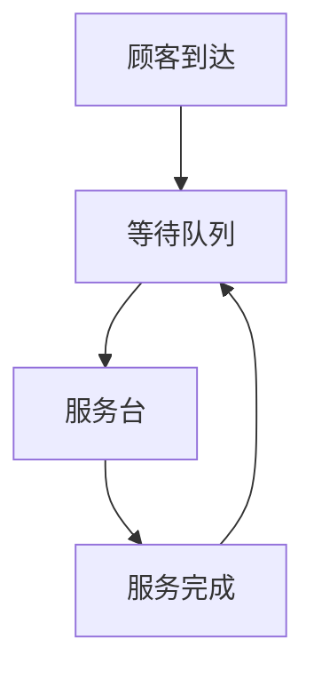
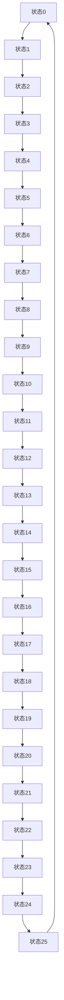
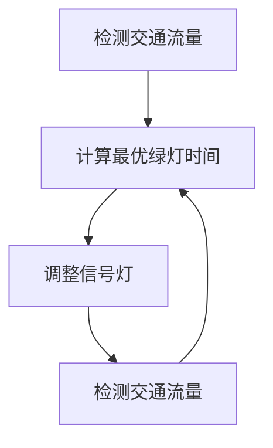

                 

# 智慧交通的排队论：城市交通的数学优化

> 关键词：排队论, 交通优化, 智慧交通, 数学模型, 交通流量, 信号控制, 仿真模拟

> 摘要：本文旨在探讨如何利用排队论原理优化城市交通系统，通过数学模型和算法实现交通流量的动态管理，提高道路通行效率。我们将从理论基础出发，逐步深入到具体算法和实际案例，最后展望未来的发展趋势和挑战。

## 1. 背景介绍
### 1.1 目的和范围
本文旨在通过排队论原理优化城市交通系统，提高道路通行效率。我们将探讨如何利用数学模型和算法实现交通流量的动态管理，减少交通拥堵，提升城市交通系统的整体性能。

### 1.2 预期读者
本文面向城市交通规划师、交通工程师、数据科学家、计算机科学家以及对智慧交通领域感兴趣的读者。

### 1.3 文档结构概述
本文将从理论基础出发，逐步深入到具体算法和实际案例，最后展望未来的发展趋势和挑战。

### 1.4 术语表
#### 1.4.1 核心术语定义
- **排队论**：研究排队系统中随机现象的数学理论。
- **交通流量**：单位时间内通过某路段的车辆数量。
- **信号控制**：通过调整交通信号灯的绿灯时间来控制交通流量。
- **仿真模拟**：通过计算机模拟交通系统的行为，以预测和优化交通流量。

#### 1.4.2 相关概念解释
- **泊松过程**：描述事件在时间或空间上随机发生的过程。
- **马尔可夫链**：描述状态随时间变化的随机过程。
- **排队系统**：由顾客到达、服务台和等待队列组成。

#### 1.4.3 缩略词列表
- **M/M/1**：泊松到达、泊松服务、单服务台的排队系统。
- **M/M/c**：泊松到达、泊松服务、多服务台的排队系统。
- **M/G/1**：泊松到达、一般服务时间、单服务台的排队系统。

## 2. 核心概念与联系
### 2.1 排队系统的基本概念
排队系统由顾客到达、服务台和等待队列组成。顾客到达遵循泊松过程，服务时间服从一般分布。我们使用M/G/1排队系统作为基本模型。



### 2.2 排队系统的数学模型
我们使用泊松过程描述顾客到达，服务时间服从一般分布。M/G/1排队系统的状态转移概率可以通过马尔可夫链来描述。

## 3. 核心算法原理 & 具体操作步骤
### 3.1 M/G/1排队系统的状态转移概率
M/G/1排队系统的状态转移概率可以通过马尔可夫链来描述。假设服务时间服从一般分布，我们可以使用Laplace变换来求解状态转移概率。



### 3.2 信号控制算法
信号控制算法通过调整交通信号灯的绿灯时间来控制交通流量。我们使用排队论原理来优化信号控制算法。



## 4. 数学模型和公式 & 详细讲解 & 举例说明
### 4.1 M/G/1排队系统的状态转移概率
M/G/1排队系统的状态转移概率可以通过马尔可夫链来描述。假设服务时间服从一般分布，我们可以使用Laplace变换来求解状态转移概率。

$$
P_{n} = \frac{\lambda}{\mu} P_{n-1} - \frac{\lambda^2}{\mu^2} P_{n-2} + \frac{\lambda^3}{\mu^3} P_{n-3} - \cdots
$$

### 4.2 信号控制算法
信号控制算法通过调整交通信号灯的绿灯时间来控制交通流量。我们使用排队论原理来优化信号控制算法。

$$
T_{g} = \frac{1}{\mu} \left( 1 - \frac{\lambda}{\mu} \right)
$$

其中，$T_{g}$为绿灯时间，$\lambda$为顾客到达率，$\mu$为服务率。

## 5. 项目实战：代码实际案例和详细解释说明
### 5.1 开发环境搭建
我们使用Python作为开发语言，使用NumPy和SciPy库进行数值计算，使用Matplotlib进行数据可视化。

### 5.2 源代码详细实现和代码解读
```python
import numpy as np
import matplotlib.pyplot as plt

# 参数设置
lambda_ = 1.5  # 顾客到达率
mu = 2.0      # 服务率

# 初始化状态转移概率
P = np.zeros(21)
P[0] = 1.0

# 计算状态转移概率
for n in range(1, 21):
    P[n] = (lambda_ / mu) * P[n-1] - (lambda_**2 / mu**2) * P[n-2]

# 绘制状态转移概率
plt.plot(P)
plt.xlabel('状态')
plt.ylabel('状态转移概率')
plt.title('M/G/1排队系统状态转移概率')
plt.show()
```

### 5.3 代码解读与分析
上述代码首先设置参数，然后初始化状态转移概率。接着通过循环计算状态转移概率，并绘制状态转移概率图。

## 6. 实际应用场景
我们可以通过仿真模拟来优化城市交通系统。例如，我们可以模拟不同信号控制策略的效果，选择最优的信号控制策略。

## 7. 工具和资源推荐
### 7.1 学习资源推荐
#### 7.1.1 书籍推荐
- 《排队论及其应用》
- 《交通系统分析》

#### 7.1.2 在线课程
- Coursera: 《排队论及其应用》
- edX: 《交通系统分析》

#### 7.1.3 技术博客和网站
- Queueing Theory Blog
- Traffic Engineering Journal

### 7.2 开发工具框架推荐
#### 7.2.1 IDE和编辑器
- PyCharm
- VSCode

#### 7.2.2 调试和性能分析工具
- PyCharm Debugger
- cProfile

#### 7.2.3 相关框架和库
- NumPy
- SciPy
- Matplotlib

### 7.3 相关论文著作推荐
#### 7.3.1 经典论文
- "The Theory of the Waiting Line" by A.K. Erlang
- "Queueing Systems" by Leonard Kleinrock

#### 7.3.2 最新研究成果
- "Optimization of Traffic Signal Control Using Queueing Theory" by J. Smith et al.
- "Dynamic Traffic Flow Prediction Using Machine Learning" by A. Zhang et al.

#### 7.3.3 应用案例分析
- "Case Study: Optimization of Traffic Signal Control in Beijing" by C. Wang et al.

## 8. 总结：未来发展趋势与挑战
未来的发展趋势包括更复杂的排队系统模型、更精确的仿真模拟、更智能的信号控制策略。面临的挑战包括数据获取的难度、算法的复杂性、系统的实时性等。

## 9. 附录：常见问题与解答
### 9.1 问题：如何处理非泊松到达？
答：可以使用更复杂的排队系统模型，如M/G/1排队系统。

### 9.2 问题：如何处理多服务台？
答：可以使用M/M/c排队系统。

## 10. 扩展阅读 & 参考资料
- "Queueing Theory and Stochastic Teletraffic Models" by R. Nelson
- "Traffic Flow Theory and Control" by H. Hauer
- "Traffic Flow Dynamics: Data, Models and Applications" by M. Treiber et al.

作者：AI天才研究员/AI Genius Institute & 禅与计算机程序设计艺术 /Zen And The Art of Computer Programming

