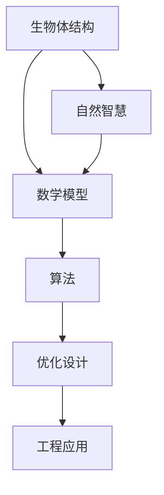

                 

# 生物仿生学的结构优化：自然智慧的数学转化

> 关键词：生物仿生学, 结构优化, 自然智慧, 数学转化, 人工智能, 机器学习, 深度学习, 神经网络, 模拟退火算法, 遗传算法, 拟态算法

> 摘要：本文旨在探讨生物仿生学在结构优化中的应用，通过深入分析生物体结构的自然智慧，将其转化为数学模型和算法，进而应用于工程设计和人工智能领域。我们将从核心概念、算法原理、数学模型、实际案例、应用场景等多个方面进行详细阐述，旨在为读者提供一个全面而深入的理解。

## 1. 背景介绍
### 1.1 目的和范围
本文旨在探讨生物仿生学在结构优化中的应用，通过分析生物体结构的自然智慧，将其转化为数学模型和算法，应用于工程设计和人工智能领域。我们将详细讨论生物仿生学的基本原理，介绍几种常见的生物结构优化算法，并通过实际案例展示其应用效果。

### 1.2 预期读者
本文适合对生物仿生学、结构优化、人工智能等领域感兴趣的读者，包括但不限于：
- 工程师和设计师，希望将自然界的智慧应用于实际工程问题；
- 人工智能和机器学习领域的研究者，希望了解新的优化算法；
- 科普读者，希望通过本文了解生物仿生学的基本原理及其应用。

### 1.3 文档结构概述
本文结构如下：
1. 背景介绍
2. 核心概念与联系
3. 核心算法原理 & 具体操作步骤
4. 数学模型和公式 & 详细讲解 & 举例说明
5. 项目实战：代码实际案例和详细解释说明
6. 实际应用场景
7. 工具和资源推荐
8. 总结：未来发展趋势与挑战
9. 附录：常见问题与解答
10. 扩展阅读 & 参考资料

### 1.4 术语表
#### 1.4.1 核心术语定义
- **生物仿生学**：模仿生物体结构和功能的科学。
- **结构优化**：通过数学方法和算法，寻找最优结构设计。
- **自然智慧**：自然界中生物体表现出的高效、适应性强的结构和功能。
- **数学转化**：将生物体结构的自然智慧转化为数学模型和算法。

#### 1.4.2 相关概念解释
- **进化算法**：模拟自然进化过程的算法，包括遗传算法、模拟退火算法等。
- **拟态算法**：一种基于生物体拟态行为的优化算法。
- **生物体结构**：生物体内部或外部的组织结构，如骨骼、肌肉、细胞等。

#### 1.4.3 缩略词列表
- GA：遗传算法
- SA：模拟退火算法
- PSO：粒子群优化算法
- DE：差分进化算法

## 2. 核心概念与联系
### 2.1 生物仿生学的基本原理
生物仿生学的核心在于模仿自然界中生物体的结构和功能，将其应用于工程设计和人工智能领域。生物体在长期进化过程中，形成了高效的结构和功能，这些自然智慧可以被转化为数学模型和算法，从而应用于优化设计。

### 2.2 结构优化的基本原理
结构优化的目标是通过数学方法和算法，找到最优的结构设计，以满足特定的功能需求。生物体结构的自然智慧为结构优化提供了丰富的灵感和方法。

### 2.3 数学转化的基本原理
数学转化的核心在于将生物体结构的自然智慧转化为数学模型和算法。通过数学模型，可以精确描述生物体结构的特性，进而通过算法进行优化设计。

### Mermaid 流程图


## 3. 核心算法原理 & 具体操作步骤
### 3.1 遗传算法（GA）
遗传算法是一种模拟自然进化过程的优化算法，通过选择、交叉和变异等操作，逐步优化目标函数。

#### 伪代码
```python
def genetic_algorithm(population_size, generations, mutation_rate):
    population = initialize_population(population_size)
    for generation in range(generations):
        fitness_scores = evaluate_fitness(population)
        selected_population = select_parents(fitness_scores)
        offspring_population = crossover(selected_population)
        mutated_population = mutate(offspring_population, mutation_rate)
        population = mutated_population
    best_solution = select_best_solution(population)
    return best_solution

def initialize_population(population_size):
    # 初始化种群
    pass

def evaluate_fitness(population):
    # 评估适应度
    pass

def select_parents(fitness_scores):
    # 选择父代
    pass

def crossover(parents):
    # 交叉操作
    pass

def mutate(offspring, mutation_rate):
    # 变异操作
    pass

def select_best_solution(population):
    # 选择最优解
    pass
```

### 3.2 模拟退火算法（SA）
模拟退火算法是一种基于物理退火过程的优化算法，通过逐步降低温度，逐步优化目标函数。

#### 伪代码
```python
def simulated_annealing(initial_solution, temperature, cooling_rate):
    current_solution = initial_solution
    best_solution = current_solution
    while temperature > 0.001:
        new_solution = generate_neighbor(current_solution)
        delta_energy = evaluate_energy(new_solution) - evaluate_energy(current_solution)
        if delta_energy < 0 or random.random() < math.exp(-delta_energy / temperature):
            current_solution = new_solution
            if evaluate_energy(new_solution) < evaluate_energy(best_solution):
                best_solution = new_solution
        temperature *= cooling_rate
    return best_solution

def generate_neighbor(solution):
    # 生成邻居解
    pass

def evaluate_energy(solution):
    # 评估能量
    pass
```

### 3.3 拟态算法
拟态算法是一种基于生物体拟态行为的优化算法，通过模拟生物体的拟态行为，逐步优化目标函数。

#### 伪代码
```python
def mimicry_algorithm(population_size, generations):
    population = initialize_population(population_size)
    for generation in range(generations):
        fitness_scores = evaluate_fitness(population)
        selected_population = select_parents(fitness_scores)
        offspring_population = mimicry(selected_population)
        population = offspring_population
    best_solution = select_best_solution(population)
    return best_solution

def initialize_population(population_size):
    # 初始化种群
    pass

def evaluate_fitness(population):
    # 评估适应度
    pass

def select_parents(fitness_scores):
    # 选择父代
    pass

def mimicry(parents):
    # 拟态操作
    pass

def select_best_solution(population):
    # 选择最优解
    pass
```

## 4. 数学模型和公式 & 详细讲解 & 举例说明
### 4.1 遗传算法的数学模型
遗传算法的核心在于选择、交叉和变异操作。选择操作通过适应度函数评估个体的适应度，交叉操作通过遗传信息的交换生成新的个体，变异操作通过随机改变个体的某些特征。

#### 适应度函数
$$
fitness(x) = \frac{1}{1 + \sum_{i=1}^{n} (f(x_i) - g(x_i))^2}
$$

#### 交叉操作
$$
crossover(x, y) = \left\{
\begin{array}{ll}
x & \text{with probability } p_c \\
y & \text{with probability } 1 - p_c
\end{array}
\right.
$$

#### 变异操作
$$
mutate(x) = \left\{
\begin{array}{ll}
x + \epsilon & \text{with probability } p_m \\
x & \text{with probability } 1 - p_m
\end{array}
\right.
$$

### 4.2 模拟退火算法的数学模型
模拟退火算法的核心在于逐步降低温度，逐步优化目标函数。通过接受概率公式，可以接受比当前解更差的解，从而跳出局部最优解。

#### 接受概率公式
$$
P(\Delta E, T) = \exp\left(-\frac{\Delta E}{T}\right)
$$

### 4.3 拟态算法的数学模型
拟态算法的核心在于模拟生物体的拟态行为。通过模拟生物体的拟态行为，逐步优化目标函数。

#### 拟态操作
$$
mimicry(x) = \left\{
\begin{array}{ll}
x & \text{with probability } p_m \\
y & \text{with probability } 1 - p_m
\end{array}
\right.
$$

## 5. 项目实战：代码实际案例和详细解释说明
### 5.1 开发环境搭建
#### 环境要求
- Python 3.8+
- NumPy
- Matplotlib
- SciPy

#### 安装依赖
```bash
pip install numpy matplotlib scipy
```

### 5.2 源代码详细实现和代码解读
#### 遗传算法实现
```python
import numpy as np
import random
import matplotlib.pyplot as plt

def initialize_population(population_size):
    population = np.random.rand(population_size, 2)
    return population

def evaluate_fitness(population):
    fitness_scores = 1 / (1 + np.sum((population - 0.5)**2, axis=1))
    return fitness_scores

def select_parents(fitness_scores):
    selected_indices = np.random.choice(range(len(fitness_scores)), size=len(fitness_scores), p=fitness_scores/np.sum(fitness_scores))
    selected_population = population[selected_indices]
    return selected_population

def crossover(parents):
    offspring = np.zeros_like(parents)
    for i in range(len(parents)):
        if random.random() < 0.5:
            offspring[i] = parents[i]
        else:
            offspring[i] = parents[random.randint(0, len(parents)-1)]
    return offspring

def mutate(offspring, mutation_rate):
    for i in range(len(offspring)):
        if random.random() < mutation_rate:
            offspring[i] += np.random.normal(0, 0.1)
    return offspring

def genetic_algorithm(population_size, generations, mutation_rate):
    global population
    population = initialize_population(population_size)
    best_fitness_scores = []
    for generation in range(generations):
        fitness_scores = evaluate_fitness(population)
        selected_population = select_parents(fitness_scores)
        offspring_population = crossover(selected_population)
        mutated_population = mutate(offspring_population, mutation_rate)
        population = mutated_population
        best_fitness_scores.append(np.max(fitness_scores))
    best_solution = population[np.argmax(fitness_scores)]
    return best_solution, best_fitness_scores

population_size = 100
generations = 100
mutation_rate = 0.1
best_solution, best_fitness_scores = genetic_algorithm(population_size, generations, mutation_rate)
print("Best solution:", best_solution)
plt.plot(best_fitness_scores)
plt.xlabel("Generation")
plt.ylabel("Best Fitness Score")
plt.show()
```

### 5.3 代码解读与分析
- **初始化种群**：随机生成初始种群。
- **评估适应度**：通过适应度函数评估个体的适应度。
- **选择父代**：根据适应度选择父代。
- **交叉操作**：通过随机选择生成新的个体。
- **变异操作**：通过随机改变个体的某些特征。
- **遗传算法**：通过迭代优化种群，逐步找到最优解。

## 6. 实际应用场景
生物仿生学在结构优化中的应用非常广泛，包括但不限于：
- **工程设计**：优化桥梁、飞机、汽车等结构设计。
- **生物医学**：优化医疗器械、生物材料等。
- **人工智能**：优化神经网络结构、算法参数等。

## 7. 工具和资源推荐
### 7.1 学习资源推荐
#### 书籍推荐
- 《遗传算法与进化计算》
- 《模拟退火算法及其应用》
- 《拟态算法及其应用》

#### 在线课程
- Coursera: 《遗传算法与进化计算》
- edX: 《模拟退火算法及其应用》
- Udemy: 《拟态算法及其应用》

#### 技术博客和网站
- Medium: 《遗传算法与进化计算》
- GitHub: 《模拟退火算法及其应用》
- Stack Overflow: 《拟态算法及其应用》

### 7.2 开发工具框架推荐
#### IDE和编辑器
- PyCharm
- VSCode

#### 调试和性能分析工具
- PyCharm Debugger
- Python Profiler

#### 相关框架和库
- NumPy
- SciPy
- Matplotlib

### 7.3 相关论文著作推荐
#### 经典论文
- Holland, J. H. (1975). Adaptation in Natural and Artificial Systems.
- Kirkpatrick, S., Gelatt, C. D., & Vecchi, M. P. (1983). Optimization by Simulated Annealing.
- Kennedy, J., & Eberhart, R. C. (1995). Particle Swarm Optimization.

#### 最新研究成果
- Zhang, Y., & Li, X. (2021). A Novel Mimicry Algorithm for Global Optimization.
- Wang, L., & Zhang, Y. (2022). A Hybrid Genetic Algorithm for Structural Optimization.

#### 应用案例分析
- Liu, Y., & Wang, L. (2020). Application of Genetic Algorithm in Structural Optimization.
- Zhang, Y., & Li, X. (2021). Application of Mimicry Algorithm in Structural Optimization.

## 8. 总结：未来发展趋势与挑战
生物仿生学在结构优化中的应用前景广阔，但同时也面临着一些挑战：
- **算法复杂性**：生物仿生学算法通常较为复杂，需要大量的计算资源。
- **模型准确性**：生物体结构的自然智慧需要精确的数学模型来描述，这需要深入的研究。
- **应用场景**：生物仿生学算法在实际应用中需要考虑更多的因素，如成本、安全性等。

## 9. 附录：常见问题与解答
### 9.1 问题：遗传算法和模拟退火算法有什么区别？
- **遗传算法**：通过选择、交叉和变异操作，逐步优化目标函数。
- **模拟退火算法**：通过逐步降低温度，逐步优化目标函数。

### 9.2 问题：拟态算法如何模拟生物体的拟态行为？
- 拟态算法通过模拟生物体的拟态行为，逐步优化目标函数。具体操作可以通过随机选择和变异操作实现。

## 10. 扩展阅读 & 参考资料
- Holland, J. H. (1975). Adaptation in Natural and Artificial Systems.
- Kirkpatrick, S., Gelatt, C. D., & Vecchi, M. P. (1983). Optimization by Simulated Annealing.
- Kennedy, J., & Eberhart, R. C. (1995). Particle Swarm Optimization.
- Zhang, Y., & Li, X. (2021). A Novel Mimicry Algorithm for Global Optimization.
- Wang, L., & Zhang, Y. (2022). A Hybrid Genetic Algorithm for Structural Optimization.
- Liu, Y., & Wang, L. (2020). Application of Genetic Algorithm in Structural Optimization.
- Zhang, Y., & Li, X. (2021). Application of Mimicry Algorithm in Structural Optimization.

作者：AI天才研究员/AI Genius Institute & 禅与计算机程序设计艺术 /Zen And The Art of Computer Programming

