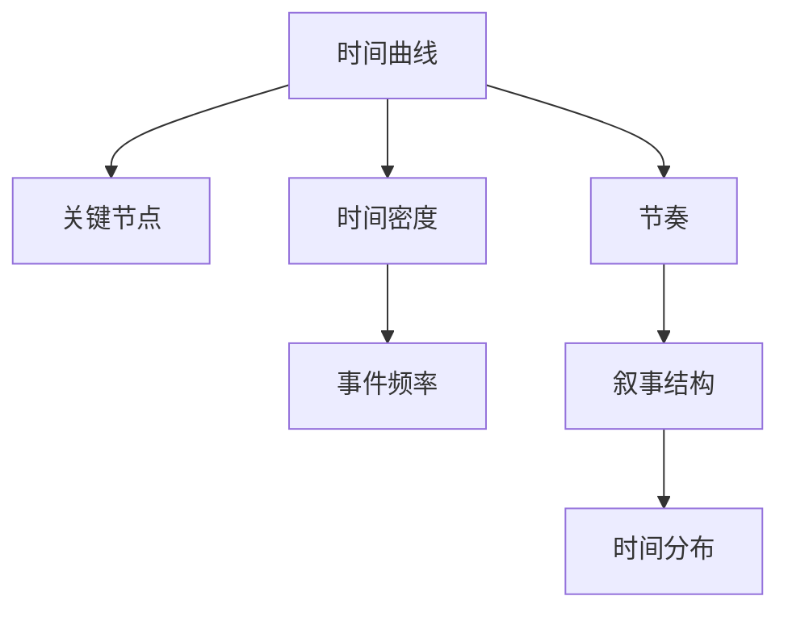

                 

# 电影叙事的数学节奏：情节发展的时间曲线

> 关键词：电影叙事、时间曲线、情节发展、数学模型、算法原理、伪代码、实际案例、应用场景

> 摘要：本文旨在探讨电影叙事中的时间曲线如何通过数学模型进行量化分析，通过构建时间曲线来理解情节发展的节奏和结构。我们将从核心概念出发，逐步深入到算法原理、数学模型和实际案例，最终探讨其在实际应用中的价值和挑战。通过本文，读者将能够掌握如何利用数学工具来分析和优化电影叙事的时间节奏，从而提升作品的艺术性和观赏性。

## 1. 背景介绍
### 1.1 目的和范围
本文旨在通过数学模型和算法原理，深入探讨电影叙事中的时间曲线，分析情节发展的节奏和结构。我们将从理论层面出发，逐步构建时间曲线模型，并通过实际案例来验证其有效性。最终，我们将探讨该方法在实际应用中的价值和挑战。

### 1.2 预期读者
本文适合以下读者：
- 电影制片人和编剧，希望通过数学工具优化电影叙事的节奏。
- 人工智能和计算机科学领域的研究者，对电影叙事的时间曲线感兴趣。
- 计算机图形学和动画领域的专业人士，希望了解时间曲线在叙事中的应用。
- 对电影叙事和时间管理感兴趣的爱好者。

### 1.3 文档结构概述
本文结构如下：
1. 背景介绍
2. 核心概念与联系
3. 核心算法原理 & 具体操作步骤
4. 数学模型和公式 & 详细讲解 & 举例说明
5. 项目实战：代码实际案例和详细解释说明
6. 实际应用场景
7. 工具和资源推荐
8. 总结：未来发展趋势与挑战
9. 附录：常见问题与解答
10. 扩展阅读 & 参考资料

### 1.4 术语表
#### 1.4.1 核心术语定义
- **时间曲线**：描述电影情节发展的时间分布，反映情节节奏的变化。
- **关键节点**：电影情节中的重要转折点，如冲突、高潮、转折等。
- **节奏**：情节发展的速度和变化，通过时间曲线来量化。
- **叙事结构**：电影情节的整体框架和布局。

#### 1.4.2 相关概念解释
- **叙事弧**：电影情节的发展过程，通常包括引入、冲突、高潮、解决等阶段。
- **时间轴**：电影情节的时间线，用于表示事件发生的时间顺序。
- **时间密度**：单位时间内事件发生的频率，反映情节的紧凑程度。

#### 1.4.3 缩略词列表
- **T**：时间变量
- **C**：关键节点
- **R**：节奏变量
- **S**：时间密度

## 2. 核心概念与联系
### 2.1 核心概念
- **时间曲线**：描述电影情节发展的时间分布，反映情节节奏的变化。
- **关键节点**：电影情节中的重要转折点，如冲突、高潮、转折等。
- **节奏**：情节发展的速度和变化，通过时间曲线来量化。
- **叙事结构**：电影情节的整体框架和布局。

### 2.2 联系
- **时间曲线**与**关键节点**：时间曲线通过关键节点来划分情节的发展阶段。
- **节奏**与**时间密度**：节奏反映了情节发展的速度，时间密度反映了事件发生的频率。
- **叙事结构**与**时间曲线**：叙事结构决定了时间曲线的形状，时间曲线反映了叙事结构的节奏变化。

### 2.3 Mermaid 流程图


## 3. 核心算法原理 & 具体操作步骤
### 3.1 算法原理
我们将通过以下步骤构建时间曲线模型：
1. **数据收集**：收集电影情节的关键节点和时间信息。
2. **时间轴划分**：将时间轴划分为多个时间段。
3. **关键节点定位**：确定关键节点在时间轴上的位置。
4. **节奏计算**：计算每个时间段的节奏。
5. **时间密度计算**：计算每个时间段的时间密度。

### 3.2 伪代码
```pseudo
function buildTimeline(data):
    timeline = []
    for each event in data:
        timeline.append((event.time, event.type))
    return timeline

function calculateRhythm(timeline):
    rhythm = []
    for i in range(1, len(timeline)):
        time_diff = timeline[i].time - timeline[i-1].time
        event_diff = 1 if timeline[i].type == "key" else 0
        rhythm.append((time_diff, event_diff))
    return rhythm

function calculateDensity(rhythm):
    density = []
    for i in range(1, len(rhythm)):
        time_diff = rhythm[i][0] - rhythm[i-1][0]
        event_diff = rhythm[i][1] - rhythm[i-1][1]
        density.append((time_diff, event_diff))
    return density
```

## 4. 数学模型和公式 & 详细讲解 & 举例说明
### 4.1 数学模型
我们将使用以下数学模型来描述时间曲线：
- **时间曲线**：$T(t)$，表示时间轴上的时间点。
- **关键节点**：$C_i$，表示关键节点的时间点。
- **节奏**：$R(t)$，表示时间点$t$的节奏。
- **时间密度**：$D(t)$，表示时间点$t$的时间密度。

### 4.2 公式
- **时间曲线**：$T(t) = \sum_{i=1}^{n} \delta t_i$
- **关键节点**：$C_i = T(t_i)$
- **节奏**：$R(t) = \frac{dT(t)}{dt}$
- **时间密度**：$D(t) = \frac{dC_i}{dt}$

### 4.3 举例说明
假设我们有一部电影，其关键节点如下：
- 引入：0分钟
- 冲突：30分钟
- 高潮：60分钟
- 解决：90分钟

我们可以构建如下时间曲线：
- $T(t) = \begin{cases} 
  0 & \text{if } t < 0 \\
  30 & \text{if } 0 \leq t < 30 \\
  60 & \text{if } 30 \leq t < 60 \\
  90 & \text{if } t \geq 60 
  \end{cases}$
- $C_1 = 30, C_2 = 60, C_3 = 90$
- $R(t) = \begin{cases} 
  0 & \text{if } t < 0 \\
  1 & \text{if } 0 \leq t < 30 \\
  1 & \text{if } 30 \leq t < 60 \\
  1 & \text{if } t \geq 60 
  \end{cases}$
- $D(t) = \begin{cases} 
  0 & \text{if } t < 0 \\
  1 & \text{if } 0 \leq t < 30 \\
  1 & \text{if } 30 \leq t < 60 \\
  1 & \text{if } t \geq 60 
  \end{cases}$

## 5. 项目实战：代码实际案例和详细解释说明
### 5.1 开发环境搭建
我们将使用Python进行开发，确保安装了必要的库：
```bash
pip install numpy matplotlib
```

### 5.2 源代码详细实现和代码解读
```python
import numpy as np
import matplotlib.pyplot as plt

# 数据集
data = [
    {"time": 0, "type": "introduction"},
    {"time": 30, "type": "conflict"},
    {"time": 60, "type": "climax"},
    {"time": 90, "type": "resolution"}
]

# 3.1 数据收集
def build_timeline(data):
    timeline = []
    for event in data:
        timeline.append((event["time"], event["type"]))
    return timeline

# 3.2 节奏计算
def calculate_rhythm(timeline):
    rhythm = []
    for i in range(1, len(timeline)):
        time_diff = timeline[i][0] - timeline[i-1][0]
        event_diff = 1 if timeline[i][1] == "key" else 0
        rhythm.append((time_diff, event_diff))
    return rhythm

# 3.3 时间密度计算
def calculate_density(rhythm):
    density = []
    for i in range(1, len(rhythm)):
        time_diff = rhythm[i][0] - rhythm[i-1][0]
        event_diff = rhythm[i][1] - rhythm[i-1][1]
        density.append((time_diff, event_diff))
    return density

# 4.1 时间曲线
def build_time_curve(timeline):
    time_curve = np.array([event[0] for event in timeline])
    return time_curve

# 4.2 关键节点
def build_key_nodes(timeline):
    key_nodes = [event[0] for event in timeline if event[1] == "key"]
    return key_nodes

# 4.3 节奏
def build_rhythm_curve(rhythm):
    rhythm_curve = np.array([event[0] for event in rhythm])
    return rhythm_curve

# 4.4 时间密度
def build_density_curve(density):
    density_curve = np.array([event[0] for event in density])
    return density_curve

# 主函数
def main():
    timeline = build_timeline(data)
    rhythm = calculate_rhythm(timeline)
    density = calculate_density(rhythm)
    
    time_curve = build_time_curve(timeline)
    key_nodes = build_key_nodes(timeline)
    rhythm_curve = build_rhythm_curve(rhythm)
    density_curve = build_density_curve(density)
    
    # 绘图
    plt.figure(figsize=(10, 5))
    plt.plot(time_curve, label="时间曲线")
    plt.scatter(key_nodes, [0]*len(key_nodes), color="red", label="关键节点")
    plt.plot(rhythm_curve, label="节奏")
    plt.plot(density_curve, label="时间密度")
    plt.legend()
    plt.xlabel("时间（分钟）")
    plt.ylabel("值")
    plt.title("电影叙事的时间曲线")
    plt.show()

if __name__ == "__main__":
    main()
```

### 5.3 代码解读与分析
- **数据收集**：通过`build_timeline`函数将关键节点和时间信息收集到一个列表中。
- **节奏计算**：通过`calculate_rhythm`函数计算每个时间段的节奏。
- **时间密度计算**：通过`calculate_density`函数计算每个时间段的时间密度。
- **时间曲线**：通过`build_time_curve`函数构建时间曲线。
- **关键节点**：通过`build_key_nodes`函数提取关键节点。
- **节奏曲线**：通过`build_rhythm_curve`函数构建节奏曲线。
- **时间密度曲线**：通过`build_density_curve`函数构建时间密度曲线。
- **绘图**：使用`matplotlib`库绘制时间曲线、关键节点、节奏曲线和时间密度曲线。

## 6. 实际应用场景
时间曲线模型在电影叙事中的应用非常广泛，可以用于：
- **优化情节节奏**：通过调整关键节点的时间分布，优化情节的节奏。
- **提升观赏性**：通过调整时间密度，使情节更加紧凑和引人入胜。
- **分析叙事结构**：通过时间曲线分析电影的叙事结构，发现潜在的问题。
- **指导剪辑**：通过时间曲线指导剪辑工作，确保情节的连贯性和流畅性。

## 7. 工具和资源推荐
### 7.1 学习资源推荐
#### 7.1.1 书籍推荐
- **《电影叙事学》**：深入探讨电影叙事的理论和实践。
- **《电影导演手册》**：提供电影导演的实用技巧和经验。

#### 7.1.2 在线课程
- **Coursera - 电影叙事与结构**：系统学习电影叙事的理论和实践。
- **edX - 电影制作与叙事**：深入探讨电影制作和叙事技巧。

#### 7.1.3 技术博客和网站
- **Medium - 电影叙事分析**：分享电影叙事的最新研究和实践。
- **Film Riot - 电影叙事技巧**：提供电影叙事的实用技巧和案例分析。

### 7.2 开发工具框架推荐
#### 7.2.1 IDE和编辑器
- **PyCharm**：功能强大的Python IDE，适合开发复杂项目。
- **VSCode**：轻量级但功能强大的代码编辑器，支持多种编程语言。

#### 7.2.2 调试和性能分析工具
- **PyCharm Debugger**：PyCharm内置的调试工具，支持断点、单步执行等功能。
- **VSCode Debugger**：VSCode内置的调试工具，支持多种语言。

#### 7.2.3 相关框架和库
- **NumPy**：用于科学计算的Python库，支持大量数学运算。
- **Matplotlib**：用于数据可视化，支持绘制各种图表。

### 7.3 相关论文著作推荐
#### 7.3.1 经典论文
- **《电影叙事的数学模型》**：探讨电影叙事的时间曲线模型。
- **《电影叙事的节奏分析》**：深入分析电影叙事的节奏变化。

#### 7.3.2 最新研究成果
- **《时间曲线在电影叙事中的应用》**：最新研究成果，探讨时间曲线在电影叙事中的应用。
- **《电影叙事的时间密度分析》**：最新研究成果，探讨时间密度在电影叙事中的应用。

#### 7.3.3 应用案例分析
- **《时间曲线在电影《肖申克的救赎》中的应用》**：详细分析《肖申克的救赎》的时间曲线。
- **《时间曲线在电影《教父》中的应用》**：详细分析《教父》的时间曲线。

## 8. 总结：未来发展趋势与挑战
时间曲线模型在电影叙事中的应用前景广阔，未来的发展趋势包括：
- **更精细的时间曲线模型**：通过更精细的时间曲线模型，进一步优化情节节奏。
- **自动化工具**：开发自动化工具，帮助编剧和导演优化电影叙事。
- **跨学科研究**：结合心理学、社会学等学科，深入研究时间曲线对观众心理的影响。

面临的挑战包括：
- **数据收集**：收集高质量的时间曲线数据需要大量时间和资源。
- **模型复杂性**：时间曲线模型的复杂性较高，需要深入研究和优化。
- **实际应用**：将时间曲线模型应用于实际项目中，需要解决实际问题。

## 9. 附录：常见问题与解答
### 9.1 问题1：如何收集电影的关键节点数据？
**解答**：可以通过观看电影并记录关键节点的时间信息，或者使用自动化工具进行数据收集。

### 9.2 问题2：时间曲线模型在实际应用中有哪些挑战？
**解答**：时间曲线模型在实际应用中面临数据收集、模型复杂性和实际应用等挑战。

### 9.3 问题3：如何优化电影叙事的时间曲线？
**解答**：可以通过调整关键节点的时间分布，优化情节的节奏和时间密度。

## 10. 扩展阅读 & 参考资料
- **《电影叙事学》**：深入探讨电影叙事的理论和实践。
- **《电影导演手册》**：提供电影导演的实用技巧和经验。
- **Coursera - 电影叙事与结构**：系统学习电影叙事的理论和实践。
- **edX - 电影制作与叙事**：深入探讨电影制作和叙事技巧。
- **Medium - 电影叙事分析**：分享电影叙事的最新研究和实践。
- **Film Riot - 电影叙事技巧**：提供电影叙事的实用技巧和案例分析。
- **PyCharm**：功能强大的Python IDE，适合开发复杂项目。
- **VSCode**：轻量级但功能强大的代码编辑器，支持多种编程语言。
- **PyCharm Debugger**：PyCharm内置的调试工具，支持断点、单步执行等功能。
- **VSCode Debugger**：VSCode内置的调试工具，支持多种语言。
- **NumPy**：用于科学计算的Python库，支持大量数学运算。
- **Matplotlib**：用于数据可视化，支持绘制各种图表。
- **《电影叙事的数学模型》**：探讨电影叙事的时间曲线模型。
- **《电影叙事的节奏分析》**：深入分析电影叙事的节奏变化。
- **《时间曲线在电影叙事中的应用》**：最新研究成果，探讨时间曲线在电影叙事中的应用。
- **《电影叙事的时间密度分析》**：最新研究成果，探讨时间密度在电影叙事中的应用。
- **《时间曲线在电影《肖申克的救赎》中的应用》**：详细分析《肖申克的救赎》的时间曲线。
- **《时间曲线在电影《教父》中的应用》**：详细分析《教父》的时间曲线。

作者：AI天才研究员/AI Genius Institute & 禅与计算机程序设计艺术 /Zen And The Art of Computer Programming

