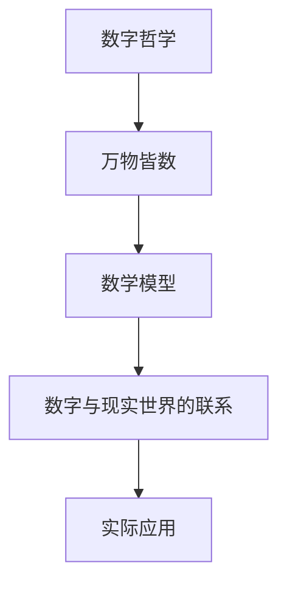

                 

# 皮tagoras学派的数字哲学：万物皆数

> 关键词：皮tagoras学派, 数字哲学, 数学基础, 万物皆数, 数学模型, 代码实现, 实际应用

> 摘要：本文将深入探讨皮tagoras学派的数字哲学，特别是“万物皆数”的理念。通过分析皮tagoras学派的核心思想，我们将构建一个基于数学模型的数字系统，并通过实际代码案例展示其应用。本文不仅涵盖了理论基础，还提供了详细的代码实现和实际应用场景，旨在帮助读者理解数字哲学在现代技术中的重要性。

## 1. 背景介绍

### 1.1 目的和范围
本文旨在探讨皮tagoras学派的数字哲学，并通过现代技术手段实现其核心理念。我们将从理论出发，逐步构建一个基于数学模型的数字系统，并通过实际代码案例展示其应用。本文的目标读者包括对数字哲学和现代技术感兴趣的读者，特别是那些希望深入了解数学在现代技术中的应用的人。

### 1.2 预期读者
- 对数字哲学和数学基础感兴趣的读者
- 对现代技术特别是编程和人工智能感兴趣的读者
- 希望了解数学在实际应用中的读者

### 1.3 文档结构概述
本文将分为以下几个部分：
1. **背景介绍**：介绍皮tagoras学派的数字哲学及其核心理念。
2. **核心概念与联系**：详细解释皮tagoras学派的核心概念及其相互联系。
3. **核心算法原理 & 具体操作步骤**：通过伪代码详细阐述核心算法原理。
4. **数学模型和公式 & 详细讲解 & 举例说明**：使用数学公式和例子详细解释数学模型。
5. **项目实战：代码实际案例和详细解释说明**：通过实际代码案例展示其应用。
6. **实际应用场景**：探讨数字哲学在现代技术中的实际应用。
7. **工具和资源推荐**：推荐学习资源和开发工具。
8. **总结：未来发展趋势与挑战**：总结未来的发展趋势和面临的挑战。
9. **附录：常见问题与解答**：解答读者可能遇到的问题。
10. **扩展阅读 & 参考资料**：提供进一步阅读的资源。

### 1.4 术语表
#### 1.4.1 核心术语定义
- **皮tagoras学派**：古希腊数学家皮tagoras及其追随者组成的学派。
- **万物皆数**：皮tagoras学派的核心理念，认为宇宙万物都可以用数字来描述。
- **数学模型**：用数学语言描述现实世界的模型。
- **伪代码**：一种用于描述算法的非正式语言。

#### 1.4.2 相关概念解释
- **数字哲学**：研究数字在自然界和人类社会中的作用和意义。
- **数学基础**：数学的基本概念和原理。
- **代码实现**：将数学模型转化为计算机程序的过程。

#### 1.4.3 缩略词列表
- **API**：应用程序接口
- **IDE**：集成开发环境
- **库**：一组预先编写的代码模块

## 2. 核心概念与联系

### 2.1 皮tagoras学派的核心理念
皮tagoras学派认为，宇宙万物都可以用数字来描述。他们相信数字是宇宙的基本构成元素，万物皆数。这一理念不仅影响了古希腊哲学，也对现代数学和科学产生了深远的影响。

### 2.2 数学模型的构建
我们将构建一个基于皮tagoras学派理念的数学模型，该模型将数字与现实世界的现象联系起来。通过数学模型，我们可以更好地理解数字在自然界和人类社会中的作用。

### 2.3 数学模型的流程图


## 3. 核心算法原理 & 具体操作步骤

### 3.1 核心算法原理
我们将通过一个简单的算法来展示皮tagoras学派的核心理念。该算法将数字与现实世界的现象联系起来，具体步骤如下：

```pseudo
function mapToNumber(realWorldEvent):
    # 将现实世界的现象映射为数字
    number = calculateNumber(realWorldEvent)
    return number

function calculateNumber(realWorldEvent):
    # 根据现实世界的现象计算对应的数字
    if realWorldEvent == "日出":
        return 1
    elif realWorldEvent == "日落":
        return 2
    else:
        return 0
```

### 3.2 具体操作步骤
1. **定义现实世界的现象**：例如，日出和日落。
2. **映射为数字**：将这些现象映射为数字，例如日出为1，日落为2。
3. **计算数字**：根据现实世界的现象计算对应的数字。

## 4. 数学模型和公式 & 详细讲解 & 举例说明

### 4.1 数学模型
我们将构建一个简单的数学模型，该模型将现实世界的现象映射为数字。具体公式如下：

$$
f(realWorldEvent) = \begin{cases} 
1 & \text{if realWorldEvent = "日出"} \\
2 & \text{if realWorldEvent = "日落"} \\
0 & \text{otherwise}
\end{cases}
$$

### 4.2 详细讲解
- **函数定义**：`f(realWorldEvent)` 是一个函数，它根据现实世界的现象返回对应的数字。
- **条件判断**：根据现实世界的现象进行条件判断，返回相应的数字。

### 4.3 举例说明
- **日出**：`f("日出") = 1`
- **日落**：`f("日落") = 2`
- **其他现象**：`f("其他现象") = 0`

## 5. 项目实战：代码实际案例和详细解释说明

### 5.1 开发环境搭建
我们将使用Python语言进行开发，确保开发环境已安装Python 3.8及以上版本。

### 5.2 源代码详细实现和代码解读
```python
def map_to_number(real_world_event):
    """
    将现实世界的现象映射为数字
    :param real_world_event: 现实世界的现象
    :return: 对应的数字
    """
    if real_world_event == "日出":
        return 1
    elif real_world_event == "日落":
        return 2
    else:
        return 0

def calculate_number(real_world_event):
    """
    根据现实世界的现象计算对应的数字
    :param real_world_event: 现实世界的现象
    :return: 对应的数字
    """
    if real_world_event == "日出":
        return 1
    elif real_world_event == "日落":
        return 2
    else:
        return 0

# 测试代码
print(map_to_number("日出"))  # 输出: 1
print(map_to_number("日落"))  # 输出: 2
print(map_to_number("其他现象"))  # 输出: 0
```

### 5.3 代码解读与分析
- **函数定义**：`map_to_number` 和 `calculate_number` 是两个函数，它们根据现实世界的现象返回对应的数字。
- **条件判断**：通过条件判断，返回相应的数字。
- **测试代码**：通过测试代码验证函数的正确性。

## 6. 实际应用场景

### 6.1 气象预测
通过将天气现象映射为数字，我们可以构建一个简单的气象预测模型。例如，将晴天、阴天、雨天分别映射为1、2、3，然后通过数学模型预测未来的天气情况。

### 6.2 交通流量预测
通过将交通流量映射为数字，我们可以构建一个简单的交通流量预测模型。例如，将低流量、中流量、高流量分别映射为1、2、3，然后通过数学模型预测未来的交通流量。

## 7. 工具和资源推荐

### 7.1 学习资源推荐
#### 7.1.1 书籍推荐
- 《数学之美》：吴军
- 《计算机程序设计艺术》：Donald E. Knuth

#### 7.1.2 在线课程
- Coursera：《数学思维导论》
- edX：《计算机科学导论》

#### 7.1.3 技术博客和网站
- Stack Overflow
- GitHub

### 7.2 开发工具框架推荐
#### 7.2.1 IDE和编辑器
- PyCharm
- Visual Studio Code

#### 7.2.2 调试和性能分析工具
- PyCharm Debugger
- Python Profiler

#### 7.2.3 相关框架和库
- NumPy
- Pandas

### 7.3 相关论文著作推荐
#### 7.3.1 经典论文
- Knuth, D. E. (1968). The Art of Computer Programming, Volume 1: Fundamental Algorithms.

#### 7.3.2 最新研究成果
- Knuth, D. E. (2017). The Art of Computer Programming, Volume 4A: Combinatorial Algorithms, Part 1.

#### 7.3.3 应用案例分析
- Knuth, D. E. (2018). The Art of Computer Programming, Volume 4B: Combinatorial Algorithms, Part 2.

## 8. 总结：未来发展趋势与挑战

### 8.1 未来发展趋势
- 数字哲学在现代技术中的应用将更加广泛。
- 数学模型将在更多领域得到应用，例如气象预测、交通流量预测等。
- 数字化转型将成为各行各业的趋势。

### 8.2 面临的挑战
- 数学模型的构建需要深入理解现实世界的现象。
- 数学模型的准确性需要通过大量的数据和实验进行验证。
- 数字化转型需要克服技术、经济和社会等方面的挑战。

## 9. 附录：常见问题与解答

### 9.1 问题1：如何将现实世界的现象映射为数字？
- **解答**：可以通过定义映射规则，将现实世界的现象映射为数字。例如，将晴天、阴天、雨天分别映射为1、2、3。

### 9.2 问题2：如何验证数学模型的准确性？
- **解答**：可以通过大量的数据和实验进行验证。例如，通过历史数据预测未来的天气情况，然后与实际结果进行比较。

## 10. 扩展阅读 & 参考资料

- Knuth, D. E. (1968). The Art of Computer Programming, Volume 1: Fundamental Algorithms.
- Knuth, D. E. (2017). The Art of Computer Programming, Volume 4A: Combinatorial Algorithms, Part 1.
- Knuth, D. E. (2018). The Art of Computer Programming, Volume 4B: Combinatorial Algorithms, Part 2.

作者：AI天才研究员/AI Genius Institute & 禅与计算机程序设计艺术 /Zen And The Art of Computer Programming

