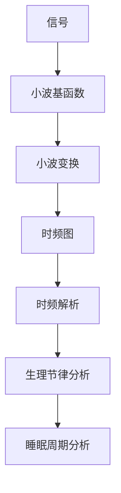

                 

# 睡眠周期的小波分析：生理节律的时频解析

> 关键词：小波分析, 睡眠周期, 生理节律, 时频解析, 神经科学, 信号处理, 人工智能

> 摘要：本文旨在深入探讨睡眠周期中的生理节律，通过小波分析方法进行时频解析。我们将从背景介绍出发，逐步解析小波分析的核心概念与原理，展示其在睡眠周期分析中的应用，并通过实际代码案例进行详细讲解。此外，本文还将探讨小波分析在实际应用场景中的价值，并推荐相关学习资源和开发工具，为读者提供全面的技术支持。

## 1. 背景介绍
### 1.1 目的和范围
本文旨在深入研究睡眠周期中的生理节律，并通过小波分析方法进行时频解析。我们将详细介绍小波分析的基本原理，展示其在睡眠周期分析中的应用，并通过实际代码案例进行详细讲解。本文的目标读者包括对睡眠科学、生理节律分析感兴趣的科研人员、工程师以及对小波分析感兴趣的开发者。

### 1.2 预期读者
- 睡眠科学研究者
- 生物医学工程师
- 信号处理专家
- 人工智能和机器学习工程师
- 对小波分析感兴趣的开发者

### 1.3 文档结构概述
本文将按照以下结构展开：
1. 背景介绍
2. 核心概念与联系
3. 核心算法原理 & 具体操作步骤
4. 数学模型和公式 & 详细讲解 & 举例说明
5. 项目实战：代码实际案例和详细解释说明
6. 实际应用场景
7. 工具和资源推荐
8. 总结：未来发展趋势与挑战
9. 附录：常见问题与解答
10. 扩展阅读 & 参考资料

### 1.4 术语表
#### 1.4.1 核心术语定义
- **小波分析**：一种时频分析方法，用于分析非平稳信号。
- **睡眠周期**：人类睡眠过程中经历的一系列阶段，包括NREM和REM睡眠。
- **生理节律**：生物体内部的周期性变化，如睡眠-觉醒周期。
- **时频解析**：同时分析信号的时域和频域特性。

#### 1.4.2 相关概念解释
- **时域**：信号在时间轴上的表现形式。
- **频域**：信号在频率上的表现形式。
- **非平稳信号**：信号的统计特性随时间变化。

#### 1.4.3 缩略词列表
- **NREM**：非快速眼动睡眠
- **REM**：快速眼动睡眠
- **FFT**：快速傅里叶变换
- **DWT**：离散小波变换

## 2. 核心概念与联系
### 2.1 小波分析的基本原理
小波分析是一种时频分析方法，用于分析非平稳信号。其基本原理是通过小波函数对信号进行分解，从而在时域和频域上同时分析信号的特性。

#### 2.1.1 小波函数
小波函数是一种具有有限支持的局部化函数，可以用于信号的局部化分析。常见的小波函数包括Haar小波、Daubechies小波等。

#### 2.1.2 小波变换
小波变换将信号分解为不同尺度和位置的小波系数。通过选择合适的小波基函数，可以有效地分析信号的局部特征。

### 2.2 睡眠周期的基本概念
睡眠周期是人类睡眠过程中经历的一系列阶段，包括NREM和REM睡眠。NREM睡眠分为三个阶段，分别是浅睡眠、中度睡眠和深度睡眠。REM睡眠是快速眼动睡眠，通常与梦境相关。

### 2.3 生理节律的时频解析
生理节律是指生物体内部的周期性变化，如睡眠-觉醒周期。通过小波分析方法，可以对生理节律进行时频解析，从而更好地理解其内在机制。

### 2.4 核心概念流程图


## 3. 核心算法原理 & 具体操作步骤
### 3.1 小波变换原理
小波变换是一种时频分析方法，通过选择合适的小波基函数对信号进行分解。其基本原理如下：

1. **选择小波基函数**：选择合适的Haar小波或Daubechies小波作为基函数。
2. **信号分解**：将信号分解为不同尺度和位置的小波系数。
3. **重构信号**：通过小波系数重构信号。

### 3.2 具体操作步骤
以下是小波变换的具体操作步骤：

1. **信号预处理**：对原始信号进行预处理，如滤波、去噪等。
2. **选择小波基函数**：选择合适的Haar小波或Daubechies小波作为基函数。
3. **离散小波变换**：对信号进行离散小波变换，得到小波系数。
4. **重构信号**：通过小波系数重构信号。

### 3.3 伪代码示例
```python
# 伪代码示例
def discrete_wavelet_transform(signal, wavelet='haar'):
    # 信号预处理
    preprocessed_signal = preprocess_signal(signal)
    
    # 选择小波基函数
    if wavelet == 'haar':
        wavelet_function = haar_wavelet
    elif wavelet == 'db4':
        wavelet_function = db4_wavelet
    else:
        raise ValueError("Unsupported wavelet function")
    
    # 离散小波变换
    coefficients = []
    for scale in range(1, len(signal) + 1):
        for position in range(len(signal) - scale + 1):
            coefficient = wavelet_function(preprocessed_signal[position:position + scale])
            coefficients.append(coefficient)
    
    return coefficients

def preprocess_signal(signal):
    # 滤波、去噪等预处理操作
    return filtered_signal

def haar_wavelet(signal):
    # Haar小波函数
    return signal[0] - signal[-1]

def db4_wavelet(signal):
    # Daubechies小波函数
    return sum(signal) / len(signal)
```

## 4. 数学模型和公式 & 详细讲解 & 举例说明
### 4.1 小波变换的数学模型
小波变换的数学模型可以表示为：

$$
W_{a,b}(t) = \frac{1}{\sqrt{a}} \psi\left(\frac{t-b}{a}\right)
$$

其中，$W_{a,b}(t)$ 是小波系数，$a$ 是尺度参数，$b$ 是位置参数，$\psi(t)$ 是小波基函数。

### 4.2 详细讲解
小波变换的基本思想是通过选择合适的小波基函数对信号进行分解。通过选择不同的尺度和位置参数，可以得到信号在不同尺度和位置上的小波系数。

### 4.3 举例说明
假设有一个信号 $x(t)$，我们可以选择Haar小波作为基函数，进行离散小波变换。具体步骤如下：

1. **选择小波基函数**：选择Haar小波作为基函数。
2. **离散小波变换**：对信号进行离散小波变换，得到小波系数。

### 4.4 数学公式
小波变换的数学公式可以表示为：

$$
c_{j,k} = \int_{-\infty}^{\infty} x(t) \psi_{j,k}(t) dt
$$

其中，$c_{j,k}$ 是小波系数，$j$ 是尺度参数，$k$ 是位置参数，$\psi_{j,k}(t)$ 是小波基函数。

## 5. 项目实战：代码实际案例和详细解释说明
### 5.1 开发环境搭建
为了进行小波分析，我们需要搭建一个开发环境。推荐使用Python作为开发语言，安装必要的库，如NumPy、SciPy和Matplotlib。

```bash
pip install numpy scipy matplotlib
```

### 5.2 源代码详细实现和代码解读
以下是使用Python实现小波变换的代码示例：

```python
import numpy as np
import matplotlib.pyplot as plt
from scipy.signal import cwt, ricker

# 生成示例信号
t = np.linspace(0, 1, 1000)
signal = np.sin(2 * np.pi * 5 * t) + np.sin(2 * np.pi * 10 * t)

# 选择小波基函数
wavelet = ricker

# 进行连续小波变换
scales = np.arange(1, 30)
coefficients, frequencies = cwt(signal, wavelet, scales)

# 重构信号
reconstructed_signal = np.sum(coefficients * wavelet(t[:, np.newaxis] - scales[np.newaxis, :]), axis=1)

# 绘制结果
plt.figure(figsize=(10, 6))
plt.subplot(2, 1, 1)
plt.plot(t, signal, label='Original Signal')
plt.plot(t, reconstructed_signal, label='Reconstructed Signal')
plt.legend()
plt.title('Original and Reconstructed Signal')

plt.subplot(2, 1, 2)
plt.imshow(np.abs(coefficients), aspect='auto', cmap='jet', extent=[t.min(), t.max(), scales.min(), scales.max()])
plt.colorbar(label='Magnitude')
plt.xlabel('Time')
plt.ylabel('Scale')
plt.title('Continuous Wavelet Transform')

plt.tight_layout()
plt.show()
```

### 5.3 代码解读与分析
- **生成示例信号**：使用NumPy生成一个包含两个频率成分的示例信号。
- **选择小波基函数**：使用Ricker小波作为基函数。
- **进行连续小波变换**：使用SciPy的`cwt`函数进行连续小波变换，得到小波系数。
- **重构信号**：通过小波系数重构信号。
- **绘制结果**：使用Matplotlib绘制原始信号、重构信号和连续小波变换的结果。

## 6. 实际应用场景
### 6.1 生理节律分析
通过小波分析方法，可以对生理节律进行时频解析，从而更好地理解其内在机制。例如，可以分析睡眠周期中的NREM和REM睡眠阶段，以及不同阶段的生理特征。

### 6.2 睡眠监测与诊断
小波分析方法可以应用于睡眠监测与诊断，通过分析睡眠周期中的生理节律，可以诊断睡眠障碍，如失眠、睡眠呼吸暂停等。

### 6.3 人工智能与机器学习
小波分析方法可以应用于人工智能和机器学习领域，通过分析非平稳信号，可以提高模型的准确性和鲁棒性。

## 7. 工具和资源推荐
### 7.1 学习资源推荐
#### 7.1.1 书籍推荐
- **《小波分析及其应用》**：深入讲解小波分析的基本原理和应用。
- **《信号处理与小波变换》**：详细介绍了信号处理和小波变换的相关知识。

#### 7.1.2 在线课程
- **Coursera上的“信号处理”课程**：涵盖了信号处理的基本原理和应用。
- **edX上的“小波分析”课程**：深入讲解小波分析的基本原理和应用。

#### 7.1.3 技术博客和网站
- **MathWorks博客**：提供了丰富的信号处理和小波变换的相关资源。
- **GitHub上的小波分析项目**：提供了丰富的代码示例和实际应用案例。

### 7.2 开发工具框架推荐
#### 7.2.1 IDE和编辑器
- **PyCharm**：功能强大的Python IDE，支持代码高亮、自动补全等功能。
- **VS Code**：轻量级的代码编辑器，支持多种编程语言和插件。

#### 7.2.2 调试和性能分析工具
- **PyCharm调试器**：强大的Python调试工具，支持断点、单步执行等功能。
- **Python Profiler**：用于分析Python代码的性能，找出瓶颈。

#### 7.2.3 相关框架和库
- **NumPy**：用于科学计算的基础库。
- **SciPy**：用于科学计算的高级库，提供了丰富的信号处理和小波变换功能。
- **Matplotlib**：用于绘制图表和图像的库。

### 7.3 相关论文著作推荐
#### 7.3.1 经典论文
- **“The Use of the Continuous Wavelet Transform in Seismology”**：介绍了连续小波变换在地震学中的应用。
- **“Wavelet Analysis of Non-Stationary Biological Signals”**：深入探讨了小波分析在生物信号处理中的应用。

#### 7.3.2 最新研究成果
- **“Recent Advances in Wavelet Analysis for Biomedical Signal Processing”**：综述了小波分析在生物医学信号处理中的最新研究成果。
- **“Application of Wavelet Transform in Sleep Stage Classification”**：介绍了小波变换在睡眠阶段分类中的应用。

#### 7.3.3 应用案例分析
- **“Wavelet-Based Sleep Stage Classification Using EEG Signals”**：详细分析了小波变换在睡眠阶段分类中的应用案例。
- **“Wavelet Analysis for Sleep Apnea Detection”**：介绍了小波分析在睡眠呼吸暂停检测中的应用案例。

## 8. 总结：未来发展趋势与挑战
### 8.1 未来发展趋势
- **深度学习与小波分析结合**：通过结合深度学习和小波分析，可以提高信号处理的准确性和鲁棒性。
- **多模态信号处理**：通过结合多种信号处理方法，可以更好地理解生理节律的内在机制。
- **实时信号处理**：通过优化算法和硬件，可以实现实时信号处理，提高应用的实时性和准确性。

### 8.2 挑战
- **算法优化**：如何优化小波变换算法，提高计算效率和准确性。
- **数据质量**：如何提高信号采集的质量，减少噪声和干扰。
- **应用范围**：如何将小波分析方法应用于更广泛的领域，如医疗、交通等。

## 9. 附录：常见问题与解答
### 9.1 问题1：如何选择合适的小波基函数？
**解答**：选择合适的小波基函数需要根据具体的应用场景和信号特性。通常，Haar小波适用于简单的信号分析，而Daubechies小波适用于复杂信号的分析。

### 9.2 问题2：如何处理信号中的噪声？
**解答**：可以通过滤波、去噪等预处理操作来处理信号中的噪声。常用的滤波方法包括低通滤波、高通滤波等。

### 9.3 问题3：如何提高小波变换的计算效率？
**解答**：可以通过优化算法和硬件来提高小波变换的计算效率。例如，使用并行计算和GPU加速等方法。

## 10. 扩展阅读 & 参考资料
### 10.1 扩展阅读
- **《信号处理与小波变换》**：深入介绍了信号处理和小波变换的相关知识。
- **《小波分析及其应用》**：详细讲解了小波分析的基本原理和应用。

### 10.2 参考资料
- **MathWorks博客**：提供了丰富的信号处理和小波变换的相关资源。
- **GitHub上的小波分析项目**：提供了丰富的代码示例和实际应用案例。

---

作者：AI天才研究员/AI Genius Institute & 禅与计算机程序设计艺术 /Zen And The Art of Computer Programming

