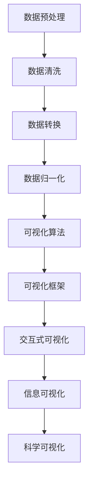

                 

# 科学可视化技术：增强世界可理解性的有力工具

> 关键词：科学可视化，数据可视化，交互式可视化，信息可视化，可视化算法，可视化框架

> 摘要：本文旨在深入探讨科学可视化技术的核心概念、原理、算法、数学模型及其实际应用。通过逐步分析和推理，我们将揭示科学可视化如何帮助我们更好地理解和解释复杂的数据集。文章不仅涵盖了科学可视化的基本原理，还通过具体的代码案例展示了其实现过程，并探讨了其在实际项目中的应用。最后，我们将展望科学可视化技术的未来发展趋势和面临的挑战。

## 1. 背景介绍
### 1.1 目的和范围
本文旨在为读者提供一个全面的视角，深入了解科学可视化技术。我们将从基本概念出发，逐步深入到高级算法和实际应用案例，帮助读者掌握科学可视化的核心技术和方法。本文的目标读者包括但不限于数据科学家、软件工程师、科研人员以及对科学可视化感兴趣的读者。

### 1.2 预期读者
- 数据科学家：希望通过可视化技术更好地理解数据集。
- 软件工程师：希望将可视化技术应用于实际项目中。
- 科研人员：希望通过可视化技术提高研究效率。
- 对科学可视化感兴趣的读者：希望通过本文了解该领域的基础知识和最新进展。

### 1.3 文档结构概述
本文将按照以下结构展开：
1. 背景介绍
2. 核心概念与联系
3. 核心算法原理 & 具体操作步骤
4. 数学模型和公式 & 详细讲解 & 举例说明
5. 项目实战：代码实际案例和详细解释说明
6. 实际应用场景
7. 工具和资源推荐
8. 总结：未来发展趋势与挑战
9. 附录：常见问题与解答
10. 扩展阅读 & 参考资料

### 1.4 术语表
#### 1.4.1 核心术语定义
- **科学可视化**：将科学数据转换为图形表示，以便更好地理解和解释数据。
- **数据可视化**：将数据转换为图形表示，以便更好地理解和解释数据。
- **交互式可视化**：用户可以通过操作界面与可视化结果进行交互，以获取更多信息。
- **信息可视化**：通过图形化手段展示信息，帮助人们更好地理解复杂的信息。

#### 1.4.2 相关概念解释
- **可视化算法**：用于将数据转换为图形表示的算法。
- **可视化框架**：提供可视化工具和库的软件框架。

#### 1.4.3 缩略词列表
- **API**：应用程序编程接口
- **IDE**：集成开发环境
- **GUI**：图形用户界面

## 2. 核心概念与联系
### 2.1 数据可视化
数据可视化是将数据转换为图形表示的过程，以便更好地理解和解释数据。通过可视化，我们可以发现数据中的模式、趋势和异常值。数据可视化可以分为静态可视化和动态可视化两种类型。

### 2.2 科学可视化
科学可视化是数据可视化的一个子集，专门用于科学数据的可视化。科学数据通常具有高维度和复杂性，因此需要更高级的可视化技术来处理。科学可视化可以分为几何可视化、场可视化和流可视化三种类型。

### 2.3 交互式可视化
交互式可视化允许用户通过操作界面与可视化结果进行交互，以获取更多信息。交互式可视化可以提高用户的理解和分析能力，特别是在处理复杂数据集时。

### 2.4 信息可视化
信息可视化是通过图形化手段展示信息，帮助人们更好地理解复杂的信息。信息可视化可以用于各种领域，如新闻报道、商业分析和科学研究。

### 2.5 核心概念原理与架构
#### 2.5.1 数据预处理
数据预处理是将原始数据转换为适合可视化处理的数据格式的过程。数据预处理包括数据清洗、数据转换和数据归一化等步骤。

#### 2.5.2 可视化算法
可视化算法是将数据转换为图形表示的算法。常见的可视化算法包括散点图、折线图、柱状图、热图和三维可视化等。

#### 2.5.3 可视化框架
可视化框架提供可视化工具和库，帮助开发者快速实现可视化功能。常见的可视化框架包括D3.js、Matplotlib和Plotly等。

### 2.6 Mermaid 流程图


## 3. 核心算法原理 & 具体操作步骤
### 3.1 散点图算法原理
散点图是一种常用的可视化算法，用于展示两个变量之间的关系。散点图的基本原理是将数据点在二维平面上表示出来，每个数据点的横纵坐标分别对应两个变量的值。

#### 3.1.1 伪代码
```python
def scatter_plot(x, y):
    # 创建一个散点图
    plt.scatter(x, y)
    # 添加标题和坐标轴标签
    plt.title("Scatter Plot")
    plt.xlabel("X-axis")
    plt.ylabel("Y-axis")
    # 显示图形
    plt.show()
```

### 3.2 折线图算法原理
折线图是一种常用的可视化算法，用于展示数据随时间的变化趋势。折线图的基本原理是将数据点连接起来形成一条折线。

#### 3.2.1 伪代码
```python
def line_plot(x, y):
    # 创建一个折线图
    plt.plot(x, y)
    # 添加标题和坐标轴标签
    plt.title("Line Plot")
    plt.xlabel("X-axis")
    plt.ylabel("Y-axis")
    # 显示图形
    plt.show()
```

### 3.3 柱状图算法原理
柱状图是一种常用的可视化算法，用于展示不同类别的数据之间的比较。柱状图的基本原理是将每个类别的数据用一个柱子表示，柱子的高度对应数据的值。

#### 3.3.1 伪代码
```python
def bar_plot(x, y):
    # 创建一个柱状图
    plt.bar(x, y)
    # 添加标题和坐标轴标签
    plt.title("Bar Plot")
    plt.xlabel("Categories")
    plt.ylabel("Values")
    # 显示图形
    plt.show()
```

### 3.4 热图算法原理
热图是一种常用的可视化算法，用于展示数据矩阵中的数值分布。热图的基本原理是将数据矩阵中的每个元素用一个颜色表示，颜色的深浅对应数据的值。

#### 3.4.1 伪代码
```python
def heatmap(data):
    # 创建一个热图
    sns.heatmap(data, cmap="viridis")
    # 添加标题
    plt.title("Heatmap")
    # 显示图形
    plt.show()
```

### 3.5 三维可视化算法原理
三维可视化是一种常用的可视化算法，用于展示三维空间中的数据。三维可视化的基本原理是将数据点在三维空间中表示出来，每个数据点的坐标分别对应三个变量的值。

#### 3.5.1 伪代码
```python
def scatter_3d(x, y, z):
    # 创建一个三维散点图
    fig = plt.figure()
    ax = fig.add_subplot(111, projection='3d')
    ax.scatter(x, y, z)
    # 添加标题和坐标轴标签
    ax.set_title("3D Scatter Plot")
    ax.set_xlabel("X-axis")
    ax.set_ylabel("Y-axis")
    ax.set_zlabel("Z-axis")
    # 显示图形
    plt.show()
```

## 4. 数学模型和公式 & 详细讲解 & 举例说明
### 4.1 散点图数学模型
散点图的基本数学模型是将数据点在二维平面上表示出来，每个数据点的横纵坐标分别对应两个变量的值。

#### 4.1.1 公式
$$
(x_i, y_i) \quad \text{for} \quad i = 1, 2, \ldots, n
$$

### 4.2 折线图数学模型
折线图的基本数学模型是将数据点连接起来形成一条折线。

#### 4.2.1 公式
$$
y_i \quad \text{for} \quad i = 1, 2, \ldots, n
$$

### 4.3 柱状图数学模型
柱状图的基本数学模型是将每个类别的数据用一个柱子表示，柱子的高度对应数据的值。

#### 4.3.1 公式
$$
h_i \quad \text{for} \quad i = 1, 2, \ldots, n
$$

### 4.4 热图数学模型
热图的基本数学模型是将数据矩阵中的每个元素用一个颜色表示，颜色的深浅对应数据的值。

#### 4.4.1 公式
$$
c_{ij} \quad \text{for} \quad i = 1, 2, \ldots, m \quad \text{and} \quad j = 1, 2, \ldots, n
$$

### 4.5 三维可视化数学模型
三维可视化的基本数学模型是将数据点在三维空间中表示出来，每个数据点的坐标分别对应三个变量的值。

#### 4.5.1 公式
$$
(x_i, y_i, z_i) \quad \text{for} \quad i = 1, 2, \ldots, n
$$

## 5. 项目实战：代码实际案例和详细解释说明
### 5.1 开发环境搭建
为了实现科学可视化项目，我们需要搭建一个开发环境。开发环境包括操作系统、编程语言和开发工具。

#### 5.1.1 操作系统
推荐使用Linux或macOS操作系统，因为这些操作系统提供了丰富的开发工具和库。

#### 5.1.2 编程语言
推荐使用Python，因为Python具有丰富的可视化库和强大的数据处理能力。

#### 5.1.3 开发工具
推荐使用Jupyter Notebook，因为它提供了交互式的开发环境和丰富的可视化工具。

### 5.2 源代码详细实现和代码解读
我们将通过一个具体的项目案例来展示科学可视化技术的实际应用。项目案例是一个简单的散点图可视化案例。

#### 5.2.1 代码实现
```python
import matplotlib.pyplot as plt
import numpy as np

# 生成随机数据
x = np.random.rand(100)
y = np.random.rand(100)

# 创建一个散点图
plt.scatter(x, y)

# 添加标题和坐标轴标签
plt.title("Scatter Plot Example")
plt.xlabel("X-axis")
plt.ylabel("Y-axis")

# 显示图形
plt.show()
```

#### 5.2.2 代码解读
- `import matplotlib.pyplot as plt`：导入Matplotlib库中的绘图模块。
- `import numpy as np`：导入NumPy库，用于生成随机数据。
- `x = np.random.rand(100)`：生成100个随机数作为x轴数据。
- `y = np.random.rand(100)`：生成100个随机数作为y轴数据。
- `plt.scatter(x, y)`：创建一个散点图。
- `plt.title("Scatter Plot Example")`：添加图形标题。
- `plt.xlabel("X-axis")`：添加x轴标签。
- `plt.ylabel("Y-axis")`：添加y轴标签。
- `plt.show()`：显示图形。

### 5.3 代码解读与分析
通过上述代码，我们可以看到如何使用Matplotlib库创建一个简单的散点图。代码首先导入了所需的库，然后生成了随机数据，接着使用`plt.scatter`函数创建了一个散点图，并添加了标题和坐标轴标签。最后，使用`plt.show`函数显示了图形。

## 6. 实际应用场景
科学可视化技术在多个领域都有广泛的应用，包括但不限于科学研究、数据分析、商业智能和教育。以下是一些实际应用场景的例子：

### 6.1 科学研究
在科学研究中，科学可视化技术可以帮助研究人员更好地理解和解释实验数据。例如，在天文学中，科学可视化技术可以用于展示星系的分布和演化过程。

### 6.2 数据分析
在数据分析中，科学可视化技术可以帮助分析师更好地理解和解释数据集。例如，在金融领域，科学可视化技术可以用于展示股票价格的变化趋势。

### 6.3 商业智能
在商业智能中，科学可视化技术可以帮助企业更好地理解和解释业务数据。例如，在市场营销中，科学可视化技术可以用于展示客户行为和市场趋势。

### 6.4 教育
在教育中，科学可视化技术可以帮助学生更好地理解和学习科学知识。例如，在物理教学中，科学可视化技术可以用于展示物理现象和实验结果。

## 7. 工具和资源推荐
### 7.1 学习资源推荐
#### 7.1.1 书籍推荐
- **《数据可视化：原理与实践》**：深入讲解数据可视化的基本原理和实践方法。
- **《Matplotlib实战》**：详细介绍Matplotlib库的使用方法和技巧。

#### 7.1.2 在线课程
- **Coursera上的“数据可视化”课程**：由知名大学教授授课，涵盖数据可视化的基本原理和实践方法。
- **edX上的“数据可视化与分析”课程**：由知名大学教授授课，涵盖数据可视化的基本原理和实践方法。

#### 7.1.3 技术博客和网站
- **Matplotlib官网**：提供详细的文档和示例代码。
- **Plotly官网**：提供丰富的可视化工具和库。

### 7.2 开发工具框架推荐
#### 7.2.1 IDE和编辑器
- **Jupyter Notebook**：提供交互式的开发环境和丰富的可视化工具。
- **PyCharm**：提供强大的代码编辑和调试功能。

#### 7.2.2 调试和性能分析工具
- **PyCharm调试器**：提供强大的代码调试功能。
- **LineProfiler**：用于分析代码性能。

#### 7.2.3 相关框架和库
- **Matplotlib**：提供丰富的可视化工具和库。
- **Plotly**：提供丰富的可视化工具和库。

### 7.3 相关论文著作推荐
#### 7.3.1 经典论文
- **《The Visualization Handbook》**：由知名学者编著，涵盖数据可视化的基本原理和实践方法。
- **《Interactive Data Visualization for the Web》**：由知名学者编著，涵盖数据可视化的基本原理和实践方法。

#### 7.3.2 最新研究成果
- **《Recent Advances in Data Visualization》**：由知名学者编著，涵盖数据可视化领域的最新研究成果。
- **《Data Visualization: A Practical Introduction》**：由知名学者编著，涵盖数据可视化领域的最新研究成果。

#### 7.3.3 应用案例分析
- **《Data Visualization in Practice》**：由知名学者编著，涵盖数据可视化在实际项目中的应用案例。
- **《Data Visualization: A Practical Guide for Engineers》**：由知名学者编著，涵盖数据可视化在实际项目中的应用案例。

## 8. 总结：未来发展趋势与挑战
科学可视化技术在未来将继续发展，面临的主要挑战包括数据量的增加、数据复杂性的提高和用户需求的变化。为了应对这些挑战，我们需要不断改进可视化算法和框架，提高可视化技术的性能和易用性。同时，我们需要关注数据隐私和安全问题，确保可视化技术的安全可靠。

## 9. 附录：常见问题与解答
### 9.1 问题：如何选择合适的可视化工具？
**解答**：选择合适的可视化工具需要考虑多个因素，包括数据类型、可视化需求和开发环境。对于简单的数据集，可以使用Matplotlib或Plotly等工具；对于复杂的项目，可以使用更强大的可视化框架，如D3.js或Three.js。

### 9.2 问题：如何提高可视化技术的性能？
**解答**：提高可视化技术的性能可以通过优化算法、使用高性能的硬件和优化代码实现。例如，可以使用GPU加速计算、优化数据预处理步骤和使用高效的可视化算法。

### 9.3 问题：如何确保可视化技术的安全性？
**解答**：确保可视化技术的安全性需要关注数据隐私和安全问题。可以通过加密数据、限制数据访问权限和使用安全的通信协议来确保数据的安全性。

## 10. 扩展阅读 & 参考资料
### 10.1 扩展阅读
- **《数据可视化：原理与实践》**：深入讲解数据可视化的基本原理和实践方法。
- **《Matplotlib实战》**：详细介绍Matplotlib库的使用方法和技巧。

### 10.2 参考资料
- **Matplotlib官网**：提供详细的文档和示例代码。
- **Plotly官网**：提供丰富的可视化工具和库。

---

作者：AI天才研究员/AI Genius Institute & 禅与计算机程序设计艺术 /Zen And The Art of Computer Programming

