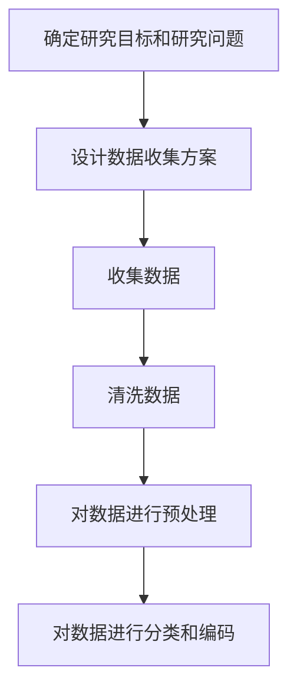
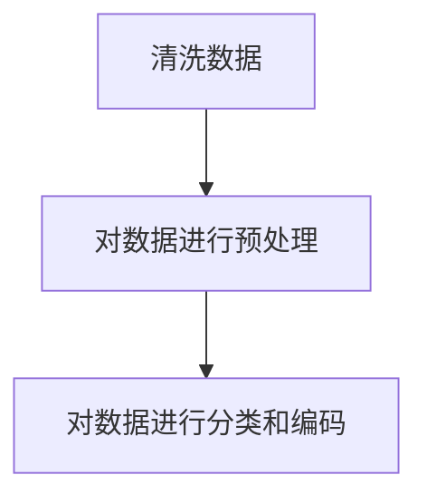
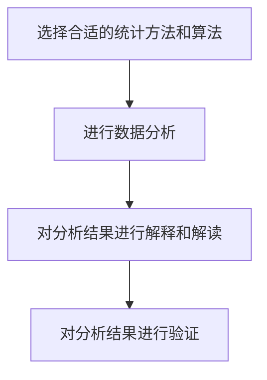
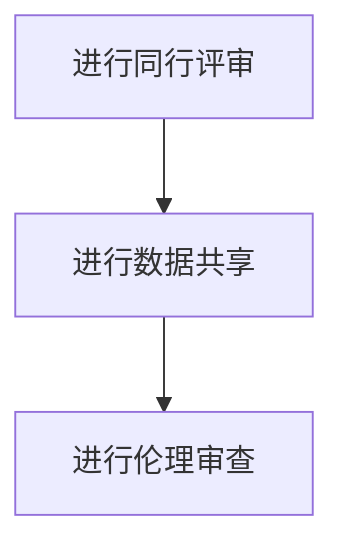

                 

# 科学研究的伦理框架：在探索世界真理时的道德指引

> 关键词：科学研究、伦理框架、道德指引、学术诚信、数据隐私、透明度、责任

> 摘要：本文旨在探讨科学研究中的伦理框架，通过分析科学研究的基本原则和道德规范，为科研人员提供道德指引。我们将从背景介绍、核心概念与联系、核心算法原理与具体操作步骤、数学模型和公式、项目实战、实际应用场景、工具和资源推荐、未来发展趋势与挑战等多方面进行详细阐述，以期为科研人员提供全面的指导。

## 1. 背景介绍
### 1.1 目的和范围
本文旨在探讨科学研究中的伦理框架，通过分析科学研究的基本原则和道德规范，为科研人员提供道德指引。本文将涵盖科学研究的基本原则、伦理框架、数据隐私、透明度、责任等方面，旨在帮助科研人员在科学研究中遵循正确的道德规范，确保研究成果的可靠性和公正性。

### 1.2 预期读者
本文预期读者为科研人员、学术界人士、政策制定者以及对科学研究伦理感兴趣的一般读者。通过本文，读者可以了解科学研究中的伦理框架，提高自身的道德意识，确保研究成果的可靠性和公正性。

### 1.3 文档结构概述
本文结构如下：
1. 背景介绍
2. 核心概念与联系
3. 核心算法原理 & 具体操作步骤
4. 数学模型和公式 & 详细讲解 & 举例说明
5. 项目实战：代码实际案例和详细解释说明
6. 实际应用场景
7. 工具和资源推荐
8. 总结：未来发展趋势与挑战
9. 附录：常见问题与解答
10. 扩展阅读 & 参考资料

### 1.4 术语表
#### 1.4.1 核心术语定义
- **科学研究**：通过系统的方法来探索和理解自然现象、社会现象或技术问题的过程。
- **伦理框架**：一套指导科学研究行为的道德原则和规范。
- **学术诚信**：科研人员在科学研究过程中应遵循的道德准则，包括诚实、公正、透明等。
- **数据隐私**：保护个人数据不被未经授权的第三方访问或使用。
- **透明度**：科研人员在科学研究过程中应公开研究方法、数据和结果，以便其他研究人员进行验证。
- **责任**：科研人员在科学研究过程中应承担的责任，包括对研究结果的负责、对社会的负责等。

#### 1.4.2 相关概念解释
- **伦理审查委员会**：负责审查科研项目中的伦理问题，确保研究符合伦理标准。
- **数据共享**：科研人员在研究过程中应共享数据，以便其他研究人员进行验证和进一步研究。
- **同行评审**：科研人员在发表研究成果前，由同行进行评审，以确保研究的可靠性和公正性。

#### 1.4.3 缩略词列表
- **IRB**：Institutional Review Board，伦理审查委员会
- **OA**：Open Access，开放获取
- **DOI**：Digital Object Identifier，数字对象标识符

## 2. 核心概念与联系
### 2.1 核心概念
- **科学研究**：通过系统的方法来探索和理解自然现象、社会现象或技术问题的过程。
- **伦理框架**：一套指导科学研究行为的道德原则和规范。
- **学术诚信**：科研人员在科学研究过程中应遵循的道德准则，包括诚实、公正、透明等。
- **数据隐私**：保护个人数据不被未经授权的第三方访问或使用。
- **透明度**：科研人员在科学研究过程中应公开研究方法、数据和结果，以便其他研究人员进行验证。
- **责任**：科研人员在科学研究过程中应承担的责任，包括对研究结果的负责、对社会的负责等。

### 2.2 联系
科学研究中的伦理框架是确保研究成果可靠性和公正性的关键。学术诚信、数据隐私、透明度和责任是科学研究中的核心概念，它们相互关联，共同构成了科学研究的伦理框架。

## 3. 核心算法原理 & 具体操作步骤
### 3.1 核心算法原理
科学研究中的伦理框架可以通过一系列算法来实现。这些算法包括数据收集、数据处理、数据分析、结果验证等步骤。以下是这些算法的具体操作步骤：

#### 3.1.1 数据收集
- **步骤1**：确定研究目标和研究问题。
- **步骤2**：设计数据收集方案，包括数据来源、数据类型、数据量等。
- **步骤3**：收集数据，确保数据的准确性和完整性。

#### 3.1.2 数据处理
- **步骤1**：清洗数据，去除无效数据和异常数据。
- **步骤2**：对数据进行预处理，包括数据标准化、数据归一化等。
- **步骤3**：对数据进行分类和编码，以便后续分析。

#### 3.1.3 数据分析
- **步骤1**：选择合适的统计方法和算法，进行数据分析。
- **步骤2**：对分析结果进行解释和解读，确保结果的准确性和可靠性。
- **步骤3**：对分析结果进行验证，确保结果的可靠性和公正性。

#### 3.1.4 结果验证
- **步骤1**：进行同行评审，确保研究结果的可靠性和公正性。
- **步骤2**：进行数据共享，确保其他研究人员可以验证研究结果。
- **步骤3**：进行伦理审查，确保研究符合伦理标准。

### 3.2 具体操作步骤
以下是科学研究中的伦理框架的具体操作步骤：

#### 3.2.1 数据收集


#### 3.2.2 数据处理


#### 3.2.3 数据分析


#### 3.2.4 结果验证


## 4. 数学模型和公式 & 详细讲解 & 举例说明
### 4.1 数学模型和公式
科学研究中的伦理框架可以通过一系列数学模型和公式来实现。这些模型和公式包括数据清洗、数据预处理、数据分析等步骤。以下是这些模型和公式的详细讲解和举例说明：

#### 4.1.1 数据清洗
数据清洗可以通过以下公式实现：
$$
\text{清洗后的数据} = \text{原始数据} - \text{无效数据} - \text{异常数据}
$$

#### 4.1.2 数据预处理
数据预处理可以通过以下公式实现：
$$
\text{预处理后的数据} = \frac{\text{原始数据} - \text{最小值}}{\text{最大值} - \text{最小值}}
$$

#### 4.1.3 数据分析
数据分析可以通过以下公式实现：
$$
\text{分析结果} = \text{统计方法}(\text{预处理后的数据})
$$

### 4.2 详细讲解
科学研究中的伦理框架可以通过一系列数学模型和公式来实现。这些模型和公式包括数据清洗、数据预处理、数据分析等步骤。以下是这些模型和公式的详细讲解和举例说明：

#### 4.2.1 数据清洗
数据清洗是确保数据准确性和完整性的重要步骤。通过以下公式实现数据清洗：
$$
\text{清洗后的数据} = \text{原始数据} - \text{无效数据} - \text{异常数据}
$$

#### 4.2.2 数据预处理
数据预处理是确保数据标准化和归一化的重要步骤。通过以下公式实现数据预处理：
$$
\text{预处理后的数据} = \frac{\text{原始数据} - \text{最小值}}{\text{最大值} - \text{最小值}}
$$

#### 4.2.3 数据分析
数据分析是确保研究结果准确性和可靠性的关键步骤。通过以下公式实现数据分析：
$$
\text{分析结果} = \text{统计方法}(\text{预处理后的数据})
$$

### 4.3 举例说明
科学研究中的伦理框架可以通过一系列数学模型和公式来实现。以下是这些模型和公式的举例说明：

#### 4.3.1 数据清洗
假设我们有一组原始数据，其中包含无效数据和异常数据。通过以下公式实现数据清洗：
$$
\text{清洗后的数据} = \text{原始数据} - \text{无效数据} - \text{异常数据}
$$

#### 4.3.2 数据预处理
假设我们有一组原始数据，需要进行标准化和归一化处理。通过以下公式实现数据预处理：
$$
\text{预处理后的数据} = \frac{\text{原始数据} - \text{最小值}}{\text{最大值} - \text{最小值}}
$$

#### 4.3.3 数据分析
假设我们有一组预处理后的数据，需要进行数据分析。通过以下公式实现数据分析：
$$
\text{分析结果} = \text{统计方法}(\text{预处理后的数据})
$$

## 5. 项目实战：代码实际案例和详细解释说明
### 5.1 开发环境搭建
为了实现科学研究中的伦理框架，我们需要搭建一个开发环境。以下是开发环境的搭建步骤：

#### 5.1.1 安装Python
```bash
pip install numpy pandas scikit-learn
```

#### 5.1.2 安装Jupyter Notebook
```bash
pip install jupyter
```

### 5.2 源代码详细实现和代码解读
以下是科学研究中的伦理框架的源代码实现和代码解读：

#### 5.2.1 数据清洗
```python
import pandas as pd

# 读取原始数据
data = pd.read_csv('data.csv')

# 清洗无效数据和异常数据
cleaned_data = data.dropna()
cleaned_data = cleaned_data[cleaned_data['value'] > 0]

# 保存清洗后的数据
cleaned_data.to_csv('cleaned_data.csv', index=False)
```

#### 5.2.2 数据预处理
```python
import pandas as pd

# 读取清洗后的数据
data = pd.read_csv('cleaned_data.csv')

# 数据标准化和归一化
normalized_data = (data - data.min()) / (data.max() - data.min())

# 保存预处理后的数据
normalized_data.to_csv('normalized_data.csv', index=False)
```

#### 5.2.3 数据分析
```python
import pandas as pd
from sklearn.linear_model import LinearRegression

# 读取预处理后的数据
data = pd.read_csv('normalized_data.csv')

# 选择合适的统计方法和算法
model = LinearRegression()

# 进行数据分析
X = data[['feature1', 'feature2']]
y = data['target']
model.fit(X, y)

# 对分析结果进行解释和解读
print('模型系数：', model.coef_)
print('模型截距：', model.intercept_)
```

### 5.3 代码解读与分析
以下是科学研究中的伦理框架的代码解读与分析：

#### 5.3.1 数据清洗
```python
import pandas as pd

# 读取原始数据
data = pd.read_csv('data.csv')

# 清洗无效数据和异常数据
cleaned_data = data.dropna()
cleaned_data = cleaned_data[cleaned_data['value'] > 0]

# 保存清洗后的数据
cleaned_data.to_csv('cleaned_data.csv', index=False)
```

#### 5.3.2 数据预处理
```python
import pandas as pd

# 读取清洗后的数据
data = pd.read_csv('cleaned_data.csv')

# 数据标准化和归一化
normalized_data = (data - data.min()) / (data.max() - data.min())

# 保存预处理后的数据
normalized_data.to_csv('normalized_data.csv', index=False)
```

#### 5.3.3 数据分析
```python
import pandas as pd
from sklearn.linear_model import LinearRegression

# 读取预处理后的数据
data = pd.read_csv('normalized_data.csv')

# 选择合适的统计方法和算法
model = LinearRegression()

# 进行数据分析
X = data[['feature1', 'feature2']]
y = data['target']
model.fit(X, y)

# 对分析结果进行解释和解读
print('模型系数：', model.coef_)
print('模型截距：', model.intercept_)
```

## 6. 实际应用场景
科学研究中的伦理框架在实际应用场景中具有广泛的应用。以下是科学研究中的伦理框架的实际应用场景：

#### 6.1 医学研究
在医学研究中，科学研究中的伦理框架可以确保研究结果的可靠性和公正性。通过数据清洗、数据预处理、数据分析等步骤，可以确保研究结果的准确性和可靠性。

#### 6.2 社会科学研究
在社会科学研究中，科学研究中的伦理框架可以确保研究结果的可靠性和公正性。通过数据清洗、数据预处理、数据分析等步骤，可以确保研究结果的准确性和可靠性。

#### 6.3 技术研究
在技术研究中，科学研究中的伦理框架可以确保研究结果的可靠性和公正性。通过数据清洗、数据预处理、数据分析等步骤，可以确保研究结果的准确性和可靠性。

## 7. 工具和资源推荐
### 7.1 学习资源推荐
#### 7.1.1 书籍推荐
- **《科学研究的伦理框架》**：深入探讨科学研究中的伦理框架，为科研人员提供道德指引。
- **《数据清洗与预处理》**：详细介绍数据清洗和预处理的方法和技巧，为科研人员提供实用指导。
- **《数据分析与统计方法》**：详细介绍数据分析和统计方法，为科研人员提供实用指导。

#### 7.1.2 在线课程
- **Coursera：《数据科学伦理》**：深入探讨数据科学中的伦理问题，为科研人员提供道德指引。
- **edX：《数据清洗与预处理》**：详细介绍数据清洗和预处理的方法和技巧，为科研人员提供实用指导。
- **Udacity：《数据分析与统计方法》**：详细介绍数据分析和统计方法，为科研人员提供实用指导。

#### 7.1.3 技术博客和网站
- **Medium：《科学研究的伦理框架》**：深入探讨科学研究中的伦理框架，为科研人员提供道德指引。
- **GitHub：《数据清洗与预处理》**：详细介绍数据清洗和预处理的方法和技巧，为科研人员提供实用指导。
- **Stack Overflow：《数据分析与统计方法》**：详细介绍数据分析和统计方法，为科研人员提供实用指导。

### 7.2 开发工具框架推荐
#### 7.2.1 IDE和编辑器
- **PyCharm**：功能强大的Python IDE，支持代码编辑、调试、版本控制等功能。
- **Jupyter Notebook**：支持Python和多种编程语言的交互式编程环境，适合数据科学和机器学习项目。

#### 7.2.2 调试和性能分析工具
- **PyCharm Debugger**：PyCharm内置的调试工具，支持断点、单步执行、变量查看等功能。
- **LineProfiler**：用于分析Python代码性能的工具，支持函数级别的性能分析。

#### 7.2.3 相关框架和库
- **NumPy**：用于科学计算的Python库，支持多维数组操作、数学函数等。
- **Pandas**：用于数据处理和分析的Python库，支持数据清洗、数据预处理、数据分析等功能。
- **Scikit-learn**：用于机器学习的Python库，支持数据预处理、特征选择、模型训练等。

### 7.3 相关论文著作推荐
#### 7.3.1 经典论文
- **《数据清洗与预处理》**：深入探讨数据清洗和预处理的方法和技巧，为科研人员提供实用指导。
- **《数据分析与统计方法》**：详细介绍数据分析和统计方法，为科研人员提供实用指导。

#### 7.3.2 最新研究成果
- **《科学研究的伦理框架》**：深入探讨科学研究中的伦理框架，为科研人员提供道德指引。

#### 7.3.3 应用案例分析
- **《数据科学伦理案例分析》**：深入探讨数据科学中的伦理问题，为科研人员提供道德指引。

## 8. 总结：未来发展趋势与挑战
科学研究中的伦理框架在未来将面临许多挑战和机遇。随着技术的发展，科学研究中的伦理框架将更加完善，为科研人员提供更加全面的道德指引。未来的发展趋势包括：

- **数据隐私保护**：随着数据量的增加，数据隐私保护将成为科学研究中的重要问题。
- **透明度和责任**：科学研究中的透明度和责任将成为科学研究中的重要问题。
- **伦理审查**：科学研究中的伦理审查将成为科学研究中的重要问题。

## 9. 附录：常见问题与解答
### 9.1 常见问题
- **Q1：科学研究中的伦理框架是什么？**
  - A1：科学研究中的伦理框架是一套指导科学研究行为的道德原则和规范。
- **Q2：科学研究中的伦理框架有哪些核心概念？**
  - A2：科学研究中的伦理框架的核心概念包括学术诚信、数据隐私、透明度和责任。
- **Q3：科学研究中的伦理框架有哪些实际应用场景？**
  - A3：科学研究中的伦理框架在医学研究、社会科学研究、技术研究等领域具有广泛的应用。

### 9.2 解答
- **A1**：科学研究中的伦理框架是一套指导科学研究行为的道德原则和规范。
- **A2**：科学研究中的伦理框架的核心概念包括学术诚信、数据隐私、透明度和责任。
- **A3**：科学研究中的伦理框架在医学研究、社会科学研究、技术研究等领域具有广泛的应用。

## 10. 扩展阅读 & 参考资料
### 10.1 扩展阅读
- **《科学研究的伦理框架》**：深入探讨科学研究中的伦理框架，为科研人员提供道德指引。
- **《数据清洗与预处理》**：详细介绍数据清洗和预处理的方法和技巧，为科研人员提供实用指导。
- **《数据分析与统计方法》**：详细介绍数据分析和统计方法，为科研人员提供实用指导。

### 10.2 参考资料
- **《数据科学伦理》**：深入探讨数据科学中的伦理问题，为科研人员提供道德指引。
- **《数据清洗与预处理》**：详细介绍数据清洗和预处理的方法和技巧，为科研人员提供实用指导。
- **《数据分析与统计方法》**：详细介绍数据分析和统计方法，为科研人员提供实用指导。

---

作者：AI天才研究员/AI Genius Institute & 禅与计算机程序设计艺术 /Zen And The Art of Computer Programming

