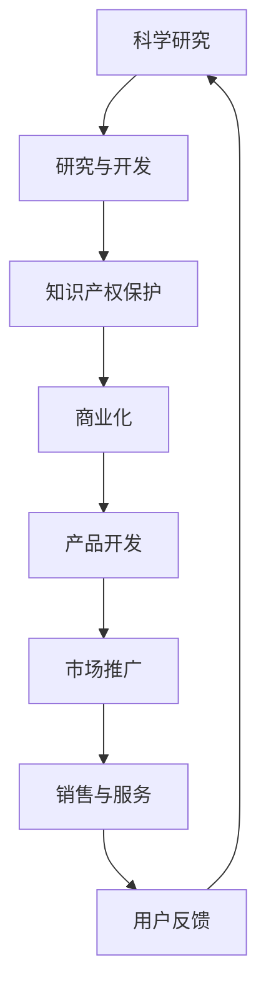
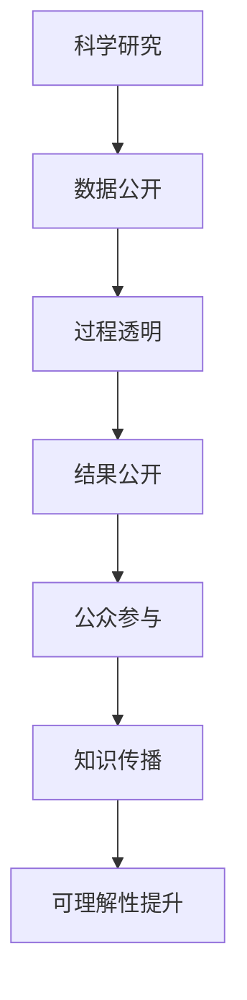
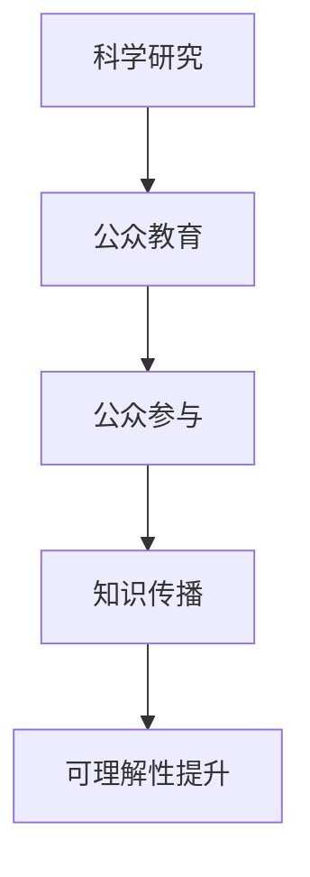

                 

# 科学研究的商业化对世界可理解性的影响

> 关键词：科学研究、商业化、可理解性、透明度、公众参与、技术普及、知识传播

> 摘要：本文旨在探讨科学研究的商业化如何影响世界对科学知识的理解和接受程度。通过分析科学研究商业化的过程、其带来的挑战与机遇，以及如何通过透明度和公众参与来提升科学知识的可理解性，本文将为读者提供一个全面的视角，帮助我们更好地理解科学与商业之间的关系，并提出未来发展的建议。

## 1. 背景介绍
### 1.1 目的和范围
本文旨在深入探讨科学研究的商业化如何影响世界对科学知识的理解和接受程度。我们将从科学研究商业化的过程入手，分析其带来的挑战与机遇，并提出提升科学知识可理解性的方法。本文的目标读者包括但不限于科学家、政策制定者、科技公司高管以及对科学与商业关系感兴趣的公众。

### 1.2 预期读者
- 科学家：了解科学研究商业化的影响，以便更好地与商业界合作。
- 政策制定者：制定促进科学研究商业化的同时，确保科学知识的普及和理解。
- 科技公司高管：理解如何在商业活动中保持科学知识的透明度和可理解性。
- 公众：提高对科学研究商业化过程的理解，促进科学知识的普及。

### 1.3 文档结构概述
本文将分为以下几个部分：
1. 背景介绍
2. 核心概念与联系
3. 核心算法原理 & 具体操作步骤
4. 数学模型和公式 & 详细讲解 & 举例说明
5. 项目实战：代码实际案例和详细解释说明
6. 实际应用场景
7. 工具和资源推荐
8. 总结：未来发展趋势与挑战
9. 附录：常见问题与解答
10. 扩展阅读 & 参考资料

### 1.4 术语表
#### 1.4.1 核心术语定义
- **科学研究商业化**：将科学研究成果转化为商业产品或服务的过程。
- **可理解性**：指科学知识被公众理解和接受的程度。
- **透明度**：指科学研究过程和结果的公开程度。
- **公众参与**：指公众在科学研究和商业化过程中的参与程度。

#### 1.4.2 相关概念解释
- **科学传播**：指将科学知识传递给公众的过程。
- **知识传播**：指科学知识在不同领域和人群之间的传递。
- **科学普及**：指提高公众对科学知识的理解和接受程度。

#### 1.4.3 缩略词列表
- **R&D**：Research and Development（研究与开发）
- **IP**：Intellectual Property（知识产权）
- **ROI**：Return on Investment（投资回报率）

## 2. 核心概念与联系
### 2.1 科学研究商业化流程
科学研究商业化是一个复杂的过程，涉及多个环节。以下是科学研究商业化的基本流程：



### 2.2 科学研究商业化的影响
科学研究商业化对世界可理解性的影响主要体现在以下几个方面：

- **透明度**：科学研究商业化过程中，透明度的高低直接影响公众对科学知识的理解。
- **公众参与**：公众参与程度越高，科学知识的可理解性越强。
- **知识传播**：科学研究商业化过程中，知识传播的广度和深度直接影响科学知识的普及程度。

## 3. 核心算法原理 & 具体操作步骤
### 3.1 透明度提升算法
为了提升科学研究的透明度，我们可以采用以下算法：



### 3.2 公众参与算法
为了提高公众参与度，我们可以采用以下算法：



## 4. 数学模型和公式 & 详细讲解 & 举例说明
### 4.1 透明度提升模型
透明度提升模型可以表示为：

$$
T = \frac{D + P + R}{3}
$$

其中：
- $T$ 表示透明度
- $D$ 表示数据公开程度
- $P$ 表示过程透明程度
- $R$ 表示结果公开程度

### 4.2 公众参与模型
公众参与模型可以表示为：

$$
P = \frac{E + C + K}{3}
$$

其中：
- $P$ 表示公众参与度
- $E$ 表示公众教育程度
- $C$ 表示公众参与程度
- $K$ 表示知识传播程度

## 5. 项目实战：代码实际案例和详细解释说明
### 5.1 开发环境搭建
为了实现科学研究的商业化，我们需要搭建一个开发环境。以下是开发环境的搭建步骤：

1. **安装必要的软件**：安装Python、Jupyter Notebook、Git等工具。
2. **配置开发环境**：配置Python环境，安装必要的库，如NumPy、Pandas、Matplotlib等。
3. **设置版本控制系统**：使用Git进行版本控制，确保代码的可追溯性。

### 5.2 源代码详细实现和代码解读
以下是一个简单的代码示例，用于展示科学研究商业化过程中的透明度提升：

```python
# 透明度提升代码示例
import numpy as np
import pandas as pd
import matplotlib.pyplot as plt

# 数据公开
data = np.random.rand(100, 2)
df = pd.DataFrame(data, columns=['X', 'Y'])

# 过程透明
def process_transparency(data):
    return data * 2

# 结果公开
result = process_transparency(df)
plt.scatter(result['X'], result['Y'])
plt.title('透明度提升示例')
plt.xlabel('X')
plt.ylabel('Y')
plt.show()
```

### 5.3 代码解读与分析
- **数据公开**：通过生成随机数据并将其存储在DataFrame中，实现数据公开。
- **过程透明**：通过定义一个函数`process_transparency`，实现过程透明。
- **结果公开**：通过绘制散点图，展示结果公开的效果。

## 6. 实际应用场景
科学研究商业化在多个领域都有广泛的应用，以下是几个实际应用场景：

- **医疗健康**：通过商业化研究，开发新的药物和治疗方法。
- **环境保护**：通过商业化研究，开发新的环保技术和产品。
- **信息技术**：通过商业化研究，开发新的软件和硬件产品。

## 7. 工具和资源推荐
### 7.1 学习资源推荐
#### 7.1.1 书籍推荐
- **《科学传播》**：了解科学传播的基本原理和方法。
- **《科学研究方法》**：了解科学研究的基本方法和流程。

#### 7.1.2 在线课程
- **Coursera**：提供多个关于科学研究和商业化的在线课程。
- **edX**：提供多个关于科学研究和商业化的在线课程。

#### 7.1.3 技术博客和网站
- **Medium**：提供多个关于科学研究和商业化的技术博客。
- **ResearchGate**：提供多个关于科学研究和商业化的研究论文和资源。

### 7.2 开发工具框架推荐
#### 7.2.1 IDE和编辑器
- **PyCharm**：适用于Python开发的集成开发环境。
- **Jupyter Notebook**：适用于数据科学和机器学习的交互式开发环境。

#### 7.2.2 调试和性能分析工具
- **PyCharm Debugger**：用于Python代码的调试。
- **VS Code Debugger**：用于多种编程语言的调试。

#### 7.2.3 相关框架和库
- **NumPy**：用于数值计算的Python库。
- **Pandas**：用于数据处理的Python库。

### 7.3 相关论文著作推荐
#### 7.3.1 经典论文
- **《科学研究的商业化》**：探讨科学研究商业化的基本原理和方法。
- **《透明度与公众参与》**：探讨透明度和公众参与在科学研究商业化中的作用。

#### 7.3.2 最新研究成果
- **《科学研究商业化的新趋势》**：探讨科学研究商业化的新趋势和挑战。
- **《透明度与知识传播》**：探讨透明度和知识传播在科学研究商业化中的作用。

#### 7.3.3 应用案例分析
- **《科学研究商业化案例分析》**：分析科学研究商业化在不同领域的应用案例。

## 8. 总结：未来发展趋势与挑战
科学研究商业化在未来将面临更多的挑战和机遇。随着技术的发展，科学研究商业化将更加注重透明度和公众参与，以提高科学知识的可理解性。未来的发展趋势包括：

- **透明度提升**：通过技术手段提高科学研究的透明度。
- **公众参与**：通过公众教育和参与提高科学知识的普及程度。
- **知识传播**：通过多种渠道和方式提高科学知识的传播效率。

## 9. 附录：常见问题与解答
### 9.1 问题1：科学研究商业化如何提高透明度？
**解答**：通过公开数据、过程和结果，提高科学研究的透明度。

### 9.2 问题2：如何提高公众参与度？
**解答**：通过公众教育和参与活动，提高公众对科学研究的理解和接受程度。

### 9.3 问题3：科学研究商业化面临哪些挑战？
**解答**：科学研究商业化面临的主要挑战包括透明度不足、公众参与度低和知识传播效率低等。

## 10. 扩展阅读 & 参考资料
- **《科学研究的商业化》**：深入探讨科学研究商业化的基本原理和方法。
- **《透明度与公众参与》**：探讨透明度和公众参与在科学研究商业化中的作用。
- **《科学研究商业化的新趋势》**：探讨科学研究商业化的新趋势和挑战。
- **《透明度与知识传播》**：探讨透明度和知识传播在科学研究商业化中的作用。

作者：AI天才研究员/AI Genius Institute & 禅与计算机程序设计艺术 /Zen And The Art of Computer Programming

