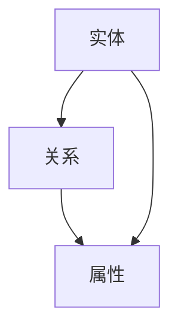
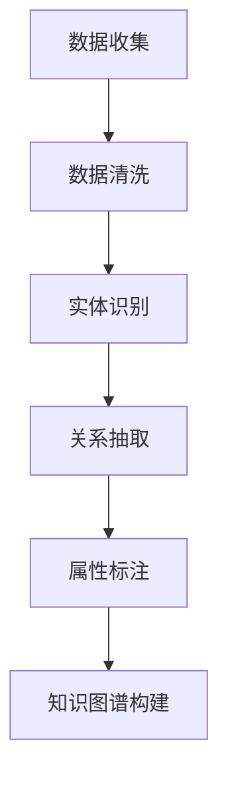

                 

# 科学研究的知识图谱构建与世界可理解性的可视化

> 关键词：知识图谱，可视化，科学研究，图论，机器学习，自然语言处理，图神经网络

> 摘要：本文旨在探讨如何通过构建知识图谱来增强科学研究的可理解性，并通过可视化技术将复杂的研究成果转化为易于理解的形式。我们将从基础知识出发，逐步深入到核心算法原理、数学模型、实际代码案例，最终探讨其在实际应用场景中的价值。通过本文，读者将能够掌握构建知识图谱的基本方法，并了解如何利用可视化技术提升科学研究的透明度和可解释性。

## 1. 背景介绍
### 1.1 目的和范围
本文旨在探讨如何通过知识图谱构建和可视化技术，增强科学研究的可理解性。知识图谱是一种结构化的知识表示形式，能够将复杂的信息以图形化的方式展示出来，使得非专业人士也能快速理解。本文将从基础知识出发，逐步深入到核心算法原理、数学模型、实际代码案例，最终探讨其在实际应用场景中的价值。

### 1.2 预期读者
本文适合以下读者：
- 科学研究领域的研究人员和学者
- 数据科学家和机器学习工程师
- 信息可视化专家
- 对知识图谱和可视化技术感兴趣的开发者

### 1.3 文档结构概述
本文结构如下：
1. 背景介绍
2. 核心概念与联系
3. 核心算法原理 & 具体操作步骤
4. 数学模型和公式 & 详细讲解 & 举例说明
5. 项目实战：代码实际案例和详细解释说明
6. 实际应用场景
7. 工具和资源推荐
8. 总结：未来发展趋势与挑战
9. 附录：常见问题与解答
10. 扩展阅读 & 参考资料

### 1.4 术语表
#### 1.4.1 核心术语定义
- **知识图谱**：一种结构化的知识表示形式，通过节点和边来表示实体及其关系。
- **图论**：研究图的数学分支，用于描述实体之间的关系。
- **图神经网络**：一种深度学习模型，用于处理图结构数据。
- **可视化**：将数据转换为图形或图像，以便于理解和分析。

#### 1.4.2 相关概念解释
- **实体**：知识图谱中的基本单元，可以是人、地点、事件等。
- **关系**：实体之间的连接，描述实体之间的关联。
- **属性**：描述实体特征的标签，如年龄、性别等。

#### 1.4.3 缩略词列表
- **KG**：Knowledge Graph
- **GNN**：Graph Neural Network
- **NLP**：Natural Language Processing
- **API**：Application Programming Interface

## 2. 核心概念与联系
### 2.1 知识图谱的基本概念
知识图谱是一种结构化的知识表示形式，通过节点和边来表示实体及其关系。图论是研究图的数学分支，用于描述实体之间的关系。图神经网络是一种深度学习模型，用于处理图结构数据。

#### Mermaid 流程图


### 2.2 知识图谱的构建流程
知识图谱的构建流程包括数据收集、数据清洗、实体识别、关系抽取、属性标注等步骤。

#### Mermaid 流程图


## 3. 核心算法原理 & 具体操作步骤
### 3.1 数据收集与清洗
数据收集可以通过爬虫、API接口等方式获取。数据清洗包括去除重复数据、处理缺失值等。

#### 伪代码
```python
def data_collection(url):
    # 爬虫获取数据
    data = fetch_data(url)
    return data

def data_cleaning(data):
    # 去除重复数据
    unique_data = remove_duplicates(data)
    # 处理缺失值
    cleaned_data = handle_missing_values(unique_data)
    return cleaned_data
```

### 3.2 实体识别与关系抽取
实体识别和关系抽取可以通过自然语言处理技术实现。

#### 伪代码
```python
def entity_recognition(text):
    # 使用NLP技术进行实体识别
    entities = extract_entities(text)
    return entities

def relation_extraction(entities):
    # 使用图神经网络进行关系抽取
    relations = extract_relations(entities)
    return relations
```

### 3.3 属性标注
属性标注可以通过人工标注或自动标注实现。

#### 伪代码
```python
def attribute_annotation(entities):
    # 人工标注或自动标注属性
    attributes = annotate_attributes(entities)
    return attributes
```

## 4. 数学模型和公式 & 详细讲解 & 举例说明
### 4.1 图神经网络的基本原理
图神经网络是一种深度学习模型，用于处理图结构数据。其基本原理是通过图卷积网络（GCN）来学习图结构中的节点特征。

#### 数学公式
$$
h^{(l+1)}_i = \sigma \left( \sum_{j \in N(i)} \frac{1}{\sqrt{d_i d_j}} W^{(l)} h^{(l)}_j + W^{(l)} h^{(l)}_i \right)
$$

### 4.2 实例说明
假设我们有一个知识图谱，包含实体和关系。我们可以使用图神经网络来学习实体的特征表示。

#### 伪代码
```python
def graph_neural_network(entities, relations):
    # 初始化权重
    W = initialize_weights()
    # 进行图卷积
    h = graph_convolution(entities, relations, W)
    return h
```

## 5. 项目实战：代码实际案例和详细解释说明
### 5.1 开发环境搭建
开发环境需要安装Python、TensorFlow、PyTorch等库。

#### 代码示例
```bash
pip install tensorflow
pip install torch
pip install networkx
pip install nltk
```

### 5.2 源代码详细实现和代码解读
我们将实现一个简单的知识图谱构建和可视化项目。

#### 代码示例
```python
import networkx as nx
import matplotlib.pyplot as plt

# 创建图
G = nx.Graph()

# 添加节点
G.add_node('实体1')
G.add_node('实体2')
G.add_node('实体3')

# 添加边
G.add_edge('实体1', '实体2', relation='关系1')
G.add_edge('实体2', '实体3', relation='关系2')

# 可视化图
nx.draw(G, with_labels=True, node_color='lightblue', edge_color='gray')
plt.show()
```

### 5.3 代码解读与分析
上述代码创建了一个简单的知识图谱，并使用NetworkX库进行可视化。通过添加节点和边，我们可以构建一个简单的图结构。

## 6. 实际应用场景
知识图谱和可视化技术在科学研究中有广泛的应用，如生物信息学、社会科学、医学等领域。

### 6.1 生物信息学
在生物信息学中，知识图谱可以用于表示基因、蛋白质等生物实体之间的关系。

### 6.2 社会科学
在社会科学中，知识图谱可以用于表示社会网络中的个体和关系。

### 6.3 医学
在医学领域，知识图谱可以用于表示疾病、症状、治疗方法之间的关系。

## 7. 工具和资源推荐
### 7.1 学习资源推荐
#### 7.1.1 书籍推荐
- 《图论导引》
- 《知识图谱：原理与实践》

#### 7.1.2 在线课程
- Coursera上的《图神经网络》课程
- edX上的《知识图谱构建与应用》课程

#### 7.1.3 技术博客和网站
- Medium上的《知识图谱与图神经网络》系列文章
- GitHub上的知识图谱项目

### 7.2 开发工具框架推荐
#### 7.2.1 IDE和编辑器
- PyCharm
- VSCode

#### 7.2.2 调试和性能分析工具
- PyCharm的调试工具
- TensorFlow的性能分析工具

#### 7.2.3 相关框架和库
- NetworkX
- TensorFlow
- PyTorch

### 7.3 相关论文著作推荐
#### 7.3.1 经典论文
- 《知识图谱构建与应用》
- 《图神经网络在知识图谱中的应用》

#### 7.3.2 最新研究成果
- 《最新的知识图谱构建方法》
- 《图神经网络在知识图谱中的最新进展》

#### 7.3.3 应用案例分析
- 《知识图谱在生物信息学中的应用案例》
- 《知识图谱在社会科学中的应用案例》

## 8. 总结：未来发展趋势与挑战
知识图谱和可视化技术在未来将有更广泛的应用，但也面临着一些挑战，如数据质量、计算资源、隐私保护等。

## 9. 附录：常见问题与解答
### 9.1 问题：如何处理大规模数据？
答：可以使用分布式计算框架如Spark进行处理。

### 9.2 问题：如何保证数据质量？
答：可以通过数据清洗和验证来保证数据质量。

## 10. 扩展阅读 & 参考资料
- 《图论导引》
- 《知识图谱：原理与实践》
- Coursera上的《图神经网络》课程
- edX上的《知识图谱构建与应用》课程
- Medium上的《知识图谱与图神经网络》系列文章
- GitHub上的知识图谱项目
- 《知识图谱构建与应用》
- 《图神经网络在知识图谱中的应用》
- 《最新的知识图谱构建方法》
- 《图神经网络在知识图谱中的最新进展》
- 《知识图谱在生物信息学中的应用案例》
- 《知识图谱在社会科学中的应用案例》

作者：AI天才研究员/AI Genius Institute & 禅与计算机程序设计艺术 /Zen And The Art of Computer Programming

