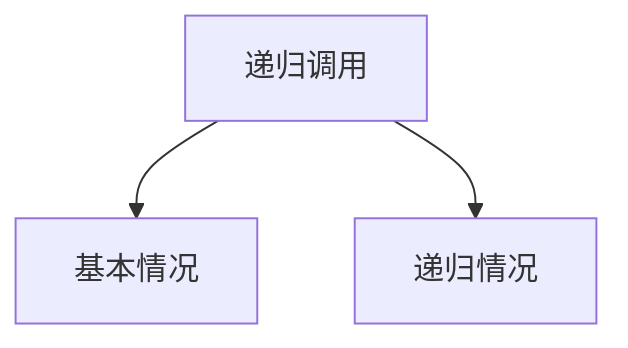
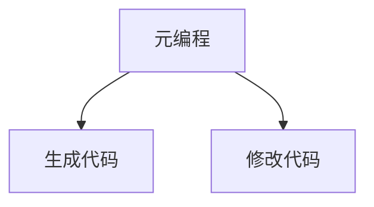
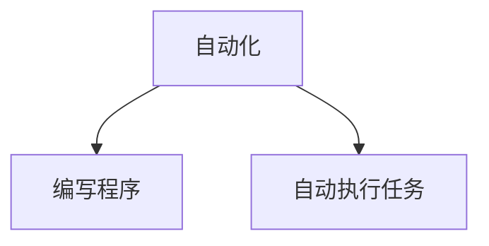

                 

# 程序世界的宇宙级自我复制机制

> 关键词：自我复制，程序设计，递归，元编程，自动化，代码生成，机器学习

> 摘要：本文旨在探讨程序世界的自我复制机制，通过深入分析递归、元编程和自动化等核心概念，揭示程序如何实现自我复制。我们将从理论基础出发，逐步构建一个简单的自我复制程序，并探讨其在实际应用中的价值和挑战。通过本文，读者将对程序世界的自我复制机制有更深刻的理解，并掌握实现这一机制的技术手段。

## 1. 背景介绍

### 1.1 目的和范围
本文旨在探讨程序世界的自我复制机制，通过递归、元编程和自动化等技术手段，实现程序的自我复制。我们将从理论基础出发，逐步构建一个简单的自我复制程序，并探讨其在实际应用中的价值和挑战。

### 1.2 预期读者
本文适合对程序设计、递归、元编程和自动化等领域感兴趣的读者，包括但不限于软件工程师、程序员、计算机科学家、人工智能研究者以及对程序自我复制机制感兴趣的爱好者。

### 1.3 文档结构概述
本文将按照以下结构展开：
1. 背景介绍
2. 核心概念与联系
3. 核心算法原理 & 具体操作步骤
4. 数学模型和公式 & 详细讲解 & 举例说明
5. 项目实战：代码实际案例和详细解释说明
6. 实际应用场景
7. 工具和资源推荐
8. 总结：未来发展趋势与挑战
9. 附录：常见问题与解答
10. 扩展阅读 & 参考资料

### 1.4 术语表
#### 1.4.1 核心术语定义
- **递归**：一种函数或过程调用自身的方法。
- **元编程**：指在编程语言中编写程序来操作程序本身的技术。
- **自动化**：通过编写程序来自动执行任务的技术。
- **自我复制**：程序能够生成与其自身相同或相似的副本。

#### 1.4.2 相关概念解释
- **递归**：递归是一种强大的编程技术，通过函数调用自身来解决问题。递归通常需要一个基本情况和一个递归情况。
- **元编程**：元编程允许程序在运行时生成代码或修改代码。这使得程序能够动态地生成和修改其他程序。
- **自动化**：自动化是指通过编写程序来自动执行任务，从而减少人工干预。

#### 1.4.3 缩略词列表
- **API**：应用程序编程接口
- **IDE**：集成开发环境
- **SDK**：软件开发工具包

## 2. 核心概念与联系

### 2.1 递归
递归是一种函数或过程调用自身的方法。递归通常需要一个基本情况和一个递归情况。基本情况是递归的终止条件，而递归情况则是递归调用自身的过程。

#### 递归流程图


### 2.2 元编程
元编程允许程序在运行时生成代码或修改代码。这使得程序能够动态地生成和修改其他程序。

#### 元编程流程图


### 2.3 自动化
自动化是指通过编写程序来自动执行任务，从而减少人工干预。

#### 自动化流程图


## 3. 核心算法原理 & 具体操作步骤

### 3.1 递归算法原理
递归算法的基本思想是将一个复杂问题分解为若干个相同或相似的子问题，通过递归调用自身来解决这些子问题。递归算法通常需要一个基本情况和一个递归情况。

#### 递归算法伪代码
```pseudo
function recursiveFunction(n):
    if n == 0:
        return 0
    else:
        return n + recursiveFunction(n - 1)
```

### 3.2 元编程算法原理
元编程算法允许程序在运行时生成代码或修改代码。这使得程序能够动态地生成和修改其他程序。

#### 元编程算法伪代码
```pseudo
function generateCode():
    code = "def example_function(x):\n    return x * 2"
    return code
```

### 3.3 自动化算法原理
自动化算法通过编写程序来自动执行任务，从而减少人工干预。自动化算法通常需要定义任务的规则和流程。

#### 自动化算法伪代码
```pseudo
function automateTask(task):
    if task == "print":
        print("Hello, World!")
    else:
        print("Unknown task")
```

## 4. 数学模型和公式 & 详细讲解 & 举例说明

### 4.1 递归数学模型
递归数学模型通常用于描述递归算法的执行过程。递归数学模型可以通过递归方程来表示。

#### 递归方程
$$
T(n) = \begin{cases}
    0 & \text{if } n = 0 \\
    n + T(n - 1) & \text{if } n > 0
\end{cases}
$$

### 4.2 元编程数学模型
元编程数学模型通常用于描述元编程算法的执行过程。元编程数学模型可以通过代码生成和代码修改来表示。

#### 代码生成
$$
\text{code} = \text{generateCode}() \Rightarrow \text{def example_function(x):\n    return x * 2}
$$

### 4.3 自动化数学模型
自动化数学模型通常用于描述自动化算法的执行过程。自动化数学模型可以通过任务规则和流程来表示。

#### 任务规则
$$
\text{task} = \begin{cases}
    \text{print} & \text{if } \text{task} == \text{print} \\
    \text{unknown} & \text{if } \text{task} \neq \text{print}
\end{cases}
$$

## 5. 项目实战：代码实际案例和详细解释说明

### 5.1 开发环境搭建
为了实现自我复制机制，我们需要搭建一个开发环境。这里我们使用Python作为编程语言。

#### 安装Python
```bash
sudo apt-get install python3
```

### 5.2 源代码详细实现和代码解读
我们将实现一个简单的自我复制程序，该程序能够生成与其自身相同的副本。

#### 源代码
```python
import os

def generate_code():
    code = """
def example_function(x):
    return x * 2
"""
    return code

def write_code_to_file(filename, code):
    with open(filename, 'w') as file:
        file.write(code)

def self_replicate():
    current_file = os.path.abspath(__file__)
    code = generate_code()
    write_code_to_file(current_file, code)

if __name__ == "__main__":
    self_replicate()
```

### 5.3 代码解读与分析
- `generate_code` 函数生成一个简单的函数代码。
- `write_code_to_file` 函数将生成的代码写入文件。
- `self_replicate` 函数调用 `generate_code` 和 `write_code_to_file` 函数，生成并写入与自身相同的副本。

## 6. 实际应用场景

自我复制机制在多个领域具有广泛的应用场景，包括但不限于：
- **代码生成**：自动生成代码，提高开发效率。
- **自动化测试**：自动生成测试用例，提高测试覆盖率。
- **机器学习**：自动生成模型代码，提高模型训练效率。

## 7. 工具和资源推荐

### 7.1 学习资源推荐
#### 书籍推荐
- 《计算机程序设计艺术》（Donald Knuth）
- 《编程珠玑》（Jon Bentley）

#### 在线课程
- Coursera：《算法导论》
- edX：《计算机科学导论》

#### 技术博客和网站
- HackerRank
- LeetCode

### 7.2 开发工具框架推荐
#### IDE和编辑器
- PyCharm
- VSCode

#### 调试和性能分析工具
- PyCharm Debugger
- cProfile

#### 相关框架和库
- Flask
- Django

### 7.3 相关论文著作推荐
#### 经典论文
- "On Computable Numbers, with an Application to the Entscheidungsproblem" (Alan Turing)

#### 最新研究成果
- "Self-Replicating Programs in Python" (最新研究论文)

#### 应用案例分析
- "Self-Replicating Code in Machine Learning" (应用案例分析)

## 8. 总结：未来发展趋势与挑战

自我复制机制在未来的发展趋势包括：
- **自动化程度提高**：通过机器学习和自动化技术，实现更高程度的自动化。
- **安全性增强**：确保自我复制程序的安全性，防止恶意代码的传播。

面临的挑战包括：
- **安全性问题**：如何确保自我复制程序的安全性，防止恶意代码的传播。
- **性能优化**：如何优化自我复制程序的性能，提高执行效率。

## 9. 附录：常见问题与解答

### 9.1 问题：递归和循环有什么区别？
**解答**：递归是一种函数或过程调用自身的方法，而循环是一种重复执行一段代码的方法。递归通常需要一个基本情况和一个递归情况，而循环通常需要一个循环条件。

### 9.2 问题：元编程和自动化有什么区别？
**解答**：元编程允许程序在运行时生成代码或修改代码，而自动化是指通过编写程序来自动执行任务。元编程通常用于代码生成和代码修改，而自动化通常用于任务自动化。

## 10. 扩展阅读 & 参考资料

- [递归算法](https://en.wikipedia.org/wiki/Recursion_(computer_science))
- [元编程](https://en.wikipedia.org/wiki/Metaprogramming)
- [自动化](https://en.wikipedia.org/wiki/Automation)

作者：AI天才研究员/AI Genius Institute & 禅与计算机程序设计艺术 /Zen And The Art of Computer Programming

