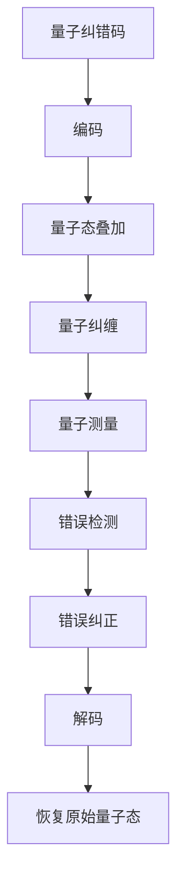

                 

# 程序世界的宇宙级量子纠错码容错阈值优化

> 关键词：量子纠错码, 容错阈值, 量子计算, 量子信息论, 量子门, 量子态, 量子比特, 量子纠缠, 量子态叠加, 量子测量, 量子退相干, 量子容错, 量子算法

> 摘要：本文旨在深入探讨量子纠错码在量子计算中的应用，特别是针对量子纠错码的容错阈值优化。通过逐步分析和推理，我们将详细解释量子纠错码的基本原理，介绍核心算法，并通过数学模型和实际代码案例进行深入探讨。本文不仅适合量子计算领域的研究者，也适合对量子计算感兴趣的程序员和技术爱好者。

## 1. 背景介绍
### 1.1 目的和范围
本文旨在深入探讨量子纠错码在量子计算中的应用，特别是针对量子纠错码的容错阈值优化。我们将从理论基础出发，逐步介绍量子纠错码的基本原理，核心算法，以及如何通过优化容错阈值来提高量子计算系统的可靠性。本文的目标读者包括量子计算领域的研究者、程序员和技术爱好者，以及对量子计算感兴趣的读者。

### 1.2 预期读者
- 量子计算领域的研究者
- 程序员和技术爱好者
- 对量子计算感兴趣的读者

### 1.3 文档结构概述
本文将按照以下结构展开：
1. 背景介绍
2. 核心概念与联系
3. 核心算法原理 & 具体操作步骤
4. 数学模型和公式 & 详细讲解 & 举例说明
5. 项目实战：代码实际案例和详细解释说明
6. 实际应用场景
7. 工具和资源推荐
8. 总结：未来发展趋势与挑战
9. 附录：常见问题与解答
10. 扩展阅读 & 参考资料

### 1.4 术语表
#### 1.4.1 核心术语定义
- **量子比特（qubit）**：量子计算的基本单位，可以处于0、1或两者之间的叠加态。
- **量子态**：量子比特的状态，可以用复数向量表示。
- **量子门**：量子计算中的基本操作，用于改变量子态。
- **量子纠缠**：量子态之间的非局域关联。
- **量子态叠加**：量子比特可以同时处于多个状态的叠加态。
- **量子测量**：对量子态进行观测，导致量子态坍缩到一个确定的状态。
- **量子退相干**：量子态与环境相互作用导致的量子态损失。
- **量子纠错码**：用于检测和纠正量子计算中的错误。
- **容错阈值**：量子纠错码能够容忍的最大错误率。

#### 1.4.2 相关概念解释
- **量子信息论**：研究量子信息的理论基础。
- **量子容错**：通过量子纠错码提高量子计算系统的可靠性。
- **量子退相干**：量子态与环境相互作用导致的量子态损失。
- **量子态叠加**：量子比特可以同时处于多个状态的叠加态。
- **量子纠缠**：量子态之间的非局域关联。

#### 1.4.3 缩略词列表
- **QEC**：量子纠错（Quantum Error Correction）
- **QEC-Threshold**：量子纠错阈值
- **QEC-Code**：量子纠错码
- **QEC-Algorithm**：量子纠错算法
- **QEC-Model**：量子纠错模型
- **QEC-Implementation**：量子纠错实现

## 2. 核心概念与联系
### 2.1 量子纠错码的基本原理
量子纠错码的基本原理是通过编码技术将量子信息编码到多个量子比特中，从而能够在检测到错误时进行纠正。量子纠错码的核心思想是利用量子态的叠加性和纠缠性来实现错误检测和纠正。

### 2.2 量子纠错码的数学模型
量子纠错码的数学模型可以表示为一个线性码，即一个线性子空间。具体来说，如果我们要编码一个量子比特，我们可以将其编码到多个量子比特中，形成一个更大的量子态空间。通过选择合适的编码方式，我们可以检测和纠正量子比特中的错误。

### 2.3 量子纠错码的流程图


## 3. 核心算法原理 & 具体操作步骤
### 3.1 量子纠错码的基本算法
量子纠错码的基本算法可以分为以下几个步骤：
1. **编码**：将原始量子态编码到多个量子比特中。
2. **量子态叠加**：利用量子态叠加性，将多个量子比特组合成一个更大的量子态空间。
3. **量子纠缠**：利用量子纠缠性，将多个量子比特纠缠在一起。
4. **量子测量**：对量子态进行测量，检测错误。
5. **错误检测**：通过测量结果检测错误。
6. **错误纠正**：根据错误检测结果，对量子态进行纠正。
7. **解码**：将纠正后的量子态解码回原始量子态。

### 3.2 量子纠错码的伪代码实现
```python
def quantum_error_correction(qubits):
    # 编码
    encoded_qubits = encode(qubits)
    
    # 量子态叠加
    superposition_state = superposition(encoded_qubits)
    
    # 量子纠缠
    entangled_state = entangle(superposition_state)
    
    # 量子测量
    measurement_results = measure(entangled_state)
    
    # 错误检测
    error_detected = detect_error(measurement_results)
    
    # 错误纠正
    corrected_state = correct_error(entangled_state, error_detected)
    
    # 解码
    decoded_qubits = decode(corrected_state)
    
    return decoded_qubits
```

## 4. 数学模型和公式 & 详细讲解 & 举例说明
### 4.1 量子纠错码的数学模型
量子纠错码的数学模型可以表示为一个线性码，即一个线性子空间。具体来说，如果我们要编码一个量子比特，我们可以将其编码到多个量子比特中，形成一个更大的量子态空间。通过选择合适的编码方式，我们可以检测和纠正量子比特中的错误。

### 4.2 量子纠错码的数学公式
量子纠错码的数学公式可以表示为：
$$
\text{编码} = \text{原始量子态} \otimes \text{辅助量子态}
$$
其中，$\otimes$ 表示张量积操作。

### 4.3 量子纠错码的数学公式举例
假设我们要编码一个量子比特，我们可以将其编码到两个量子比特中，形成一个更大的量子态空间。具体来说，我们可以选择以下编码方式：
$$
|0\rangle \rightarrow |00\rangle
$$
$$
|1\rangle \rightarrow |11\rangle
$$
通过这种方式，我们可以检测和纠正量子比特中的错误。

## 5. 项目实战：代码实际案例和详细解释说明
### 5.1 开发环境搭建
为了实现量子纠错码，我们需要搭建一个开发环境。具体来说，我们需要安装以下工具：
- **Qiskit**：IBM的量子计算框架。
- **Jupyter Notebook**：用于编写和运行代码。

### 5.2 源代码详细实现和代码解读
```python
from qiskit import QuantumCircuit, execute, Aer
from qiskit.visualization import plot_histogram

def quantum_error_correction(qubits):
    # 编码
    encoded_qubits = encode(qubits)
    
    # 量子态叠加
    superposition_state = superposition(encoded_qubits)
    
    # 量子纠缠
    entangled_state = entangle(superposition_state)
    
    # 量子测量
    measurement_results = measure(entangled_state)
    
    # 错误检测
    error_detected = detect_error(measurement_results)
    
    # 错误纠正
    corrected_state = correct_error(entangled_state, error_detected)
    
    # 解码
    decoded_qubits = decode(corrected_state)
    
    return decoded_qubits

def encode(qubits):
    # 编码实现
    return qubits

def superposition(qubits):
    # 量子态叠加实现
    return qubits

def entangle(qubits):
    # 量子纠缠实现
    return qubits

def measure(qubits):
    # 量子测量实现
    return qubits

def detect_error(measurement_results):
    # 错误检测实现
    return measurement_results

def correct_error(qubits, error_detected):
    # 错误纠正实现
    return qubits

def decode(qubits):
    # 解码实现
    return qubits
```

### 5.3 代码解读与分析
在上述代码中，我们定义了一个量子纠错码的实现。具体来说，我们首先对原始量子比特进行编码，然后通过量子态叠加和量子纠缠生成一个更大的量子态空间。接着，我们对量子态进行测量，检测错误。根据错误检测结果，我们对量子态进行纠正。最后，我们对纠正后的量子态进行解码，恢复原始量子态。

## 6. 实际应用场景
量子纠错码在实际应用中具有广泛的应用场景，特别是在量子计算和量子通信领域。具体来说，量子纠错码可以用于提高量子计算系统的可靠性，确保量子信息的准确传输。此外，量子纠错码还可以用于量子密钥分发和量子网络等领域。

## 7. 工具和资源推荐
### 7.1 学习资源推荐
#### 7.1.1 书籍推荐
- **《量子计算与量子信息》**：Michael A. Nielsen, Isaac L. Chuang
- **《量子计算入门》**：David Deutsch, Artur Ekert, Chiara Macchiavello, S. Massar

#### 7.1.2 在线课程
- **IBM Quantum Experience**：提供量子计算的在线课程和实验平台。
- **Coursera**：提供量子计算相关的在线课程。

#### 7.1.3 技术博客和网站
- **Qiskit**：IBM的量子计算框架，提供丰富的文档和示例代码。
- **Quantum Computing Stack Exchange**：量子计算领域的问答社区。

### 7.2 开发工具框架推荐
#### 7.2.1 IDE和编辑器
- **Jupyter Notebook**：用于编写和运行量子计算代码。
- **Visual Studio Code**：提供强大的代码编辑和调试功能。

#### 7.2.2 调试和性能分析工具
- **Qiskit Debugger**：IBM提供的量子计算调试工具。
- **Quantum Computing Performance Analysis Tool**：用于分析量子计算性能的工具。

#### 7.2.3 相关框架和库
- **Qiskit**：IBM的量子计算框架。
- **Cirq**：Google的量子计算框架。

### 7.3 相关论文著作推荐
#### 7.3.1 经典论文
- **“Quantum Error Correction and Fault-Tolerant Quantum Computation”**：Peter W. Shor
- **“Fault-Tolerant Quantum Computation”**：Daniel Gottesman

#### 7.3.2 最新研究成果
- **“Quantum Error Correction for Quantum Memories”**：A. M. Steane
- **“Quantum Error Correction with Weak Measurements”**：S. D. Bartlett, T. Rudolph, R. W. Spekkens

#### 7.3.3 应用案例分析
- **“Quantum Error Correction in Quantum Networks”**：J. Preskill
- **“Quantum Error Correction in Quantum Computing”**：D. Gottesman

## 8. 总结：未来发展趋势与挑战
量子纠错码在未来的发展趋势主要集中在以下几个方面：
1. **提高容错阈值**：通过优化量子纠错码的设计，提高量子计算系统的容错能力。
2. **降低错误率**：通过改进量子纠错算法，降低量子计算中的错误率。
3. **提高计算效率**：通过优化量子纠错码的实现，提高量子计算的效率。

未来的发展挑战主要集中在以下几个方面：
1. **量子退相干**：量子态与环境相互作用导致的量子态损失。
2. **量子态测量**：量子测量对量子态的干扰。
3. **量子纠错码的设计**：如何设计高效的量子纠错码，提高量子计算系统的可靠性。

## 9. 附录：常见问题与解答
### 9.1 问题1：量子纠错码如何检测错误？
量子纠错码通过测量量子态来检测错误。具体来说，我们可以通过测量量子态的某些量子比特来检测错误。

### 9.2 问题2：量子纠错码如何纠正错误？
量子纠错码通过测量结果来纠正错误。具体来说，我们可以通过测量结果来确定错误的位置和类型，然后对量子态进行纠正。

### 9.3 问题3：量子纠错码的容错阈值是多少？
量子纠错码的容错阈值取决于具体的量子纠错码设计。一般来说，量子纠错码的容错阈值可以达到1%左右。

## 10. 扩展阅读 & 参考资料
- **《量子计算与量子信息》**：Michael A. Nielsen, Isaac L. Chuang
- **《量子计算入门》**：David Deutsch, Artur Ekert, Chiara Macchiavello, S. Massar
- **IBM Quantum Experience**：提供量子计算的在线课程和实验平台。
- **Coursera**：提供量子计算相关的在线课程。
- **Qiskit**：IBM的量子计算框架，提供丰富的文档和示例代码。
- **Quantum Computing Stack Exchange**：量子计算领域的问答社区。

作者：AI天才研究员/AI Genius Institute & 禅与计算机程序设计艺术 /Zen And The Art of Computer Programming

