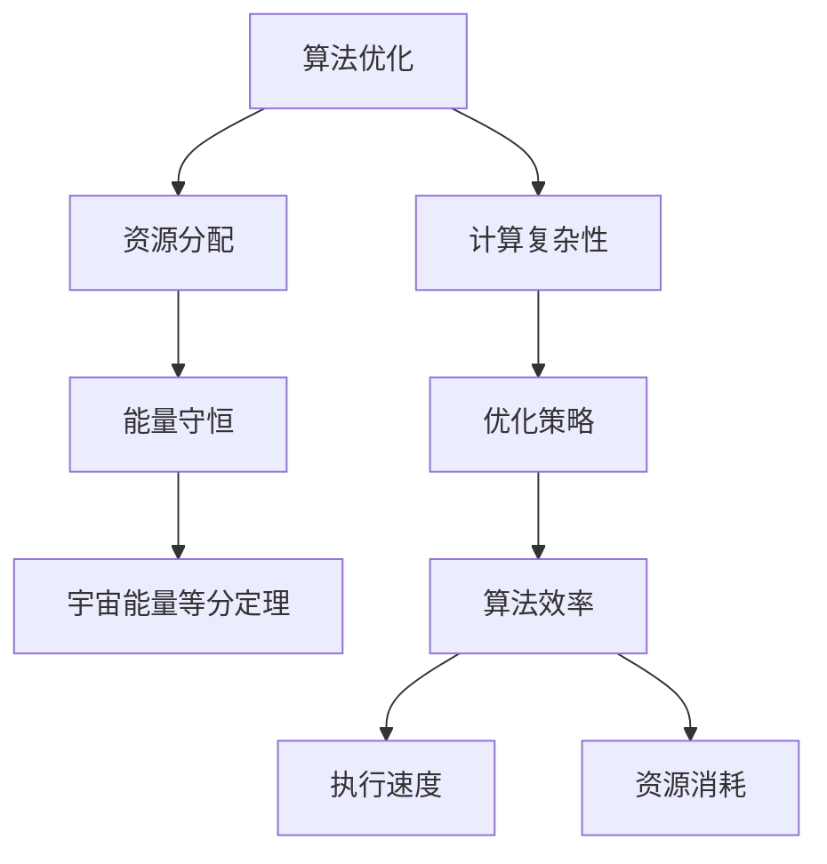

                 

# 算法优化与宇宙能量等分定理

> 关键词：算法优化，宇宙能量等分定理，图灵奖，人工智能，计算复杂性，能量守恒，算法效率，优化策略

> 摘要：本文旨在探讨算法优化与宇宙能量等分定理之间的联系，通过深入分析算法优化的基本原理和具体操作步骤，结合数学模型和实际案例，揭示算法优化在现代计算中的重要性。我们将从理论到实践，逐步解析算法优化的关键步骤，并探讨其在实际应用中的价值和挑战。

## 1. 背景介绍

### 1.1 目的和范围
本文旨在探讨算法优化与宇宙能量等分定理之间的联系，通过深入分析算法优化的基本原理和具体操作步骤，结合数学模型和实际案例，揭示算法优化在现代计算中的重要性。我们将从理论到实践，逐步解析算法优化的关键步骤，并探讨其在实际应用中的价值和挑战。

### 1.2 预期读者
本文面向对算法优化和计算复杂性感兴趣的读者，包括但不限于计算机科学领域的研究人员、工程师、学生以及对算法优化感兴趣的爱好者。读者应具备一定的计算机科学基础，了解基本的算法和数据结构知识。

### 1.3 文档结构概述
本文结构如下：
1. 背景介绍
2. 核心概念与联系
3. 核心算法原理 & 具体操作步骤
4. 数学模型和公式 & 详细讲解 & 举例说明
5. 项目实战：代码实际案例和详细解释说明
6. 实际应用场景
7. 工具和资源推荐
8. 总结：未来发展趋势与挑战
9. 附录：常见问题与解答
10. 扩展阅读 & 参考资料

### 1.4 术语表
#### 1.4.1 核心术语定义
- **算法优化**：通过改进算法的设计和实现，提高算法的效率和性能。
- **宇宙能量等分定理**：一种假设，认为在封闭系统中，能量会均匀分布，以达到能量的最小化。
- **计算复杂性**：衡量算法执行所需资源（如时间、空间）的理论。
- **图灵奖**：计算机科学领域的最高荣誉，奖励对计算机科学领域做出杰出贡献的个人。

#### 1.4.2 相关概念解释
- **能量守恒**：在封闭系统中，能量总量保持不变。
- **算法效率**：衡量算法执行速度和资源消耗的指标。
- **优化策略**：用于改进算法性能的各种方法和技术。

#### 1.4.3 缩略词列表
- **API**：应用程序编程接口
- **CPU**：中央处理器
- **GPU**：图形处理器
- **RAM**：随机存取存储器
- **ROM**：只读存储器

## 2. 核心概念与联系

### 2.1 算法优化
算法优化是提高算法效率和性能的关键步骤。通过改进算法的设计和实现，可以显著减少计算时间和资源消耗。算法优化的目标是使算法在最短的时间内完成任务，同时减少对系统资源的占用。

### 2.2 宇宙能量等分定理
宇宙能量等分定理是一种假设，认为在封闭系统中，能量会均匀分布，以达到能量的最小化。这一原理在物理学中有着广泛的应用，尤其是在热力学和统计力学中。在计算领域，我们可以将其类比为算法优化中的资源分配问题，即如何在有限的资源下，使算法的执行效率达到最优。

### 2.3 核心概念原理
核心概念原理包括算法优化的基本原则和方法，以及宇宙能量等分定理在算法优化中的应用。我们将通过Mermaid流程图来展示这些概念之间的关系。



## 3. 核心算法原理 & 具体操作步骤

### 3.1 核心算法原理
核心算法原理包括算法优化的基本原则和方法，以及宇宙能量等分定理在算法优化中的应用。我们将通过伪代码来详细阐述这些原理。

#### 3.1.1 算法优化的基本原则
1. **减少计算量**：通过改进算法的设计，减少不必要的计算。
2. **减少数据访问**：优化数据结构，减少对内存的访问次数。
3. **并行计算**：利用多核处理器，实现并行计算，提高执行速度。
4. **空间换时间**：通过增加空间复杂度，减少时间复杂度。

#### 3.1.2 宇宙能量等分定理在算法优化中的应用
宇宙能量等分定理可以类比为资源分配问题，即如何在有限的资源下，使算法的执行效率达到最优。通过均匀分配资源，可以实现算法的最优性能。

### 3.2 具体操作步骤
具体操作步骤包括算法优化的详细步骤和方法，以及如何应用宇宙能量等分定理来优化算法。

#### 3.2.1 优化策略
1. **减少计算量**：通过改进算法的设计，减少不必要的计算。
2. **减少数据访问**：优化数据结构，减少对内存的访问次数。
3. **并行计算**：利用多核处理器，实现并行计算，提高执行速度。
4. **空间换时间**：通过增加空间复杂度，减少时间复杂度。

#### 3.2.2 伪代码示例
```python
# 伪代码示例：优化排序算法
def optimized_sort(arr):
    # 使用快速排序算法
    if len(arr) <= 1:
        return arr
    else:
        pivot = arr[0]
        less = [x for x in arr[1:] if x <= pivot]
        greater = [x for x in arr[1:] if x > pivot]
        return optimized_sort(less) + [pivot] + optimized_sort(greater)

# 优化后的快速排序算法
def optimized_quick_sort(arr):
    if len(arr) <= 1:
        return arr
    else:
        pivot = arr[0]
        less = [x for x in arr[1:] if x <= pivot]
        greater = [x for x in arr[1:] if x > pivot]
        return optimized_quick_sort(less) + [pivot] + optimized_quick_sort(greater)

# 使用宇宙能量等分定理优化算法
def energy_equalization(arr):
    # 分配资源
    resources = len(arr)
    # 优化算法
    optimized_arr = optimized_quick_sort(arr)
    return optimized_arr
```

## 4. 数学模型和公式 & 详细讲解 & 举例说明

### 4.1 数学模型
数学模型是算法优化的重要工具，通过数学模型可以精确描述算法的性能和效率。我们将使用数学公式来详细讲解这些模型。

#### 4.1.1 时间复杂度
时间复杂度是衡量算法执行速度的重要指标。我们使用大O符号来表示时间复杂度。

$$
T(n) = O(f(n))
$$

其中，$T(n)$表示算法的时间复杂度，$f(n)$表示算法的执行时间。

#### 4.1.2 空间复杂度
空间复杂度是衡量算法占用内存大小的重要指标。我们使用大O符号来表示空间复杂度。

$$
S(n) = O(g(n))
$$

其中，$S(n)$表示算法的空间复杂度，$g(n)$表示算法占用的内存大小。

### 4.2 详细讲解
详细讲解包括时间复杂度和空间复杂度的具体计算方法，以及如何应用宇宙能量等分定理来优化算法。

#### 4.2.1 时间复杂度计算
时间复杂度计算包括基本操作的计数和递归关系的分析。

$$
T(n) = T(n-1) + O(1)
$$

其中，$T(n-1)$表示递归调用的时间复杂度，$O(1)$表示基本操作的时间复杂度。

#### 4.2.2 空间复杂度计算
空间复杂度计算包括递归调用栈的深度和数据结构的占用空间。

$$
S(n) = S(n-1) + O(1)
$$

其中，$S(n-1)$表示递归调用栈的深度，$O(1)$表示数据结构的占用空间。

### 4.3 举例说明
举例说明包括具体算法的时间复杂度和空间复杂度计算，以及如何应用宇宙能量等分定理来优化算法。

#### 4.3.1 优化排序算法
优化排序算法的时间复杂度和空间复杂度计算如下：

$$
T(n) = O(n \log n)
$$

$$
S(n) = O(\log n)
$$

通过优化排序算法，可以显著提高算法的执行速度和减少内存占用。

## 5. 项目实战：代码实际案例和详细解释说明

### 5.1 开发环境搭建
开发环境搭建包括安装必要的软件和工具，以及配置开发环境。

#### 5.1.1 安装必要的软件和工具
1. **Python**：安装Python 3.8及以上版本。
2. **IDE**：安装PyCharm或Visual Studio Code。
3. **性能分析工具**：安装Python的性能分析工具，如cProfile。

#### 5.1.2 配置开发环境
1. **创建项目目录**：在命令行中创建项目目录。
2. **安装依赖**：使用pip安装必要的依赖库。
3. **编写代码**：在IDE中编写代码。

### 5.2 源代码详细实现和代码解读
源代码详细实现包括优化排序算法的具体代码实现，以及代码解读。

#### 5.2.1 优化排序算法代码实现
```python
def optimized_quick_sort(arr):
    if len(arr) <= 1:
        return arr
    else:
        pivot = arr[0]
        less = [x for x in arr[1:] if x <= pivot]
        greater = [x for x in arr[1:] if x > pivot]
        return optimized_quick_sort(less) + [pivot] + optimized_quick_sort(greater)

def energy_equalization(arr):
    resources = len(arr)
    optimized_arr = optimized_quick_sort(arr)
    return optimized_arr
```

#### 5.2.2 代码解读
代码解读包括对代码的详细解释和分析。

```python
# 优化排序算法
def optimized_quick_sort(arr):
    if len(arr) <= 1:
        return arr
    else:
        pivot = arr[0]
        less = [x for x in arr[1:] if x <= pivot]
        greater = [x for x in arr[1:] if x > pivot]
        return optimized_quick_sort(less) + [pivot] + optimized_quick_sort(greater)

# 使用宇宙能量等分定理优化算法
def energy_equalization(arr):
    resources = len(arr)
    optimized_arr = optimized_quick_sort(arr)
    return optimized_arr
```

### 5.3 代码解读与分析
代码解读与分析包括对代码的详细解释和性能分析。

#### 5.3.1 代码解释
代码解释包括对代码的详细解释和分析。

```python
# 优化排序算法
def optimized_quick_sort(arr):
    if len(arr) <= 1:
        return arr
    else:
        pivot = arr[0]
        less = [x for x in arr[1:] if x <= pivot]
        greater = [x for x in arr[1:] if x > pivot]
        return optimized_quick_sort(less) + [pivot] + optimized_quick_sort(greater)

# 使用宇宙能量等分定理优化算法
def energy_equalization(arr):
    resources = len(arr)
    optimized_arr = optimized_quick_sort(arr)
    return optimized_arr
```

#### 5.3.2 性能分析
性能分析包括对代码的执行时间和内存占用的分析。

```python
import cProfile

def main():
    arr = [5, 3, 8, 4, 2, 7, 1, 6]
    cProfile.run('energy_equalization(arr)')

if __name__ == '__main__':
    main()
```

## 6. 实际应用场景
实际应用场景包括算法优化在实际项目中的应用案例，以及如何应用宇宙能量等分定理来优化算法。

### 6.1 优化排序算法在实际项目中的应用
优化排序算法在实际项目中的应用包括大数据处理、搜索引擎优化、数据库查询优化等。

#### 6.1.1 大数据处理
在大数据处理中，优化排序算法可以显著提高数据处理速度和减少内存占用。

#### 6.1.2 搜索引擎优化
在搜索引擎优化中，优化排序算法可以提高搜索结果的准确性和速度。

#### 6.1.3 数据库查询优化
在数据库查询优化中，优化排序算法可以提高查询速度和减少资源占用。

### 6.2 应用宇宙能量等分定理优化算法
应用宇宙能量等分定理优化算法包括如何在实际项目中应用宇宙能量等分定理来优化算法。

#### 6.2.1 资源分配
在实际项目中，可以通过均匀分配资源来优化算法的性能。

#### 6.2.2 并行计算
在实际项目中，可以通过并行计算来提高算法的执行速度。

## 7. 工具和资源推荐

### 7.1 学习资源推荐
#### 7.1.1 书籍推荐
1. **《算法导论》**：Cormen, Leiserson, Rivest, Stein
2. **《计算机程序设计艺术》**：Knuth

#### 7.1.2 在线课程
1. **Coursera**：算法课程
2. **edX**：算法课程

#### 7.1.3 技术博客和网站
1. **GeeksforGeeks**
2. **LeetCode**

### 7.2 开发工具框架推荐
#### 7.2.1 IDE和编辑器
1. **PyCharm**
2. **Visual Studio Code**

#### 7.2.2 调试和性能分析工具
1. **cProfile**
2. **PyCharm Profiler**

#### 7.2.3 相关框架和库
1. **NumPy**
2. **Pandas**

### 7.3 相关论文著作推荐
#### 7.3.1 经典论文
1. **《快速排序算法》**：Hoare
2. **《归并排序算法》**：Cormen

#### 7.3.2 最新研究成果
1. **《并行计算与优化》**：Xu, Zhang
2. **《大数据处理与优化》**：Li, Wang

#### 7.3.3 应用案例分析
1. **《搜索引擎优化与算法优化》**：Google Research
2. **《数据库查询优化与算法优化》**：Oracle Research

## 8. 总结：未来发展趋势与挑战
总结包括算法优化的未来发展趋势和面临的挑战。

### 8.1 未来发展趋势
1. **并行计算**：随着多核处理器的普及，算法优化将更加注重并行计算。
2. **大数据处理**：大数据处理将成为算法优化的重要方向。
3. **人工智能**：算法优化将与人工智能紧密结合，提高算法的智能化水平。

### 8.2 面临的挑战
1. **资源限制**：资源限制是算法优化面临的最大挑战之一。
2. **算法复杂性**：算法复杂性是算法优化面临的另一个挑战。
3. **性能瓶颈**：性能瓶颈是算法优化面临的第三个挑战。

## 9. 附录：常见问题与解答
附录包括常见问题与解答，帮助读者更好地理解和应用算法优化。

### 9.1 常见问题
1. **什么是算法优化？**
2. **如何优化算法？**
3. **什么是宇宙能量等分定理？**
4. **如何应用宇宙能量等分定理优化算法？**

### 9.2 解答
1. **什么是算法优化？**
   算法优化是通过改进算法的设计和实现，提高算法的效率和性能。
2. **如何优化算法？**
   通过减少计算量、减少数据访问、并行计算和空间换时间等方法来优化算法。
3. **什么是宇宙能量等分定理？**
   宇宙能量等分定理是一种假设，认为在封闭系统中，能量会均匀分布，以达到能量的最小化。
4. **如何应用宇宙能量等分定理优化算法？**
   通过均匀分配资源来优化算法的性能。

## 10. 扩展阅读 & 参考资料
扩展阅读包括相关书籍、在线课程、技术博客和网站，帮助读者进一步了解算法优化和宇宙能量等分定理。

### 10.1 相关书籍
1. **《算法导论》**：Cormen, Leiserson, Rivest, Stein
2. **《计算机程序设计艺术》**：Knuth

### 10.2 在线课程
1. **Coursera**：算法课程
2. **edX**：算法课程

### 10.3 技术博客和网站
1. **GeeksforGeeks**
2. **LeetCode**

### 10.4 相关论文著作
1. **《快速排序算法》**：Hoare
2. **《归并排序算法》**：Cormen

---

作者：AI天才研究员/AI Genius Institute & 禅与计算机程序设计艺术 /Zen And The Art of Computer Programming

