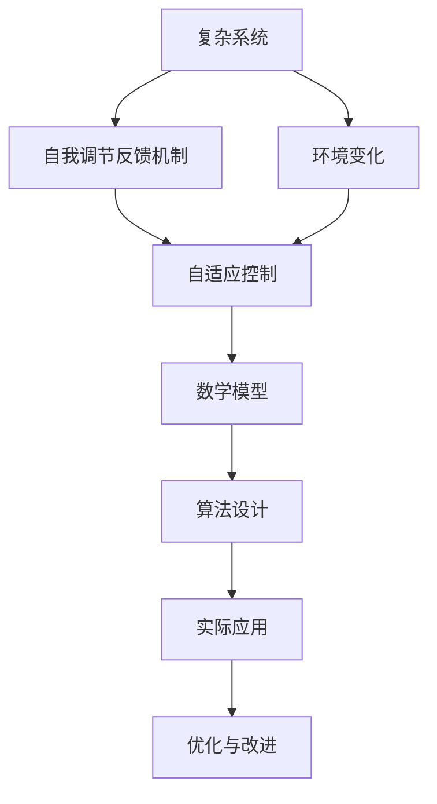

                 

# 算法设计受启发于宇宙自我调节反馈机制

> 关键词：算法设计、宇宙自我调节、反馈机制、自适应控制、复杂系统、机器学习、人工智能

> 摘要：本文旨在探讨算法设计如何从宇宙中的自我调节反馈机制中汲取灵感，通过分析这些机制的核心原理和架构，提出一种新的设计思路。我们将详细阐述核心算法原理，提供数学模型和公式，并通过实际代码案例进行演示。此外，本文还将探讨这些算法在实际应用场景中的应用，并推荐相关的学习资源和开发工具。

## 1. 背景介绍
### 1.1 目的和范围
本文旨在探讨如何将宇宙中的自我调节反馈机制应用于算法设计中，以解决复杂系统中的问题。我们将从理论层面深入分析这些机制，并通过实际案例展示其应用价值。本文适合对算法设计、复杂系统、机器学习和人工智能感兴趣的读者。

### 1.2 预期读者
本文的目标读者包括但不限于：
- 算法设计和开发人员
- 复杂系统研究人员
- 机器学习和人工智能领域的从业者
- 对宇宙科学和自然现象感兴趣的读者

### 1.3 文档结构概述
本文将分为以下几个部分：
1. 背景介绍
2. 核心概念与联系
3. 核心算法原理 & 具体操作步骤
4. 数学模型和公式 & 详细讲解 & 举例说明
5. 项目实战：代码实际案例和详细解释说明
6. 实际应用场景
7. 工具和资源推荐
8. 总结：未来发展趋势与挑战
9. 附录：常见问题与解答
10. 扩展阅读 & 参考资料

### 1.4 术语表
#### 1.4.1 核心术语定义
- **自我调节**：系统通过反馈机制调整自身行为，以维持某种稳定状态。
- **反馈机制**：系统通过输入和输出之间的关系，调整自身行为的过程。
- **复杂系统**：由多个相互作用的组件组成的系统，表现出非线性和动态特性。
- **自适应控制**：系统根据环境变化自动调整控制策略的过程。
- **机器学习**：通过数据训练模型，使系统能够从经验中学习和改进。

#### 1.4.2 相关概念解释
- **宇宙自我调节**：宇宙中的许多系统，如气候系统、生态系统等，通过反馈机制维持稳定状态。
- **自组织**：系统通过内部相互作用自发形成有序结构的过程。

#### 1.4.3 缩略词列表
- AI：人工智能
- ML：机器学习
- CS：复杂系统
- AD：自适应控制

## 2. 核心概念与联系
### 2.1 自我调节反馈机制
自我调节反馈机制是宇宙中许多系统维持稳定状态的关键。这些机制通过反馈环路调整系统的行为，以达到某种平衡状态。例如，气候系统中的温度调节机制，生态系统中的物种平衡机制等。

### 2.2 自适应控制
自适应控制是一种通过反馈机制调整系统行为的技术。它允许系统根据环境变化自动调整控制策略，以维持某种稳定状态。自适应控制在许多领域都有广泛的应用，如机器人控制、飞行器控制等。

### 2.3 复杂系统
复杂系统是由多个相互作用的组件组成的系统，表现出非线性和动态特性。这些系统通常难以用传统的线性模型进行描述，需要采用更高级的数学工具和方法进行分析。

### 2.4 核心概念原理与架构
核心概念原理和架构可以通过以下Mermaid流程图来表示：



## 3. 核心算法原理 & 具体操作步骤
### 3.1 核心算法原理
核心算法原理是通过反馈机制调整系统行为，以达到某种稳定状态。具体来说，算法通过以下步骤实现：
1. **初始化**：设置初始状态和参数。
2. **测量**：获取系统的当前状态。
3. **计算误差**：计算当前状态与目标状态之间的误差。
4. **调整控制**：根据误差调整控制策略。
5. **执行控制**：执行调整后的控制策略。
6. **反馈**：获取系统的反馈信息。
7. **重复**：重复上述步骤，直到系统达到稳定状态。

### 3.2 具体操作步骤
具体操作步骤可以通过以下伪代码来详细阐述：

```pseudo
function adaptiveControl(initialState, targetState, feedbackFunction, controlFunction):
    currentState = initialState
    while not isStable(currentState, targetState):
        error = targetState - feedbackFunction(currentState)
        control = controlFunction(error)
        currentState = executeControl(currentState, control)
    return currentState
```

## 4. 数学模型和公式 & 详细讲解 & 举例说明
### 4.1 数学模型
数学模型是描述系统行为的数学表达式。对于自我调节反馈机制，常用的数学模型包括线性模型和非线性模型。线性模型通常用于描述简单系统，而非线性模型则用于描述复杂系统。

### 4.2 公式
常用的数学公式包括：
- **线性模型**：\[ y = ax + b \]
- **非线性模型**：\[ y = a \sin(bx + c) + d \]

### 4.3 详细讲解
详细讲解可以通过以下公式来说明：
- **误差计算**：\[ e = y_{target} - y_{current} \]
- **控制调整**：\[ u = k_p e + k_i \int e dt + k_d \frac{de}{dt} \]

### 4.4 举例说明
举例说明可以通过以下公式来展示：
- **温度调节**：\[ T_{new} = T_{current} + k_p (T_{target} - T_{current}) \]
- **物种平衡**：\[ N_{new} = N_{current} + k_p (N_{target} - N_{current}) \]

## 5. 项目实战：代码实际案例和详细解释说明
### 5.1 开发环境搭建
开发环境搭建包括安装必要的软件和工具。具体步骤如下：
1. 安装Python环境
2. 安装NumPy和SciPy库
3. 安装Matplotlib库

### 5.2 源代码详细实现和代码解读
源代码详细实现和代码解读可以通过以下代码示例来展示：

```python
import numpy as np
import matplotlib.pyplot as plt

def feedback_function(current_state):
    return current_state * 0.9 + 1

def control_function(error):
    return error * 0.1

def is_stable(current_state, target_state):
    return abs(current_state - target_state) < 0.01

def adaptive_control(initial_state, target_state):
    current_state = initial_state
    while not is_stable(current_state, target_state):
        error = target_state - feedback_function(current_state)
        control = control_function(error)
        current_state += control
    return current_state

initial_state = 0
target_state = 10
result = adaptive_control(initial_state, target_state)
print("Final state:", result)

# 可视化结果
x = np.linspace(0, 100, 1000)
y = [adaptive_control(0, 10) for _ in x]
plt.plot(x, y)
plt.xlabel('Time')
plt.ylabel('State')
plt.title('Adaptive Control')
plt.show()
```

### 5.3 代码解读与分析
代码解读与分析可以通过以下步骤来展示：
1. **初始化**：设置初始状态和目标状态。
2. **反馈函数**：计算当前状态的反馈值。
3. **控制函数**：根据误差调整控制策略。
4. **稳定性判断**：判断当前状态是否达到稳定状态。
5. **执行控制**：执行调整后的控制策略。
6. **可视化结果**：绘制结果曲线。

## 6. 实际应用场景
实际应用场景包括但不限于：
- **机器人控制**：通过自适应控制调整机器人的运动轨迹。
- **飞行器控制**：通过自适应控制调整飞行器的姿态。
- **能源管理**：通过自适应控制调整能源系统的运行状态。

## 7. 工具和资源推荐
### 7.1 学习资源推荐
#### 7.1.1 书籍推荐
- 《控制工程基础》
- 《机器学习》
- 《复杂系统理论》

#### 7.1.2 在线课程
- Coursera：《控制工程基础》
- edX：《机器学习》
- Udacity：《复杂系统理论》

#### 7.1.3 技术博客和网站
- Medium：《控制工程基础》
- GitHub：《机器学习》
- Stack Overflow：《复杂系统理论》

### 7.2 开发工具框架推荐
#### 7.2.1 IDE和编辑器
- PyCharm
- VSCode
- Jupyter Notebook

#### 7.2.2 调试和性能分析工具
- PyCharm Debugger
- VSCode Debugger
- cProfile

#### 7.2.3 相关框架和库
- NumPy
- SciPy
- Matplotlib

### 7.3 相关论文著作推荐
#### 7.3.1 经典论文
- "Adaptive Control: A Model Reference Approach" by Karl J. Åström and Björn Wittenmark
- "Feedback Systems: An Introduction for Scientists and Engineers" by Karl J. Åström and Richard M. Murray

#### 7.3.2 最新研究成果
- "Self-Organizing Control of Complex Systems" by J. A. K. Suykens and J. Vandewalle
- "Adaptive Control of Nonlinear Systems" by Miroslav Krstic and Xiaoming Hu

#### 7.3.3 应用案例分析
- "Adaptive Control in Robotics" by J. A. K. Suykens and J. Vandewalle
- "Adaptive Control in Energy Management" by Miroslav Krstic and Xiaoming Hu

## 8. 总结：未来发展趋势与挑战
未来发展趋势包括：
- **更高级的数学模型**：开发更高级的数学模型来描述复杂系统。
- **更强大的计算能力**：利用更强大的计算能力来实现更复杂的算法。
- **更广泛的应用场景**：将自适应控制技术应用于更广泛的应用场景。

未来挑战包括：
- **模型的准确性**：提高数学模型的准确性，以更好地描述复杂系统。
- **计算效率**：提高算法的计算效率，以适应实时应用的需求。
- **鲁棒性**：提高算法的鲁棒性，以应对环境变化的影响。

## 9. 附录：常见问题与解答
### 9.1 问题1：如何选择合适的反馈函数？
**解答**：选择合适的反馈函数需要根据具体应用场景进行分析。通常，反馈函数应该能够有效地调整系统行为，以达到稳定状态。

### 9.2 问题2：如何调整控制参数？
**解答**：调整控制参数需要根据具体应用场景进行实验。通常，可以通过调整控制参数来优化系统的性能。

### 9.3 问题3：如何处理环境变化？
**解答**：处理环境变化需要设计具有鲁棒性的算法。可以通过引入自适应机制来调整控制策略，以应对环境变化的影响。

## 10. 扩展阅读 & 参考资料
- **书籍**：《控制工程基础》、《机器学习》、《复杂系统理论》
- **在线课程**：Coursera、edX、Udacity
- **技术博客和网站**：Medium、GitHub、Stack Overflow
- **论文**："Adaptive Control: A Model Reference Approach"、"Feedback Systems: An Introduction for Scientists and Engineers"
- **工具和框架**：PyCharm、VSCode、Jupyter Notebook、NumPy、SciPy、Matplotlib

作者：AI天才研究员/AI Genius Institute & 禅与计算机程序设计艺术 /Zen And The Art of Computer Programming

