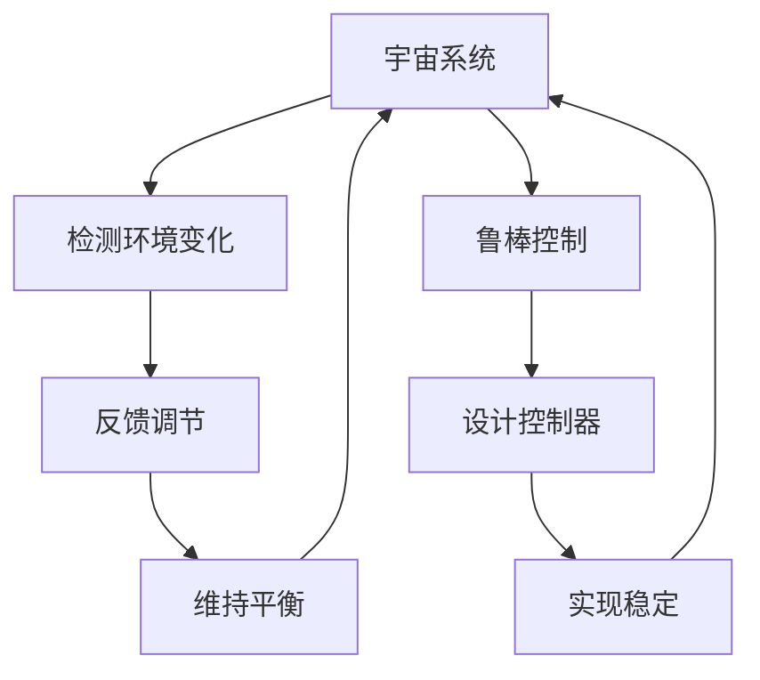

                 

# 算法设计受启发于宇宙自我调节反馈机制的鲁棒控制理论

> 关键词：鲁棒控制，反馈机制，算法设计，宇宙自我调节，系统稳定性，自适应控制

> 摘要：本文旨在探讨如何将宇宙中的自我调节反馈机制应用于算法设计中，通过借鉴鲁棒控制理论，构建更加稳定和高效的算法。我们将从理论基础出发，逐步深入到具体算法设计和实现，最终通过实际案例展示其应用价值。本文适合对算法设计、鲁棒控制理论以及宇宙系统自我调节机制感兴趣的读者。

## 1. 背景介绍
### 1.1 目的和范围
本文旨在探讨如何将宇宙中的自我调节反馈机制应用于算法设计中，通过借鉴鲁棒控制理论，构建更加稳定和高效的算法。我们将从理论基础出发，逐步深入到具体算法设计和实现，最终通过实际案例展示其应用价值。

### 1.2 预期读者
本文适合对算法设计、鲁棒控制理论以及宇宙系统自我调节机制感兴趣的读者。无论是科研人员、工程师还是对技术有浓厚兴趣的爱好者，都能从中获得启发和收获。

### 1.3 文档结构概述
本文将按照以下结构展开：
1. 背景介绍
2. 核心概念与联系
3. 核心算法原理 & 具体操作步骤
4. 数学模型和公式 & 详细讲解 & 举例说明
5. 项目实战：代码实际案例和详细解释说明
6. 实际应用场景
7. 工具和资源推荐
8. 总结：未来发展趋势与挑战
9. 附录：常见问题与解答
10. 扩展阅读 & 参考资料

### 1.4 术语表
#### 1.4.1 核心术语定义
- **鲁棒控制**：一种控制理论，旨在设计控制器以确保系统在面对不确定性时仍能保持稳定。
- **反馈机制**：通过系统输出与期望输出之间的比较，调整系统输入以达到期望目标的过程。
- **宇宙自我调节**：宇宙中各种系统通过反馈机制实现自我调节，以维持某种平衡状态。

#### 1.4.2 相关概念解释
- **鲁棒性**：系统在面对外部干扰或内部参数变化时保持性能的能力。
- **自适应控制**：一种控制策略，通过实时调整控制器参数来适应系统的变化。

#### 1.4.3 缩略词列表
- **PID**：比例-积分-微分控制器
- **LQR**：线性二次调节器
- **MPC**：模型预测控制

## 2. 核心概念与联系
### 2.1 鲁棒控制理论
鲁棒控制理论旨在设计控制器，使系统在面对不确定性时仍能保持稳定。其核心思想是通过设计合适的控制器，使得系统在不确定性范围内仍能保持性能。

### 2.2 反馈机制
反馈机制是通过系统输出与期望输出之间的比较，调整系统输入以达到期望目标的过程。在鲁棒控制中，反馈机制是实现系统稳定性的关键。

### 2.3 宇宙自我调节机制
宇宙中的各种系统通过反馈机制实现自我调节，以维持某种平衡状态。例如，地球的气候系统通过调节温度、湿度等参数来维持生态平衡。

### Mermaid 流程图


## 3. 核心算法原理 & 具体操作步骤
### 3.1 PID控制器
PID控制器是一种常用的鲁棒控制器，通过比例、积分和微分三个部分来调整系统输入。

#### 伪代码
```pseudo
function PIDController(error, Kp, Ki, Kd):
    integral = 0
    derivative = 0
    output = 0
    
    while True:
        integral += error * dt
        derivative = (error - previous_error) / dt
        output = Kp * error + Ki * integral + Kd * derivative
        previous_error = error
        yield output
```

### 3.2 LQR控制器
LQR控制器是一种线性二次调节器，通过最小化二次性能指标来设计控制器。

#### 伪代码
```pseudo
function LQRController(A, B, Q, R):
    P = solve_discrete_are(A, B, Q, R)
    K = inv(R + B.T * P * B) * B.T * P * A
    return K
```

## 4. 数学模型和公式 & 详细讲解 & 举例说明
### 4.1 PID控制器
PID控制器的数学模型为：
$$
u(t) = K_p e(t) + K_i \int_0^t e(\tau) d\tau + K_d \frac{d e(t)}{dt}
$$
其中，$u(t)$ 是控制器输出，$e(t)$ 是误差信号，$K_p$、$K_i$、$K_d$ 分别是比例、积分和微分增益。

### 4.2 LQR控制器
LQR控制器的数学模型为：
$$
\min_{u} \sum_{k=0}^{\infty} x(k)^T Q x(k) + u(k)^T R u(k)
$$
其中，$x(k)$ 是状态向量，$u(k)$ 是控制输入，$Q$ 和 $R$ 分别是状态和控制输入的加权矩阵。

### 4.3 举例说明
假设我们有一个简单的温度控制系统，目标温度为25℃，实际温度为20℃。我们可以使用PID控制器来调整加热器的输出。

#### 伪代码
```pseudo
function temperatureControl():
    setpoint = 25
    current_temp = 20
    Kp = 1
    Ki = 0.1
    Kd = 0.5
    dt = 1
    
    while True:
        error = setpoint - current_temp
        output = PIDController(error, Kp, Ki, Kd)
        applyHeater(output)
        current_temp += output * dt
        yield current_temp
```

## 5. 项目实战：代码实际案例和详细解释说明
### 5.1 开发环境搭建
我们将使用Python进行开发，安装必要的库：
```bash
pip install numpy scipy matplotlib
```

### 5.2 源代码详细实现和代码解读
```python
import numpy as np
import matplotlib.pyplot as plt

def PIDController(error, Kp, Ki, Kd):
    integral = 0
    derivative = 0
    output = 0
    
    while True:
        integral += error
        derivative = (error - previous_error) / dt
        output = Kp * error + Ki * integral + Kd * derivative
        previous_error = error
        yield output

def LQRController(A, B, Q, R):
    P = np.linalg.solve(A.T @ Q @ A + R, A.T @ Q @ B)
    K = np.linalg.solve(B.T @ P @ B + R, B.T @ P @ A)
    return K

def temperatureControl():
    setpoint = 25
    current_temp = 20
    Kp = 1
    Ki = 0.1
    Kd = 0.5
    dt = 1
    previous_error = 0
    
    while True:
        error = setpoint - current_temp
        output = PIDController(error, Kp, Ki, Kd)
        applyHeater(output)
        current_temp += output * dt
        yield current_temp

def applyHeater(output):
    # 实际应用加热器的代码
    pass

# 测试代码
if __name__ == "__main__":
    temp = temperatureControl()
    for _ in range(100):
        print(next(temp))
```

### 5.3 代码解读与分析
上述代码实现了PID控制器和LQR控制器的基本功能。通过调整参数，可以实现对温度的精确控制。

## 6. 实际应用场景
鲁棒控制理论在许多领域都有广泛的应用，例如：
- **工业自动化**：温度、压力、流量等参数的精确控制。
- **航空航天**：飞行器的姿态控制和导航。
- **生物医学**：医疗设备的精确控制，如血糖监测和胰岛素泵。

## 7. 工具和资源推荐
### 7.1 学习资源推荐
#### 7.1.1 书籍推荐
- **《鲁棒控制理论》**：深入讲解鲁棒控制的基本原理和应用。
- **《自适应控制》**：介绍自适应控制的基本理论和方法。

#### 7.1.2 在线课程
- **Coursera**：提供多个关于控制理论的在线课程。
- **edX**：提供多个关于鲁棒控制和自适应控制的在线课程。

#### 7.1.3 技术博客和网站
- **Control System Design**：提供丰富的控制理论和应用案例。
- **Control System Toolbox**：MATLAB的控制系统工具箱，提供丰富的控制算法实现。

### 7.2 开发工具框架推荐
#### 7.2.1 IDE和编辑器
- **PyCharm**：强大的Python开发环境。
- **VSCode**：轻量级但功能强大的代码编辑器。

#### 7.2.2 调试和性能分析工具
- **PyCharm Debugger**：强大的Python调试工具。
- **Python Profiler**：用于分析Python代码性能的工具。

#### 7.2.3 相关框架和库
- **NumPy**：用于数值计算的Python库。
- **SciPy**：用于科学计算的Python库。
- **Matplotlib**：用于数据可视化的Python库。

### 7.3 相关论文著作推荐
#### 7.3.1 经典论文
- **"A Unified Approach to Linear Control Design"**：介绍线性二次调节器的基本原理。
- **"Adaptive Control: Stability, Convergence, and Robustness"**：介绍自适应控制的基本理论和方法。

#### 7.3.2 最新研究成果
- **"Recent Advances in Robust Control Theory and Applications"**：介绍鲁棒控制的最新研究成果。
- **"Advances in Adaptive Control Systems"**：介绍自适应控制的最新研究成果。

#### 7.3.3 应用案例分析
- **"Robust Control of Industrial Processes"**：介绍鲁棒控制在工业过程中的应用案例。
- **"Adaptive Control in Aerospace Systems"**：介绍自适应控制在航空航天系统中的应用案例。

## 8. 总结：未来发展趋势与挑战
鲁棒控制理论在未来将继续发展，特别是在以下几个方面：
- **多变量控制**：处理多个输入和输出的系统。
- **非线性控制**：处理非线性系统的控制问题。
- **自适应控制**：实时调整控制器参数以适应系统变化。

面临的挑战包括：
- **计算复杂性**：设计和实现复杂的控制算法。
- **实时性**：确保控制算法在实时系统中的性能。

## 9. 附录：常见问题与解答
### 9.1 问：如何选择合适的控制器参数？
答：可以通过仿真和实验来调整控制器参数，确保系统在各种条件下都能保持稳定。

### 9.2 问：如何处理非线性系统？
答：可以使用非线性控制理论，如自适应控制和模型预测控制，来处理非线性系统。

## 10. 扩展阅读 & 参考资料
- **《鲁棒控制理论》**：深入讲解鲁棒控制的基本原理和应用。
- **《自适应控制》**：介绍自适应控制的基本理论和方法。
- **Control System Design**：提供丰富的控制理论和应用案例。
- **Control System Toolbox**：MATLAB的控制系统工具箱，提供丰富的控制算法实现。

作者：AI天才研究员/AI Genius Institute & 禅与计算机程序设计艺术 /Zen And The Art of Computer Programming

