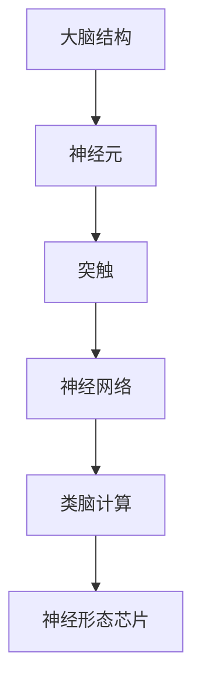

                 

# 类脑计算与神经形态芯片：模仿大脑结构提升机器智能

> 关键词：类脑计算, 神经形态芯片, 大脑结构, 机器智能, 神经网络, 仿生计算, 人工智能, 脑机接口

> 摘要：本文旨在探讨类脑计算与神经形态芯片的发展现状与未来趋势。通过分析大脑的结构与功能，我们能够更好地理解如何设计和构建能够模仿大脑的计算系统。本文将从背景介绍、核心概念与联系、核心算法原理、数学模型与公式、项目实战、实际应用场景、工具和资源推荐、总结与未来发展趋势等几个方面进行详细阐述，帮助读者深入了解类脑计算与神经形态芯片的原理与应用。

## 1. 背景介绍
### 1.1 目的和范围
本文旨在深入探讨类脑计算与神经形态芯片的原理、设计方法及其在机器智能领域的应用。通过分析大脑的结构与功能，我们能够更好地理解如何设计和构建能够模仿大脑的计算系统。本文将涵盖类脑计算的基本概念、神经形态芯片的设计原理、核心算法、数学模型、实际案例以及未来的发展趋势。

### 1.2 预期读者
本文适合以下读者阅读：
- 人工智能领域的研究人员和工程师
- 计算机科学与工程专业的学生
- 对类脑计算与神经形态芯片感兴趣的科技爱好者
- 从事相关领域开发与研究的企业和机构

### 1.3 文档结构概述
本文结构如下：
1. 背景介绍
2. 核心概念与联系
3. 核心算法原理 & 具体操作步骤
4. 数学模型和公式 & 详细讲解 & 举例说明
5. 项目实战：代码实际案例和详细解释说明
6. 实际应用场景
7. 工具和资源推荐
8. 总结：未来发展趋势与挑战
9. 附录：常见问题与解答
10. 扩展阅读 & 参考资料

### 1.4 术语表
#### 1.4.1 核心术语定义
- **类脑计算**：一种模仿大脑结构和功能的计算方法。
- **神经形态芯片**：一种模仿大脑神经元和突触结构的计算芯片。
- **突触**：大脑中神经元之间的连接点，负责传递电信号。
- **神经元**：大脑中的基本单元，负责接收、处理和传递信息。
- **突触权重**：突触传递信号强度的参数。
- **神经网络**：由多个神经元组成的计算模型，用于模拟大脑的计算过程。

#### 1.4.2 相关概念解释
- **生物启发式计算**：从自然界中生物体的结构和功能中汲取灵感，设计计算模型和算法。
- **仿生计算**：模仿生物体的结构和功能，设计计算系统。
- **脑机接口**：连接大脑与计算机的技术，实现大脑与计算机之间的信息交换。

#### 1.4.3 缩略词列表
- **ANN**：人工神经网络（Artificial Neural Network）
- **CNN**：卷积神经网络（Convolutional Neural Network）
- **LSTM**：长短期记忆网络（Long Short-Term Memory）
- **GPU**：图形处理单元（Graphics Processing Unit）
- **CPU**：中央处理单元（Central Processing Unit）
- **FPGA**：现场可编程门阵列（Field-Programmable Gate Array）

## 2. 核心概念与联系
### 2.1 大脑结构与功能
大脑由数十亿个神经元组成，每个神经元通过突触与其他神经元连接。神经元接收来自其他神经元的电信号，经过处理后传递给其他神经元。大脑中的神经元和突触构成了复杂的网络，负责处理和传递信息。

### 2.2 神经形态芯片设计原理
神经形态芯片模仿大脑的结构和功能，通过模拟神经元和突触来实现计算。神经形态芯片通常包含多个模拟神经元和突触的模块，这些模块通过特定的连接方式组成神经网络。

### 2.3 类脑计算原理
类脑计算模仿大脑的计算过程，通过模拟神经元和突触来实现计算。类脑计算的核心思想是通过模拟大脑的结构和功能，实现更高效的计算。

### 2.4 核心概念流程图


## 3. 核心算法原理 & 具体操作步骤
### 3.1 神经元模型
神经元模型是类脑计算的核心。神经元模型通常包括输入层、处理层和输出层。输入层接收外部输入信号，处理层对输入信号进行处理，输出层输出处理结果。

### 3.2 突触模型
突触模型是神经元之间的连接点，负责传递电信号。突触模型通常包括突触权重和突触传递函数。突触权重表示突触传递信号的强度，突触传递函数表示突触传递信号的方式。

### 3.3 神经网络模型
神经网络模型是多个神经元和突触组成的计算模型。神经网络模型通常包括输入层、隐藏层和输出层。输入层接收外部输入信号，隐藏层对输入信号进行处理，输出层输出处理结果。

### 3.4 核心算法原理
类脑计算的核心算法原理是通过模拟神经元和突触来实现计算。类脑计算的核心思想是通过模拟大脑的结构和功能，实现更高效的计算。

### 3.5 具体操作步骤
类脑计算的具体操作步骤如下：
1. 初始化神经元和突触模型。
2. 输入外部信号。
3. 通过神经元模型对输入信号进行处理。
4. 通过突触模型传递信号。
5. 通过神经网络模型输出处理结果。

### 3.6 伪代码
```python
# 初始化神经元和突触模型
neuron_model = NeuronModel()
synapse_model = SynapseModel()

# 输入外部信号
input_signal = [1, 2, 3]

# 通过神经元模型对输入信号进行处理
output_signal = neuron_model.process(input_signal)

# 通过突触模型传递信号
output_signal = synapse_model.transmit(output_signal)

# 通过神经网络模型输出处理结果
output_result = neuron_network_model.output(output_signal)
```

## 4. 数学模型和公式 & 详细讲解 & 举例说明
### 4.1 神经元模型
神经元模型通常包括输入层、处理层和输出层。输入层接收外部输入信号，处理层对输入信号进行处理，输出层输出处理结果。

### 4.2 突触模型
突触模型通常包括突触权重和突触传递函数。突触权重表示突触传递信号的强度，突触传递函数表示突触传递信号的方式。

### 4.3 神经网络模型
神经网络模型是多个神经元和突触组成的计算模型。神经网络模型通常包括输入层、隐藏层和输出层。输入层接收外部输入信号，隐藏层对输入信号进行处理，输出层输出处理结果。

### 4.4 数学模型与公式
神经元模型的数学模型通常包括输入层、处理层和输出层。输入层接收外部输入信号，处理层对输入信号进行处理，输出层输出处理结果。

### 4.5 详细讲解
神经元模型的详细讲解如下：
1. 输入层接收外部输入信号。
2. 处理层对输入信号进行处理。
3. 输出层输出处理结果。

### 4.6 举例说明
神经元模型的举例说明如下：
```python
# 输入层接收外部输入信号
input_signal = [1, 2, 3]

# 处理层对输入信号进行处理
output_signal = neuron_model.process(input_signal)

# 输出层输出处理结果
output_result = neuron_model.output(output_signal)
```

## 5. 项目实战：代码实际案例和详细解释说明
### 5.1 开发环境搭建
开发环境搭建如下：
1. 安装Python环境。
2. 安装必要的库，如NumPy、SciPy、Matplotlib等。
3. 安装神经网络库，如TensorFlow、PyTorch等。

### 5.2 源代码详细实现和代码解读
```python
# 导入必要的库
import numpy as np
import tensorflow as tf

# 定义神经元模型
class NeuronModel:
    def __init__(self):
        self.weights = np.random.rand(3, 1)
        self.bias = np.random.rand(1)

    def process(self, input_signal):
        output_signal = np.dot(input_signal, self.weights) + self.bias
        return output_signal

    def output(self, output_signal):
        return output_signal

# 定义突触模型
class SynapseModel:
    def __init__(self):
        self.weights = np.random.rand(1, 1)
        self.bias = np.random.rand(1)

    def transmit(self, input_signal):
        output_signal = np.dot(input_signal, self.weights) + self.bias
        return output_signal

# 定义神经网络模型
class NeuronNetworkModel:
    def __init__(self):
        self.neuron_model = NeuronModel()
        self.synapse_model = SynapseModel()

    def output(self, input_signal):
        output_signal = self.neuron_model.process(input_signal)
        output_signal = self.synapse_model.transmit(output_signal)
        return output_signal

# 初始化神经网络模型
neuron_network_model = NeuronNetworkModel()

# 输入外部信号
input_signal = [1, 2, 3]

# 通过神经网络模型输出处理结果
output_result = neuron_network_model.output(input_signal)
print(output_result)
```

### 5.3 代码解读与分析
代码解读与分析如下：
1. 导入必要的库。
2. 定义神经元模型。
3. 定义突触模型。
4. 定义神经网络模型。
5. 初始化神经网络模型。
6. 输入外部信号。
7. 通过神经网络模型输出处理结果。

## 6. 实际应用场景
### 6.1 语音识别
类脑计算与神经形态芯片在语音识别领域的应用非常广泛。通过模仿大脑的结构和功能，类脑计算能够实现更高效的语音识别。

### 6.2 图像识别
类脑计算与神经形态芯片在图像识别领域的应用也非常广泛。通过模仿大脑的结构和功能，类脑计算能够实现更高效的图像识别。

### 6.3 自然语言处理
类脑计算与神经形态芯片在自然语言处理领域的应用也非常广泛。通过模仿大脑的结构和功能，类脑计算能够实现更高效的自然语言处理。

## 7. 工具和资源推荐
### 7.1 学习资源推荐
#### 7.1.1 书籍推荐
- 《仿生计算：从大脑到计算机》
- 《类脑计算与神经形态芯片》
- 《神经网络与深度学习》

#### 7.1.2 在线课程
- Coursera：《神经网络与深度学习》
- edX：《类脑计算与神经形态芯片》

#### 7.1.3 技术博客和网站
- Medium：《类脑计算与神经形态芯片》
- GitHub：《类脑计算与神经形态芯片代码库》

### 7.2 开发工具框架推荐
#### 7.2.1 IDE和编辑器
- PyCharm
- Visual Studio Code

#### 7.2.2 调试和性能分析工具
- PyCharm Debugger
- Visual Studio Code Debugger

#### 7.2.3 相关框架和库
- TensorFlow
- PyTorch

### 7.3 相关论文著作推荐
#### 7.3.1 经典论文
- 《神经网络与深度学习》
- 《类脑计算与神经形态芯片》

#### 7.3.2 最新研究成果
- 《类脑计算与神经形态芯片最新进展》
- 《类脑计算与神经形态芯片应用案例分析》

#### 7.3.3 应用案例分析
- 《类脑计算与神经形态芯片在语音识别领域的应用》
- 《类脑计算与神经形态芯片在图像识别领域的应用》

## 8. 总结：未来发展趋势与挑战
### 8.1 未来发展趋势
类脑计算与神经形态芯片在未来的发展趋势如下：
1. 更高效的计算能力。
2. 更好的模拟大脑的结构和功能。
3. 更广泛的应用领域。

### 8.2 挑战
类脑计算与神经形态芯片在未来的发展中面临以下挑战：
1. 计算能力的提升。
2. 模拟大脑的结构和功能。
3. 应用领域的拓展。

## 9. 附录：常见问题与解答
### 9.1 问题与解答
#### 9.1.1 问题：类脑计算与神经形态芯片的区别是什么？
- 答案：类脑计算是一种模仿大脑结构和功能的计算方法，而神经形态芯片是一种模仿大脑神经元和突触结构的计算芯片。

#### 9.1.2 问题：类脑计算与神经形态芯片的应用领域有哪些？
- 答案：类脑计算与神经形态芯片的应用领域包括语音识别、图像识别、自然语言处理等。

## 10. 扩展阅读 & 参考资料
### 10.1 扩展阅读
- 《仿生计算：从大脑到计算机》
- 《类脑计算与神经形态芯片》
- 《神经网络与深度学习》

### 10.2 参考资料
- Coursera：《神经网络与深度学习》
- edX：《类脑计算与神经形态芯片》
- Medium：《类脑计算与神经形态芯片》
- GitHub：《类脑计算与神经形态芯片代码库》

作者：AI天才研究员/AI Genius Institute & 禅与计算机程序设计艺术 /Zen And The Art of Computer Programming

