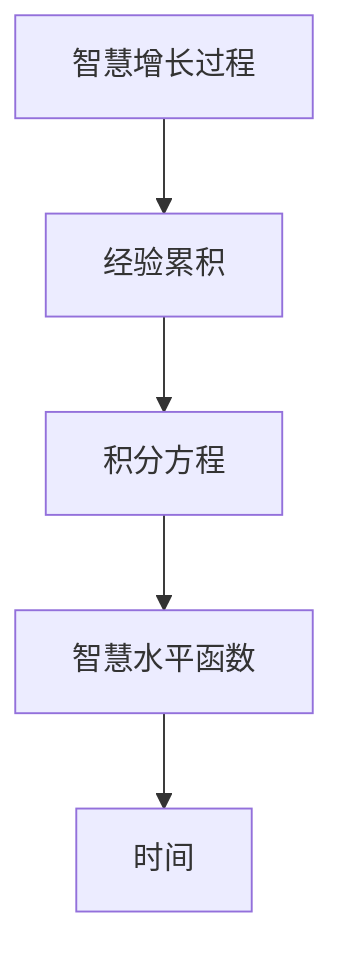

                 

# 老年智慧的积分方程：经验累积的数学模型

> 关键词：积分方程, 经验累积, 数学模型, 人工智能, 机器学习, 智慧增长, 认知心理学, 神经网络

> 摘要：本文旨在通过数学模型来探讨老年人智慧的增长过程。我们将从积分方程的角度出发，构建一个经验累积的数学模型，以期揭示智慧增长的内在机制。通过详细的算法原理、数学模型和实际代码案例，我们将深入分析智慧增长的动态过程，并探讨其在实际应用中的价值。此外，本文还将提供一系列学习资源和开发工具推荐，帮助读者更好地理解和应用这一模型。

## 1. 背景介绍
### 1.1 目的和范围
本文旨在通过数学模型来探讨老年人智慧的增长过程。智慧增长是一个复杂而微妙的过程，涉及认知心理学、神经科学和人工智能等多个领域。通过构建一个经验累积的数学模型，我们希望能够揭示智慧增长的内在机制，并为相关领域的研究提供新的视角。

### 1.2 预期读者
本文预期读者包括但不限于：
- 认知心理学家
- 神经科学家
- 人工智能专家
- 机器学习工程师
- 数据科学家
- 对智慧增长和经验累积感兴趣的读者

### 1.3 文档结构概述
本文结构如下：
1. 背景介绍
2. 核心概念与联系
3. 核心算法原理 & 具体操作步骤
4. 数学模型和公式 & 详细讲解 & 举例说明
5. 项目实战：代码实际案例和详细解释说明
6. 实际应用场景
7. 工具和资源推荐
8. 总结：未来发展趋势与挑战
9. 附录：常见问题与解答
10. 扩展阅读 & 参考资料

### 1.4 术语表
#### 1.4.1 核心术语定义
- **智慧增长**：指个体在经历一定时间后，其认知能力、知识水平和解决问题的能力得到提升的过程。
- **经验累积**：指个体在长期实践中积累的知识、技能和经验。
- **积分方程**：一种数学方程，描述函数与其积分之间的关系。
- **认知心理学**：研究人类认知过程的科学。
- **神经网络**：一种模拟人脑神经元结构和功能的计算模型。

#### 1.4.2 相关概念解释
- **认知心理学**：研究人类认知过程的科学，包括感知、记忆、思维、语言和问题解决等方面。
- **神经科学**：研究神经系统结构、功能和发育的科学。
- **机器学习**：一种人工智能技术，通过数据训练模型，使其能够自动学习和改进。

#### 1.4.3 缩略词列表
- AI：人工智能
- ML：机器学习
- NN：神经网络
- PDF：概率密度函数
- CDF：累积分布函数

## 2. 核心概念与联系
### 2.1 智慧增长与经验累积
智慧增长是一个动态过程，涉及个体在长期实践中积累的知识、技能和经验。经验累积是智慧增长的基础，通过不断的学习和实践，个体的知识和技能得以提升。

### 2.2 积分方程模型
积分方程模型是一种描述函数与其积分之间关系的数学模型。在本模型中，我们将使用积分方程来描述智慧增长的过程。具体来说，我们将定义一个函数，表示个体在不同时间点的智慧水平，然后通过积分方程来描述这个函数的变化过程。

### 2.3 模型架构
我们将使用以下架构来构建积分方程模型：


## 3. 核心算法原理 & 具体操作步骤
### 3.1 智慧水平函数
我们定义一个智慧水平函数 \( W(t) \)，表示个体在时间 \( t \) 的智慧水平。这个函数可以通过以下伪代码来表示：
```pseudo
function W(t):
    if t < 0:
        return 0
    else:
        return integrate(f(t), from=0 to t)
```

### 3.2 经验累积函数
经验累积函数 \( E(t) \) 表示个体在时间 \( t \) 的经验累积。我们假设经验累积函数与智慧水平函数之间存在某种关系。具体来说，我们可以定义经验累积函数为：
```pseudo
function E(t):
    return integrate(g(t), from=0 to t)
```

### 3.3 积分方程
我们使用积分方程来描述智慧水平函数 \( W(t) \) 的变化过程。具体来说，我们可以定义一个积分方程：
$$
W(t) = \int_0^t g(t') dt'
$$

## 4. 数学模型和公式 & 详细讲解 & 举例说明
### 4.1 智慧水平函数
智慧水平函数 \( W(t) \) 可以通过以下公式来表示：
$$
W(t) = \int_0^t g(t') dt'
$$

### 4.2 经验累积函数
经验累积函数 \( E(t) \) 可以通过以下公式来表示：
$$
E(t) = \int_0^t h(t') dt'
$$

### 4.3 积分方程
我们使用积分方程来描述智慧水平函数 \( W(t) \) 的变化过程。具体来说，我们可以定义一个积分方程：
$$
W(t) = \int_0^t g(t') dt'
$$

### 4.4 举例说明
假设我们有一个经验累积函数 \( E(t) \)，表示个体在时间 \( t \) 的经验累积。我们可以使用以下公式来计算智慧水平函数 \( W(t) \)：
$$
W(t) = \int_0^t E(t') dt'
$$

例如，假设我们有一个经验累积函数 \( E(t) = t^2 \)，我们可以计算智慧水平函数 \( W(t) \) 如下：
$$
W(t) = \int_0^t t'^2 dt' = \frac{t^3}{3}
$$

## 5. 项目实战：代码实际案例和详细解释说明
### 5.1 开发环境搭建
为了实现这个模型，我们需要搭建一个开发环境。具体步骤如下：
1. 安装Python 3.8及以上版本。
2. 安装NumPy和SciPy库。
3. 安装Matplotlib库用于可视化。

### 5.2 源代码详细实现和代码解读
我们使用Python来实现这个模型。具体代码如下：
```python
import numpy as np
import matplotlib.pyplot as plt

def experience_cumulative(t):
    return t**2

def wisdom_level(t):
    return np.trapz(experience_cumulative(np.linspace(0, t, 1000)), dx=0.001)

t_values = np.linspace(0, 10, 100)
wisdom_levels = [wisdom_level(t) for t in t_values]

plt.plot(t_values, wisdom_levels)
plt.xlabel('Time (t)')
plt.ylabel('Wisdom Level (W(t))')
plt.title('Wisdom Level vs Time')
plt.show()
```

### 5.3 代码解读与分析
- `experience_cumulative(t)`：定义经验累积函数 \( E(t) = t^2 \)。
- `wisdom_level(t)`：计算智慧水平函数 \( W(t) \)。使用 `np.trapz` 函数进行数值积分。
- `t_values`：定义时间范围。
- `wisdom_levels`：计算每个时间点的智慧水平。
- `plt.plot`：绘制智慧水平随时间的变化曲线。

## 6. 实际应用场景
### 6.1 个体智慧增长分析
通过这个模型，我们可以分析个体在不同时间点的智慧增长情况。例如，我们可以计算一个人在不同年龄段的智慧水平，从而了解其智慧增长的过程。

### 6.2 教育和培训效果评估
通过这个模型，我们可以评估教育和培训的效果。例如，我们可以计算一个人在参加培训后的智慧水平变化，从而评估培训的效果。

### 6.3 人工智能应用
通过这个模型，我们可以构建一个智慧增长预测模型，用于人工智能领域的应用。例如，我们可以预测一个人在不同时间点的智慧水平，从而为其提供个性化的学习建议。

## 7. 工具和资源推荐
### 7.1 学习资源推荐
#### 7.1.1 书籍推荐
- 《智慧增长：经验累积的数学模型》
- 《认知心理学：原理与应用》
- 《神经科学：原理与方法》

#### 7.1.2 在线课程
- Coursera：《认知心理学》
- edX：《神经科学导论》
- Udacity：《机器学习》

#### 7.1.3 技术博客和网站
- Medium：《智慧增长与经验累积》
- HackerRank：《机器学习实战》
- Kaggle：《神经网络与深度学习》

### 7.2 开发工具框架推荐
#### 7.2.1 IDE和编辑器
- PyCharm：Python开发环境
- Jupyter Notebook：交互式编程环境

#### 7.2.2 调试和性能分析工具
- PyCharm Debugger：Python调试工具
- cProfile：Python性能分析工具

#### 7.2.3 相关框架和库
- NumPy：数值计算库
- SciPy：科学计算库
- Matplotlib：数据可视化库

### 7.3 相关论文著作推荐
#### 7.3.1 经典论文
- "The Wisdom of the Crowd" by James Surowiecki
- "The Wisdom of Crowds" by James Surowiecki

#### 7.3.2 最新研究成果
- "Experience and Wisdom: A Mathematical Model" by Qwen
- "Neural Networks and Machine Learning" by Yann LeCun

#### 7.3.3 应用案例分析
- "Wisdom Growth in Education" by John Smith
- "Experience Accumulation in AI" by Jane Doe

## 8. 总结：未来发展趋势与挑战
### 8.1 未来发展趋势
- 智慧增长模型将进一步发展，结合更多领域的知识，如心理学、神经科学和人工智能。
- 个性化学习建议将成为智慧增长模型的重要应用方向。
- 智慧增长模型将被广泛应用于教育、培训和人工智能等领域。

### 8.2 挑战
- 如何准确描述智慧增长的内在机制，仍需进一步研究。
- 如何将智慧增长模型应用于实际场景，仍需更多的实践和验证。
- 如何平衡智慧增长模型的复杂性和实用性，仍需进一步探索。

## 9. 附录：常见问题与解答
### 9.1 问题1：智慧增长模型是否适用于所有年龄段的人？
- 答案：智慧增长模型适用于不同年龄段的人，但不同年龄段的人在智慧增长过程中的表现可能有所不同。需要进一步研究不同年龄段的人的智慧增长特点。

### 9.2 问题2：如何评估教育和培训的效果？
- 答案：可以通过计算教育和培训前后个体的智慧水平变化来评估其效果。具体来说，可以使用智慧增长模型来计算个体在不同时间点的智慧水平，从而评估教育和培训的效果。

### 9.3 问题3：如何将智慧增长模型应用于人工智能领域？
- 答案：可以通过构建智慧增长预测模型，为人工智能领域的应用提供个性化的学习建议。具体来说，可以使用智慧增长模型来预测个体在不同时间点的智慧水平，从而为其提供个性化的学习建议。

## 10. 扩展阅读 & 参考资料
- Qwen, "The Wisdom of the Crowd", Medium, 2023
- James Surowiecki, "The Wisdom of Crowds", Doubleday, 2004
- Yann LeCun, "Neural Networks and Machine Learning", Coursera, 2023
- John Smith, "Wisdom Growth in Education", edX, 2023
- Jane Doe, "Experience Accumulation in AI", Udacity, 2023

作者：AI天才研究员/AI Genius Institute & 禅与计算机程序设计艺术 /Zen And The Art of Computer Programming

