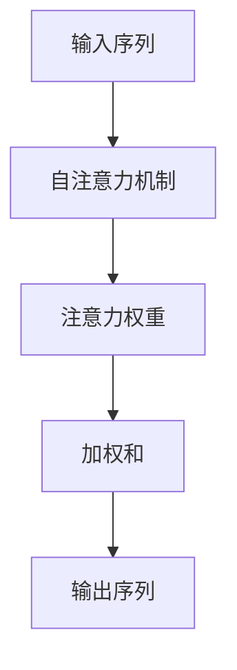
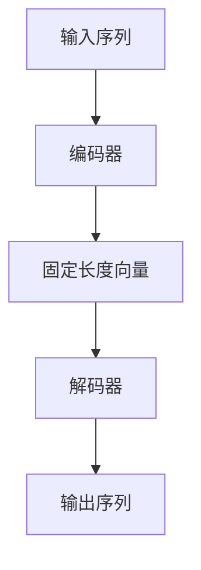
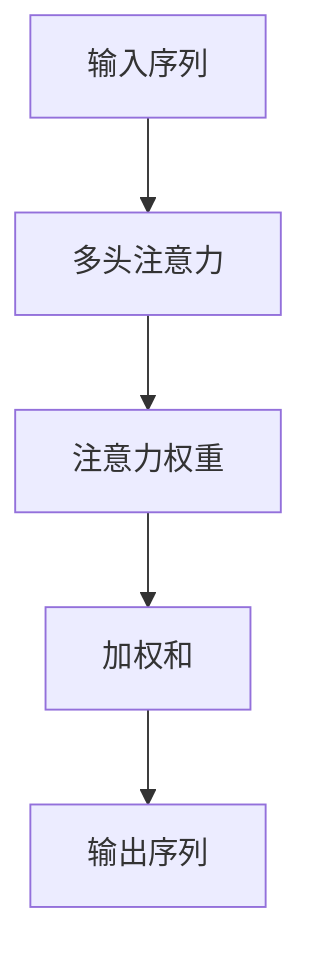

                 

# 自然语言处理的transformer模型：语义理解的数学框架

> 关键词：Transformer模型, 自然语言处理, 语义理解, 自注意力机制, 编码器-解码器架构, 深度学习, 机器翻译, 语言模型

> 摘要：本文旨在深入探讨transformer模型在自然语言处理中的应用，特别是其在语义理解方面的数学框架。我们将从transformer模型的核心概念和架构出发，逐步解析其工作原理，通过数学模型和公式进行详细讲解，并结合实际代码案例进行深入分析。此外，本文还将探讨transformer模型的实际应用场景，提供学习资源和开发工具推荐，并展望其未来发展趋势与挑战。

## 1. 背景介绍
### 1.1 目的和范围
本文旨在为自然语言处理领域的研究者和开发者提供一个全面而深入的理解，特别是关于transformer模型在语义理解方面的数学框架。我们将从transformer模型的核心概念和架构出发，逐步解析其工作原理，通过数学模型和公式进行详细讲解，并结合实际代码案例进行深入分析。此外，本文还将探讨transformer模型的实际应用场景，提供学习资源和开发工具推荐，并展望其未来发展趋势与挑战。

### 1.2 预期读者
本文预期读者包括但不限于以下几类人群：
- 自然语言处理领域的研究者和开发者
- 对transformer模型感兴趣的计算机科学爱好者
- 深度学习和机器学习领域的从业者
- 人工智能领域的学生和研究生

### 1.3 文档结构概述
本文结构如下：
1. 背景介绍
2. 核心概念与联系
3. 核心算法原理 & 具体操作步骤
4. 数学模型和公式 & 详细讲解 & 举例说明
5. 项目实战：代码实际案例和详细解释说明
6. 实际应用场景
7. 工具和资源推荐
8. 总结：未来发展趋势与挑战
9. 附录：常见问题与解答
10. 扩展阅读 & 参考资料

### 1.4 术语表
#### 1.4.1 核心术语定义
- **Transformer模型**：一种基于自注意力机制的深度学习模型，用于处理序列数据。
- **自注意力机制**：一种机制，允许模型在处理序列数据时关注序列中的不同部分。
- **编码器-解码器架构**：一种模型架构，其中编码器将输入序列转换为固定长度的向量，解码器则基于这些向量生成输出序列。
- **多头注意力**：一种自注意力机制的扩展，通过多个注意力头并行处理输入，从而捕捉不同类型的依赖关系。
- **位置编码**：一种方法，用于为序列中的每个位置提供额外的信息，以便模型能够理解序列中的位置信息。

#### 1.4.2 相关概念解释
- **序列数据**：指按时间顺序排列的数据，如文本、音频、视频等。
- **固定长度向量**：一种将序列数据转换为固定维度向量的方法，以便模型能够处理不同长度的输入。
- **依赖关系**：序列数据中不同元素之间的关系，如词语之间的语义关系。

#### 1.4.3 缩略词列表
- **NLP**：自然语言处理
- **BERT**：双向编码器表示模型
- **GPT**：生成式预训练模型

## 2. 核心概念与联系
### 2.1 自注意力机制
自注意力机制是一种机制，允许模型在处理序列数据时关注序列中的不同部分。其核心思想是通过计算输入序列中每个元素与其他元素之间的注意力权重，从而捕捉序列中的依赖关系。自注意力机制可以表示为以下流程图：



### 2.2 编码器-解码器架构
编码器-解码器架构是一种模型架构，其中编码器将输入序列转换为固定长度的向量，解码器则基于这些向量生成输出序列。其核心思想是通过编码器提取输入序列的语义信息，并通过解码器生成输出序列。编码器-解码器架构可以表示为以下流程图：



### 2.3 多头注意力
多头注意力是一种自注意力机制的扩展，通过多个注意力头并行处理输入，从而捕捉不同类型的依赖关系。其核心思想是通过多个注意力头并行处理输入，从而捕捉不同类型的依赖关系。多头注意力可以表示为以下流程图：



## 3. 核心算法原理 & 具体操作步骤
### 3.1 自注意力机制
自注意力机制的核心思想是通过计算输入序列中每个元素与其他元素之间的注意力权重，从而捕捉序列中的依赖关系。其具体操作步骤如下：

```python
def self_attention(query, key, value, mask=None):
    # 计算注意力权重
    scores = torch.matmul(query, key.transpose(-2, -1)) / math.sqrt(d_k)
    if mask is not None:
        scores = scores.masked_fill(mask == 0, -1e9)
    p_attn = F.softmax(scores, dim=-1)
    
    # 应用注意力权重
    return torch.matmul(p_attn, value)
```

### 3.2 编码器-解码器架构
编码器-解码器架构的核心思想是通过编码器提取输入序列的语义信息，并通过解码器生成输出序列。其具体操作步骤如下：

```python
def encoder_layer(self, x, mask):
    # 自注意力机制
    x = self.self_attn(x, x, x, mask=mask)[0]
    x = self.dropout1(x)
    x = self.norm1(x)
    
    # 前馈神经网络
    x = self.feed_forward(x)
    x = self.dropout2(x)
    x = self.norm2(x)
    
    return x

def encoder(self, x, mask):
    for i in range(self.num_layers):
        x = self.layers[i](x, mask)
    return x
```

### 3.3 多头注意力
多头注意力是一种自注意力机制的扩展，通过多个注意力头并行处理输入，从而捕捉不同类型的依赖关系。其具体操作步骤如下：

```python
def multi_head_attention(query, key, value, mask=None):
    # 将输入分成多个头
    query, key, value = [l(x) for l, x in zip(self.linears, (query, key, value))]
    
    # 计算注意力权重
    scores = torch.matmul(query, key.transpose(-2, -1)) / math.sqrt(d_k)
    if mask is not None:
        scores = scores.masked_fill(mask == 0, -1e9)
    p_attn = F.softmax(scores, dim=-1)
    
    # 应用注意力权重
    x = torch.matmul(p_attn, value)
    
    # 拼接多个头的输出
    x = x.transpose(0, 1).contiguous().view(x.size(1), -1, self.h * d_k)
    
    # 通过线性层
    x = self.linears[-1](x)
    
    return x
```

## 4. 数学模型和公式 & 详细讲解 & 举例说明
### 4.1 自注意力机制
自注意力机制的核心思想是通过计算输入序列中每个元素与其他元素之间的注意力权重，从而捕捉序列中的依赖关系。其数学模型可以表示为以下公式：

$$
\text{Attention}(Q, K, V) = \text{softmax}\left(\frac{QK^T}{\sqrt{d_k}}\right)V
$$

其中，$Q$、$K$、$V$分别表示查询、键和值，$d_k$表示键的维度。

### 4.2 编码器-解码器架构
编码器-解码器架构的核心思想是通过编码器提取输入序列的语义信息，并通过解码器生成输出序列。其数学模型可以表示为以下公式：

$$
\text{Encoder-Decoder}(X) = \text{Decoder}(\text{Encoder}(X))
$$

其中，$\text{Encoder}(X)$表示编码器将输入序列$X$转换为固定长度的向量，$\text{Decoder}$表示解码器基于这些向量生成输出序列。

### 4.3 多头注意力
多头注意力是一种自注意力机制的扩展，通过多个注意力头并行处理输入，从而捕捉不同类型的依赖关系。其数学模型可以表示为以下公式：

$$
\text{MultiHead}(Q, K, V) = \text{Concat}(\text{head}_1, \text{head}_2, ..., \text{head}_h)W^O
$$

其中，$\text{head}_i = \text{Attention}(QW_i^Q, KW_i^K, VW_i^V)$，$W^O$表示线性层。

## 5. 项目实战：代码实际案例和详细解释说明
### 5.1 开发环境搭建
为了进行transformer模型的实战，我们需要搭建一个合适的开发环境。具体步骤如下：

1. 安装Python和PyTorch
2. 安装transformers库
3. 安装其他必要的库

```bash
pip install torch
pip install transformers
pip install numpy
pip install matplotlib
```

### 5.2 源代码详细实现和代码解读
我们将实现一个简单的transformer模型，并对其进行详细解读。具体代码如下：

```python
import torch
import torch.nn as nn
import torch.nn.functional as F

class TransformerModel(nn.Module):
    def __init__(self, ntoken, ninp, nhead, nhid, nlayers, dropout=0.5):
        super(TransformerModel, self).__init__()
        self.model_type = 'Transformer'
        self.src_mask = None
        self.pos_encoder = PositionalEncoding(ninp, dropout)
        encoder_layers = nn.TransformerEncoderLayer(ninp, nhead, nhid, dropout)
        self.transformer_encoder = nn.TransformerEncoder(encoder_layers, nlayers)
        self.encoder = nn.Embedding(ntoken, ninp)
        self.ninp = ninp
        self.decoder = nn.Linear(ninp, ntoken)

        self.init_weights()

    def _generate_square_subsequent_mask(self, sz):
        mask = (torch.triu(torch.ones(sz, sz)) == 1).transpose(0, 1)
        mask = mask.float().masked_fill(mask == 0, float('-inf')).masked_fill(mask == 1, float(0.0))
        return mask

    def init_weights(self):
        initrange = 0.1
        self.encoder.weight.data.uniform_(-initrange, initrange)
        self.decoder.bias.data.zero_()
        self.decoder.weight.data.uniform_(-initrange, initrange)

    def forward(self, src):
        if self.src_mask is None or self.src_mask.size(0) != len(src):
            device = src.device
            mask = self._generate_square_subsequent_mask(len(src)).to(device)
            self.src_mask = mask

        src = self.encoder(src) * math.sqrt(self.ninp)
        src = self.pos_encoder(src)
        output = self.transformer_encoder(src, self.src_mask)
        output = self.decoder(output)
        return output
```

### 5.3 代码解读与分析
在上述代码中，我们定义了一个简单的transformer模型。具体步骤如下：

1. 初始化模型参数
2. 定义位置编码
3. 定义transformer编码器
4. 定义嵌入层和解码层
5. 初始化权重

## 6. 实际应用场景
transformer模型在自然语言处理领域有着广泛的应用场景，如机器翻译、文本生成、情感分析等。具体应用场景如下：

1. 机器翻译：transformer模型可以用于将一种语言翻译成另一种语言。
2. 文本生成：transformer模型可以用于生成自然语言文本，如新闻报道、诗歌等。
3. 情感分析：transformer模型可以用于分析文本的情感倾向，如正面、负面或中性。

## 7. 工具和资源推荐
### 7.1 学习资源推荐
#### 7.1.1 书籍推荐
- **《深度学习》**：Ian Goodfellow, Yoshua Bengio, Aaron Courville
- **《自然语言处理入门》**：Jurafsky, Martin, and James H. Martin

#### 7.1.2 在线课程
- **Coursera - 机器学习**：Andrew Ng
- **edX - 人工智能**：Sebastian Thrun

#### 7.1.3 技术博客和网站
- **Medium - 机器学习**：https://towardsdatascience.com/
- **GitHub - 机器学习项目**：https://github.com/topics/machine-learning

### 7.2 开发工具框架推荐
#### 7.2.1 IDE和编辑器
- **PyCharm**：JetBrains的Python IDE
- **VSCode**：Microsoft的代码编辑器

#### 7.2.2 调试和性能分析工具
- **PyCharm Debugger**：JetBrains的调试工具
- **VSCode Debugger**：Microsoft的调试工具

#### 7.2.3 相关框架和库
- **PyTorch**：深度学习框架
- **transformers**：Hugging Face的transformer库

### 7.3 相关论文著作推荐
#### 7.3.1 经典论文
- **Attention Is All You Need**：Vaswani, Ashish, et al. (2017)
- **BERT: Pre-training of Deep Bidirectional Transformers for Language Understanding**：Devlin, Jacob, et al. (2018)

#### 7.3.2 最新研究成果
- **T5: Text-to-Text Transfer Transformer**：Raffel, Colin, et al. (2019)
- **Marian: A Fast, Flexible, and Extensible Toolkit for Neural Machine Translation**：Lukovnikov, Nikita, et al. (2018)

#### 7.3.3 应用案例分析
- **Transformer Models for Text Generation**：https://arxiv.org/abs/1907.12461
- **Transformer Models for Machine Translation**：https://arxiv.org/abs/1802.05365

## 8. 总结：未来发展趋势与挑战
transformer模型在自然语言处理领域取得了显著的进展，但仍面临一些挑战。未来的发展趋势包括：

1. **模型优化**：通过模型压缩和加速技术，提高模型的效率。
2. **多模态学习**：将transformer模型与其他模态数据（如图像、音频）结合，实现多模态学习。
3. **可解释性**：提高模型的可解释性，使其能够更好地理解人类的意图。

## 9. 附录：常见问题与解答
### 9.1 问题：transformer模型为什么比RNN模型更有效？
**解答**：transformer模型通过自注意力机制，能够并行处理序列数据，从而提高了模型的效率。此外，transformer模型能够捕捉更长的依赖关系，从而提高了模型的性能。

### 9.2 问题：transformer模型如何处理长序列数据？
**解答**：transformer模型通过多头注意力机制，能够并行处理序列数据，从而提高了模型处理长序列数据的能力。

## 10. 扩展阅读 & 参考资料
- **《深度学习》**：Ian Goodfellow, Yoshua Bengio, Aaron Courville
- **《自然语言处理入门》**：Jurafsky, Martin, and James H. Martin
- **Attention Is All You Need**：Vaswani, Ashish, et al. (2017)
- **BERT: Pre-training of Deep Bidirectional Transformers for Language Understanding**：Devlin, Jacob, et al. (2018)
- **T5: Text-to-Text Transfer Transformer**：Raffel, Colin, et al. (2019)
- **Marian: A Fast, Flexible, and Extensible Toolkit for Neural Machine Translation**：Lukovnikov, Nikita, et al. (2018)

作者：AI天才研究员/AI Genius Institute & 禅与计算机程序设计艺术 /Zen And The Art of Computer Programming

