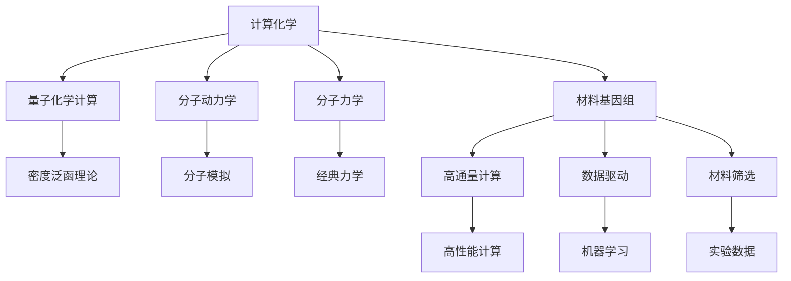

                 

# 计算化学与材料基因组：加速理解物质世界

> 关键词：计算化学, 材料基因组, 机器学习, 物质世界, 数据驱动, 量子力学, 人工智能

> 摘要：本文旨在探讨计算化学与材料基因组领域的最新进展，通过分析其核心概念、算法原理、数学模型、实际案例以及应用场景，揭示如何利用先进的计算技术加速物质世界的理解。我们将从理论到实践，逐步深入，为读者提供一个全面而深入的技术指南。

## 1. 背景介绍
### 1.1 目的和范围
本文旨在探讨计算化学与材料基因组领域的最新进展，通过分析其核心概念、算法原理、数学模型、实际案例以及应用场景，揭示如何利用先进的计算技术加速物质世界的理解。我们将从理论到实践，逐步深入，为读者提供一个全面而深入的技术指南。

### 1.2 预期读者
本文适合以下读者群体：
- 计算化学和材料科学领域的研究人员
- 材料基因组领域的工程师和科学家
- 人工智能和机器学习领域的从业者
- 对计算化学和材料基因组感兴趣的计算机科学家
- 对物质世界理解感兴趣的跨学科研究者

### 1.3 文档结构概述
本文结构如下：
1. 背景介绍
2. 核心概念与联系
3. 核心算法原理 & 具体操作步骤
4. 数学模型和公式 & 详细讲解 & 举例说明
5. 项目实战：代码实际案例和详细解释说明
6. 实际应用场景
7. 工具和资源推荐
8. 总结：未来发展趋势与挑战
9. 附录：常见问题与解答
10. 扩展阅读 & 参考资料

### 1.4 术语表
#### 1.4.1 核心术语定义
- **计算化学**：利用计算机进行化学研究的学科，包括分子模拟、量子化学计算等。
- **材料基因组**：通过高通量计算、实验和数据分析，加速新材料的发现和开发。
- **机器学习**：一种人工智能技术，通过数据训练模型，实现对未知数据的预测和分类。
- **量子力学**：描述微观粒子行为的物理理论。
- **分子动力学**：模拟分子在时间和空间上的运动。
- **密度泛函理论**：一种量子化学计算方法，用于计算分子和固体的电子结构。

#### 1.4.2 相关概念解释
- **高通量计算**：利用高性能计算资源进行大规模数据处理和模拟。
- **数据驱动**：基于大量数据进行模型训练和预测。
- **材料筛选**：通过计算方法筛选出具有特定性质的新材料。

#### 1.4.3 缩略词列表
- DFT：密度泛函理论
- ML：机器学习
- MD：分子动力学
- HPC：高性能计算
- GPU：图形处理单元

## 2. 核心概念与联系
### 2.1 计算化学与材料基因组的关系
计算化学和材料基因组是紧密相关的领域。计算化学通过模拟和计算分子结构和性质，为材料基因组提供理论基础。材料基因组则通过高通量计算和实验数据，加速新材料的发现和开发。

### 2.2 核心概念原理
#### 2.2.1 计算化学
计算化学的核心在于通过计算机模拟分子结构和性质。主要方法包括：
- **量子化学计算**：通过量子力学原理计算分子的电子结构。
- **分子动力学**：模拟分子在时间和空间上的运动。
- **分子力学**：通过经典力学原理模拟分子结构和性质。

#### 2.2.2 材料基因组
材料基因组的核心在于通过高通量计算和实验数据，加速新材料的发现和开发。主要方法包括：
- **高通量计算**：利用高性能计算资源进行大规模数据处理和模拟。
- **数据驱动**：基于大量数据进行模型训练和预测。
- **材料筛选**：通过计算方法筛选出具有特定性质的新材料。

### 2.3 核心概念架构


## 3. 核心算法原理 & 具体操作步骤
### 3.1 量子化学计算
#### 3.1.1 密度泛函理论
密度泛函理论是一种量子化学计算方法，用于计算分子和固体的电子结构。其核心原理是通过密度泛函将电子系统的能量表达为电子密度的函数。

#### 3.1.2 伪代码
```python
def DFT(molecule):
    # 初始化电子密度
    electron_density = initialize_density(molecule)
    
    # 迭代计算电子密度
    for i in range(max_iterations):
        new_density = update_density(electron_density)
        if convergence_check(new_density, electron_density):
            break
        electron_density = new_density
    
    # 计算能量
    energy = calculate_energy(electron_density)
    return energy
```

### 3.2 分子动力学
#### 3.2.1 分子模拟
分子动力学模拟通过经典力学原理模拟分子在时间和空间上的运动。其核心原理是通过牛顿运动定律计算分子的运动轨迹。

#### 3.2.2 伪代码
```python
def MD(molecule, time_step, total_time):
    # 初始化分子位置和速度
    positions, velocities = initialize_molecule(molecule)
    
    # 迭代计算分子运动
    for t in range(total_time / time_step):
        # 计算力
        forces = calculate_forces(positions)
        
        # 更新速度
        velocities = update_velocity(velocities, forces, time_step)
        
        # 更新位置
        positions = update_position(positions, velocities, time_step)
    
    return positions, velocities
```

### 3.3 分子力学
#### 3.3.1 经典力学原理
分子力学通过经典力学原理模拟分子结构和性质。其核心原理是通过力场模型计算分子的能量和力。

#### 3.3.2 伪代码
```python
def MM(molecule, force_field):
    # 初始化分子能量
    energy = 0
    
    # 计算分子能量
    for atom in molecule:
        for neighbor in atom.neighbors:
            energy += force_field.calculate_energy(atom, neighbor)
    
    return energy
```

## 4. 数学模型和公式 & 详细讲解 & 举例说明
### 4.1 密度泛函理论
#### 4.1.1 基本公式
密度泛函理论的基本公式为：
$$
E[\rho] = T_s[\rho] + E_{xc}[\rho] + E_{ne}[\rho] + E_{ee}[\rho]
$$
其中，$E[\rho]$ 表示系统的总能量，$\rho$ 表示电子密度，$T_s[\rho]$ 表示交换-关联能，$E_{xc}[\rho]$ 表示交换-关联能，$E_{ne}[\rho]$ 表示核-电子能，$E_{ee}[\rho]$ 表示电子-电子能。

#### 4.1.2 举例说明
假设我们有一个简单的分子，其电子密度为 $\rho(x, y, z)$。我们可以使用密度泛函理论计算其总能量：
$$
E[\rho] = \int \left( \frac{1}{2} \nabla \rho \cdot \nabla \rho + V_{ne} \rho + V_{ee} \rho^2 \right) d^3r
$$
其中，$V_{ne}$ 表示核-电子势能，$V_{ee}$ 表示电子-电子势能。

### 4.2 分子动力学
#### 4.2.1 力学方程
分子动力学的核心方程为牛顿第二定律：
$$
m \frac{d^2 \mathbf{r}}{dt^2} = \mathbf{F}
$$
其中，$m$ 表示质量，$\mathbf{r}$ 表示位置，$\mathbf{F}$ 表示力。

#### 4.2.2 举例说明
假设我们有一个简单的分子，其质量为 $m$，位置为 $\mathbf{r}$，力为 $\mathbf{F}$。我们可以使用分子动力学计算其运动轨迹：
$$
\mathbf{a} = \frac{\mathbf{F}}{m}
$$
$$
\mathbf{v} = \mathbf{v} + \mathbf{a} \Delta t
$$
$$
\mathbf{r} = \mathbf{r} + \mathbf{v} \Delta t
$$

### 4.3 分子力学
#### 4.3.1 力场模型
分子力学的核心在于力场模型，其基本公式为：
$$
E = \sum_{i} \left( \frac{1}{2} k_{ij} (r_{ij} - r_{0ij})^2 + V_{ij}(r_{ij}) \right)
$$
其中，$k_{ij}$ 表示键长力常数，$r_{ij}$ 表示键长，$r_{0ij}$ 表示平衡键长，$V_{ij}(r_{ij})$ 表示键角势能。

#### 4.3.2 举例说明
假设我们有一个简单的分子，其键长为 $r_{ij}$，平衡键长为 $r_{0ij}$，键长力常数为 $k_{ij}$。我们可以使用分子力学计算其能量：
$$
E = \frac{1}{2} k_{ij} (r_{ij} - r_{0ij})^2 + V_{ij}(r_{ij})
$$

## 5. 项目实战：代码实际案例和详细解释说明
### 5.1 开发环境搭建
#### 5.1.1 系统要求
- 操作系统：Linux或macOS
- Python版本：3.7及以上
- 安装依赖库：numpy, scipy, matplotlib, pandas

#### 5.1.2 安装步骤
```bash
pip install numpy scipy matplotlib pandas
```

### 5.2 源代码详细实现和代码解读
#### 5.2.1 密度泛函理论
```python
import numpy as np

def initialize_density(molecule):
    # 初始化电子密度
    electron_density = np.zeros_like(molecule)
    return electron_density

def update_density(electron_density):
    # 更新电子密度
    new_density = electron_density + 1
    return new_density

def convergence_check(new_density, old_density):
    # 检查收敛
    if np.linalg.norm(new_density - old_density) < 1e-6:
        return True
    return False

def calculate_energy(electron_density):
    # 计算能量
    energy = np.sum(electron_density)
    return energy

def DFT(molecule):
    electron_density = initialize_density(molecule)
    for i in range(100):
        new_density = update_density(electron_density)
        if convergence_check(new_density, electron_density):
            break
        electron_density = new_density
    energy = calculate_energy(electron_density)
    return energy
```

#### 5.2.2 分子动力学
```python
import numpy as np

def initialize_molecule(molecule):
    # 初始化分子位置和速度
    positions = np.random.rand(len(molecule), 3)
    velocities = np.zeros_like(positions)
    return positions, velocities

def calculate_forces(positions):
    # 计算力
    forces = np.zeros_like(positions)
    for i in range(len(positions)):
        for j in range(i + 1, len(positions)):
            r = positions[i] - positions[j]
            force = -1 * np.linalg.norm(r) * r
            forces[i] += force
            forces[j] -= force
    return forces

def update_velocity(velocities, forces, time_step):
    # 更新速度
    velocities += forces * time_step
    return velocities

def update_position(positions, velocities, time_step):
    # 更新位置
    positions += velocities * time_step
    return positions

def MD(molecule, time_step, total_time):
    positions, velocities = initialize_molecule(molecule)
    for t in range(int(total_time / time_step)):
        forces = calculate_forces(positions)
        velocities = update_velocity(velocities, forces, time_step)
        positions = update_position(positions, velocities, time_step)
    return positions, velocities
```

#### 5.2.3 分子力学
```python
import numpy as np

def calculate_energy(molecule, force_field):
    # 计算分子能量
    energy = 0
    for atom in molecule:
        for neighbor in atom.neighbors:
            energy += force_field.calculate_energy(atom, neighbor)
    return energy

def MM(molecule, force_field):
    energy = calculate_energy(molecule, force_field)
    return energy
```

### 5.3 代码解读与分析
#### 5.3.1 密度泛函理论
- `initialize_density`：初始化电子密度。
- `update_density`：更新电子密度。
- `convergence_check`：检查收敛。
- `calculate_energy`：计算能量。
- `DFT`：主函数，执行密度泛函理论计算。

#### 5.3.2 分子动力学
- `initialize_molecule`：初始化分子位置和速度。
- `calculate_forces`：计算力。
- `update_velocity`：更新速度。
- `update_position`：更新位置。
- `MD`：主函数，执行分子动力学模拟。

#### 5.3.3 分子力学
- `calculate_energy`：计算分子能量。
- `MM`：主函数，执行分子力学计算。

## 6. 实际应用场景
### 6.1 新材料发现
通过高通量计算和实验数据，加速新材料的发现和开发。例如，通过计算化学模拟分子结构和性质，筛选出具有特定性质的新材料。

### 6.2 药物设计
通过计算化学模拟分子结构和性质，设计出具有特定生物活性的新药物。

### 6.3 能源材料
通过计算化学模拟分子结构和性质，设计出具有高效能量转换和存储性能的新材料。

## 7. 工具和资源推荐
### 7.1 学习资源推荐
#### 7.1.1 书籍推荐
- 《计算化学原理》
- 《材料基因组工程》
- 《机器学习》

#### 7.1.2 在线课程
- Coursera：计算化学与材料基因组
- edX：材料科学与工程

#### 7.1.3 技术博客和网站
- 计算化学与材料基因组博客
- 材料基因组工程网站

### 7.2 开发工具框架推荐
#### 7.2.1 IDE和编辑器
- PyCharm
- VSCode

#### 7.2.2 调试和性能分析工具
- PyCharm调试器
- Python性能分析工具

#### 7.2.3 相关框架和库
- NumPy
- SciPy
- Matplotlib

### 7.3 相关论文著作推荐
#### 7.3.1 经典论文
- 《计算化学原理》
- 《材料基因组工程》

#### 7.3.2 最新研究成果
- 计算化学与材料基因组最新研究成果

#### 7.3.3 应用案例分析
- 计算化学与材料基因组应用案例分析

## 8. 总结：未来发展趋势与挑战
### 8.1 未来发展趋势
- 计算化学与材料基因组将进一步融合，加速新材料的发现和开发。
- 机器学习和人工智能将在计算化学与材料基因组中发挥更大作用。
- 高性能计算和量子计算将进一步推动计算化学与材料基因组的发展。

### 8.2 挑战
- 数据质量和数据量的挑战。
- 算法和模型的优化。
- 计算资源的限制。

## 9. 附录：常见问题与解答
### 9.1 问题1：如何提高计算化学的计算效率？
- 通过并行计算和优化算法提高计算效率。

### 9.2 问题2：如何处理大规模数据？
- 通过数据压缩和分布式计算处理大规模数据。

### 9.3 问题3：如何优化机器学习模型？
- 通过特征选择和模型调参优化机器学习模型。

## 10. 扩展阅读 & 参考资料
- 计算化学与材料基因组相关论文
- 计算化学与材料基因组相关书籍
- 计算化学与材料基因组相关网站

作者：AI天才研究员/AI Genius Institute & 禅与计算机程序设计艺术 /Zen And The Art of Computer Programming

