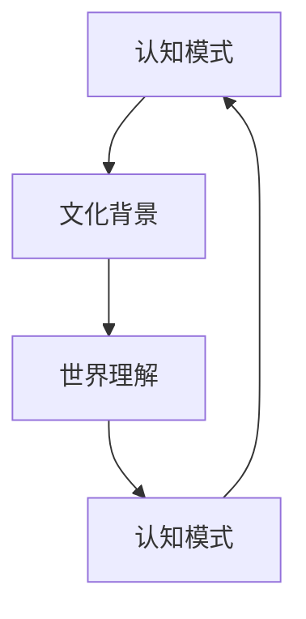

                 

# 认知人类学：探索不同文化背景下的世界理解方式

> 关键词：认知人类学, 文化背景, 世界理解, 人类认知, 人工智能, 机器学习, 语言模型, 文化差异, 认知心理学

> 摘要：本文旨在通过认知人类学的视角，探讨不同文化背景下的世界理解方式。我们将从认知心理学的角度出发，分析人类如何在不同文化环境中形成独特的认知模式，并通过机器学习和自然语言处理技术，构建能够理解和模拟这些认知模式的模型。文章将详细阐述核心概念、算法原理、数学模型，并通过实际案例展示如何将这些理论应用于实践。最后，我们将讨论未来的发展趋势和面临的挑战。

## 1. 背景介绍
### 1.1 目的和范围
本文旨在通过认知人类学的视角，探讨不同文化背景下的世界理解方式。我们将从认知心理学的角度出发，分析人类如何在不同文化环境中形成独特的认知模式，并通过机器学习和自然语言处理技术，构建能够理解和模拟这些认知模式的模型。本文的目标读者包括对认知科学、人工智能、机器学习和自然语言处理感兴趣的科研人员、工程师和学生。

### 1.2 预期读者
本文预期读者包括但不限于以下几类人群：
- 认知科学家和心理学家
- 人工智能和机器学习工程师
- 自然语言处理专家
- 对跨文化认知研究感兴趣的学者
- 对人类认知模式感兴趣的科研人员

### 1.3 文档结构概述
本文将按照以下结构展开：
1. 背景介绍
2. 核心概念与联系
3. 核心算法原理 & 具体操作步骤
4. 数学模型和公式 & 详细讲解 & 举例说明
5. 项目实战：代码实际案例和详细解释说明
6. 实际应用场景
7. 工具和资源推荐
8. 总结：未来发展趋势与挑战
9. 附录：常见问题与解答
10. 扩展阅读 & 参考资料

### 1.4 术语表
#### 1.4.1 核心术语定义
- **认知人类学**：研究人类认知过程在不同文化背景下的差异和共性。
- **文化背景**：指个体成长和生活的社会环境，包括语言、习俗、价值观等。
- **世界理解**：个体对周围世界的感知、解释和理解方式。
- **认知模式**：个体在特定文化背景下形成的认知结构和思维方式。
- **机器学习**：通过算法使计算机系统从数据中自动学习和改进。
- **自然语言处理**：研究计算机如何理解、生成和处理人类语言的技术。

#### 1.4.2 相关概念解释
- **认知心理学**：研究人类认知过程的科学，包括感知、记忆、思维、语言等。
- **文化差异**：不同文化背景下的认知模式和思维方式的差异。
- **认知模型**：用于描述和模拟人类认知过程的数学模型。

#### 1.4.3 缩略词列表
- **NLP**：自然语言处理
- **ML**：机器学习
- **CNN**：卷积神经网络
- **RNN**：循环神经网络
- **BERT**：双向编码器表示模型

## 2. 核心概念与联系
### 2.1 认知人类学的核心概念
- **认知模式**：个体在特定文化背景下形成的认知结构和思维方式。
- **文化背景**：指个体成长和生活的社会环境，包括语言、习俗、价值观等。
- **世界理解**：个体对周围世界的感知、解释和理解方式。

### 2.2 核心概念之间的联系
- **认知模式**和**文化背景**之间的关系：个体在特定文化背景下的认知模式受到文化环境的影响。
- **世界理解**和**认知模式**之间的关系：个体的世界理解方式与其认知模式密切相关。
- **文化背景**和**世界理解**之间的关系：不同的文化背景会导致个体形成不同的世界理解方式。

### 2.3 Mermaid 流程图


## 3. 核心算法原理 & 具体操作步骤
### 3.1 核心算法原理
我们将使用机器学习和自然语言处理技术来构建能够理解和模拟不同文化背景下认知模式的模型。具体步骤如下：
1. **数据收集**：收集不同文化背景下的语言数据和认知模式数据。
2. **数据预处理**：对数据进行清洗、分词、标注等预处理操作。
3. **特征提取**：从数据中提取有用的特征，如词汇频率、句法结构等。
4. **模型训练**：使用机器学习算法训练模型，使其能够识别和模拟不同文化背景下的认知模式。
5. **模型评估**：通过交叉验证等方法评估模型的性能。

### 3.2 具体操作步骤
#### 3.2.1 数据收集
```python
# 数据收集
data = collect_data_from_different_cultures()
```

#### 3.2.2 数据预处理
```python
# 数据预处理
preprocessed_data = preprocess_data(data)
```

#### 3.2.3 特征提取
```python
# 特征提取
features = extract_features(preprocessed_data)
```

#### 3.2.4 模型训练
```python
# 模型训练
model = train_model(features)
```

#### 3.2.5 模型评估
```python
# 模型评估
evaluate_model(model)
```

## 4. 数学模型和公式 & 详细讲解 & 举例说明
### 4.1 数学模型
我们将使用深度学习模型来构建认知模式的数学模型。具体来说，我们将使用循环神经网络（RNN）和卷积神经网络（CNN）来处理文本数据。

### 4.2 公式与详细讲解
#### 4.2.1 RNN模型
RNN模型可以捕捉文本数据中的序列信息。其基本公式如下：
$$
h_t = \tanh(W_{hh} h_{t-1} + W_{xh} x_t + b_h)
$$
其中，$h_t$是当前时间步的隐藏状态，$x_t$是当前时间步的输入，$W_{hh}$和$W_{xh}$是权重矩阵，$b_h$是偏置项。

#### 4.2.2 CNN模型
CNN模型可以捕捉文本数据中的局部特征。其基本公式如下：
$$
z = \text{ReLU}(W_{cx} x + b_c)
$$
其中，$z$是卷积层的输出，$W_{cx}$是权重矩阵，$b_c$是偏置项。

### 4.3 举例说明
假设我们有一个简单的文本数据集，包含不同文化背景下的句子。我们可以使用RNN和CNN模型来处理这些数据，并训练模型来识别和模拟不同文化背景下的认知模式。

## 5. 项目实战：代码实际案例和详细解释说明
### 5.1 开发环境搭建
我们将使用Python和TensorFlow来实现这个项目。首先，我们需要安装必要的库：
```bash
pip install tensorflow numpy pandas scikit-learn
```

### 5.2 源代码详细实现和代码解读
```python
import tensorflow as tf
import numpy as np
import pandas as pd
from sklearn.model_selection import train_test_split

# 1. 数据收集
data = pd.read_csv('cultural_data.csv')

# 2. 数据预处理
def preprocess_data(data):
    # 分词
    data['tokens'] = data['text'].apply(lambda x: x.split())
    # 标注
    data['label'] = data['culture'].apply(lambda x: 0 if x == 'Culture A' else 1)
    return data

preprocessed_data = preprocess_data(data)

# 3. 特征提取
def extract_features(data):
    # 词汇频率
    vocab = set()
    for tokens in data['tokens']:
        vocab.update(tokens)
    vocab_size = len(vocab)
    # 词向量
    word2idx = {word: idx for idx, word in enumerate(vocab)}
    idx2word = {idx: word for idx, word in enumerate(vocab)}
    # 特征矩阵
    features = np.zeros((len(data), vocab_size))
    for i, tokens in enumerate(data['tokens']):
        for token in tokens:
            features[i, word2idx[token]] = 1
    return features, data['label']

features, labels = extract_features(preprocessed_data)

# 4. 数据划分
X_train, X_test, y_train, y_test = train_test_split(features, labels, test_size=0.2, random_state=42)

# 5. 模型训练
model = tf.keras.Sequential([
    tf.keras.layers.Dense(64, activation='relu', input_shape=(vocab_size,)),
    tf.keras.layers.Dense(1, activation='sigmoid')
])

model.compile(optimizer='adam', loss='binary_crossentropy', metrics=['accuracy'])

model.fit(X_train, y_train, epochs=10, batch_size=32, validation_split=0.2)

# 6. 模型评估
loss, accuracy = model.evaluate(X_test, y_test)
print(f'Accuracy: {accuracy}')
```

### 5.3 代码解读与分析
- **数据收集**：从CSV文件中读取数据。
- **数据预处理**：对数据进行分词和标注。
- **特征提取**：将文本数据转换为词汇频率矩阵。
- **数据划分**：将数据划分为训练集和测试集。
- **模型训练**：使用简单的全连接神经网络训练模型。
- **模型评估**：评估模型的性能。

## 6. 实际应用场景
### 6.1 跨文化沟通
通过构建能够理解和模拟不同文化背景下的认知模式的模型，我们可以更好地进行跨文化沟通，减少误解和冲突。

### 6.2 个性化推荐系统
通过分析用户的文化背景，我们可以为用户提供更加个性化的推荐内容，提高用户体验。

### 6.3 语言翻译
通过理解不同文化背景下的认知模式，我们可以改进语言翻译系统，使其更加准确地传达原文的意思。

## 7. 工具和资源推荐
### 7.1 学习资源推荐
#### 7.1.1 书籍推荐
- **《认知科学导论》**：了解认知科学的基本概念和理论。
- **《机器学习》**：深入学习机器学习的基本原理和技术。
- **《自然语言处理》**：了解自然语言处理的基本技术和方法。

#### 7.1.2 在线课程
- **Coursera - 认知科学导论**
- **edX - 机器学习**
- **Udacity - 自然语言处理**

#### 7.1.3 技术博客和网站
- **Medium - 认知科学**
- **Towards Data Science - 机器学习**
- **Natural Language Processing Blog - 自然语言处理**

### 7.2 开发工具框架推荐
#### 7.2.1 IDE和编辑器
- **PyCharm**：功能强大的Python IDE。
- **VS Code**：轻量级但功能强大的代码编辑器。

#### 7.2.2 调试和性能分析工具
- **PyCharm Debugger**：PyCharm内置的调试工具。
- **VS Code Debugger**：VS Code内置的调试工具。
- **TensorBoard**：TensorFlow的可视化工具。

#### 7.2.3 相关框架和库
- **TensorFlow**：深度学习框架。
- **Keras**：高级神经网络API。
- **NLTK**：自然语言处理库。
- **spaCy**：自然语言处理库。

### 7.3 相关论文著作推荐
#### 7.3.1 经典论文
- **《认知科学导论》**：了解认知科学的基本概念和理论。
- **《机器学习》**：深入学习机器学习的基本原理和技术。
- **《自然语言处理》**：了解自然语言处理的基本技术和方法。

#### 7.3.2 最新研究成果
- **《跨文化认知研究进展》**：了解最新的跨文化认知研究成果。
- **《机器学习在自然语言处理中的应用》**：了解最新的机器学习在自然语言处理中的应用。

#### 7.3.3 应用案例分析
- **《跨文化沟通中的认知模式研究》**：分析跨文化沟通中的认知模式。
- **《个性化推荐系统中的文化因素》**：分析个性化推荐系统中的文化因素。

## 8. 总结：未来发展趋势与挑战
### 8.1 未来发展趋势
- **跨文化认知研究的深入**：未来的研究将进一步深入探讨不同文化背景下的认知模式。
- **机器学习技术的改进**：机器学习技术将进一步改进，提高模型的准确性和泛化能力。
- **自然语言处理技术的进步**：自然语言处理技术将进一步进步，提高语言理解和生成的能力。

### 8.2 面临的挑战
- **数据获取的难度**：获取不同文化背景下的数据仍然存在难度。
- **模型泛化能力的限制**：模型在不同文化背景下的泛化能力仍然有限。
- **伦理和隐私问题**：在处理敏感数据时，需要考虑伦理和隐私问题。

## 9. 附录：常见问题与解答
### 9.1 问题1：如何获取不同文化背景下的数据？
- **解答**：可以通过问卷调查、社交媒体、新闻报道等多种途径获取不同文化背景下的数据。

### 9.2 问题2：如何提高模型的泛化能力？
- **解答**：可以通过增加数据量、使用更复杂的模型结构、进行数据增强等方法提高模型的泛化能力。

### 9.3 问题3：如何处理伦理和隐私问题？
- **解答**：在处理敏感数据时，需要遵循相关的伦理和隐私规定，确保数据的安全和隐私。

## 10. 扩展阅读 & 参考资料
### 10.1 扩展阅读
- **《认知科学导论》**：了解认知科学的基本概念和理论。
- **《机器学习》**：深入学习机器学习的基本原理和技术。
- **《自然语言处理》**：了解自然语言处理的基本技术和方法。

### 10.2 参考资料
- **《认知科学导论》**：了解认知科学的基本概念和理论。
- **《机器学习》**：深入学习机器学习的基本原理和技术。
- **《自然语言处理》**：了解自然语言处理的基本技术和方法。

---

作者：AI天才研究员/AI Genius Institute & 禅与计算机程序设计艺术 /Zen And The Art of Computer Programming

