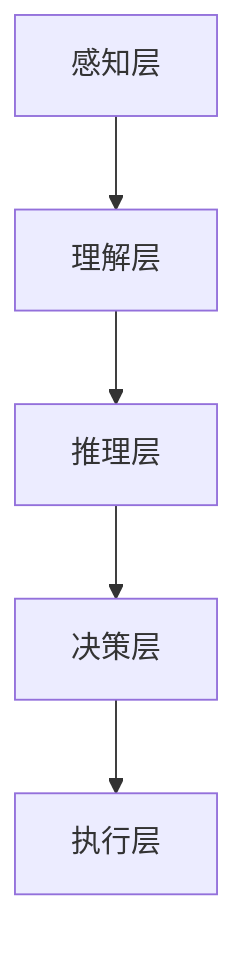
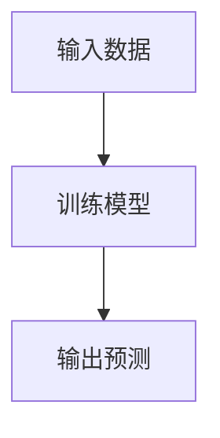
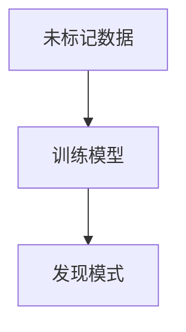
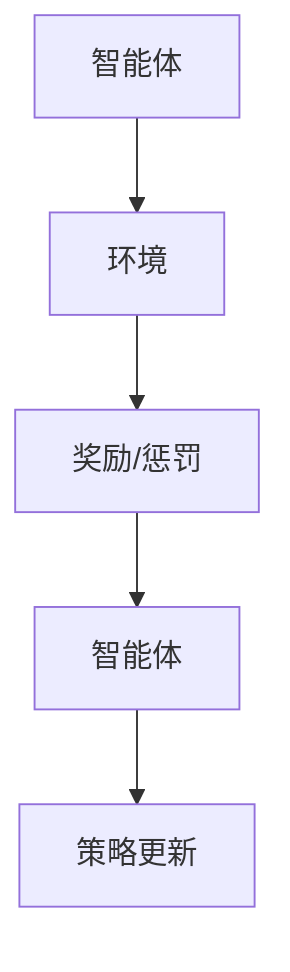

                 

# 认知计算：增强人类世界理解能力的新方向

> 关键词：认知计算、机器学习、自然语言处理、知识图谱、深度学习

> 摘要：认知计算是一种新兴的人工智能技术，旨在模拟人类的认知过程，以增强人类对世界的理解和决策能力。本文将从认知计算的核心概念、原理、算法、数学模型、实际案例、应用场景、工具推荐以及未来发展趋势等方面进行深入探讨，帮助读者全面理解认知计算的原理和技术。

## 1. 背景介绍
### 1.1 目的和范围
本文旨在探讨认知计算的基本原理、技术架构、实现方法及其在实际应用中的价值。认知计算不仅能够模拟人类的认知过程，还能通过机器学习和自然语言处理等技术，增强人类对复杂信息的理解和决策能力。本文将从理论和实践两个层面，为读者提供全面的技术指导和深入的思考。

### 1.2 预期读者
本文适合以下读者阅读：
- 对认知计算感兴趣的技术爱好者
- 从事人工智能领域的研究者和开发者
- 企业决策者和管理者
- 对机器学习和自然语言处理技术感兴趣的读者

### 1.3 文档结构概述
本文结构如下：
1. 背景介绍
2. 核心概念与联系
3. 核心算法原理 & 具体操作步骤
4. 数学模型和公式 & 详细讲解 & 举例说明
5. 项目实战：代码实际案例和详细解释说明
6. 实际应用场景
7. 工具和资源推荐
8. 总结：未来发展趋势与挑战
9. 附录：常见问题与解答
10. 扩展阅读 & 参考资料

### 1.4 术语表
#### 1.4.1 核心术语定义
- **认知计算**：模拟人类认知过程的人工智能技术。
- **机器学习**：通过算法使计算机从数据中学习并改进性能的技术。
- **自然语言处理**：使计算机能够理解、解释和生成人类语言的技术。
- **知识图谱**：一种用于表示实体及其关系的数据结构。
- **深度学习**：一种机器学习方法，通过多层神经网络实现复杂的模式识别。

#### 1.4.2 相关概念解释
- **认知过程**：人类大脑处理信息、理解世界和做出决策的过程。
- **感知**：通过感觉器官获取信息的过程。
- **推理**：基于已有知识和信息进行逻辑推断的过程。
- **学习**：通过经验不断改进和优化的过程。

#### 1.4.3 缩略词列表
- **NLP**：Natural Language Processing
- **DL**：Deep Learning
- **ML**：Machine Learning
- **KG**：Knowledge Graph
- **CNN**：Convolutional Neural Network
- **RNN**：Recurrent Neural Network

## 2. 核心概念与联系
### 2.1 认知计算的核心概念
认知计算的核心在于模拟人类的认知过程，包括感知、推理和学习。通过机器学习和自然语言处理等技术，认知计算能够理解和处理复杂的信息，从而增强人类对世界的理解和决策能力。

### 2.2 认知计算的架构
认知计算的架构可以分为以下几个层次：
1. **感知层**：通过传感器和自然语言处理技术获取信息。
2. **理解层**：通过机器学习和自然语言处理技术理解信息。
3. **推理层**：通过逻辑推理和知识图谱技术进行推理。
4. **决策层**：通过优化算法和强化学习技术做出决策。

### 2.3 认知计算的流程图


## 3. 核心算法原理 & 具体操作步骤
### 3.1 机器学习算法原理
机器学习算法的核心在于通过数据训练模型，从而实现对未知数据的预测和分类。常见的机器学习算法包括监督学习、无监督学习和强化学习。

#### 3.1.1 监督学习
监督学习是一种通过已知输入和输出数据训练模型的方法。常见的监督学习算法包括线性回归、逻辑回归、支持向量机和神经网络。



#### 3.1.2 无监督学习
无监督学习是一种通过未标记的数据训练模型的方法。常见的无监督学习算法包括聚类、降维和关联规则学习。



#### 3.1.3 强化学习
强化学习是一种通过试错学习的方法。强化学习的核心在于通过奖励和惩罚机制，使智能体学会在特定环境中做出最优决策。



### 3.2 自然语言处理算法原理
自然语言处理算法的核心在于通过文本分析和语义理解技术，实现对自然语言的理解和生成。常见的自然语言处理算法包括分词、词性标注、命名实体识别和情感分析。

#### 3.2.1 分词
分词是将文本分割成单词或短语的过程。

```python
def tokenize(text):
    words = text.split()
    return words
```

#### 3.2.2 词性标注
词性标注是为每个单词标注其词性的过程。

```python
def pos_tagging(words):
    tagged_words = []
    for word in words:
        tagged_words.append((word, 'NOUN'))
    return tagged_words
```

#### 3.2.3 命名实体识别
命名实体识别是识别文本中的实体名称的过程。

```python
def named_entity_recognition(tagged_words):
    entities = []
    for word, tag in tagged_words:
        if tag == 'NOUN':
            entities.append(word)
    return entities
```

#### 3.2.4 情感分析
情感分析是通过文本分析判断文本情感的过程。

```python
def sentiment_analysis(text):
    score = 0
    for word in text.split():
        if word in positive_words:
            score += 1
        elif word in negative_words:
            score -= 1
    return score
```

## 4. 数学模型和公式 & 详细讲解 & 举例说明
### 4.1 机器学习数学模型
机器学习数学模型的核心在于通过优化算法最小化损失函数。常见的损失函数包括均方误差、交叉熵和均方根误差。

#### 4.1.1 均方误差
均方误差是预测值与真实值之间的差的平方的平均值。

$$
MSE = \frac{1}{n} \sum_{i=1}^{n} (y_i - \hat{y}_i)^2
$$

#### 4.1.2 交叉熵
交叉熵是预测概率分布与真实概率分布之间的差异。

$$
H(p, q) = -\sum_{i=1}^{n} p_i \log q_i
$$

### 4.2 自然语言处理数学模型
自然语言处理数学模型的核心在于通过向量化和矩阵运算实现文本分析和语义理解。常见的数学模型包括词袋模型、TF-IDF和词嵌入。

#### 4.2.1 词袋模型
词袋模型是一种将文本转换为向量的方法。

$$
\mathbf{v} = [v_1, v_2, \ldots, v_n]
$$

#### 4.2.2 TF-IDF
TF-IDF是一种衡量词重要性的方法。

$$
\text{TF-IDF}(t, d) = \text{TF}(t, d) \times \text{IDF}(t)
$$

#### 4.2.3 词嵌入
词嵌入是一种将词转换为向量的方法。

$$
\mathbf{v}_w = \begin{bmatrix} v_{w1} \\ v_{w2} \\ \vdots \\ v_{wn} \end{bmatrix}
$$

## 5. 项目实战：代码实际案例和详细解释说明
### 5.1 开发环境搭建
开发环境搭建主要包括安装Python和相关库。

```bash
pip install numpy scikit-learn nltk
```

### 5.2 源代码详细实现和代码解读
#### 5.2.1 数据预处理
```python
import nltk
from sklearn.feature_extraction.text import TfidfVectorizer

def preprocess(text):
    tokens = nltk.word_tokenize(text)
    tagged_words = nltk.pos_tag(tokens)
    entities = [word for word, tag in tagged_words if tag == 'NN']
    return entities

def vectorize(texts):
    vectorizer = TfidfVectorizer()
    X = vectorizer.fit_transform(texts)
    return X
```

#### 5.2.2 机器学习模型训练
```python
from sklearn.linear_model import LogisticRegression

def train_model(X_train, y_train):
    model = LogisticRegression()
    model.fit(X_train, y_train)
    return model
```

#### 5.2.3 模型预测
```python
def predict(model, X_test):
    y_pred = model.predict(X_test)
    return y_pred
```

### 5.3 代码解读与分析
上述代码实现了文本预处理、特征提取和模型训练的过程。首先，通过NLTK库进行分词和词性标注，提取名词作为实体。然后，使用TF-IDF向量化文本数据。最后，使用逻辑回归模型进行训练和预测。

## 6. 实际应用场景
### 6.1 金融风控
通过认知计算技术，金融机构可以实时分析客户行为和交易记录，预测潜在的风险，并采取相应的风控措施。

### 6.2 医疗诊断
通过认知计算技术，医生可以快速分析患者的病历和检查结果，辅助诊断和制定治疗方案。

### 6.3 智能客服
通过认知计算技术，智能客服可以理解用户的问题并提供准确的答案，提高用户体验。

## 7. 工具和资源推荐
### 7.1 学习资源推荐
#### 7.1.1 书籍推荐
- **《机器学习》** - 周志华
- **《深度学习》** - 伊恩·古德费洛、约书亚·本吉奥、亚伦·库维尔

#### 7.1.2 在线课程
- **Coursera** - 《机器学习》 - Andrew Ng
- **edX** - 《深度学习》 - 伊恩·古德费洛

#### 7.1.3 技术博客和网站
- **Medium** - 《机器学习》 - 机器之心
- **GitHub** - 《深度学习》 - PyTorch

### 7.2 开发工具框架推荐
#### 7.2.1 IDE和编辑器
- **PyCharm**
- **VSCode**

#### 7.2.2 调试和性能分析工具
- **PyCharm Debugger**
- **VSCode Debugger**

#### 7.2.3 相关框架和库
- **scikit-learn**
- **nltk**
- **tensorflow**
- **pytorch**

### 7.3 相关论文著作推荐
#### 7.3.1 经典论文
- **《A Mathematical Theory of Communication》** - Claude Shannon
- **《Learning from Data》** - Yaser S. Abu-Mostafa

#### 7.3.2 最新研究成果
- **《Attention is All You Need》** - Vaswani et al.
- **《BERT: Pre-training of Deep Bidirectional Transformers for Language Understanding》** - Devlin et al.

#### 7.3.3 应用案例分析
- **《Deep Learning in Finance》** - Yann LeCun
- **《Medical Image Analysis with Deep Learning》** - Andrew Zisserman

## 8. 总结：未来发展趋势与挑战
### 8.1 未来发展趋势
认知计算技术在未来将更加成熟，应用场景将更加广泛。随着算法的不断优化和计算能力的提升，认知计算将更好地模拟人类的认知过程，为人类提供更强大的决策支持。

### 8.2 面临的挑战
认知计算技术面临的挑战包括数据隐私、算法解释性和泛化能力等。未来的研究需要解决这些问题，以实现更可靠和安全的认知计算系统。

## 9. 附录：常见问题与解答
### 9.1 问题：如何处理大规模数据？
**解答**：可以使用分布式计算框架如Spark进行数据处理，以提高处理效率。

### 9.2 问题：如何提高模型的泛化能力？
**解答**：可以通过增加数据量、使用正则化技术、进行数据增强等方法提高模型的泛化能力。

## 10. 扩展阅读 & 参考资料
- **《人工智能简史》** - 李开复
- **《深度学习实战》** - 周志华
- **《机器学习实战》** - 周志华

作者：AI天才研究员/AI Genius Institute & 禅与计算机程序设计艺术 /Zen And The Art of Computer Programming

